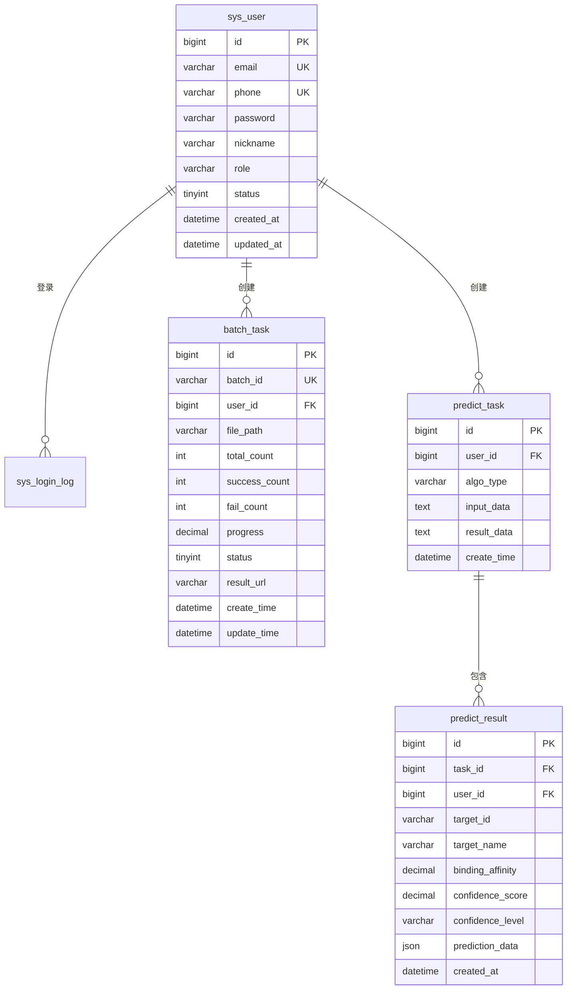
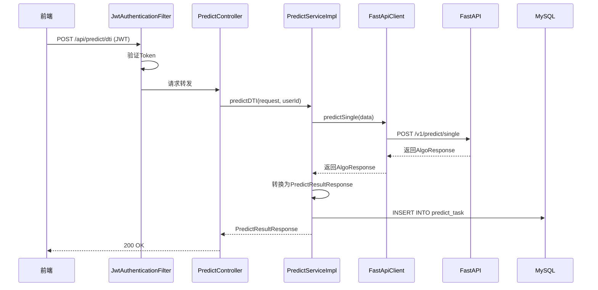
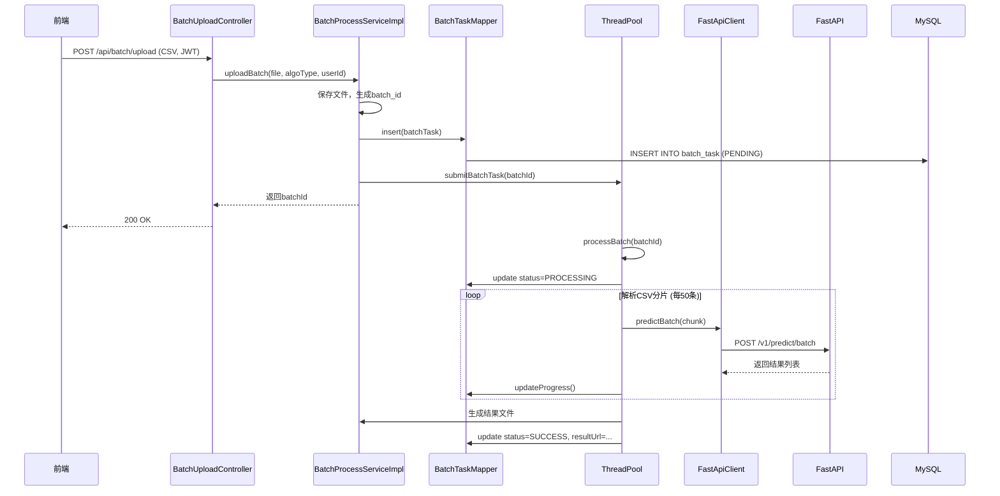
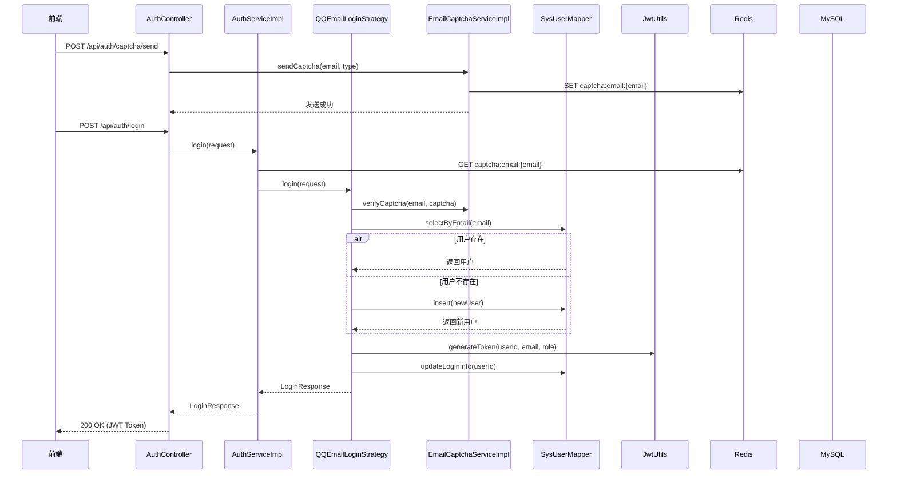

# AI预测核心模块技术开发文档

## 目录

1. [项目概述](#1-项目概述)
2. [系统架构设计](#2-系统架构设计)
3. [模块划分](#3-模块划分)
4. [技术栈](#4-技术栈)
5. [数据库设计](#5-数据库设计)
6. [API接口设计](#6-api接口设计)
7. [核心业务流程](#7-核心业务流程)
8. [部署与运行](#8-部署与运行)
9. [测试方案](#9-测试方案)
10. [开发规范](#10-开发规范)
11. [文档导航](#11-文档导航)

---

## 1. 项目概述

### 1.1 项目定位

SynPharm AI预测核心模块是一个基于微服务架构的药物相互作用预测系统，采用 **SpringBoot 业务中台 + FastAPI 算法引擎** 的分离架构，实现业务逻辑与计算资源的解耦。

### 1.2 核心功能

| 功能模块 | 说明 |
| :--- | :--- |
| **用户认证模块** | QQ邮箱注册登录、JWT认证、验证码验证 |
| **DTI预测** | 药物-靶点相互作用预测 |
| **PPI预测** | 蛋白质-蛋白质相互作用预测 |
| **DDI预测** | 药物-药物相互作用预测 |
| **批量预测** | CSV文件批量上传与预测 |
| **任务管理** | 任务状态查询、结果管理 |

### 1.3 双模运行机制

| 模式 | 适用场景 | 特点 |
| :--- | :--- | :--- |
| **单条处理模式** | 前端实时交互 | 同步请求，毫秒级响应，即时反馈 |
| **批量处理模式** | 海量CSV数据 | SpringBoot线程池异步调度，进度追踪，结果下载 |

---

## 2. 系统架构设计

### 2.1 整体架构图

```
┌─────────────────────────────────────────────────────────────────────────────┐
│                          前端层 (Vue 3 + TypeScript)                         │
│  ┌──────────┐    ┌──────────┐    ┌──────────┐    ┌──────────┐              │
│  │ 单条预测   │    │ 批量上传   │    │ 结果详情   │    │ 用户管理   │              │
│  └────┬─────┘    └────┬─────┘    └────┬─────┘    └────┬─────┘              │
│       │               │               │               │                     │
└───────┼───────────────┼───────────────┼───────────────┼─────────────────────┘
        │               │               │               │
        ▼               ▼               ▼               ▼
┌─────────────────────────────────────────────────────────────────────────────┐
│                         Nginx 反向代理                                       │
│  - 静态资源托管     - API请求转发     - HTTPS终止                            │
└─────────────────────────────────────────────────────────────────────────────┘
        │
        ▼
┌─────────────────────────────────────────────────────────────────────────────┐
│                     Spring Security 过滤器链                                 │
│  Cors Filter → JWT Auth Filter → Authorization Filter                      │
└─────────────────────────────────────────────────────────────────────────────┘
        │
        ▼
┌─────────────────────────────────────────────────────────────────────────────┐
│                      SpringBoot 业务中台                                    │
│                                                                             │
│  ┌──────────────────┐   ┌──────────────────┐   ┌────────────────────────┐   │
│  │ AuthController   │   │PredictController │   │BatchUploadController   │   │
│  │ /api/auth/*      │   │/api/predict/*    │   │/api/batch/*           │   │
│  └────────┬─────────┘   └────────┬─────────┘   └────────────┬───────────┘   │
│           │                      │                          │              │
│           ▼                      ▼                          ▼              │
│  ┌──────────────────┐   ┌──────────────────┐   ┌────────────────────────┐   │
│  │AuthServiceImpl   │   │PredictServiceImpl│   │BatchProcessServiceImpl │   │
│  │ 策略模式认证     │   │ 调用FastAPI      │   │ 解析CSV+异步调度       │   │
│  └────────┬─────────┘   └────────┬─────────┘   └────────────┬───────────┘   │
│           │                      │                          │              │
│           ▼                      ▼                          ▼              │
│  ┌──────────────────┐   ┌──────────────────┐   ┌────────────────────────┐   │
│  │  JwtUtils        │   │  FastApiClient   │   │  ThreadPool            │   │
│  │  Token生成验证    │   │  HTTP客户端      │   │  异步任务执行器         │   │
│  └────────┬─────────┘   └────────┬─────────┘   └────────────────────────┘   │
│           │                      │                                         │
└───────────┼──────────────────────┼─────────────────────────────────────────┘
            │                      │
            │                      ▼
            │           ┌───────────────────────────────────────────────────┐
            │           │                    FastAPI 算法引擎                │
            │           │                                                   │
            │           │  ┌─────────────────────────────────────────────┐  │
            │           │  │ main.py → /v1/predict/single → /v1/batch   │  │
            │           │  │              ↓                            │  │
            │           │  │ core/loader.py (模型单例加载)              │  │
            │           │  │              ↓                            │  │
            │           │  │ services/dti_service.py (DTI推理)         │  │
            │           │  │ services/ppi_service.py (PPI推理)         │  │
            │           │  │ services/ddi_service.py (DDI推理)         │  │
            │           │  │              ↓                            │  │
            │           │  │              GPU/CPU 执行推理              │  │
            │           │  └─────────────────────────────────────────────┘  │
            │           └───────────────────────────────────────────────────┘
            │                                    │
            ▼                                    ▼
     ┌───────────┐                       ┌──────────────┐
     │   Redis   │                       │   Models/    │
     │ 缓存/限流  │                       │ dti_model.pt │
     └───────────┘                       │ ppi_model.pt │
                                         │ ddi_model.pt │
                                         └──────────────┘
            │
            ▼
     ┌───────────┐
     │   MySQL   │
     │sys_user   │
     │batch_task │
     │predict_*  │
     └───────────┘
```

### 2.2 架构特点

| 特点 | 说明 |
| :--- | :--- |
| **微服务分离** | SpringBoot业务逻辑与FastAPI算法计算分离，支持独立部署 |
| **无状态设计** | FastAPI为无状态计算节点，支持水平扩展 |
| **异步处理** | 批量任务采用线程池异步执行，不阻塞主线程 |
| **双模运行** | 支持单条实时预测和批量异步预测两种模式 |

---

## 3. 模块划分

### 3.1 模块职责

| 模块 | 职责 | 技术栈 |
| :--- | :--- | :--- |
| **用户认证模块** | 用户注册、登录、JWT认证、权限控制 | SpringBoot + Spring Security + Redis |
| **SpringBoot预测模块** | 业务逻辑处理、任务管理、文件处理、结果持久化 | SpringBoot + MyBatis-Plus + WebClient |
| **FastAPI预测模块** | 模型加载、GPU推理、算法计算 | FastAPI + PyTorch + CUDA |

### 3.2 项目结构

```text
SynPharm/
├── synpharm-backend/           # SpringBoot后端
│   ├── src/main/java/com/synpharm/
│   │   ├── api/                # 控制器层
│   │   ├── service/            # 服务层
│   │   ├── repository/         # 数据访问层
│   │   ├── dto/                # 数据传输对象
│   │   ├── model/              # 实体模型
│   │   ├── config/             # 配置类
│   │   ├── client/             # HTTP客户端
│   │   ├── exception/          # 异常处理
│   │   └── utils/              # 工具类
│   └── src/main/resources/
│       ├── application.yml     # 应用配置
│       └── mapper/             # MyBatis映射文件
│
├── synpharm-fastapi/           # FastAPI算法引擎
│   ├── main.py                 # 应用入口
│   ├── config.py               # 配置文件
│   ├── requirements.txt        # Python依赖
│   ├── models/                 # 模型文件
│   ├── api/v1/                 # 接口路由
│   ├── core/                   # 核心模块
│   └── services/               # 算法服务
│
├── synpharm-frontend/          # Vue前端
│   ├── src/
│   │   ├── api/                # API封装
│   │   ├── components/         # 组件
│   │   ├── stores/             # 状态管理
│   │   └── views/              # 页面视图
│   └── package.json
│
└── docs/                       # 技术文档
    ├── AI预测核心模块技术开发文档.md              # 总览文档（本文档）
    ├── 用户认证模块技术设计文档.md                 # 用户认证模块文档
    ├── AI预测核心模块-SpringBoot后端技术开发文档.md # SpringBoot预测模块文档
    └── AI预测核心模块-FastAPI算法引擎技术开发文档.md # FastAPI预测模块文档
```

---

## 4. 技术栈

### 4.1 后端技术栈

| 层级 | 技术 | 版本 | 说明 |
| :--- | :--- | :--- | :--- |
| 后端业务中台 | SpringBoot | 3.2.x | 业务逻辑处理 |
| 后端算法引擎 | FastAPI | 0.104.x | 算法推理服务 |
| 安全框架 | Spring Security | 6.2.x | JWT认证 |
| ORM框架 | MyBatis-Plus | 3.5.x | 数据库操作 |
| 数据库 | MySQL | 8.0+ | 数据持久化 |
| 缓存/限流 | Redis | 7.x | Token黑名单、登录限流 |
| HTTP客户端 | WebClient | 6.1.x | 调用FastAPI |
| 算法框架 | PyTorch | 2.1.x | 深度学习推理 |
| GPU加速 | CUDA | 11.8+ | 可选，GPU服务器使用 |

### 4.2 前端技术栈

| 技术 | 版本 | 说明 |
| :--- | :--- | :--- |
| Vue | 3.x | 前端框架 |
| TypeScript | 5.x | 类型安全 |
| Vite | 5.x | 构建工具 |
| Pinia | 2.x | 状态管理 |
| Axios | 1.x | HTTP请求 |

---

## 5. 数据库设计

### 5.1 核心数据表

| 表名 | 说明 |
| :--- | :--- |
| `sys_user` | 系统用户表 |
| `sys_login_log` | 登录日志表 |
| `batch_task` | 批次任务表 |
| `predict_task` | 单条预测历史表 |
| `predict_result` | 预测结果表 |

### 5.2 ER关系图



---

## 6. API接口设计

### 6.1 接口总览

| 模块 | 方法 | 路径 | 功能 |
| :--- | :--- | :--- | :--- |
| **认证模块** | POST | `/api/auth/login` | 用户登录 |
| | POST | `/api/auth/register` | 用户注册 |
| | POST | `/api/auth/captcha/send` | 发送验证码 |
| | POST | `/api/auth/logout` | 用户登出 |
| **预测模块** | POST | `/api/predict/dti` | DTI单条预测 |
| | POST | `/api/predict/ppi` | PPI单条预测 |
| | POST | `/api/predict/ddi` | DDI单条预测 |
| | POST | `/api/predict/single` | 通用单条预测 |
| **批量模块** | POST | `/api/batch/upload` | 批量CSV上传 |
| | GET | `/api/batch/status/{batchId}` | 查询批量状态 |
| | GET | `/api/batch/download/{batchId}` | 下载批量结果 |
| **任务模块** | GET | `/api/tasks` | 查询任务列表 |
| | GET | `/api/tasks/{id}` | 查询任务详情 |
| | DELETE | `/api/tasks/{id}` | 取消任务 |
| **结果模块** | GET | `/api/results` | 查询结果列表 |
| | GET | `/api/results/{id}` | 查询结果详情 |
| | DELETE | `/api/results/{id}` | 删除结果 |

### 6.2 错误码定义

| 错误码 | 含义 | HTTP状态码 |
| :--- | :--- | :--- |
| 200 | 成功 | 200 |
| 400 | 请求参数错误 | 400 |
| 401 | 未授权 | 401 |
| 403 | 禁止访问 | 403 |
| 404 | 资源不存在 | 404 |
| 500 | 系统错误 | 500 |
| 3001 | 验证码错误 | 400 |
| 3002 | 验证码发送频繁 | 400 |

---

## 7. 核心业务流程

### 7.1 单条预测流程



### 7.2 批量预测流程



### 7.3 用户登录流程



---

## 8. 部署与运行

### 8.1 Docker Compose部署

```yaml
version: '3.8'

services:
  mysql:
    image: mysql:8.0
    container_name: synpharm-mysql
    environment:
      MYSQL_ROOT_PASSWORD: password
      MYSQL_DATABASE: synpharm
    ports:
      - "3306:3306"
    volumes:
      - mysql_data:/var/lib/mysql

  redis:
    image: redis:7-alpine
    container_name: synpharm-redis
    ports:
      - "6379:6379"

  springboot:
    build: ./synpharm-backend
    container_name: synpharm-springboot
    environment:
      - DB_URL=jdbc:mysql://mysql:3306/synpharm
      - DB_USERNAME=root
      - DB_PASSWORD=password
      - FASTAPI_URL=http://fastapi:8000
      - REDIS_HOST=redis
    ports:
      - "8080:8080"
    depends_on:
      - mysql
      - redis

  fastapi:
    build: ./synpharm-fastapi
    container_name: synpharm-fastapi
    ports:
      - "8000:8000"
    volumes:
      - ./synpharm-fastapi/models:/app/models
    deploy:
      resources:
        reservations:
          devices:
            - driver: nvidia
              count: 1
              capabilities: [gpu]

volumes:
  mysql_data:
```

### 8.2 服务端口

| 服务 | 端口 | 说明 |
| :--- | :--- | :--- |
| SpringBoot后端 | 8080 | 业务中台 |
| FastAPI算法引擎 | 8000 | 算法服务 |
| MySQL | 3306 | 数据库 |
| Redis | 6379 | 缓存/限流 |

---

## 9. 测试方案

### 9.1 测试分层

| 测试类型 | 说明 |
| :--- | :--- |
| **单元测试** | 测试单个类或方法的功能 |
| **集成测试** | 测试模块间的交互 |
| **性能测试** | 测试系统性能指标 |
| **安全测试** | 测试认证、授权、注入等 |

### 9.2 核心测试场景

| 测试场景 | 模块 | 预期结果 |
| :--- | :--- | :--- |
| 用户注册登录 | 认证模块 | 成功获取JWT Token |
| DTI单条预测 | 预测模块 | 返回结合亲和力和置信度 |
| PPI单条预测 | 预测模块 | 返回置信度分数 |
| DDI单条预测 | 预测模块 | 返回置信度分数 |
| 批量CSV上传 | 批量模块 | 返回batchId，状态PENDING |
| 批量状态查询 | 批量模块 | 返回进度和状态信息 |
| 批量结果下载 | 批量模块 | 返回CSV文件流 |
| 任务列表查询 | 任务模块 | 返回用户任务列表 |

---

## 10. 开发规范

### 10.1 命名规范

| 类型 | Java规范 | Python规范 |
| :--- | :--- | :--- |
| 类名 | PascalCase | PascalCase |
| 方法名 | camelCase | snake_case |
| 变量名 | camelCase | snake_case |
| 常量名 | UPPER_SNAKE_CASE | UPPER_SNAKE_CASE |
| 包名 | lowercase | lowercase |

### 10.2 Git提交规范

```
<类型>(<模块>): <描述>

<详细说明>
```

**类型说明**：

| 类型 | 说明 |
| :--- | :--- |
| `feat` | 新增功能 |
| `fix` | 修复bug |
| `docs` | 更新文档 |
| `refactor` | 代码重构 |
| `test` | 添加测试 |
| `chore` | 构建/工具类变更 |

### 10.3 代码注释规范

- **Java**: 使用Javadoc风格注释
- **Python**: 使用Google风格或NumPy风格注释
- **重要逻辑必须有注释**，简单逻辑可省略

---

## 11. 文档导航

本项目包含以下技术文档：

| 文档 | 路径 | 说明 |
| :--- | :--- | :--- |
| **总览文档** | [AI预测核心模块技术开发文档.md](file:///d:/SynPharm/docs/AI预测核心模块技术开发文档.md) | 项目整体架构、技术栈、核心流程 |
| **用户认证模块** | [用户认证模块技术设计文档.md](file:///d:/SynPharm/docs/用户认证模块技术设计文档.md) | 用户注册登录、JWT认证、权限控制 |
| **SpringBoot预测模块** | [AI预测核心模块-SpringBoot后端技术开发文档.md](file:///d:/SynPharm/docs/AI预测核心模块-SpringBoot后端技术开发文档.md) | 业务逻辑、任务管理、文件处理 |
| **FastAPI预测模块** | [AI预测核心模块-FastAPI算法引擎技术开发文档.md](file:///d:/SynPharm/docs/AI预测核心模块-FastAPI算法引擎技术开发文档.md) | 模型加载、GPU推理、算法服务 |

---

**版本**: v3.0.0  
**更新日期**: 2026-07-25  
**适用范围**: SynPharm AI预测核心模块整体架构与设计  
**更新内容**: 重构为总览性文档，整合四个文档结构