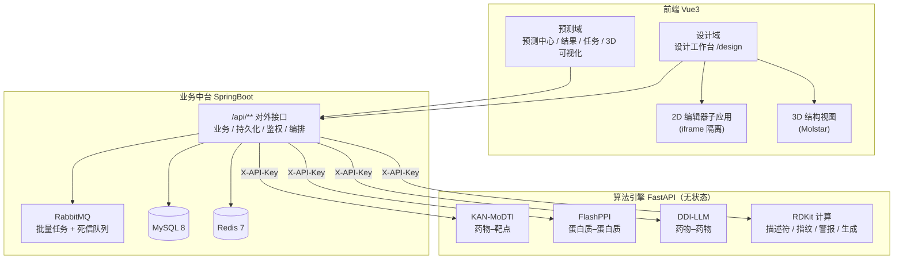

# SynPharm · 智互药研

## AI 驱动的药物相互作用预测与干实验设计平台

> **文档类型**：项目书（创意创新类高校计算机竞赛）
> **文档版本**：v1.0
> **编写日期**：2026-09-24
> **项目周期**：2026-07-22 ~ 进行中
> **参赛单位 / 团队成员**：待填写

---

## 摘要

**SynPharm（智互药研）** 是一个面向药物早期发现的计算平台。它由两条主线构成：

- **评估线**：整合三个独立的预测模型（药物–靶点 DTI、蛋白质–蛋白质 PPI、药物–药物 DDI），
  以统一的数据流管道对外提供单条实时预测与消息队列驱动的批量预测；
- **设计线**：把早期药物设计所需的一整套干实验工具（靶点与口袋、设计约束、分子生成、分子编辑、
  多维评估、项目管理）做成一个**类 IDE 的设计工作台**，让用户能在同一个界面里从"设计目标"
  走到"可交付候选集"。

与同类作品相比，本项目有三个不常见的判断：

1. **把"选择性"做成一等公民** —— 同一靶点同时绑定野生型与突变体，评估时跑两次 DTI 算选择性指数，
   直接回应"如何避开野生型以获得安全窗"这类真实科研问题；
2. **约束不是事后检查表，而是生成器的输入** —— 一份约束定义在两处执行（生成时引导 / 评估时过滤），
   保证"按 A 标准生成的分子不会被 B 标准筛掉"；
3. **能力缺失必须可见** —— 未部署的引擎对应的指标与命令显式置灰并说明原因，
   绝不静默返回假结果。

项目已实现完整的三端架构（SpringBoot 业务中台 + FastAPI 算法引擎 + Vue3 前端）、
三算法真实推理与 RabbitMQ 异步批处理链路，并交付了可运行的干实验设计工作台前端；
后端的设计域接口与库表已完成设计、待落地。

---

## 1. 项目概述

### 1.1 名称与定位

| 项 | 内容 |
|---|---|
| 中文名 | 智互药研 |
| 英文名 | SynPharm |
| 一句话定位 | 从"预测一个分子的性质"到"设计一批候选分子"的一体化计算平台 |
| 核心用户 | 药物化学 / 生物信息学方向的学生与科研人员、计算辅助药物设计（CADD）入门者 |
| 适用场景 | 教学演示、科研辅助、课题预研、方法验证 |

### 1.2 项目解决什么问题

现有计算药物设计工具存在一个普遍的**断层**：

> **能预测的平台很多，能设计的平台很少；能设计的多是商业软件，能预测的多是零散脚本。**

SynPharm 的切入点是把这两端接起来 —— 用一套**统一的约束定义**贯穿"生成"与"评估"，
再把这个闭环放进一个**可手工操作的工作台**里。用户操作的是一条完整的任务链：

```
   新建项目 → 选靶点定口袋 → 定约束 → 生成候选 → 编辑微调
      → 评估打分 → 筛选 → 改结构进入下一轮 → 输出候选集
```

### 1.3 两阶段的演进路径

项目的终极目标不是"跑几个模型"，而是**让药物设计的干实验流程可被自动化**。
为此拆成两个阶段，第一阶段先造工具、第二阶段再让智能体使用工具：

| | 第一阶段（当前交付） | 第二阶段（规划） |
|---|---|---|
| 交互方式 | **人手动操作** | 智能体自主编排 |
| 本质 | 造工具 + 把手动流程跑通 | 用工具 + 自动化流程 |
| 形态 | **干实验 IDE（工作台）** | 智能体驱动**同一个** IDE |
| 产出物 | 可复现的**手动设计闭环** | 自动闭环 + 可溯源报告 |

> **关键设计决策**：第一阶段刻意做成**工作台**而不是**向导**（步骤化、未完成则下一步禁用）。
> 向导把流程写死在界面里，第二阶段无法被智能体复用；工作台把每一步暴露为**独立命令**，
> 智能体只需调用同一批命令即可完成自动化。这是两阶段能共用一套后端的原因。

### 1.4 交付物清单

| 类别 | 内容 |
|---|---|
| 可运行系统 | 三端应用 + Docker Compose 六服务一键部署（MySQL / Redis / RabbitMQ / 后端 / 算法引擎 / 前端） |
| 算法引擎 | 三个预测算法的真实推理服务，统一 `/v1/**` 契约 |
| 设计工作台 | 四页签 IDE（画布 / 候选 / 对比 / 口袋），含 2D 分子编辑器与 3D 结构视图 |
| 数据库 | 预测域 11 个 SQL 脚本；设计域 DDL 设计完成（编号 `11_`~`25_`） |
| 技术文档 | 35 份，含 8 份设计工作台模块文档、架构设计、部署与上线流程、问题总账与整改方案 |
| 工程质量 | 一份 119 条的**问题总账**与待办清单，明确区分"能立刻做"与"须等外部数据" |

---

## 2. 背景与痛点

### 2.1 为什么需要计算辅助

新药研发长期遵循"双十定律"——约 **10 年**周期、**10 亿美元**投入，且临床阶段失败率极高。
其中相当一部分失败源于**早期分子选择的偏差**：活性够但选择性差、成药性差、或存在安全性警报。
在湿实验之前用计算手段做一轮筛选，是行业公认的降本手段。

### 2.2 现有工具链的四道墙

| 编号 | 痛点 | 具体表现 |
|---|---|---|
| **P1** | **算法散落，无法组合** | 一个 DTI 脚本、一个对接程序、一个 ADMET 工具，各自输入输出格式不同，用户手工搬运数据；一个课题要维护五六个虚拟环境 |
| **P2** | **只有"打分"，没有"设计"** | 多数平台只能对已有分子给分，不能按约束**生成**新分子；用户拿到的是一张排名表，而不是一批可继续优化的候选 |
| **P3** | **"选择性"无处表达** | 真实课题常要求"对突变体有效、对野生型尽量弱"，但主流工具的工作单位是"分子–靶点对"，表达不了"同一分子对两个靶点的相对关系" |
| **P4** | **失败是静默的，结果不可信** | 模型缺失或异常时常返回随机/占位结果并报成功，用户无法分辨"真推理"与"假数据"——这是计算工具最危险的失效模式 |

### 2.3 为什么是现在

三件事同时成熟，使一个**学生团队**能够完成过去需要商业软件团队才能做的事：

1. **开源算法与权重已可获取**：三个可用的预训练模型 + RDKit 生态（描述符、指纹、警报目录）；
2. **浏览器具备运行化学引擎的能力**：WebAssembly 化后的 Indigo 引擎可直接在页面内完成结构解析与规范化，
   无需后端中转；
3. **Web 3D 技术栈成熟**：Mol* 等开源渲染库可在浏览器里流畅展示大分子结构。

---

## 3. 国内外现状与竞品分析

### 3.1 学术工具链（脚本式）

| 工具 | 能力 | 局限 |
|---|---|---|
| RDKit | 分子解析、描述符、指纹、警报 | 是库不是平台，无界面、无流程、无持久化 |
| AutoDock Vina / smina | 分子对接 | 单点工具，需要自行准备受体与盒子，无结果管理 |
| DeepPurpose / admet_ai | 性质与 ADMET 预测 | 单一维度，与其它工具无契约 |
| 各类 DTI/DDI 论文代码 | 特定模型推理 | 输入输出格式各异，多数不提供工程化的服务封装 |

### 3.2 商业平台（一体化）

| 平台 | 能力 | 与本项目的关系 |
|---|---|---|
| Schrödinger Maestro | 业界标准的建模与设计一体化 | 功能全面但**商业授权、成本高、学习曲线陡**，教学场景难以铺开 |
| CCG MOE | 建模、对接、药效团 | 同上 |
| ChemAxon / DataWarrior | 结构编辑、性质计算、数据探索 | 偏"化合物数据管理"，设计闭环弱 |
| SeeSAR / Flare | 基于结构的分子优化 | 强于单一环节（姿势优化/相互作用分析），需配合其它工具 |

### 3.3 差异化定位

| 维度 | 商业平台 | 学术脚本 | **SynPharm** |
|---|---|---|---|
| 成本 | 高（授权） | 免费 | **全开源、零授权成本** |
| 上手成本 | 高（需培训） | 高（需编程） | **浏览器即用，含引导与模板** |
| 预测能力 | 强 | 取决于脚本 | 三个真实可用模型 + 统一契约 |
| **生成能力** | 强 | 弱 | **约束驱动的确定性生成策略** |
| **选择性建模** | 需手工组合 | 几乎无 | **一等公民（自动跑野生型与突变体）** |
| 设计闭环 | 强 | 无 | **工作台形态，可手工跑通全链路** |
| 可自动化 | 部分（需脚本） | 需自行编排 | **所有写操作经命令注册表，天然可被智能体调用** |

> **定位结论**：本项目不与商业平台比功能覆盖度，而是补上"**教学与预研场景下、
> 零成本、开箱即用的设计与评估闭环**"这个空位。

---

## 4. 核心创新点

### C1 · 把"选择性"做成一等公民

主流工具的工作单位是"分子–靶点对"。真实课题却常常问："**这个分子对突变体有效，
但对野生型是否足够弱？**"——这是安全窗问题，也是本平台最有辨识度的能力。

**实现方式**：`project_target` 表中同一靶点可同时以 `WILD_TYPE` 与 `MUTANT` 两种角色绑定。
评估时对每个候选**跑两次 DTI**，派生选择性指数（突变体亲和力 ÷ 野生型亲和力）作为独立指标参与打分。

### C2 · 干实验设计工作台（IDE 形态）

不是"预测平台的附属页面"，而是一个**独立的工作台**：三栏布局、
四个并列页签（画布 / 候选 / 对比 / 口袋）、常驻的约束判定与指标面板、轮次时间线。

**IDE 概念映射**（这是设计的核心类比）：

| IDE 概念 | 本项目 |
|---|---|
| 工作区 / 项目 | `design_project` |
| 外部依赖 / 库 | 靶点序列、蛋白结构、结合口袋、支持药物集 |
| 项目设置 / 代码风格 | `constraint_set` + `constraint_rule` |
| 脚手架 / 代码生成 | 分子生成器 |
| **编辑器** | 分子编辑器 + 2D 画布 |
| 编译 / 测试 / lint | 评估器 |
| 版本控制 | 轮次 + 父子谱系 |
| 构建产物 | 候选分子集（可导出 CSV/SDF） |
| 布局 / 面板 / 命令 / Diff / 撤销 | 工作台本体 |

### C3 · 一份约束定义、两处执行

**这是整个平台的判据中枢。**

| 复用点 | 时机 | 作用 |
|---|---|---|
| **生成时引导** | 生成过程中 | 提前淘汰不合格产物，减少无效计算 |
| **评估时过滤** | 评估后 | 输出每条规则的 pass/fail 与实测值，驱动筛选与打分 |

**设计铁律**：生成与筛选**必须使用同一份约束**。否则会出现"按 A 标准生成的分子被 B 标准筛掉"，
用户无法解释为什么 —— 这是许多拼凑式平台最致命的体验问题。

### C4 · 降级可见：拒绝静默假结果

计算工具最危险的失效模式是"模型没加载却报成功"。本项目确立原则：

- 引擎缺失 → 对应指标**显式置灰并说明原因**，权重按比例重分配，不拉低总分；
- 加载失败 → 不影响其它能力的可用性，但失败状态**必须对用户可见**；
- 假数据 → 全面清除，异常必须抛出而非静默兜底。

### C5 · 两阶段演进：手动工具台 → 智能体自动化

第一阶段的"工作台"与第二阶段的"多智能体"**共用同一套后端**：所有写操作必须经过**命令注册表**
（Command Registry），智能体只需调用同一批命令即可自动化整个设计流程。
这避免了"演示能跑、自动化要重写"的常见返工。

### C6 · 重依赖隔离（浏览器内跑化学引擎）

分子编辑器依赖的化学引擎（WebAssembly，约 29 MB）与 3D 渲染库若直接进入主应用依赖图，
会导致主包体积暴涨、构建配置被大量 Node polyfill 污染。

**方案**：把编辑器构建成**独立子应用**，通过 iframe 隔离，用 `postMessage` 暴露一个窄接口
（读写分子、渲染结构式、批量实算分子事实）。主应用因此**不需要任何 polyfill**，
主包体积不受影响，且这套子应用可被其它页面复用。

---

## 5. 系统架构

### 5.1 架构铁律

> **一切与"计算"有关的都归算法引擎；业务中台只做业务、持久化、权限、编排。**

| 关注点 | 业务中台（SpringBoot） | 算法引擎（FastAPI） |
|---|---|---|
| 对外 REST | ✅ 全部对外接口（`/api/**`） | ❌ 只对中台提供 `/v1/**` |
| 认证鉴权 | ✅ JWT + 归属校验 | ⚠️ 仅 `X-API-Key` 服务间鉴权 |
| 业务状态机 | ✅ 项目 / 生成 / 评估的状态流转 | ❌ 无状态计算节点 |
| 持久化 | ✅ MySQL + Redis 全部读写 | ❌ **不碰数据库** |
| 任务编排 | ✅ 异步任务、线程池、消息队列、进度 | ✅ 单次计算内部并行 |
| 分子解析 / 描述符 / 指纹 | ❌ | ✅ |
| 分子生成 / 片段操作 | ❌ | ✅ |
| 口袋检测 / 对接 | ❌ | ✅ |
| 模型推理 | ❌（只转发） | ✅ |

**为什么这样切**：算法引擎保持**无状态**，才能独立扩容、独立升级、独立部署到 GPU 服务器，
且算法迭代不会波及业务数据；业务中台不必知道任何算法细节。

### 5.2 分层架构



### 5.3 三条主数据流

| 数据流 | 路径 | 特点 |
|---|---|---|
| **单条预测** | 前端 → 中台校验 → 算法引擎 → 结果落库 → 返回 | 同步、低延迟 |
| **批量预测** | 前端上传 CSV → 中台落库并投递消息 → 消费者异步处理 → 进度落库 → 前端轮询 → 下载结果 | 异步、可恢复、任务状态以数据库为权威 |
| **设计闭环** | 工作台 → 设计域接口 → （生成/评估归算法引擎） → 候选与指标落库 → Diff / 对比 / 报告 | 增量反馈，保存即编译 |

---

## 6. 核心技术方案

### 6.1 三大预测引擎与实测指标

| 引擎 | 预测目标 | 模型 | 权重 | 实测指标 |
|---|---|---|---|---|
| **DDI-LLM** | 药物–药物相互作用 | 3 层图卷积网络 + 摩根指纹 + 点积解码（**本仓库自行训练**） | 1.75 MB | **Test AUROC 0.8732 / AUPR 0.8507**（BioSNAP，1323 节点 / 8327 测试边） |
| **KAN-MoDTI** | 药物–靶点相互作用 | KAN + 多任务，上游预训练权重 | 2.5 MB + 2 个映射文件 | 上游权重在 human 数据集训练 AUC ≈ 0.9949 |
| **FlashPPI** | 蛋白质–蛋白质相互作用 | FlashAttention 系蛋白语言模型 | 2.93 GB | 输出接触图（如 668×668） |

> **指标说明**：DDI 的 AUROC 与 BioSNAP 数据集上论文报告的量级一致（Morgan 特征约 0.90）。
> KAN-MoDTI 的 0.9949 为**上游权重的训练集**指标，本项目**不将其作为测试性能主张**。
> FlashPPI 提供接触图与两个打分，本项目未对其做独立复现评测。

### 6.2 策略模式数据流管道

预测链路被抽象为三个可插拔维度：

```
InputParser（SMILES / UniProt / PDB / CSV）
      ×  AlgoExecutor（DTI / PPI / DDI）
      ×  OutputFormatter（JSON / CSV）
```

由工厂按三个注册表动态组合。新增一种输入类型或输出格式，只需新增一个实现并注册，
**不需要修改任何既有代码**，也避免了"算法 × 输入 × 输出"的类爆炸。

### 6.3 RabbitMQ 异步批处理

| 设计点 | 做法 |
|---|---|
| 可靠性 | 消息持久化、手动 ack、死信队列 |
| 幂等 | 以任务 ID 作为幂等键，重复消费不产生副作用 |
| 状态权威 | 任务状态以**数据库**为准，内存进度仅作加速 |
| 事务边界 | 消息投递必须在事务提交**之后**，否则消费者读不到记录 |
| 失败分类 | 区分"单条失败"与"整批失败"，逐条统计成功/失败数 |

### 6.4 DDI 输入契约转换层

算法引擎的 DDI 分支只接受图内药物（DrugBank 编号），而用户与前端天然输入 SMILES。
本项目在业务侧引入**转换层**：

- 从模型检查点导出图内药物白名单（**1323 个**），落库为独立表（含药物名、SMILES 及其哈希）；
- 用户输入 SMILES → 规范化 → 哈希 → 查表 → 转成 DrugBank 编号 → 调用引擎；
- 图外药物明确返回 `DRUG_NOT_SUPPORTED` 并附支持药物数量，而不是笼统的 400。

**价值**：把"用户输入"与"模型契约"解耦，前端零改动，下游算法零改动。

### 6.5 干实验设计工作台的六个模块

| 模块 | 内容 | 关键设计 |
|---|---|---|
| **01 项目管理** | 项目 / 轮次 / 生命周期 | 项目-轮次-约束集-候选集构成可复现快照 |
| **02 靶点与结合口袋** | UniProt 与 PDB 解析、口袋检测 | 复用既有解析器（只做 IO，不算计算，故不迁移） |
| **03 设计约束** | 11 类规则（硬/软分级） | **一份定义、两处执行**（见 C3） |
| **04 分子生成器** | 6 种确定性生成策略 | 全部基于 RDKit，**不需要训练新模型** |
| **05 分子编辑器** | 9 类编辑操作 | **父分子不可变**，编辑产生子分子，天然形成谱系 |
| **06 评估器** | 12 个评估维度、表驱动指标 | 指标定义入库，权重可调；缺失能力权重按比例重分配 |
| **07 工作台与交互** | 布局、命令、Diff、撤销 | 所有写操作经命令注册表；撤销为"游标移动"而非反向日志 |

> **注意**：`07` 不是"第七步"，而是**横切所有模块的交互层** —— 这正是 IDE 类比与向导式流程的根本区别。

### 6.6 评估器的 12 个维度

| # | 维度 | 实现方式 | 状态 |
|---|---|---|---|
| D1 | 约束合规 | 复用 03 模块，逐条硬/软规则 pass/fail | 设计完成 |
| D2 | 理化性质 | RDKit 描述符 | 设计完成 |
| D3 | 成药性 | QED + Lipinski/Veber/Ghose/Egan 通过数 | 设计完成 |
| D4 | 安全性警报 | PAINS / BRENK / NIH 命中 | 设计完成 |
| D5 | 合成可及性 | SA Score | 设计完成 |
| D6 | 多样性 | 批内最大/平均 Tanimoto | 设计完成 |
| D7 | 活性（DTI） | 复用 KAN-MoDTI | **引擎可用** |
| D8 | 相互作用（DDI） | 复用 DDI-LLM（含白名单边界） | **引擎可用** |
| D9 | 相互作用（PPI） | 复用 FlashPPI | **引擎可用** |
| D10 | **选择性指数** | 由 D7 组合派生（野生型 vs 突变体） | 设计完成，**本项目特色** |
| D11 | 对接打分 | AutoDock Vina / smina | 引擎未部署 |
| D12 | ADMET | 本地 ADMET 模型 | 待接入 |

### 6.7 前端重依赖隔离

| 方案 | 结果 |
|---|---|
| 直接在主应用引入化学编辑器 | 主包暴涨、需要大量 Node polyfill、主构建配置被污染 |
| **独立子应用 + iframe（采用）** | 引擎隔离在子文档内，主应用构建配置零改动；子应用可复用 |

3D 结构视图则以**可选属性**的方式扩展（口袋腔体可视化、共结晶配体渲染），
不传即不生效 —— 因此既有 3D 页面零影响。显示控制接口（显示模式 / 颜色方案 / 渲染映射）
只有一份实现，两个页面共用，避免"改一处漏一处"。

---

## 7. 功能完成度（诚实说明）

> 项目书常见的问题是只写"实现了什么"。这里把真实状态完整列出，
> 便于评委判断当前进度与规划的可信度。

| 能力 | 状态 | 说明 |
|---|---|---|
| 三端架构与 Docker 六服务一键部署 | ✅ 已完成 | 含自动修复环境变量、端口预检、按需构建 |
| 用户认证（邮箱验证码 / 密码 / 游客） | ✅ 已完成 | JWT、限流、Token 黑名单 |
| 三算法真实推理 | ✅ 已完成 | 单条 + 批量，均已实测 |
| RabbitMQ 异步批处理 | ✅ 已完成 | 含死信、幂等、逐条统计 |
| DDI 白名单转换层 | ✅ 已完成 | 1323 个药物，端到端验证 |
| 设计工作台前端（四页签 + 2D 编辑器 + 3D 视图） | ✅ 已完成 | 可完整演示手动设计流程 |
| 候选分子真实分子事实（InChIKey / 分子量 / 分子式） | ✅ 已完成 | 由本地化学引擎实算，非估算 |
| 设计域后端接口与库表 | ⬜ 未落地 | 契约与 DDL 设计完成（`11_`~`25_`），前端当前走可切换的演示数据 |
| 分子生成器 6 种策略 | ⬜ 未落地 | 设计完成，均为确定性策略 |
| 评估器接入真实引擎 | ⬜ 未落地 | 设计完成；接入时必须复用管道工厂，避免污染预测结果表 |
| 对接引擎（姿势生成） | ⬜ 未部署 | 3D 验证能力的**前置条件** |
| ADMET | ⬜ 未接入 | 本地模型即可，无需 GPU |
| 多智能体自动化（第二阶段） | ⬜ 规划中 | 文档完成（36 页），工具层已具备 |

**工程质量现状**：项目维护了一份 **119 条**的问题总账，其中 **18 条已修复**、约 **101 条**待处理，
并明确区分"能立刻做"（约 96 条）与"须等外部数据"（约 6 条）。
这份清单本身也是项目的一个特点 —— **我们清楚自己还差什么**。

---

## 8. 关键技术难点与解决方案

> 以下是开发过程中真实遇到并解决的问题，均有代码层面的验证记录。

### D1 · 环境依赖三方错位导致两个算法同时失效

**现象**：PPI 与 DDI 均不可用，但报错方向完全不同。
**根因**：容器内 `torch 2.1.0 + numpy 1.26`，而 `transformers 未锁版本`实际装了 5.x
（要求 `torch ≥ 2.5`，直接禁用 PyTorch 后端）；同时 DDI 的权重是 `numpy 2.x` 序列化的。
**三件事其实是同一个根因**：环境的 numpy 卡在 1.x，而生态与项目自己的权重都转向 2.x。
**解决**：整体现代化（`torch 2.5.1` + `numpy 2.x` + `transformers 5.x`）并补齐遗漏依赖。
**结果**：PPI **首次真正可用**；DDI 结果与基线完全一致（`0.662937`）。

### D2 · 容器内 DDI 完全不可用，本地却看不出来

**现象**：本地能跑，容器内所有 DDI 请求 404。
**根因**：权重由 numpy 2.x 序列化，容器内 numpy 1.x 反序列化报 `No module named 'numpy._core'`。
**教训**：**本地跑得通不代表容器跑得通**，依赖矩阵必须两端一致。
**解决**：随 D1 一并根治（不再需要临时别名补丁）。

### D3 · MySQL 保留字导致批量上传 100% 失败

**现象**：批量上传在"建明细"阶段直接报 SQL 语法错误。
**根因**：`ROW_NUMBER` 是 MySQL 8.0 保留字。建表脚本已加反引号，但**实体类没加**，
ORM 原样拼接列名。
**解决**：实体字段显式加反引号。
**教训**：DDL 加了反引号 ≠ 实体也加了；ORM 不会自动引用保留字列名。

### D4 · 化学引擎在浏览器内初始化失败

**现象**：编辑器白屏，报 `require is not defined`、构造函数不存在等。
**根因**：引擎的 ESM 产物中仍残留 `require('raphael')` 调用，而 Rollup 的 commonjs 插件
不处理 ESM 文件里的 require；**且返回空值的桩同样失败**（后续判空分支仍拿到 undefined），
必须指向真实模块。
**解决**：在子应用构建期把该调用改写为全局注入的真实模块引用，并在正确的导入顺序下注册。
**价值**：这是一个典型的"报错信息与真实原因无关"的排障案例。

### D5 · 约 29 MB 的化学引擎进入主包

**现象**：主应用分块体积暴涨。
**根因**：引擎把 WebAssembly 以单行字符串字面量内联进 JavaScript，无法拆成独立静态文件。
**解决**：改为**独立子应用 + iframe 隔离**（见 C6），并开启服务器端压缩（传输量降至约 1/3）。

### D6 · 3D 视图在结构切换后"回到默认显示"

**现象**：用户选了显示模式与配色，切换结构后界面状态还在，画面却回到默认。
**根因**：3D 引擎在重建结构时会重置场景。
**解决**：抽象出"加载后重新同步"的公共逻辑：模式与配色在结构加载完成后自动重放；
该逻辑与显示控制接口一起收口为**唯一实现**，两个页面共用。
**验证方式**：以控制台日志为判据 —— 结构重载后必须出现模式与配色两条重新应用记录。

### D7 · 静默假结果（最危险的失效模式）

**现象**：模型未加载时，接口返回 HTTP 200 与"看起来正常"的随机结果。
**根因**：多处异常被兜底为占位输出。
**解决**：全面清除兜底，异常必须显式抛出并分类透传（未就绪 / 输入非法 / 图外药物 / 真实故障），
健康检查改为报告**逐算法真实状态**且刻意不触发昂贵的权重加载。

---

## 9. 可行性分析

### 9.1 技术可行性

| 维度 | 判断 | 依据 |
|---|---|---|
| 算法 | ✅ 已验证 | 三个模型均已真实推理并实测 |
| 工程 | ✅ 已验证 | 三端分离、容器化部署、异步链路均已跑通 |
| 前端重依赖 | ✅ 已验证 | 化学引擎与 3D 引擎均已在浏览器内稳定运行 |
| 设计域落地 | ⚠️ 有明确路径 | 契约与库表已设计完毕，主要工作量在实现而非探索 |
| 对接引擎 | ⚠️ 有开源路径 | AutoDock Vina 等开源方案成熟，需额外部署与算力 |

### 9.2 数据可行性

| 数据 | 来源 | 状态 |
|---|---|---|
| 蛋白结构 | 公共结构数据库 | ✅ 已接入并实测加载 |
| 靶点序列与标识 | 公共蛋白数据库 | ✅ 已接入 |
| 药物白名单 | 由模型检查点导出 | ✅ 1323 个，已落库 |
| 预测与设计域数据 | 自建 | ✅ 库表设计完成 |

### 9.3 经济与合规可行性

- **软件成本为零**：全部依赖为开源许可（含模型权重与算法库）；
- **硬件门槛低**：三算法与 RDKit 均可 CPU 推理，无需 GPU 即可演示；GPU 仅加速批量场景；
- **合规**：所用数据与权重均来自公开数据集与开源模型，项目自身代码开源。

---

## 10. 应用场景与推广价值

| 场景 | 价值 |
|---|---|
| **教学实验** | 学生可在浏览器内完整体验"设约束 → 生成 → 评估 → 筛选"的药物设计闭环，无需安装任何专业软件 |
| **课题预研** | 在申请正式计算资源前，用统一接口快速得到一批可评估的候选分子 |
| **方法验证** | 约束集与指标定义均为表驱动，便于对比不同判据对候选集的影响 |
| **竞赛与答辩** | 手动闭环 + 可导出报告，成果可复现、可追溯 |
| **自动化扩展** | 因所有写操作经命令注册表，可直接被智能体调用，演进为自动化科研助手 |

---

## 11. 项目进度与路线图

### 11.1 已完成里程碑（共 84 次提交）

| 时间 | 里程碑 |
|---|---|
| 2026-07-22 | 项目初始化，基础框架 |
| 2026-07-23 ~ 07-24 | 用户认证模块（策略模式登录、Redis 限流与黑名单） |
| 2026-07-25 ~ 08-07 | 数据流管道、三算法接入、结果与任务管理 |
| 2026-08-23 | 前后端 JSON 契约对齐 |
| 2026-09-06 | 靶点库、3D 可视化接入 |
| 2026-09-14 ~ 09-16 | 全量三端代码审查，产出 119 条问题总账 |
| 2026-09-21 ~ 09-22 | 容器化一键部署重构；**计算引擎修复**（PPI 首次可用、DDI 容器内可用）；批量链路打通 |
| **2026-09-22 ~ 09-24** | **干实验设计工作台**：8 份模块设计文档 + 前端四页签 + 2D 编辑器 + 3D 口袋视图 + 引擎实算 + 接口收口 |

### 11.2 后续路线图

**P0 — 不依赖外部引擎，性价比最高**

| # | 事项 | 解决的问题 |
|---|---|---|
| 1 | 新建项目引导流 + 项目模板（预置真实课题骨架） | 用户不知从何下手 |
| 2 | **约束三段式**：左栏定义 → 生成参数化 → 编辑时实时反馈 | 约束"突兀"、闭环断裂 |
| 3 | 命令面板 + 撤销重做 + 会话恢复 | IDE 通用功能缺失 |
| 4 | **设计报告导出**（背景 → 依据 → Top-N → 失败模式 → 结论） | 评估无产出物 |
| 5 | 选择性指数接入 | 强化核心创新点 |

**P1 — 需要后端与算法引擎落地**

| # | 事项 |
|---|---|
| 6 | 设计域接口与库表落地（否则一切仍是演示数据） |
| 7 | 分子生成器 6 策略 + 评估器接入（复用管道工厂） |
| 8 | ADMET 本地模型接入（把真实评估引擎从 3 个扩到 4 个） |
| 9 | 对接引擎部署 → 生成结合姿势 → 3D 验证才有实质意义 |

**P2 — 拉开差距**

| # | 事项 |
|---|---|
| 10 | 主动学习迭代环（评估 → 选优 → 再生成） |
| 11 | 多智能体自动化（第二阶段），复用第一阶段的命令注册表 |

---

## 12. 团队与分工

> 待填写。建议按下表列出，评审关注"每人有明确可验证的产出"。

| 姓名 | 角色 | 负责模块 | 可验证产出 |
|---|---|---|---|
| 待填 | 项目负责人 / 架构 | 系统架构、设计域总体设计 | 架构文档、8 份模块设计文档 |
| 待填 | 后端开发 | 业务中台、异步批处理 | 接口与库表、批量链路实测 |
| 待填 | 算法工程 | 三算法集成与修复、依赖治理 | 三算法实测结果、引擎健壮性修复 |
| 待填 | 前端开发 | 工作台、3D 视图、编辑器接入 | 四页签工作台、编辑器子应用 |
| 待填 | 测试与文档 | 问题总账、测试数据、部署验证 | 119 条问题总账、部署与上线流程文档 |

---

## 13. 预期成果与考核指标

| 类别 | 指标 | 当前 | 目标 |
|---|---|---|---|
| 功能 | 可手动完成的设计闭环 | 前端已可演示 | 后端落地后全链路可用 |
| 功能 | 真实可用的评估引擎数 | 3 | ≥ 4（补 ADMET） |
| 成果 | 可导出的设计报告 | 无 | ≥ 1 种格式（PDF/Markdown） |
| 性能 | 单条预测响应 | 秒级 | 保持秒级 |
| 性能 | 批量预测吞吐 | 已跑通 | 支持 ≥ 1000 行批次 |
| 质量 | 问题总账剩余项 | ~101 | 收敛至安全与部署类清零 |
| 文档 | 技术文档数量 | 35 | 保持与实现同步 |
| 创新 | 差异化能力 | 选择性指数（设计） | 可复现的选择性筛选结果 |

---

## 14. 风险分析与应对

| 风险 | 影响 | 概率 | 应对 |
|---|---|---|---|
| 对接引擎未部署，3D 验证空转 | 设计闭环缺关键一环 | 高 | P1 优先部署开源对接方案；未部署前 3D 明确标注"仅展示共结晶配体" |
| 设计域后端工作量大 | 闭环停留演示态 | 中 | 按 P0 先做不依赖后端的四项（引导、约束、命令、报告） |
| 模型权重体积大（PPI 2.93 GB） | 部署门槛高 | 中 | 权重不入库，由部署脚本下载；缺失时该能力显式降级 |
| 外部数据缺失（靶点库） | 部分功能不可用 | 中 | 已单独列出"等数据"清单，不阻塞其它模块 |
| 安全类问题未清零 | 上线风险 | 中 | 总账中已按优先级排列，第一梯队为凭据与越权 |
| 单点依赖公共结构数据库 | 网络受限时结构不可得 | 低 | 引入本地结构映射兜底 |

---

## 15. 附录

### 15.1 技术文档索引（35 份）

| 类别 | 位置 |
|---|---|
| 架构与培训 | `docs/architecture/` |
| 接口契约 | `docs/api/接口文档.md` |
| 部署与上线 | `docs/deploy/` |
| 认证模块 | `docs/modules/auth/` |
| 预测模块（含三算法） | `docs/modules/predict/` |
| **设计工作台模块（8 份）** | `docs/modules/design/` |
| 问题总账与待办 | `docs/development/` |
| 更新日志 | `log/CHANGELOG.md` |

### 15.2 术语表

| 术语 | 含义 |
|---|---|
| DTI / PPI / DDI | 药物–靶点 / 蛋白质–蛋白质 / 药物–药物 相互作用 |
| 干实验 | 完全在计算机上进行的实验，与湿实验（实际做实验）相对 |
| 结合口袋 | 蛋白表面可容纳小分子的空腔 |
| 共结晶配体 | 晶体结构中与蛋白一同解析出来的小分子 |
| 对接 | 计算小分子在口袋中的结合姿势与打分 |
| InChIKey | 分子的国际标准唯一标识，可作跨平台去重键 |
| QED / SA Score | 类药性评分 / 合成可及性评分 |
| PAINS / BRENK | 常见假阳性或高风险结构片段目录 |
| 选择性指数 | 对突变体与野生型亲和力的比值，衡量安全窗 |
| 骨架 / R 基 | 分子核心结构 / 可变取代基 |

### 15.3 参考资料方向

- 图神经网络与药物相互作用预测（BioSNAP 数据集与相关论文）
- 蛋白质语言模型与接触图预测
- RDKit 文档：描述符、指纹、警报目录、合成可及性
- AutoDock Vina / smina：开源分子对接
- 开源 ADMET 预测模型

---

**（本文件为项目书初稿，标注"待填写"处需按实际团队信息补全。）**
