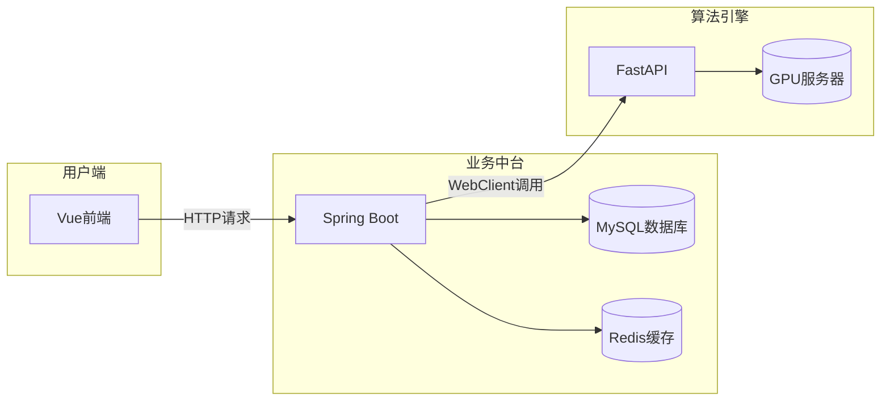
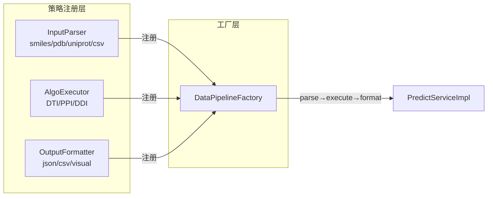
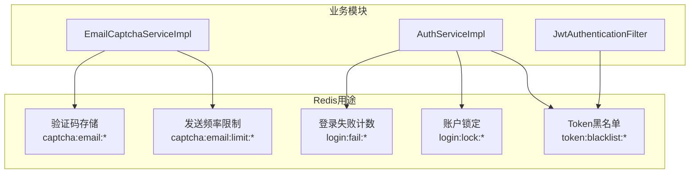
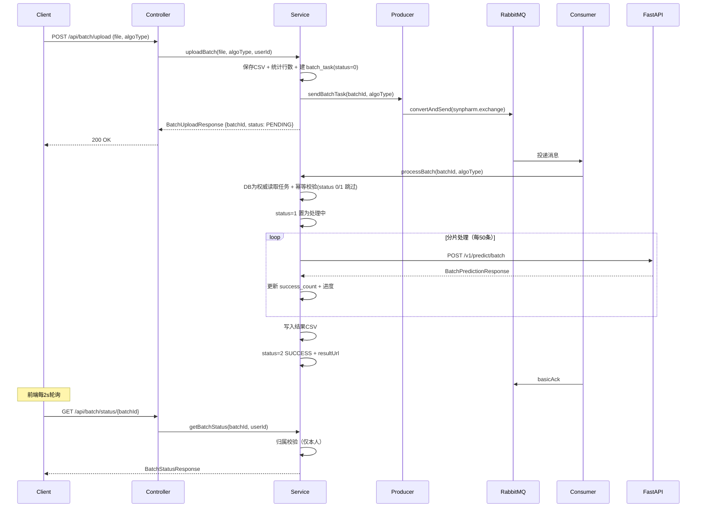
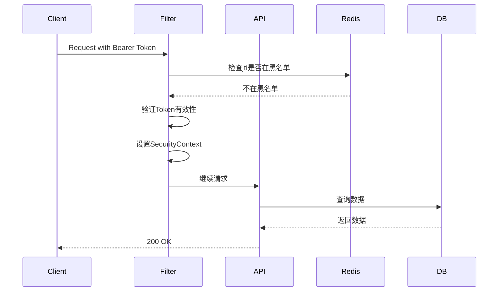
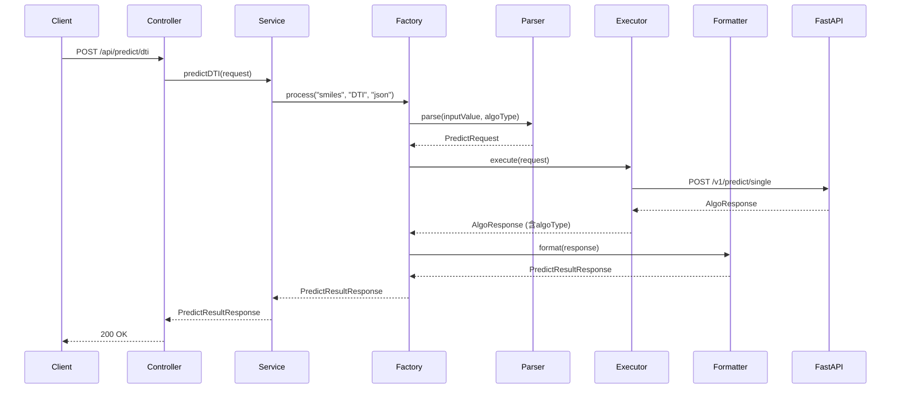
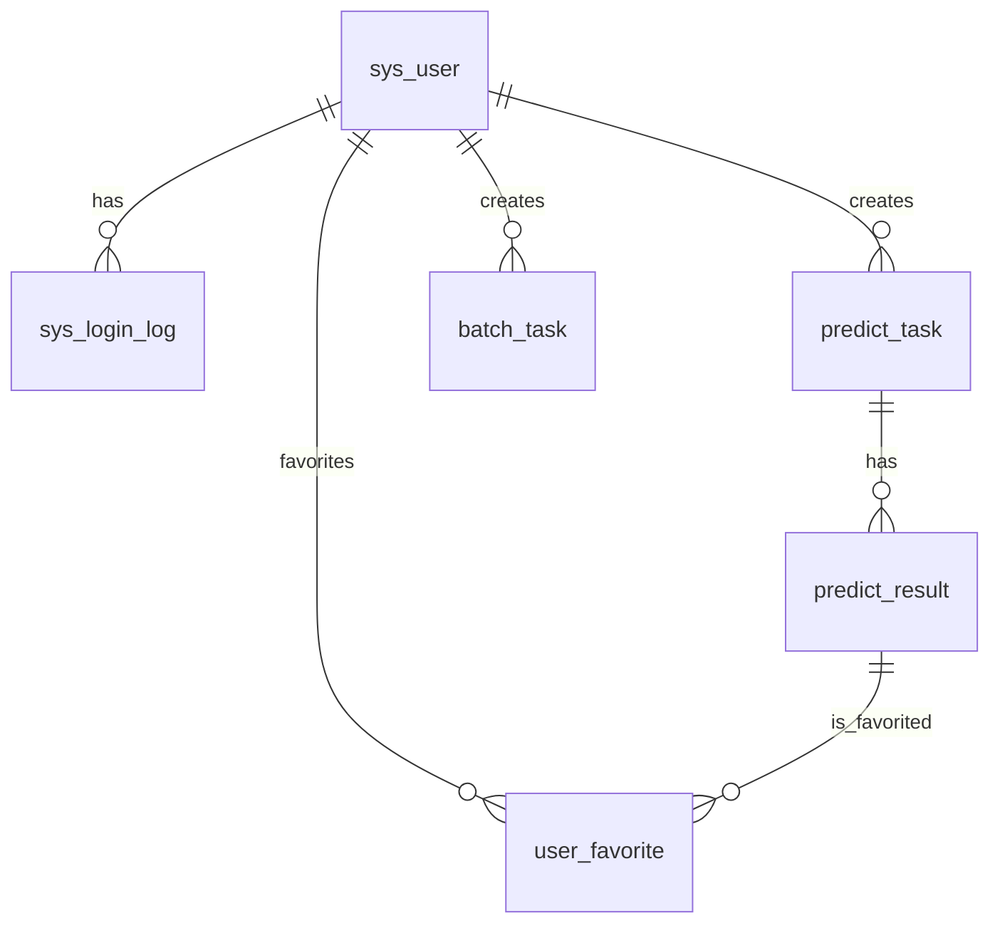

# SynPharm 项目整体架构培训文档

## 目录

1. [项目概述](#1-项目概述)
2. [项目结构](#2-项目结构)
3. [核心架构](#3-核心架构)
4. [Redis应用详解](#4-redis应用详解)
5. [RabbitMQ消息队列与批量处理](#5-rabbitmq消息队列与批量处理)
6. [核心功能模块](#6-核心功能模块)
7. [数据库设计](#7-数据库设计)
8. [FastAPI算法引擎](#8-fastapi算法引擎)
9. [配置与部署](#9-配置与部署)
10. [数据流开发指南](#10-数据流开发指南)
11. [架构亮点总结](#11-架构亮点总结)
12. [干实验设计工作台](#12-干实验设计工作台)
13. [待完成任务](#13-待完成任务)

---

## 1. 项目概述

### 1.1 项目定位

**SynPharm** 是一个基于人工智能的药物-靶点相互作用预测平台，采用微服务分离架构：

- **Spring Boot 业务中台**：处理用户认证、任务管理、数据存储等业务逻辑
- **FastAPI 算法引擎**：运行预测算法，部署在GPU服务器上

### 1.2 技术栈

| 层级 | 技术 | 说明 |
|:---|:---|:---|
| **前端** | Vue 3 + TypeScript + Vite | 响应式单页应用 |
| **前端 2D 化学** | Ketcher 3.18（内置 Indigo 引擎） | 分子编辑器；独立子应用 + iframe 隔离，不进主依赖图 |
| **前端 3D 结构** | Molstar 5.11 | 蛋白质结构渲染、口袋腔体与共结晶配体 |
| **前端图表** | ECharts 5 | 轮次趋势与统计图表 |
| **业务中台** | Spring Boot 3 + MyBatis Plus | Java后端服务 |
| **算法引擎** | FastAPI + PyTorch | Python机器学习推理 |
| **数据库** | MySQL 8.0+ | 关系型数据存储 |
| **缓存** | Redis 7.0+ | 验证码、Token黑名单、登录限流 |
| **认证** | JWT + Spring Security | 用户身份认证 |
| **异步** | RabbitMQ 消息队列 | 批量任务异步处理 |
| **文档** | Knife4j/Swagger | API接口文档 |

---

## 2. 项目结构

```
SynPharm/
├── README.md                 # 项目总览（唯一入口文档）
├── log/CHANGELOG.md          # 更新日志
├── deploy/                   # 一键部署（compose + .env 模板 + 启停脚本 + 环境说明）
├── docs/                     # 技术文档
│   ├── api/                  # 接口契约
│   ├── architecture/         # 架构 / 培训文档
│   ├── deploy/               # 部署与上线流程
│   ├── modules/auth/         # 用户认证模块
│   ├── modules/predict/      # 预测模块（含 algorithm/ 与 data/ 子目录）
│   ├── modules/design/       # 干实验设计工作台模块（8 份）
│   └── development/          # 问题总账 / 待办清单 / 阶段规划
├── synpharm-backend/         # Spring Boot 业务中台
│   ├── sql/                  # 数据库初始化脚本（8 个文件）
│   ├── src/main/java/com/synpharm/
│   │   ├── api/              # 控制器层
│   │   ├── client/           # 外部API客户端（FastApiClient）
│   │   ├── config/           # 配置类（RabbitConfig, Redis, JWT）
│   │   ├── dto/ enums/       # 数据传输对象 / 枚举类
│   │   ├── exception/        # 异常处理
│   │   ├── model/entity/     # 数据库实体
│   │   ├── pipeline/         # 数据流管道（策略模式核心）
│   │   ├── repository/       # 数据访问层（Mapper）
│   │   ├── service/          # 业务服务层
│   │   └── utils/            # 工具类（JwtUtils, CsvUtils, IpUtils）
│   └── src/main/resources/   # 配置文件（application.yml）
├── synpharm-fastapi/         # FastAPI算法引擎
│   ├── api/ core/ services/  # 路由 / 核心模块（模型加载器、数据模型）/ 算法服务
│   ├── models/               # 模型权重目录（缺失时按算法降级）
│   └── main.py config.py
└── synpharm-frontend/        # Vue前端
    ├── ketcher-app/          # 2D 分子编辑器独立子应用 → public/ketcher
    └── src/
        ├── api/              # API调用封装（含 design 门面与生成式 mock）
        ├── components/       # 组件（Sidebar / protein / design）
        ├── views/            # 页面视图（含 Design.vue 设计工作台）
        ├── stores/           # 状态管理（含 design store）
        └── router/ types/ utils/
```

---

## 3. 核心架构

### 3.1 微服务分离架构



### 3.2 数据流管道架构（策略模式）



**三个独立策略维度，运行时动态组合**：
- **输入解析器**：将用户输入转换为算法可接受的格式
- **算法执行器**：调用具体的预测算法
- **输出格式化器**：将算法结果转换为指定格式

### 3.3 Redis架构



---

## 4. Redis应用详解

### 4.1 验证码存储与频率限制

**文件**：`synpharm-backend/src/main/java/com/synpharm/service/impl/EmailCaptchaServiceImpl.java`

**Redis Key设计**：

| Key | 格式 | 过期时间 | 说明 |
|:---|:---|:---|:---|
| `captcha:email:{type}:{target}` | `captcha:email:register:user@qq.com` | 5分钟 | 存储验证码 |
| `captcha:email:limit:{target}` | `captcha:email:limit:user@qq.com` | 1小时 | 发送频率限制计数 |

**核心代码**：

```java
// 发送验证码时存入Redis
String key = CAPTCHA_KEY + type + ":" + target;
redisTemplate.opsForValue().set(key, code, CAPTCHA_EXPIRE_MINUTES, TimeUnit.MINUTES);

// 验证时取出比对
String savedCode = redisTemplate.opsForValue().get(key);

// 验证成功后删除（一次性使用）
redisTemplate.delete(key);

// 频率限制：原子递增
Long count = redisTemplate.opsForValue().increment(limitKey);
if (count > MAX_SEND_PER_HOUR) {
    throw new BusinessException("发送太频繁");
}
```

**安全设计**：
- 使用 `SecureRandom` 生成验证码，保证密码学安全
- 使用 `MessageDigest.isEqual` 进行常量时间比较，防止时序攻击
- 验证码一次性使用，验证成功后立即删除

### 4.2 登录限流与账户锁定

**文件**：`synpharm-backend/src/main/java/com/synpharm/service/impl/AuthServiceImpl.java`

**Redis Key设计**：

| Key | 格式 | 过期时间 | 说明 |
|:---|:---|:---|:---|
| `login:fail:{account}` | `login:fail:user@qq.com` | 15分钟 | 登录失败计数 |
| `login:lock:{account}` | `login:lock:user@qq.com` | 15分钟 | 账户锁定标记 |

**核心代码**：

```java
// 检查账户是否被锁定
Boolean locked = redisTemplate.hasKey(lockKey);
if (Boolean.TRUE.equals(locked)) {
    throw new BusinessException("账户已被锁定");
}

// 登录失败：原子递增计数
Long failCount = redisTemplate.opsForValue().increment(failKey);

// 达到阈值（5次），锁定账户
if (failCount >= MAX_LOGIN_FAIL_COUNT) {
    redisTemplate.opsForValue().set(lockKey, "1", LOCK_DURATION_MINUTES, TimeUnit.MINUTES);
}

// 登录成功：清除失败计数和锁定
redisTemplate.delete(LOGIN_FAIL_KEY + account);
redisTemplate.delete(LOGIN_LOCK_KEY + account);
```

### 4.3 Token黑名单（登出机制）

**文件**：`synpharm-backend/src/main/java/com/synpharm/service/impl/AuthServiceImpl.java`、`synpharm-backend/src/main/java/com/synpharm/config/JwtAuthenticationFilter.java`

**Redis Key设计**：

| Key | 格式 | 过期时间 | 说明 |
|:---|:---|:---|:---|
| `token:blacklist:{jti}` | `token:blacklist:abc123` | Token剩余有效期 | 登出Token黑名单 |

**核心代码**：

```java
// 登出时：将jti加入黑名单
String jti = jwtUtils.getJtiFromToken(token);
long remainingTime = jwtUtils.getRemainingTime(token);
redisTemplate.opsForValue().set(TOKEN_BLACKLIST_KEY + jti, "1", remainingTime, TimeUnit.MILLISECONDS);

// 认证时：检查jti是否在黑名单
String jti = jwtUtils.getJtiFromToken(token);
if (redisTemplate.hasKey(TOKEN_BLACKLIST_KEY + jti)) {
    log.warn("Token已在黑名单中");
}
```

**设计优势**：
- 使用 `jti`（JWT ID）而非完整Token作为Key，节省Redis内存
- TTL设为Token剩余有效期，到期自动删除，无需额外清理
- 登出后Token立即失效，即使Token还未过期

---

## 5. RabbitMQ 消息队列与批量处理

> 批量预测已由「线程池异步」升级为 **RabbitMQ 消息队列异步**（v3.1.0）：消息持久化、失败进死信队列、任务状态以数据库为权威，可水平扩展。

### 5.1 消息基础设施配置

**文件**：`synpharm-backend/src/main/java/com/synpharm/mq/RabbitConfig.java`

| 组件 | 名称 | 说明 |
|:---|:---|:---|
| Exchange | `synpharm.exchange` | direct、durable，统一业务交换机 |
| 业务队列 | `batch.task.queue` | 批量任务队列，绑定交换机 |
| 死信队列 | `batch.task.dlq` | 消费失败（nack 且 requeue=false）进入死信 |

**消费确认**（`mq/BatchTaskConsumer.java`）：采用**手动 ack**（`ackMode="MANUAL"`）：
- 处理成功 → `basicAck`（确认消费）
- 处理失败 → `basicNack(requeue=false)`（不重回队列，进入死信队列，便于人工/脚本排查重投）

### 5.2 批量处理流程

**文件**：
- 生产者：`mq/BatchTaskProducer.java`
- 消费者：`mq/BatchTaskConsumer.java`
- 业务逻辑：`service/impl/BatchProcessServiceImpl.java`

**流程架构**：



**核心代码**：

```java
// 生产者：上传后投递消息
batchTaskProducer.sendBatchTask(batchId, algoType);

// 消费者：@RabbitListener 手动 ack
@RabbitListener(queues = "batch.task.queue", ackMode = "MANUAL")
public void onMessage(BatchTaskMessage msg, Channel channel,
                      @Header(AmqpHeaders.DELIVERY_TAG) long tag) {
    try {
        batchProcessService.processBatch(msg.getBatchId(), msg.getAlgoType());
        channel.basicAck(tag, false);
    } catch (Exception e) {
        channel.basicNack(tag, false, false); // 进死信
    }
}

// 业务：DB 为权威 + 幂等消费
public void processBatch(String batchId, String algoType) {
    BatchTask task = batchTaskMapper.selectByBatchId(batchId);
    if (task == null) return;
    if (task.getStatus() == 1 || task.getStatus() == 2) return; // 幂等跳过
    task.setStatus(1); // PROCESSING
    // ... 分片调用 FastAPI ...
    task.setStatus(2); // SUCCESS（异常置 3 FAIL）
    batchTaskMapper.updateById(task);
}
```

### 5.3 状态追踪机制

**DB 为权威，Redis 仅缓存**：任务状态、算法类型、进度、结果路径全部持久化在 `batch_task` 表；Redis 缓存仅用于进度回显，重启/过期不影响正确性。

**进度更新**：每处理 5 个分片（`PROGRESS_UPDATE_INTERVAL`）批量更新一次数据库，同时刷新 Redis 缓存。

**状态码定义**（`batch_task.status`）：

| 状态码 | 含义 |
|:---|:---|
| 0 | PENDING（待处理） |
| 1 | PROCESSING（处理中） |
| 2 | SUCCESS（成功） |
| 3 | FAIL（失败） |

**可靠性**：
- 手动 ack + 死信队列：消费失败不丢失，可人工/脚本从 DLQ 排查重投
- 幂等消费：重复投递不重复处理（status 0/1 跳过）
- 归属校验：`getBatchStatus` / `downloadBatch` 均校验 `userId`，防止越权访问他人批次（修复 IDOR）

---

## 6. 核心功能模块

### 6.1 用户认证模块

| 功能 | 接口 | 文件 |
|:---|:---|:---|
| 用户注册 | `POST /api/auth/register` | `api/AuthController.java` |
| 用户登录 | `POST /api/auth/login` | `api/AuthController.java` |
| 发送验证码 | `POST /api/auth/captcha` | `service/impl/EmailCaptchaServiceImpl.java` |
| 用户登出 | `POST /api/auth/logout` | `api/AuthController.java` |
| JWT认证 | Spring Security过滤器 | `config/JwtAuthenticationFilter.java` |

**认证流程**：



### 6.2 预测模块

| 功能 | 接口 | 文件 |
|:---|:---|:---|
| DTI预测 | `POST /api/predict/dti` | `api/PredictController.java` |
| PPI预测 | `POST /api/predict/ppi` | `api/PredictController.java` |
| DDI预测 | `POST /api/predict/ddi` | `api/PredictController.java` |
| 通用预测 | `POST /api/predict/general` | `api/PredictController.java` |

**预测流程**：



### 6.3 任务管理模块

| 功能 | 接口 | 文件 |
|:---|:---|:---|
| 创建任务 | `POST /api/task` | `api/TaskController.java` |
| 查询任务列表 | `GET /api/task/list` | `api/TaskController.java` |
| 查询任务详情 | `GET /api/task/{id}` | `api/TaskController.java` |
| 删除任务 | `DELETE /api/task/{id}` | `api/TaskController.java` |

### 6.4 批量处理模块

| 功能 | 接口 | 文件 |
|:---|:---|:---|
| 上传CSV | `POST /api/batch/upload` | `api/BatchUploadController.java` |
| 查询进度 | `GET /api/batch/status/{batchId}` | `api/BatchUploadController.java` |
| 下载结果 | `GET /api/batch/download/{batchId}` | `api/BatchUploadController.java` |

### 6.5 结果管理模块

| 功能 | 接口 | 文件 |
|:---|:---|:---|
| 查询结果列表 | `GET /api/result/list` | `api/ResultController.java` |
| 查询结果详情 | `GET /api/result/{id}` | `api/ResultController.java` |
| 收藏结果 | `POST /api/result/favorite/{id}` | `api/ResultController.java` |

---

## 7. 数据库设计

### 7.1 数据库表结构

| 表名 | 说明 | 核心字段 |
|:---|:---|:---|
| `sys_user` | 用户表 | id, email, password, nickname, role, status |
| `sys_login_log` | 登录日志表 | id, user_id, account, login_type, status, ip |
| `predict_task` | 预测任务表 | id, task_no, user_id, predict_type, input_type, status |
| `predict_result` | 预测结果表 | id, result_no, task_id, user_id, target_id, binding_affinity, confidence_score |
| `user_favorite` | 用户收藏表 | id, user_id, result_id |
| `batch_task` | 批次任务表 | id, batch_id, user_id, file_path, total_count, progress, status |

### 7.2 ER关系图



### 7.3 SQL文件执行顺序

```
00_create_database.sql  → 创建数据库
01_sys_user.sql         → 用户表
02_sys_login_log.sql    → 登录日志表
03_predict_task.sql     → 预测任务表
04_predict_result.sql   → 预测结果表
05_user_favorite.sql    → 用户收藏表
06_batch_task.sql       → 批次任务表
07_test_data.sql        → 测试数据（可选）
```

---

## 8. FastAPI算法引擎

### 8.1 项目结构

```
synpharm-fastapi/
├── main.py               # 应用入口
├── config.py             # 配置文件
├── Dockerfile            # Docker部署配置
├── api/v1/
│   ├── health.py         # 健康检查接口
│   └── predict.py        # 预测接口
├── core/
│   ├── base_algo.py      # 算法基类
│   ├── loader.py         # 模型加载器（单例模式）
│   └── schemas.py        # 数据模型
├── services/
│   ├── dti_service.py    # DTI算法服务
│   ├── ppi_service.py    # PPI算法服务
│   ├── ddi_service.py    # DDI算法服务
│   └── batch_service.py  # 批量处理服务
└── models/               # 模型文件目录
```

### 8.2 核心接口

| 接口 | 方法 | 说明 |
|:---|:---|:---|
| `/health` | GET | 健康检查 |
| `/v1/predict/single` | POST | 单条预测 |
| `/v1/predict/batch` | POST | 批量预测 |

### 8.3 模型加载机制

```python
# core/loader.py - 单例模式，确保模型只加载一次
class ModelLoader:
    _instance = None
    _models = {}
    
    def __new__(cls):
        if cls._instance is None:
            cls._instance = super().__new__(cls)
            cls._instance._load_models()
        return cls._instance
```

---

## 9. 配置与部署

### 9.1 application.yml 关键配置

```yaml
spring:
  datasource:
    url: ${DB_URL:jdbc:mysql://localhost:3306/synpharm}
    username: ${DB_USERNAME:root}
    password: ${DB_PASSWORD:password}
  
  data:
    redis:
      host: ${REDIS_HOST:localhost}
      port: ${REDIS_PORT:6379}
      timeout: 3000ms

  servlet:
    multipart:
      max-file-size: 100MB
      max-request-size: 100MB

jwt:
  secret: ${JWT_SECRET:SynPharmSecretKey2024}
  expiration: ${JWT_EXPIRATION:86400000}

fastapi:
  base-url: ${FASTAPI_URL:http://localhost:8000}
  timeout-single: ${FASTAPI_TIMEOUT_SINGLE:30000}
  timeout-batch: ${FASTAPI_TIMEOUT_BATCH:60000}

file:
  upload-dir: ${FILE_UPLOAD_DIR:./uploads}
  result-dir: ${FILE_RESULT_DIR:./results}
```

### 9.2 本地开发启动

**Redis（必须先启动）**：
```bash
redis-server
```

**Spring Boot后端**：
```bash
cd synpharm-backend
mvn spring-boot:run
```

**FastAPI算法引擎**：
```bash
cd synpharm-fastapi
pip install -r requirements.txt
uvicorn main:app --host 0.0.0.0 --port 8000
```

**前端**：
```bash
cd synpharm-frontend
npm install
npm run dev
```

### 9.3 Docker部署

**FastAPI容器**：
```dockerfile
FROM python:3.10-slim
WORKDIR /app
COPY requirements.txt .
RUN pip install --no-cache-dir -r requirements.txt
COPY . .
EXPOSE 8000
CMD ["uvicorn", "main:app", "--host", "0.0.0.0", "--port", "8000"]
```

---

## 10. 数据流开发指南（培训重点）

### 10.1 新增算法类型步骤

**只需创建一个文件**：

```java
// pipeline/impl/PpiAlgoExecutor.java
@Component
public class PpiAlgoExecutor implements AlgoExecutor<PredictRequest, AlgoResponse> {
    
    private final FastApiClient fastApiClient;
    
    @Override
    public AlgoType getAlgoType() {
        return AlgoType.PPI;
    }
    
    @Override
    public AlgoResponse execute(PredictRequest inputData) {
        AlgoResponse response = fastApiClient.predictSingle(inputData);
        response.setAlgoType(getAlgoType().getCode());
        return response;
    }
}
```

### 10.2 新增输入类型步骤

```java
// pipeline/impl/UniprotInputParser.java
@Component
public class UniprotInputParser implements InputParser<PredictRequest> {
    
    @Override
    public InputType getInputType() {
        return InputType.UNIPROT;
    }
    
    @Override
    public PredictRequest parse(String inputValue, String fileUrl, AlgoType algoType) {
        return switch (algoType) {
            case DTI -> PredictRequest.forDTI(param1, param2);
            case PPI -> PredictRequest.forPPI(param1, param2);
            case DDI -> PredictRequest.forDDI(param1, param2);
        };
    }
}
```

### 10.3 组件自动注册

Spring启动时自动扫描并注册到工厂：

```
注册输入解析器: smiles
注册算法执行器: DTI
注册输出格式化器: json
数据流管道工厂初始化完成: 1个解析器, 1个执行器, 1个格式化器
```

---

## 11. 架构亮点总结

| 维度 | 实现方式 | 优势 |
|:---|:---|:---|
| **微服务分离** | Spring Boot + FastAPI | 业务与计算分离，FastAPI可独立部署在GPU服务器 |
| **策略模式** | InputParser + AlgoExecutor + OutputFormatter | 三个维度独立注册，动态组合，无类爆炸 |
| **类型安全** | 泛型接口 | 编译期检查类型，运行时无需强制转换 |
| **组件复用** | 通用解析器/格式化器 | 一个组件支持所有算法类型 |
| **Redis缓存** | 验证码、限流、Token黑名单 | 高性能缓存，支持原子操作 |
| **异步处理** | RabbitMQ 消息队列 | 批量任务异步执行，不阻塞主线程 |
| **进度追踪** | 内存缓存 + 定期刷库 | 高效进度更新，减少数据库压力 |
| **计算与业务隔离** | FastAPI 承担全部计算且**不访问数据库** | 无状态可水平扩展，算法迭代不影响业务数据 |
| **重依赖隔离** | 化学引擎/3D 引擎不进主依赖图 | 主包体积与构建配置不受约 30 MB 引擎影响 |

---

## 12. 干实验设计工作台

### 12.1 定位

预测能力回答“**这个分子会不会起作用**”，设计工作台回答“**怎么把分子做出来**”。
第一阶段交付的是**类 IDE 的手工工具台**：把干实验需要的工具（项目、靶点、约束、生成、编辑、评估）
一个个做成可手工操作的面板；第二阶段再由多智能体把这些工具串成自动化闭环。

> **架构铁律**：SpringBoot 负责业务、持久化、鉴权与编排；**一切与计算有关的东西都归 FastAPI**，
> 且 FastAPI **不访问数据库**（无状态计算服务，便于独立扩容与算法迭代）。

### 12.2 前端形态

`/design` 是一个三栏 IDE，采用**纯增量**方式接入——只新增 1 条路由与 1 个导航项，
既有页面、全局样式、主构建配置一律未改动：

| 区域 | 内容 |
|:---|:---|
| 左栏 | 项目 / 靶点（含野生型·突变体角色）/ 约束集 / 轮次 / 生成任务 |
| 中栏 | 四个页签：**画布**（2D 编辑器）/ **候选**（网格）/ **对比**（分子级 + 轮次级）/ **口袋**（3D） |
| 右栏 | 逐条约束判定（硬/软）+ 评估指标 + 选中分子摘要 |
| 底栏 | 轮次时间线 + 本轮通过率与指标均值 |

**2D 分子编辑器**（Ketcher + Indigo，约 29 MB 化学引擎）不进入主应用依赖图，
而是构建成**独立子应用**放在 iframe 里，用 `postMessage` 暴露一个窄接口（读/写分子、
渲染结构式、批量实算）；主应用因此不需要任何 Node polyfill，主包体积不受影响。

**3D 结构视图**复用既有 `MolstarViewer`，并通过**可选 prop** 扩展出口袋腔体线框球
（`binding_pocket.center / radius` 的可视化）与共结晶配体球棍表示——不传即完全不生效，
既有 3D 可视化页零影响。

### 12.3 数据层与降级

前端分四层，页面**零写死数据**：

```
页面/组件 → stores/design.ts → api/design.ts（门面）→ 演示数据(design.mock.ts) 或 真实后端
```

- 门面按 `VITE_DESIGN_MOCK` 选择实现（默认演示数据），后端就绪后置 `false` 即可切换，**页面代码不动**
- 演示数据是**生成式**的（9 脚手架 × 23 取代基确定性组合，加真实去重与父子谱系），
  约束判定与综合得分走**真实逻辑**而非编造
- 候选分子的 **InChIKey / 分子量 / 分子式** 由本地 Indigo 引擎实算回填，
  引擎未就绪时自动降级回估算值
- 缺失能力（如未部署的对接引擎）对应的指标与命令显式**置灰并说明原因**，不假装可用

### 12.4 已验证 / 未落地

| 项 | 状态 |
|:---|:---|
| 工作台四页签、2D 编辑器、3D 口袋视图、引擎实算 | ✅ 已跑通 |
| 设计域库表（DDL 编号 `11_` ~ `25_`）与 `/api/design/**` | ❌ 仅设计文档，未实现 |
| 对接引擎（AutoDock Vina）、ADMET | ❌ 未部署，对应指标已置灰 |

详细设计见 `docs/modules/design/`（共 8 份）。

---

## 13. 待完成任务

> 完整清单见 `docs/development/未修复功能清单.md`（区分“能立刻做”与“须等外部数据”）；
> 逐条证据见 `docs/development/SynPharm问题总账与整改方案（整合版）.md`。

### 13.1 安全（最紧急，均不需要外部数据）

| 任务 | 说明 |
|:---|:---|
| 轮换已入库的密钥 | MySQL root 口令与邮箱授权码硬编码在仓库中，改代码不够，必须轮换 |
| 去掉随部署自动创建的弱口令管理员 | 生产环境等同后门 |
| 补归属校验 | 任务详情/取消、收藏与批次读取存在越权路径 |
| JWT 验人（不只验签） | 禁用/注销/改密后旧 token 仍有效 |
| 凭据不再走 query | 密码与验证码明文会泄露到日志、代理、浏览器历史 |
| 收紧 CORS | 当前任意源 + `allowCredentials(true)` |

### 13.2 部署 / 工程（不需要外部数据）

| 任务 | 说明 |
|:---|:---|
| nginx `client_max_body_size` | 默认 1 MB，与后端允许的 100 MB 不匹配，批量上传受限 |
| 构建流水线加类型检查 | 前端镜像跳过 `vue-tsc`，仓库无 CI |
| 初始化脚本去 `DROP TABLE` | 手工执行会清库 |

### 13.3 设计工作台（后端与第二阶段）

| 任务 | 说明 |
|:---|:---|
| 后端落地 `/api/design/**` 与库表 | 契约与 DDL 已在 `docs/modules/design/` 设计完毕 |
| 分子生成器 S1~S6 | 确定性策略，**不需要新模型** |
| 评估器接真实引擎 | 必须走 `PipelineFactory` 而非单条预测入口，否则会污染 `predict_result` |
| 对接引擎 / ADMET | 需部署外部引擎，对应指标目前置灰 |
| 多智能体闭环 | 见 `docs/development/第二阶段开发文档-多智能体协同与智能体闭环.md` |

### 13.4 等外部数据

| 任务 | 说明 |
|:---|:---|
| 靶点库数据补全 | 需外部测试数据，见 `docs/development/测试数据准备清单.md` |

---

**版本**: v3.4.0  
**创建日期**: 2026-07-25  
**最近更新**: 2026-09-23（新增干实验设计工作台章节，重写待完成任务）  
**适用场景**: 团队培训、新成员入职  
**包含**: 微服务分离架构、Redis 应用、RabbitMQ 异步批处理、策略模式数据流架构、干实验设计工作台