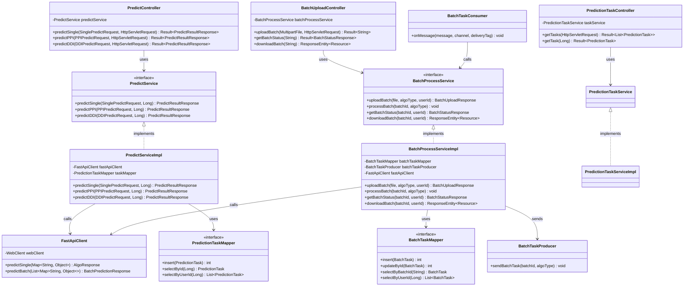
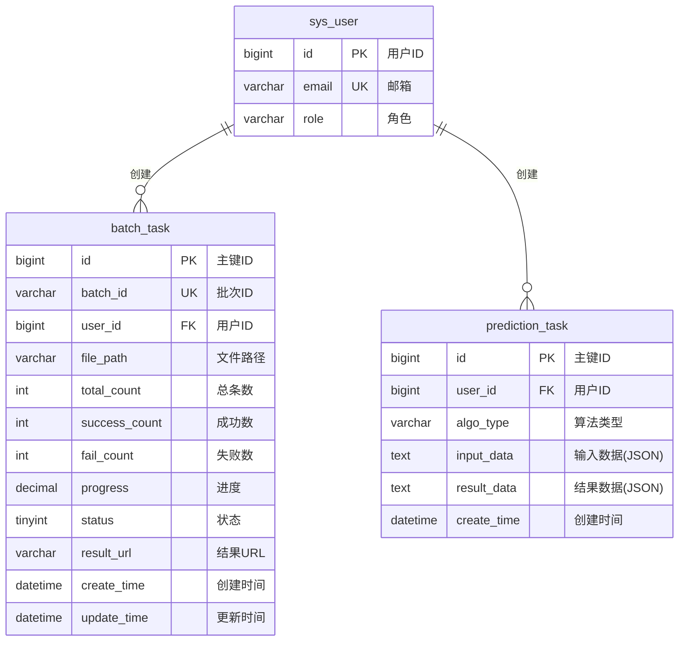
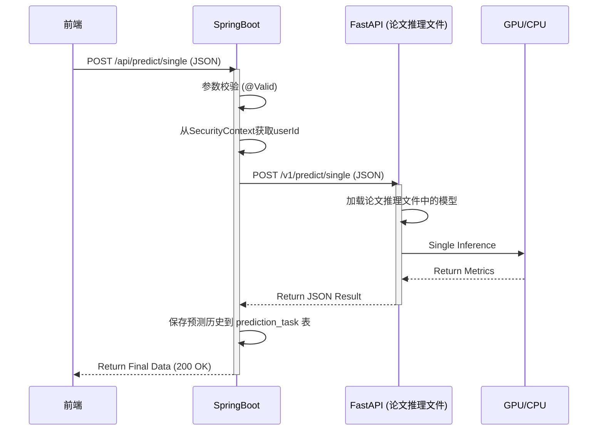
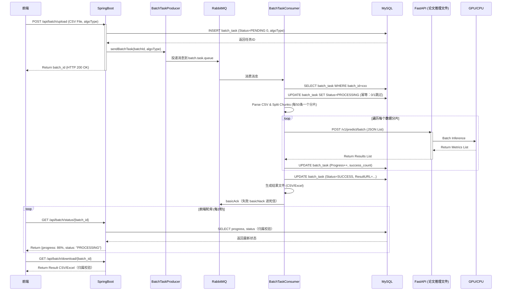

# 基于Springboot和FastAPI双后端框架的预测核心模块技术设计文档

## 1. 模块概述

### 1.1 模块定位

AI预测核心模块是 SynPharm 系统的**核心业务模块**，采用 **SpringBoot 业务中台 + FastAPI 算法引擎** 的微服务分离架构，负责处理三种药物相互作用预测任务：

- **DTI（Drug-Target Interaction）**：药物-靶点相互作用预测
- **PPI（Protein-Protein Interaction）**：蛋白质-蛋白质相互作用预测
- **DDI（Drug-Drug Interaction）**：药物-药物相互作用预测

该模块支持**双模运行机制**：

| 模式         | 适用场景    | 特点                          |
| :--------- | :------ | :-------------------------- |
| **单条处理模式** | 前端实时交互  | 同步/短异步请求，毫秒级响应，即时反馈         |
| **批量处理模式** | 海量CSV数据 | RabbitMQ 消息队列异步调度，进度追踪，结果下载 |

**核心职责**：

- SpringBoot：用户鉴权、单条接口转发、CSV文件解析、任务拆分、异步调度、进度追踪、结果持久化
- FastAPI：无状态计算节点，加载论文中的推理文件，执行GPU推理，提供 `/predict/single` 和 `/predict/batch` 接口

### 1.2 核心特性

| 特性     | 说明                           | 技术实现                        | 设计目的           |
| :----- | :--------------------------- | :-------------------------- | :------------- |
| 双模运行   | 支持单条实时预测和批量CSV处理             | RabbitMQ消息队列 + FastAPI双接口  | 兼顾实时交互与海量数据处理  |
| 微服务分离  | SpringBoot业务中台与FastAPI算法引擎解耦 | HTTP RESTful API通信          | 独立扩展，算法更新不影响业务 |
| 任务管理   | 异步任务提交、状态追踪、进度查询             | `batch_task` 表 + 状态机        | 支持长时间批量任务管理    |
| 结果存储   | 预测结果持久化存储，支持历史查询和下载          | MySQL + 文件存储                | 数据持久化，支持追溯分析   |
| 数据可视化  | 提供相互作用详情，支持可视化展示             | JSON字段存储相互作用数据              | 前端可直接解析渲染      |
| 无状态计算  | FastAPI为纯计算引擎，不依赖数据库         | HTTP接口契约通信                  | 支持水平扩展，多节点部署   |
| Mock模式 | 开发阶段使用模拟数据，无需FastAPI         | `PredictServiceImpl` 随机生成结果 | 加速前端开发和测试      |

### 1.3 设计原则

| 原则       | 应用示例                                                | 代码体现                   |
| :------- | :-------------------------------------------------- | :--------------------- |
| **单一职责** | SpringBoot只处理业务，FastAPI只处理计算                        | 微服务分离架构                |
| **开闭原则** | 新增预测类型只需在FastAPI中扩展                                 | `BaseAlgo` 抽象基类 + 具体实现 |
| **依赖倒置** | SpringBoot依赖FastAPI接口契约                             | HTTP客户端调用，不依赖具体实现      |
| **接口隔离** | `PredictService`、`TaskService`、`ResultService` 独立接口 | 不同业务域使用不同服务接口          |
| **可观测性** | 任务状态、进度可追踪                                          | `batch_task` 表记录完整生命周期 |
| **故障补偿** | 定时任务扫描丢失任务自动重启                                      | 定时重置 `PROCESSING` 状态任务 |

### 1.4 业务场景

| 场景      | 描述                     | 涉及接口                                              |
| :------ | :--------------------- | :------------------------------------------------ |
| DTI单条预测 | 用户输入药物SMILES和靶点序列，实时预测 | `/api/predict/single` → FastAPI `/predict/single` |
| PPI单条预测 | 用户输入两个蛋白质序列，实时预测       | `/api/predict/single` → FastAPI `/predict/single` |
| DDI单条预测 | 用户输入两个药物SMILES，实时预测    | `/api/predict/single` → FastAPI `/predict/single` |
| 批量CSV上传 | 用户上传CSV文件，批量预测         | `/api/batch/upload`                               |
| 查询批量状态  | 用户轮询批量任务进度             | `/api/batch/status/{batch_id}`                    |
| 下载批量结果  | 用户下载批量预测结果文件           | `/api/batch/download/{batch_id}`                  |
| 查询单条历史  | 用户查看单条预测历史             | `/api/prediction/tasks`                           |
| 查询历史详情  | 用户查看单条预测结果详情           | `/api/prediction/tasks/{id}`                      |

***

## 2. 架构设计

### 2.1 整体架构图

```
┌─────────────────────────────────────────────────────────────────────────────┐
│                          前端层 (Vue 3 + TypeScript)                         │
│                                                                             │
│  ┌──────────────────────────────────────────────────────────────────────┐   │
│  │                        预测页面组件                                    │   │
│  │  ┌──────────┐    ┌──────────┐    ┌──────────┐    ┌──────────┐        │   │
│  │  │ 单条预测   │    │ 批量上传   │    │ 结果详情   │    │ 3D可视化  │        │   │
│  │  └────┬─────┘    └────┬─────┘    └────┬─────┘    └────┬─────┘        │   │
│  │  ┌──────────┐    ┌──────────┐                                        │   │
│  │  │ 任务列表  │    │ 进度展示  │                                        │   │
│  │  └──────────┘    └──────────┘                                        │   │
│  └──────────────────────────────────────────────────────────────────────┘   │
└─────────────────────────────────────────────────────────────────────────────┘
                                    │ HTTP/HTTPS
                                    ▼
┌─────────────────────────────────────────────────────────────────────────────┐
│                         网络层 (Nginx 反向代理)                              │
│  ┌──────────────────────────────────────────────────────────────────────┐   │
│  │  - 静态资源托管                                                      │   │
│  │  - API请求转发                                                      │   │
│  │  - X-Forwarded-For 头透传（获取真实客户端IP）                         │   │
│  │  - HTTPS终止                                                        │   │
│  └──────────────────────────────────────────────────────────────────────┘   │
└─────────────────────────────────────────────────────────────────────────────┘
                                    │
                                    ▼
┌─────────────────────────────────────────────────────────────────────────────┐
│                     Spring Security 过滤器链 (Filter Chain)                  │
│                                                                             │
│  ┌──────────┐     ┌──────────┐     ┌──────────────┐     ┌─────────┐        │
│  │ Disable  │────▶│ Cors     │────▶│ JWT Auth    │────▶│Authz    │        │
│  │ Encode   │     │ Filter   │     │ Filter      │     │ Filter  │        │
│  │ (移除)   │     │跨域处理  │     │ 验证Token   │     │ 检查权限│        │
│  └──────────┘     └──────────┘     └──────────────┘     └─────────┘        │
│                     │                                                      │
│                     ▼                                                      │
│              Controller 层                                                 │
└─────────────────────────────────────────────────────────────────────────────┘
                                    │
                                    ▼
┌─────────────────────────────────────────────────────────────────────────────┐
│                      SpringBoot 业务中台                                    │
│                                                                             │
│  ┌──────────────────────────────────────────────────────────────────────┐   │
│  │                        PredictController                              │   │
│  │  POST /api/predict/single  → 转发FastAPI /predict/single             │   │
│  │  POST /api/predict/ppi     → 转发FastAPI /predict/single             │   │
│  │  POST /api/predict/ddi     → 转发FastAPI /predict/single             │   │
│  └──────────────────────────────────────────────────────────────────────┘   │
│                                                                             │
│  ┌──────────────────────────────────────────────────────────────────────┐   │
│  │                      BatchUploadController                           │   │
│  │  POST /api/batch/upload    → 解析CSV,生成batch_id,投递MQ消息         │   │
│  │  GET  /api/batch/status    → 查询批量任务状态（归属校验）             │   │
│  │  GET  /api/batch/download  → 下载批量结果文件（归属校验）             │   │
│  └──────────────────────────────────────────────────────────────────────┘   │
│                                                                             │
│  ┌──────────────────────────────────────────────────────────────────────┐   │
│  │                        PredictionTaskController                       │   │
│  │  GET  /api/prediction/tasks    → 查询单条预测历史                     │   │
│  │  GET  /api/prediction/tasks/{id} → 查询单条预测详情                   │   │
│  └──────────────────────────────────────────────────────────────────────┘   │
│                                                                             │
│  ┌──────────────────────────────────────────────────────────────────────┐   │
│  │                        BatchProcessService                           │   │
│  │  - uploadBatch(file,algoType,userId) → 落库 + 投递MQ消息             │   │
│  │  - processBatch(batchId,algoType)    → 解析CSV,分片调用FastAPI(幂等)  │   │
│  │  - getBatchStatus(batchId,userId)    → 查询进度（归属校验）           │   │
│  │  - downloadBatch(batchId,userId)     → 下载结果（归属校验）           │   │
│  └──────────────────────────────────────────────────────────────────────┘   │
│                                                                             │
│  ┌──────────────────────────────────────────────────────────────────────┐   │
│  │                        FastApiClient                                 │   │
│  │  - predictSingle(data)         → POST /v1/predict/single             │   │
│  │  - predictBatch(dataList)      → POST /v1/predict/batch              │   │
│  └──────────────────────────────────────────────────────────────────────┘   │
│                                                                             │
│  ┌──────────────────────────────────────────────────────────────────────┐   │
│  │                      RabbitMQ (mq 包)                                │   │
│  │  - exchange: synpharm.exchange (direct, durable)                     │   │
│  │  - queue: batch.task.queue + 死信 batch.task.dlq                     │   │
│  │  - producer: BatchTaskProducer → 上传后投递消息                       │   │
│  │  - consumer: BatchTaskConsumer → 手动 ack，失败进死信                 │   │
│  └──────────────────────────────────────────────────────────────────────┘   │
└─────────────────────────────────────────────────────────────────────────────┘
                                    │ HTTP POST (JSON)
                                    ▼
┌─────────────────────────────────────────────────────────────────────────────┐
│                        FastAPI 算法引擎（论文推理文件）                       │
│                                                                             │
│  ┌──────────────────────────────────────────────────────────────────────┐   │
│  │                        main.py (入口)                                 │   │
│  │  - 注册路由: /v1/predict/single, /v1/predict/batch                   │   │
│  │  - 健康检查: /health                                                 │   │
│  └──────────────────────────────────────────────────────────────────────┘   │
│                                                                             │
│  ┌──────────────────────────────────────────────────────────────────────┐   │
│  │                        core/loader.py                                │   │
│  │  - 模型单例加载器                                                     │   │
│  │  - 加载论文中的推理文件（PyTorch/TensorFlow模型）                      │   │
│  │  - 配置设备(CUDA:0)                                                  │   │
│  └──────────────────────────────────────────────────────────────────────┘   │
│                                                                             │
│  ┌──────────────────────────────────────────────────────────────────────┐   │
│  │                        services/                                     │   │
│  │  ┌──────────────┐  ┌──────────────┐  ┌──────────────┐                │   │
│  │  │ base_algo.py │  │ dti_service  │  │ batch_service│                │   │
│  │  │ (抽象基类)    │  │ (DTI实现)    │  │ (批量封装)    │                │   │
│  │  └──────────────┘  └──────────────┘  └──────────────┘                │   │
│  └──────────────────────────────────────────────────────────────────────┘   │
│                                                                             │
│  ┌──────────────────────────────────────────────────────────────────────┐   │
│  │                          GPU/CPU 算力                                 │   │
│  │  - 单条推理: Single Inference                                         │   │
│  │  - 批量推理: Batch Inference                                          │   │
│  └──────────────────────────────────────────────────────────────────────┘   │
└─────────────────────────────────────────────────────────────────────────────┘
                                    │
                                    ▼
┌─────────────────────────────────────────────────────────────────────────────┐
│                            数据存储层                                       │
│                                                                             │
│  ┌──────────────────────────────────────────────────────────────────────┐   │
│  │                          MySQL 8.0                                   │   │
│  │  - batch_task (批次任务表)                                           │   │
│  │  - prediction_task (单条预测历史表)                                   │   │
│  └──────────────────────────────────────────────────────────────────────┘   │
│                                                                             │
│  ┌──────────────────────────────────────────────────────────────────────┐   │
│  │                          文件存储                                     │   │
│  │  - 上传的CSV文件                                                     │   │
│  │  - 批量结果CSV/Excel文件                                             │   │
│  └──────────────────────────────────────────────────────────────────────┘   │
└─────────────────────────────────────────────────────────────────────────────┘
```

### 2.2 模块划分

| 模块                  | 职责                 | 关键类                                                                          | 文件路径                 |
| :------------------ | :----------------- | :--------------------------------------------------------------------------- | :------------------- |
| `api/controller`    | 接收HTTP请求，参数校验，返回响应 | `PredictController`, `BatchUploadController`, `PredictionTaskController`     | `api/`               |
| `service`           | 业务逻辑接口定义           | `PredictService`, `BatchProcessService`, `PredictionTaskService`             | `service/`           |
| `service/impl`      | 业务逻辑实现             | `PredictServiceImpl`, `BatchProcessServiceImpl`, `PredictionTaskServiceImpl` | `service/impl/`      |
| `repository/mapper` | 数据访问               | `BatchTaskMapper`, `PredictionTaskMapper`                                    | `repository/mapper/` |
| `dto/request`       | 请求数据传输对象           | `SinglePredictRequest`, `BatchUploadRequest`, `AlgoType`                     | `dto/request/`       |
| `dto/response`      | 响应数据传输对象           | `PredictResultResponse`, `BatchStatusResponse`, `BatchProgressResponse`      | `dto/response/`      |
| `model/entity`      | 数据库实体              | `BatchTask`, `PredictionTask`                                                | `model/entity/`      |
| `model/enums`       | 枚举定义               | `AlgoType`, `TaskStatus`                                                     | `model/enums/`       |
| `client`            | FastAPI HTTP客户端    | `FastApiClient`                                                              | `client/`            |
| `config`            | 配置类                | `RabbitConfig`, `FastApiConfig`                                              | `config/`            |
| `mq`                | 消息队列               | `RabbitConfig`, `BatchTaskMessage`, `BatchTaskProducer`, `BatchTaskConsumer`  | `mq/`               |

### 2.3 核心类关系图



### 2.4 核心通信机制

系统采用 **HTTP 接口契约**与**数据库状态机**进行协作：

| 通信路径                 | 方式               | 说明                                             |
| :------------------- | :--------------- | :--------------------------------------------- |
| SpringBoot ↔ FastAPI | HTTP RESTful API | SpringBoot作为客户端，发送JSON数据；FastAPI作为服务端，返回JSON结果 |
| SpringBoot ↔ MySQL   | JDBC/ORM         | SpringBoot是MySQL的唯一写入者，负责任务记录和结果持久化            |
| SpringBoot ↔ RabbitMQ | AMQP           | 上传后投递批量任务消息，消费者异步执行，失败进死信队列            |
| FastAPI ↔ MySQL      | **零通信**          | FastAPI是无状态纯计算引擎，只负责"接收参数→计算→返回结果"             |

### 2.5 交互流程图

```mermaid
flowchart TD
    User([前端/用户]) -->|1. 上传CSV文件| SpringBoot

    subgraph SpringBoot业务中台
        SpringBoot -->|2. 解析文件,生成batch_id,落库| MySQL[(MySQL数据库)]
        MySQL -.->|3. 返回任务记录状态| SpringBoot
        SpringBoot -->|4. 投递批量任务消息| MQ[(RabbitMQ<br/>batch.task.queue)]
    end

    subgraph MQ消费者 + FastAPI算法黑箱
        MQ -->|5. 消费者消费消息| Consumer[BatchTaskConsumer]
        Consumer -->|6. HTTP POST /v1/predict/batch (JSON)| FastAPI
        FastAPI -->|7. 加载论文推理文件执行GPU推理| GPU[GPU/CPU算力]
        GPU -->|8. 返回计算指标| FastAPI
        FastAPI -->|9. HTTP 200 OK (JSON结果)| Consumer
        Consumer -->|10. basicAck 确认| MQ
    end

    subgraph 结果持久化
        Consumer -->|11. 更新任务状态与结果| MySQL
        User -->|12. 轮询获取进度| SpringBoot
        SpringBoot -->|13. 查询最新状态(归属校验)| MySQL
        MySQL -.->|14. 返回进度/结果| SpringBoot
        SpringBoot -->|15. 返回进度JSON| User
    end
```

***

## 3. 数据库设计

### 3.1 批次任务表 (batch\_task)

| 字段名             | 类型           | 约束                                                               | 说明          | 设计考虑                                       |
| :-------------- | :----------- | :--------------------------------------------------------------- | :---------- | :----------------------------------------- |
| `id`            | BIGINT       | PRIMARY KEY AUTO\_INCREMENT                                      | 主键ID        | 自增主键                                       |
| `batch_id`      | VARCHAR(64)  | NOT NULL UNIQUE                                                  | 唯一批次ID      | UUID格式，全局唯一                                |
| `user_id`       | BIGINT       | NOT NULL                                                         | 用户ID        | 关联用户表，索引加速查询                               |
| `file_path`     | VARCHAR(255) | NOT NULL                                                         | 原始CSV文件存储路径 | 文件系统存储路径                                   |
| `total_count`   | INT          | NOT NULL DEFAULT 0                                               | 总数据条数       | 进度计算基础                                     |
| `success_count` | INT          | NOT NULL DEFAULT 0                                               | 成功处理条数      | 统计成功数                                      |
| `fail_count`    | INT          | NOT NULL DEFAULT 0                                               | 失败条数        | 统计失败数                                      |
| `progress`      | DECIMAL(5,2) | NOT NULL DEFAULT 0.00                                            | 当前进度        | 0.00-100.00，百分比                            |
| `status`        | TINYINT      | NOT NULL DEFAULT 0                                               | 状态          | 0:PENDING, 1:PROCESSING, 2:SUCCESS, 3:FAIL |
| `algo_type`     | VARCHAR(20)  | NOT NULL DEFAULT ''                                              | 算法类型        | DTI/PPI/DDI，持久化避免依赖 Redis          |
| `result_url`    | VARCHAR(255) | -                                                                | 结果文件下载地址    | 处理完成后生成                                    |
| `error_msg`     | TEXT         | -                                                                | 批次级错误信息     | 失败时记录                                      |
| `create_time`   | DATETIME     | NOT NULL DEFAULT CURRENT\_TIMESTAMP                              | 创建时间        | 自动填充                                       |
| `update_time`   | DATETIME     | NOT NULL DEFAULT CURRENT\_TIMESTAMP ON UPDATE CURRENT\_TIMESTAMP | 更新时间        | 自动更新                                       |
| `deleted`       | TINYINT      | NOT NULL DEFAULT 0                                               | 逻辑删除        | MyBatis-Plus @TableLogic，查询自动过滤     |

**索引设计**：

| 索引名               | 字段            | 类型   | 说明        |
| :---------------- | :------------ | :--- | :-------- |
| `PRIMARY`         | `id`          | 主键索引 | 主键自增      |
| `uk_batch_id`     | `batch_id`    | 唯一索引 | 批次ID唯一性约束 |
| `idx_user_id`     | `user_id`     | 普通索引 | 按用户查询批次   |
| `idx_status`      | `status`      | 普通索引 | 按状态筛选     |
| `idx_create_time` | `create_time` | 普通索引 | 按时间范围查询   |

**DDL语句**：

```sql
CREATE TABLE `batch_task` (
  `id` BIGINT NOT NULL AUTO_INCREMENT COMMENT '主键ID',
  `batch_id` VARCHAR(64) NOT NULL COMMENT '唯一批次ID (UUID)',
  `user_id` BIGINT NOT NULL COMMENT '关联用户ID',
  `file_path` VARCHAR(255) NOT NULL COMMENT '原始CSV文件存储路径',
  `total_count` INT NOT NULL DEFAULT 0 COMMENT '总数据条数',
  `success_count` INT NOT NULL DEFAULT 0 COMMENT '成功处理条数',
  `fail_count` INT NOT NULL DEFAULT 0 COMMENT '失败条数',
  `progress` DECIMAL(5,2) NOT NULL DEFAULT 0.00 COMMENT '当前进度 (0.00-100.00)',
  `status` TINYINT NOT NULL DEFAULT 0 COMMENT '0:PENDING, 1:PROCESSING, 2:SUCCESS, 3:FAIL',
  `algo_type` VARCHAR(20) NOT NULL DEFAULT '' COMMENT '算法类型 DTI/PPI/DDI',
  `result_url` VARCHAR(255) DEFAULT NULL COMMENT '结果文件下载地址',
  `error_msg` TEXT DEFAULT NULL COMMENT '批次级错误信息',
  `create_time` DATETIME NOT NULL DEFAULT CURRENT_TIMESTAMP COMMENT '创建时间',
  `update_time` DATETIME NOT NULL DEFAULT CURRENT_TIMESTAMP ON UPDATE CURRENT_TIMESTAMP COMMENT '更新时间',
  `deleted` TINYINT NOT NULL DEFAULT 0 COMMENT '逻辑删除：0未删除 1已删除',
  PRIMARY KEY (`id`),
  UNIQUE KEY `uk_batch_id` (`batch_id`),
  KEY `idx_user_id` (`user_id`),
  KEY `idx_status` (`status`),
  KEY `idx_create_time` (`create_time`)
) ENGINE=InnoDB DEFAULT CHARSET=utf8mb4 COLLATE=utf8mb4_unicode_ci COMMENT='批次任务表';
```

> 迁移脚本：`synpharm-backend/sql/08_batch_task_alter.sql`（v3.1.0，幂等补列，重复执行报错可忽略）

### 3.2 单条预测历史表 (prediction\_task)

| 字段名           | 类型          | 约束                                  | 说明     | 设计考虑           |
| :------------ | :---------- | :---------------------------------- | :----- | :------------- |
| `id`          | BIGINT      | PRIMARY KEY AUTO\_INCREMENT         | 主键ID   | 自增主键           |
| `user_id`     | BIGINT      | NOT NULL                            | 用户ID   | 关联用户表          |
| `algo_type`   | VARCHAR(20) | NOT NULL                            | 算法类型   | DTI/DDI/PPI，枚举 |
| `input_data`  | TEXT        | NOT NULL                            | 原始输入   | JSON格式存储       |
| `result_data` | TEXT        | -                                   | 算法返回结果 | JSON格式存储       |
| `create_time` | DATETIME    | NOT NULL DEFAULT CURRENT\_TIMESTAMP | 创建时间   | 自动填充           |

**索引设计**：

| 索引名               | 字段            | 类型   | 说明      |
| :---------------- | :------------ | :--- | :------ |
| `PRIMARY`         | `id`          | 主键索引 | 主键自增    |
| `idx_user_id`     | `user_id`     | 普通索引 | 按用户查询历史 |
| `idx_algo_type`   | `algo_type`   | 普通索引 | 按类型统计   |
| `idx_create_time` | `create_time` | 普通索引 | 按时间范围查询 |

**DDL语句**：

```sql
CREATE TABLE `prediction_task` (
  `id` BIGINT NOT NULL AUTO_INCREMENT COMMENT '主键ID',
  `user_id` BIGINT NOT NULL COMMENT '关联用户ID',
  `algo_type` VARCHAR(20) NOT NULL COMMENT '枚举: DTI, DDI, PPI',
  `input_data` TEXT NOT NULL COMMENT '原始输入 (JSON格式)',
  `result_data` TEXT DEFAULT NULL COMMENT '算法返回的原始结果 (JSON)',
  `create_time` DATETIME NOT NULL DEFAULT CURRENT_TIMESTAMP COMMENT '创建时间',
  PRIMARY KEY (`id`),
  KEY `idx_user_id` (`user_id`),
  KEY `idx_algo_type` (`algo_type`),
  KEY `idx_create_time` (`create_time`)
) ENGINE=InnoDB DEFAULT CHARSET=utf8mb4 COLLATE=utf8mb4_unicode_ci COMMENT='单条预测历史表';
```

### 3.3 数据关系图



***

## 4. API 接口设计

### 4.1 接口列表

| 方法   | 路径                               | Controller               | 功能       |  认证 |
| :--- | :------------------------------- | :----------------------- | :------- | :-: |
| POST | `/api/predict/single`            | PredictController        | 单条预测（通用） |  ✅  |
| POST | `/api/predict/dti`               | PredictController        | DTI预测    |  ✅  |
| POST | `/api/predict/ppi`               | PredictController        | PPI预测    |  ✅  |
| POST | `/api/predict/ddi`               | PredictController        | DDI预测    |  ✅  |
| POST | `/api/batch/upload`              | BatchUploadController    | 批量CSV上传  |  ✅  |
| GET  | `/api/batch/status/{batch_id}`   | BatchUploadController    | 查询批量状态   |  ✅  |
| GET  | `/api/batch/download/{batch_id}` | BatchUploadController    | 下载批量结果   |  ✅  |
| GET  | `/api/prediction/tasks`          | PredictionTaskController | 查询单条预测历史 |  ✅  |
| GET  | `/api/prediction/tasks/{id}`     | PredictionTaskController | 查询单条预测详情 |  ✅  |

### 4.2 单条预测接口（通用）

**请求 URL**：`POST /api/predict/single`

**请求头**：

```
Content-Type: application/json
Authorization: Bearer <token>
```

**请求体**：

```json
{
  "algoType": "DTI",
  "drugSmiles": "CC(=O)OC1=CC=CC=C1C(=O)O",
  "targetSeq": "MAKELVVAALALVALVAGVAF"
}
```

| 字段            | 类型     |  必填  | 说明                  |
| :------------ | :----- | :--: | :------------------ |
| `algoType`    | String |   ✅  | 算法类型：DTI/DDI/PPI    |
| `drugSmiles`  | String | 条件必填 | 药物SMILES（DTI/DDI必填） |
| `targetSeq`   | String | 条件必填 | 靶点序列（DTI必填）         |
| `proteinA`    | String | 条件必填 | 蛋白质A序列（PPI必填）       |
| `proteinB`    | String | 条件必填 | 蛋白质B序列（PPI必填）       |
| `drugBSmiles` | String | 条件必填 | 药物B SMILES（DDI必填）   |

**成功响应**（200）：

```json
{
  "code": 200,
  "message": "预测成功",
  "data": {
    "algoType": "DTI",
    "targetId": "P00533",
    "targetName": "EGFR",
    "bindingAffinity": -9.25,
    "confidenceScore": 0.92,
    "confidenceLevel": "high",
    "interactions": [
      {
        "residue": "ASP123",
        "type": "氢键",
        "distance": 2.85
      }
    ]
  }
}
```

### 4.3 DTI预测接口

**请求 URL**：`POST /api/predict/dti`

**请求体**：

```json
{
  "smiles": "CC(=O)OC1=CC=CC=C1C(=O)O",
  "targetSeq": "MAKELVVAALALVALVAGVAF"
}
```

**成功响应**（200）：同上

### 4.4 PPI预测接口

**请求 URL**：`POST /api/predict/ppi`

**请求体**：

```json
{
  "proteinA": "MAKELVVAALALVALVAGVAF",
  "proteinB": "MALWMRLLPLLALLALWGPDPAA"
}
```

**成功响应**（200）：

```json
{
  "code": 200,
  "message": "预测成功",
  "data": {
    "algoType": "PPI",
    "confidenceScore": 0.85,
    "confidenceLevel": "high",
    "interactions": []
  }
}
```

### 4.5 DDI预测接口

**请求 URL**：`POST /api/predict/ddi`

**请求体**：

```json
{
  "drugA": "CC(=O)OC1=CC=CC=C1C(=O)O",
  "drugB": "c1ccccc1"
}
```

**成功响应**（200）：

```json
{
  "code": 200,
  "message": "预测成功",
  "data": {
    "algoType": "DDI",
    "confidenceScore": 0.78,
    "confidenceLevel": "medium",
    "interactions": []
  }
}
```

### 4.6 批量CSV上传接口

**请求 URL**：`POST /api/batch/upload`

**请求头**：

```
Content-Type: multipart/form-data
Authorization: Bearer <token>
```

**请求参数**：

| 参数         | 类型     |  必填 | 说明               |
| :--------- | :----- | :-: | :--------------- |
| `file`     | File   |  ✅  | CSV文件            |
| `algoType` | String |  ✅  | 算法类型：DTI/DDI/PPI |

**CSV文件格式**（DTI示例）：

| drug\_smiles             | target\_seq             |
| :----------------------- | :---------------------- |
| CC(=O)OC1=CC=CC=C1C(=O)O | MAKELVVAALALVALVAGVAF   |
| CCOC(=O)CCCC(=O)O        | MALWMRLLPLLALLALWGPDPAA |

**成功响应**（202）：

```json
{
  "code": 200,
  "message": "任务已受理",
  "data": {
    "batchId": "batch-abc123-def456-7890",
    "totalCount": 1000,
    "status": "PENDING"
  }
}
```

### 4.7 批量状态查询接口

**请求 URL**：`GET /api/batch/status/{batch_id}`

**请求头**：

```
Authorization: Bearer <token>
```

**成功响应**（200）：

```json
{
  "code": 200,
  "message": "查询成功",
  "data": {
    "batchId": "batch-abc123-def456-7890",
    "totalCount": 1000,
    "successCount": 850,
    "failCount": 10,
    "progress": 86.00,
    "status": "PROCESSING",
    "resultUrl": null,
    "createTime": "2026-07-23T10:00:00",
    "updateTime": "2026-07-23T10:30:00"
  }
}
```

### 4.8 批量结果下载接口

**请求 URL**：`GET /api/batch/download/{batch_id}`

**请求头**：

```
Authorization: Bearer <token>
```

**成功响应**（200）：返回CSV/Excel文件下载流

### 4.9 单条预测历史接口

**请求 URL**：`GET /api/prediction/tasks`

**请求头**：

```
Authorization: Bearer <token>
```

**成功响应**（200）：

```json
{
  "code": 200,
  "message": "查询成功",
  "data": [
    {
      "id": 1,
      "algoType": "DTI",
      "inputData": "{\"smiles\": \"...\", \"targetSeq\": \"...\"}",
      "resultData": "{\"bindingAffinity\": -9.25, \"confidenceScore\": 0.92}",
      "createTime": "2026-07-23T10:00:00"
    }
  ]
}
```

### 4.10 响应格式规范

所有接口返回统一格式：

```json
{
  "code": 200,
  "message": "操作成功",
  "data": null
}
```

| 字段        | 类型      | 说明               |
| :-------- | :------ | :--------------- |
| `code`    | Integer | 状态码：200成功，其他为错误码 |
| `message` | String  | 提示信息，用户可读        |
| `data`    | Object  | 业务数据（可为null）     |

### 4.11 错误码定义

| 错误码 | 含义     | HTTP状态码 | 场景                  |
| :-- | :----- | :------ | :------------------ |
| 200 | 成功     | 200     | 操作成功                |
| 400 | 请求参数错误 | 400     | 参数校验失败、CSV格式错误      |
| 401 | 未授权    | 401     | Token无效/过期/在黑名单     |
| 403 | 禁止访问   | 403     | 用户被禁用/无权限           |
| 404 | 资源不存在  | 404     | 批次任务不存在             |
| 500 | 系统错误   | 500     | 服务器内部异常、FastAPI调用失败 |

***

## 5. 核心业务流程

### 5.1 单条处理模式时序图



### 5.2 批量处理模式时序图



***

## 6. FastAPI 算法引擎设计

### 6.1 文件结构

```text
fastapi-engine/
├── main.py              # 入口：注册路由
├── config.py            # 配置：模型路径、设备(CUDA:0)
├── api/v1/
│   ├── predict.py       # 核心接口: /single, /batch
│   └── health.py        # 健康检查: /health
├── core/
│   ├── loader.py        # 模型单例加载器（加载论文推理文件）
│   └── schemas.py       # Pydantic模型 (Single/Batch契约)
└── services/
    ├── base_algo.py     # 抽象基类
    ├── dti_service.py   # DTI具体实现
    ├── ppi_service.py   # PPI具体实现
    ├── ddi_service.py   # DDI具体实现
    └── batch_service.py # 批量推理逻辑封装
```

### 6.2 核心路由实现

```python
from fastapi import APIRouter
from core.schemas import SingleRequest, BatchPredictionRequest, AlgoResponse, BatchPredictionResponse
from services.dti_service import DTIService
from services.ppi_service import PPIService
from services.ddi_service import DDIService
from services.batch_service import BatchPredictor

router = APIRouter()
dti_engine = DTIService()
ppi_engine = PPIService()
ddi_engine = DDIService()
batch_predictor = BatchPredictor()

@router.post("/single", response_model=AlgoResponse)
async def predict_single(req: SingleRequest):
    if req.algo_type == "DTI":
        result = dti_engine.predict({"smiles": req.drug_smiles, "seq": req.target_seq})
    elif req.algo_type == "PPI":
        result = ppi_engine.predict({"proteinA": req.protein_a, "proteinB": req.protein_b})
    elif req.algo_type == "DDI":
        result = ddi_engine.predict({"drugA": req.drug_a, "drugB": req.drug_b})
    else:
        raise ValueError(f"Unknown algo_type: {req.algo_type}")
    return {"status": "success", "metrics": result}

@router.post("/batch", response_model=BatchPredictionResponse)
async def predict_batch(req: BatchPredictionRequest):
    results = batch_predictor.run(req.data_list, req.algo_type)
    return {"status": "success", "total": len(results), "results": results}
```

### 6.3 模型加载器（加载论文推理文件）

```python
from torch import load
from pathlib import Path

class ModelLoader:
    _instance = None
    _models = {}
    
    def __new__(cls):
        if cls._instance is None:
            cls._instance = super().__new__(cls)
            cls._instance._load_models()
        return cls._instance
    
    def _load_models(self):
        model_dir = Path("models/")
        self._models["dti"] = load(model_dir / "dti_model.pt")
        self._models["ppi"] = load(model_dir / "ppi_model.pt")
        self._models["ddi"] = load(model_dir / "ddi_model.pt")
    
    def get_model(self, model_name: str):
        return self._models.get(model_name)
```

### 6.4 DTI服务实现

```python
from core.loader import ModelLoader
from core.schemas import PredictionMetrics

class DTIService:
    def __init__(self):
        self.model = ModelLoader().get_model("dti")
    
    def predict(self, data: dict) -> PredictionMetrics:
        smiles = data["smiles"]
        target_seq = data["seq"]
        
        molecular_features = self._featurize_smiles(smiles)
        target_features = self._featurize_sequence(target_seq)
        
        prediction = self.model(molecular_features, target_features)
        
        return PredictionMetrics(
            binding_affinity=prediction["affinity"].item(),
            confidence_score=prediction["confidence"].item(),
            interactions=self._extract_interactions(prediction)
        )
    
    def _featurize_smiles(self, smiles: str) -> list:
        pass
    
    def _featurize_sequence(self, seq: str) -> list:
        pass
    
    def _extract_interactions(self, prediction) -> list:
        pass
```

***

## 7. SpringBoot 端实现

### 7.1 RabbitMQ 消息队列配置

```java
@Configuration
@EnableRabbit
public class RabbitConfig {

    public static final String EXCHANGE = "synpharm.exchange";
    public static final String QUEUE = "batch.task.queue";
    public static final String DLQ = "batch.task.dlq";

    @Bean
    public DirectExchange synpharmExchange() {
        return new DirectExchange(EXCHANGE, true, false); // durable
    }

    @Bean
    public Queue batchTaskQueue() {
        return QueueBuilder.durable(QUEUE)
                .deadLetterExchange("")
                .deadLetterRoutingKey(DLQ)
                .build();
    }

    @Bean
    public Queue batchTaskDlq() {
        return QueueBuilder.durable(DLQ).build();
    }

    @Bean
    public Binding binding(Queue batchTaskQueue, DirectExchange synpharmExchange) {
        return BindingBuilder.bind(batchTaskQueue).to(synpharmExchange).with(QUEUE);
    }
}
```

### 7.2 FastAPI客户端

```java
@Component
public class FastApiClient {
    
    private final WebClient webClient;
    
    public FastApiClient(@Value("${fastapi.base-url}") String baseUrl) {
        this.webClient = WebClient.create(baseUrl);
    }
    
    public AlgoResponse predictSingle(Map<String, Object> data) {
        return webClient.post()
                .uri("/v1/predict/single")
                .contentType(MediaType.APPLICATION_JSON)
                .bodyValue(data)
                .retrieve()
                .bodyToMono(AlgoResponse.class)
                .block(Duration.ofSeconds(30));
    }
    
    public BatchPredictionResponse predictBatch(List<Map<String, Object>> dataList) {
        return webClient.post()
                .uri("/v1/predict/batch")
                .contentType(MediaType.APPLICATION_JSON)
                .bodyValue(Map.of("data_list", dataList))
                .retrieve()
                .bodyToMono(BatchPredictionResponse.class)
                .block(Duration.ofSeconds(60));
    }
}
```

### 7.3 批量处理服务（生产者 + 消费者）

```java
// ===== 生产者：上传后投递消息 =====
@Component
public class BatchTaskProducer {
    @Autowired private RabbitTemplate rabbitTemplate;

    public void sendBatchTask(String batchId, String algoType) {
        rabbitTemplate.convertAndSend(
            RabbitConfig.EXCHANGE, RabbitConfig.QUEUE,
            new BatchTaskMessage(batchId, algoType));
    }
}

// ===== 消费者：异步执行 + 手动 ack =====
@Component
public class BatchTaskConsumer {
    @Autowired private BatchProcessService batchProcessService;

    @RabbitListener(queues = RabbitConfig.QUEUE, ackMode = "MANUAL")
    public void onMessage(BatchTaskMessage msg, Channel channel,
                          @Header(AmqpHeaders.DELIVERY_TAG) long tag) throws Exception {
        try {
            batchProcessService.processBatch(msg.getBatchId(), msg.getAlgoType());
            channel.basicAck(tag, false);
        } catch (Exception e) {
            channel.basicNack(tag, false, false); // 进死信
        }
    }
}

// ===== 业务：DB 为权威 + 幂等 =====
@Override
public void processBatch(String batchId, String algoType) {
    BatchTask task = batchTaskMapper.selectByBatchId(batchId);
    if (task == null) return;
    if (task.getStatus() == 1 || task.getStatus() == 2) return; // 幂等跳过
    
    task.setStatus(1); // PROCESSING
    batchTaskMapper.updateById(task);
    
    // 分片（50/片）调用 PipelineFactory.batchProcess / FastApiClient.predictBatch
    // 每 5 片批量更新进度 + success_count
    
    task.setStatus(2); // SUCCESS + resultUrl
    batchTaskMapper.updateById(task);
}
```

***

## 8. 任务管理设计

### 8.1 批次任务状态机

```
PENDING (0) ──▶ PROCESSING (1) ──▶ SUCCESS (2)
                 │
                 ▼
              FAIL (3)
```

| 状态           | 编码 | 说明  | 可转换到          |
| :----------- | :- | :-- | :------------ |
| `PENDING`    | 0  | 待处理 | PROCESSING    |
| `PROCESSING` | 1  | 处理中 | SUCCESS, FAIL |
| `SUCCESS`    | 2  | 成功  | -             |
| `FAIL`       | 3  | 失败  | -             |

### 8.2 故障补偿机制

已使用 RabbitMQ：消息**持久化**，节点重启不丢失；消费失败进入**死信队列**（`batch.task.dlq`）便于人工/脚本排查重投；消费侧**幂等**（status 0/1 跳过）防止重复投递重复处理。

（可选增强）定时扫描长期 `PROCESSING` 的任务重新投递：

```java
@Scheduled(fixedRate = 300000)
public void recoverLostTasks() {
    List<BatchTask> lostTasks = batchTaskMapper.selectProcessingOvertime();
    for (BatchTask task : lostTasks) {
        task.setStatus(0); // 重置为PENDING
        batchTaskMapper.updateById(task);
        batchTaskProducer.sendBatchTask(task.getBatchId(), task.getAlgoType()); // 重新投递
    }
}
```

***

## 9. 配置说明

### 9.1 application.yml 配置

```yaml
server:
  port: 8080

spring:
  datasource:
    url: ${DB_URL:jdbc:mysql://localhost:3306/synpharm?useUnicode=true&characterEncoding=utf8&serverTimezone=Asia/Shanghai}
    username: ${DB_USERNAME:root}
    password: ${DB_PASSWORD:password}
    driver-class-name: com.mysql.cj.jdbc.Driver
  servlet:
    multipart:
      max-file-size: 100MB
      max-request-size: 100MB

# FastAPI配置
fastapi:
  base-url: ${FASTAPI_URL:http://localhost:8000}
  timeout-single: 30000
  timeout-batch: 60000

# 文件存储配置
file:
  upload-dir: ${FILE_UPLOAD_DIR:./uploads}
  result-dir: ${FILE_RESULT_DIR:./results}
```

### 9.2 环境变量说明

| 环境变量              | 默认值                                    | 说明            |
| :---------------- | :------------------------------------- | :------------ |
| `DB_URL`          | `jdbc:mysql://localhost:3306/synpharm` | 数据库连接URL      |
| `DB_USERNAME`     | `root`                                 | 数据库用户名        |
| `DB_PASSWORD`     | `password`                             | 数据库密码         |
| `FASTAPI_URL`     | `http://localhost:8000`                | FastAPI算法引擎地址 |
| `FILE_UPLOAD_DIR` | `./uploads`                            | 上传文件存储目录      |
| `FILE_RESULT_DIR` | `./results`                            | 结果文件存储目录      |

***

## 10. 输入数据规范

### 10.1 SMILES格式

SMILES（Simplified Molecular Input Line Entry System）是一种简化的分子输入线性编码系统。

**示例**：

- 阿司匹林：`CC(=O)OC1=CC=CC=C1C(=O)O`
- 布洛芬：`CC(C)C(C(=O)O)C1=CC=CC=C1`

### 10.2 氨基酸序列

蛋白质的氨基酸序列，使用单字母缩写。

**示例**：

```
MAKELVVAALALVALVAGVAF
```

### 10.3 CSV文件格式

**DTI预测CSV格式**：

| drug\_smiles             | target\_seq             |
| :----------------------- | :---------------------- |
| CC(=O)OC1=CC=CC=C1C(=O)O | MAKELVVAALALVALVAGVAF   |
| CCOC(=O)CCCC(=O)O        | MALWMRLLPLLALLALWGPDPAA |

**PPI预测CSV格式**：

| protein\_a            | protein\_b              |
| :-------------------- | :---------------------- |
| MAKELVVAALALVALVAGVAF | MALWMRLLPLLALLALWGPDPAA |

**DDI预测CSV格式**：

| drug\_a                  | drug\_b  |
| :----------------------- | :------- |
| CC(=O)OC1=CC=CC=C1C(=O)O | c1ccccc1 |

***

## 11. 输出数据说明

### 11.1 结合亲和力 (Binding Affinity)

- **单位**：kcal/mol
- **含义**：负值表示药物与靶点结合紧密，值越小（越负）表示亲和力越强
- **范围**：通常在 -5 到 -15 kcal/mol 之间

### 11.2 置信度 (Confidence Score)

- **范围**：0-1
- **含义**：模型对预测结果的置信程度
- **划分**：
  - 高：≥ 0.9
  - 中：0.8 - 0.9
  - 低：< 0.8

### 11.3 相互作用类型

| 类型    | 说明               |
| :---- | :--------------- |
| 氢键    | 药物与蛋白质残基之间的氢键作用  |
| 疏水作用  | 疏水性氨基酸侧链与药物的相互作用 |
| 盐桥    | 带电残基与药物之间的静电相互作用 |
| π-π堆积 | 芳香环之间的π-π相互作用    |

***

## 附录 A：索引设计汇总

| 表名                | 索引名               | 字段            | 类型   | 说明      |
| :---------------- | :---------------- | :------------ | :--- | :------ |
| `batch_task`      | `PRIMARY`         | `id`          | 主键索引 | 主键自增    |
| `batch_task`      | `uk_batch_id`     | `batch_id`    | 唯一索引 | 批次ID唯一性 |
| `batch_task`      | `idx_user_id`     | `user_id`     | 普通索引 | 用户批次查询  |
| `batch_task`      | `idx_status`      | `status`      | 普通索引 | 状态筛选    |
| `batch_task`      | `idx_create_time` | `create_time` | 普通索引 | 时间范围查询  |
| `prediction_task` | `PRIMARY`         | `id`          | 主键索引 | 主键自增    |
| `prediction_task` | `idx_user_id`     | `user_id`     | 普通索引 | 用户历史查询  |
| `prediction_task` | `idx_algo_type`   | `algo_type`   | 普通索引 | 类型统计    |
| `prediction_task` | `idx_create_time` | `create_time` | 普通索引 | 时间范围查询  |

***

## 附录 B：协同开发与运维注意事项

1. **接口契约锁定**：FastAPI 的 `/single` 与 `/batch` 接口一旦上线，字段不可随意删除，新增字段需保持向后兼容。
2. **超时与重试**：SpringBoot 调用 FastAPI 批量接口时，设置 60s 超时；若超时，自动重试 1 次，仍失败则标记该分片为 FAIL。
3. **资源隔离**：FastAPI 需限制 `/batch` 接口的并发数（如 `max_workers=2`），防止多批次同时打满显存导致 OOM。
4. **单机容灾补偿**：由于未使用 MQ，若 SpringBoot 节点意外重启，内存中排队的任务会丢失。需实现定时任务（每 5 分钟扫描一次），将状态为 `PROCESSING` 但 `update_time` 超过 10 分钟未更新的批次重置为 `PENDING`，由节点自动拉起重新执行。

***

**版本**: v2.0.0\
**创建日期**: 2026-07-23\
**更新说明**: 基于论文推理文件，重构为 SpringBoot + FastAPI 双模运行架构\
**适用范围**: SynPharm AI预测核心模块开发与扩展
