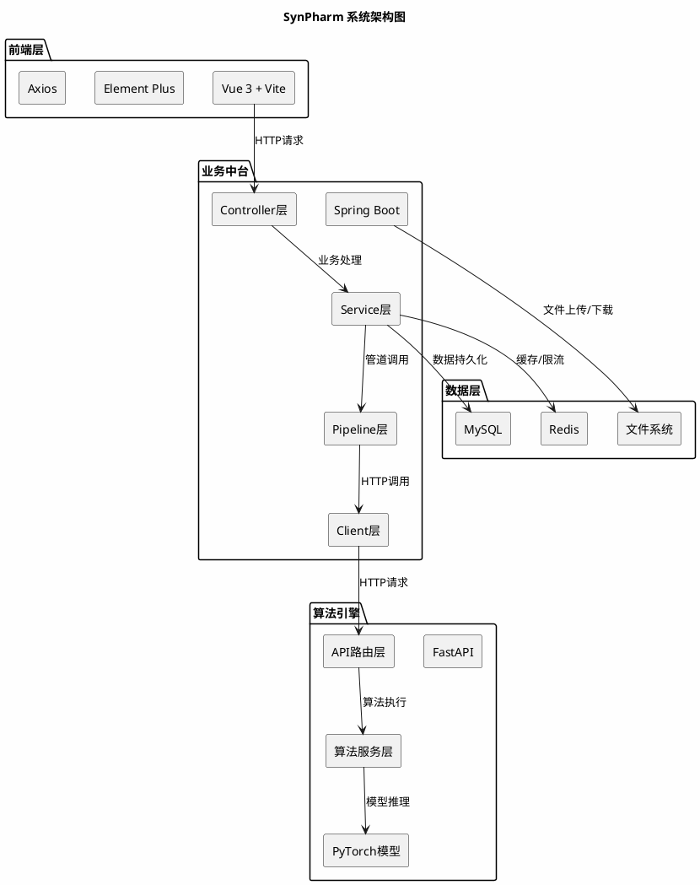
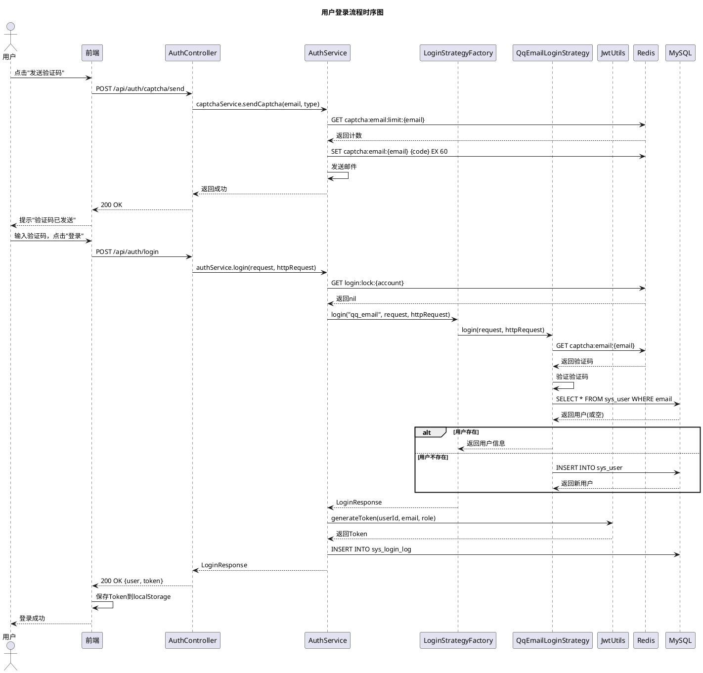
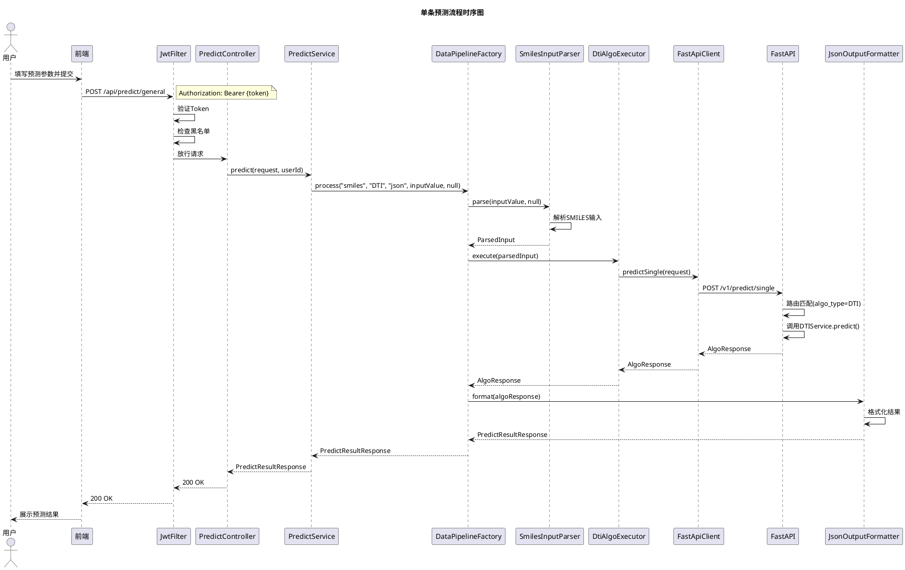
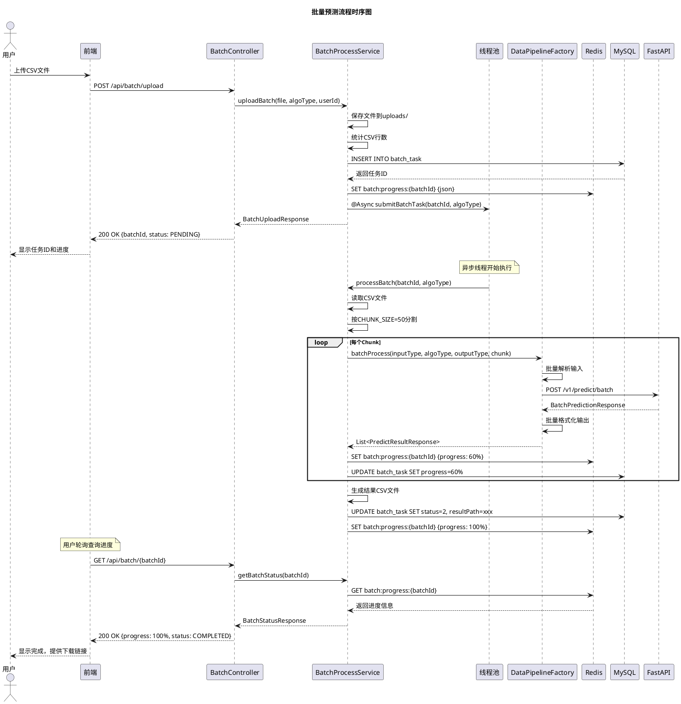
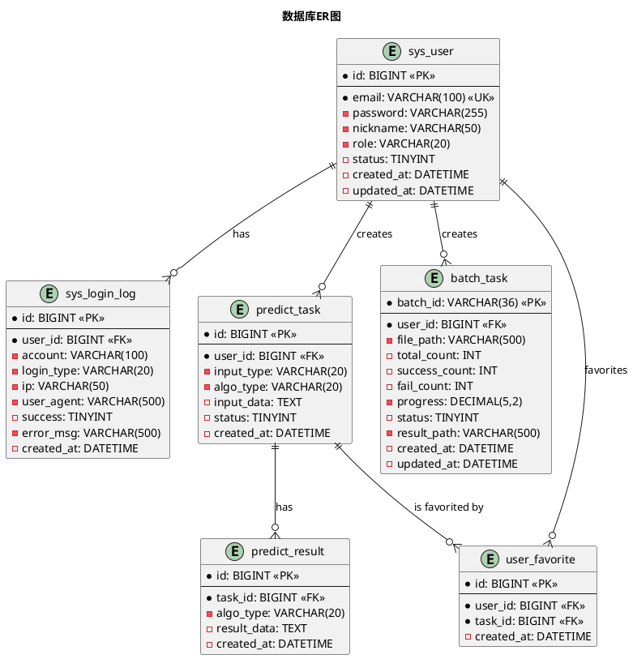
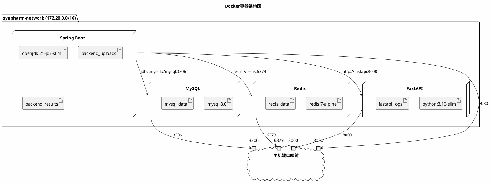
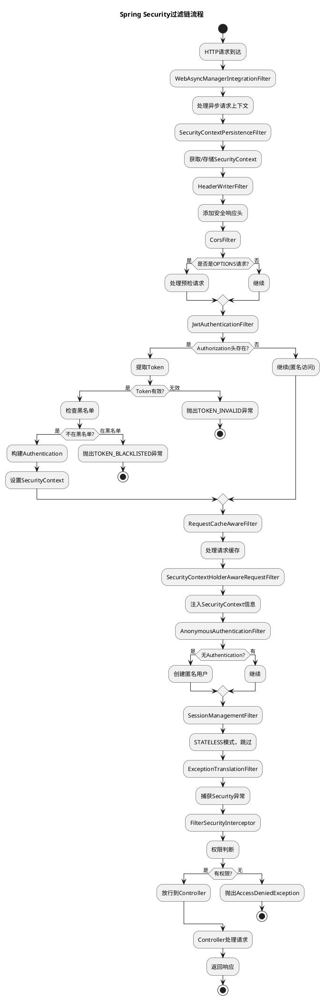
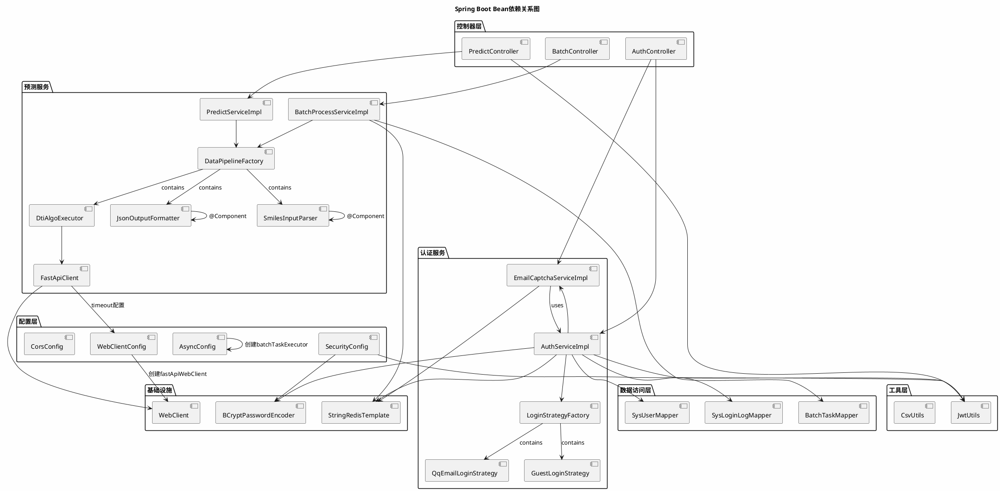

# SynPharm 架构设计文档

> 文档版本：v1.0.0  
> 创建日期：2026-07-26  
> 文档状态：正式版

---

## 目录

1. [系统架构图](#1-系统架构图)
2. [登录流程时序图](#2-登录流程时序图)
3. [预测流程时序图](#3-预测流程时序图)
4. [批量预测流程时序图](#4-批量预测流程时序图)
5. [管道机制类图](#5-管道机制类图)
6. [数据库ER图](#6-数据库er图)
7. [Docker容器架构图](#7-docker容器架构图)
8. [安全过滤链流程图](#8-安全过滤链流程图)
9. [Bean依赖关系图](#9-bean依赖关系图)

---

## 1. 系统架构图



**架构说明**：

| 层级 | 技术 | 职责 |
|:---|:---|:---|
| 前端层 | Vue 3 + Element Plus | 用户界面展示，交互逻辑 |
| 业务中台 | Spring Boot | 业务逻辑、管道编排、安全认证 |
| 算法引擎 | FastAPI + PyTorch | 纯算法运算，GPU加速推理 |
| 数据层 | MySQL + Redis + 文件系统 | 数据存储、缓存、文件管理 |

---

## 2. 登录流程时序图



---

## 3. 预测流程时序图



---

## 4. 批量预测流程时序图



---

## 5. 管道机制类图

```plantuml
@startuml
title 管道机制类图

skinparam backgroundColor #FEFEFE
skinparam classStyle rectangle

interface InputParser {
  +getInputType(): InputType
  +parse(inputValue: String, fileUrl: String): ParsedInput
}

interface AlgoExecutor {
  +getAlgoType(): AlgoType
  +execute(inputData: ParsedInput): AlgoResponse
  +batchExecute(inputDataList: List<ParsedInput>): List<AlgoResponse>
}

interface OutputFormatter {
  +getOutputType(): OutputType
  +format(resultData: AlgoResponse): PredictResultResponse
  +batchFormat(resultDataList: List<AlgoResponse>): List<PredictResultResponse>
}

interface PipelineFactory {
  +process(inputType, algoType, outputType, inputValue, fileUrl): PredictResultResponse
  +batchProcess(inputType, algoType, outputType, inputs): List<PredictResultResponse>
  +supports(inputType, algoType, outputType): boolean
}

class DataPipelineFactory {
  -parserMap: Map<InputType, InputParser>
  -executorMap: Map<AlgoType, AlgoExecutor>
  -formatterMap: Map<OutputType, OutputFormatter>
  +process(inputType, algoType, outputType, inputValue, fileUrl): PredictResultResponse
  +batchProcess(inputType, algoType, outputType, inputs): List<PredictResultResponse>
  +supports(inputType, algoType, outputType): boolean
}

class SmilesInputParser {
  +getInputType(): InputType
  +parse(inputValue: String, fileUrl: String): ParsedInput
}

class UniprotInputParser {
  +getInputType(): InputType
  +parse(inputValue: String, fileUrl: String): ParsedInput
}

class PdbInputParser {
  +getInputType(): InputType
  +parse(inputValue: String, fileUrl: String): ParsedInput
}

class CsvInputParser {
  +getInputType(): InputType
  +parse(inputValue: String, fileUrl: String): ParsedInput
}

class DtiAlgoExecutor {
  -fastApiClient: FastApiClient
  +getAlgoType(): AlgoType
  +execute(inputData: ParsedInput): AlgoResponse
  +batchExecute(inputDataList: List<ParsedInput>): List<AlgoResponse>
}

class PpiAlgoExecutor {
  -fastApiClient: FastApiClient
  +getAlgoType(): AlgoType
  +execute(inputData: ParsedInput): AlgoResponse
  +batchExecute(inputDataList: List<ParsedInput>): List<AlgoResponse>
}

class DdiAlgoExecutor {
  -fastApiClient: FastApiClient
  +getAlgoType(): AlgoType
  +execute(inputData: ParsedInput): AlgoResponse
  +batchExecute(inputDataList: List<ParsedInput>): List<AlgoResponse>
}

class JsonOutputFormatter {
  +getOutputType(): OutputType
  +format(resultData: AlgoResponse): PredictResultResponse
  +batchFormat(resultDataList: List<AlgoResponse>): List<PredictResultResponse>
}

class CsvOutputFormatter {
  +getOutputType(): OutputType
  +format(resultData: AlgoResponse): PredictResultResponse
  +batchFormat(resultDataList: List<AlgoResponse>): List<PredictResultResponse>
}

DataPipelineFactory ..|> PipelineFactory

SmilesInputParser ..|> InputParser
UniprotInputParser ..|> InputParser
PdbInputParser ..|> InputParser
CsvInputParser ..|> InputParser

DtiAlgoExecutor ..|> AlgoExecutor
PpiAlgoExecutor ..|> AlgoExecutor
DdiAlgoExecutor ..|> AlgoExecutor

JsonOutputFormatter ..|> OutputFormatter
CsvOutputFormatter ..|> OutputFormatter

DataPipelineFactory o-- InputParser : contains
DataPipelineFactory o-- AlgoExecutor : contains
DataPipelineFactory o-- OutputFormatter : contains

DtiAlgoExecutor --> FastApiClient : uses
PpiAlgoExecutor --> FastApiClient : uses
DdiAlgoExecutor --> FastApiClient : uses

@enduml
```



**设计说明**：

| 组件 | 职责 | 设计模式 |
|:---|:---|:---|
| InputParser | 解析不同类型的输入数据 | 策略模式 |
| AlgoExecutor | 执行不同算法的预测 | 策略模式 |
| OutputFormatter | 格式化不同类型的输出 | 策略模式 |
| DataPipelineFactory | 动态组合策略，执行管道 | 工厂模式 |

---

## 6. 数据库ER图



---

## 7. Docker容器架构图



**容器通信说明**：

| 容器 | 内部地址 | 主机映射端口 | 用途 |
|:---|:---|:---|:---|
| synpharm-mysql | mysql:3306 | 3306 | 数据库服务 |
| synpharm-redis | redis:6379 | 6379 | 缓存服务 |
| synpharm-fastapi | fastapi:8000 | 8000 | 算法服务 |
| synpharm-backend | backend:8080 | 8080 | 业务服务 |

---

## 8. 安全过滤链流程图



---

## 9. Bean依赖关系图



---

## 附录：UML图查看方法

### 在线查看

将PlantUML代码复制到以下在线工具中查看：

- [PlantUML Online Server](https://www.plantuml.com/plantuml/)
- [Draw.io](https://app.diagrams.net/)

### 本地查看

安装PlantUML插件：

**IntelliJ IDEA / PyCharm**：
1. 安装插件：PlantUML Integration
2. 右键点击 `.md` 文件 → Diagrams → Show Diagram

**VS Code**：
1. 安装插件：PlantUML
2. 按 `Ctrl+Shift+P` → PlantUML: Preview Current Diagram

### 生成图片

```bash
# 安装PlantUML
sudo apt-get install plantuml

# 生成图片
plantuml architecture_diagram.puml -o output/
```