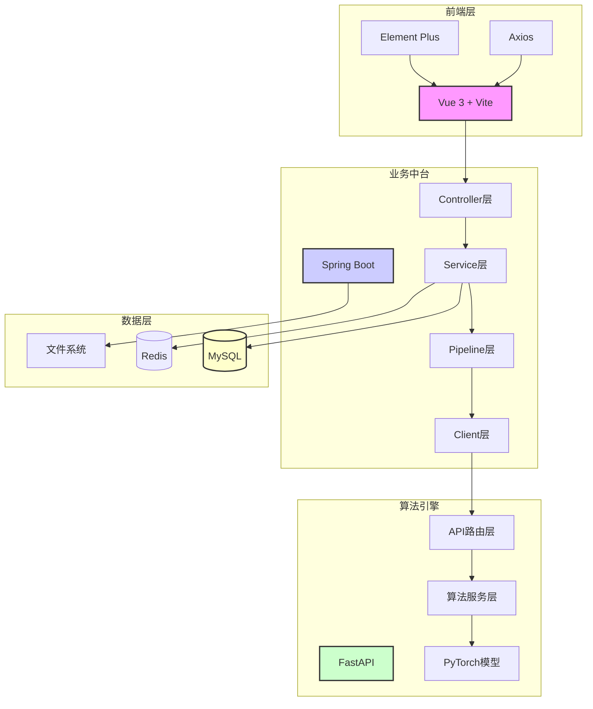
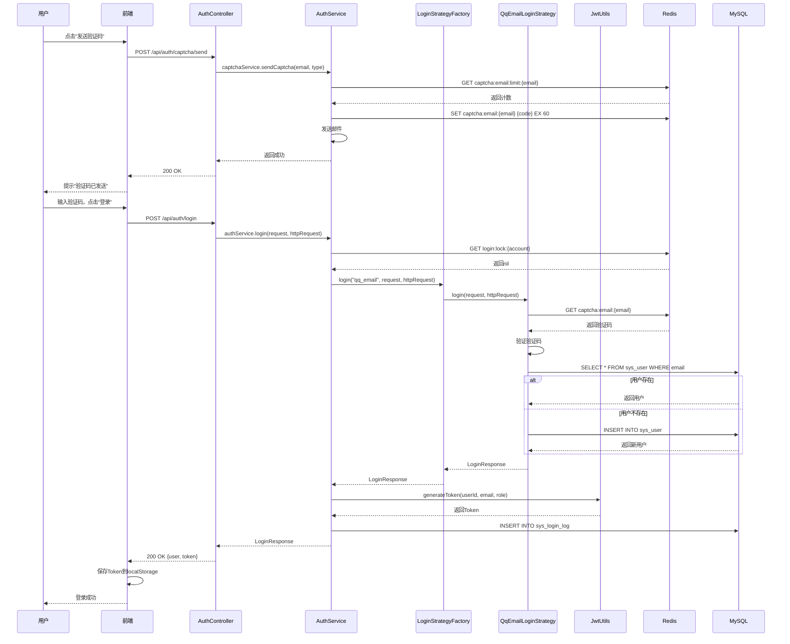
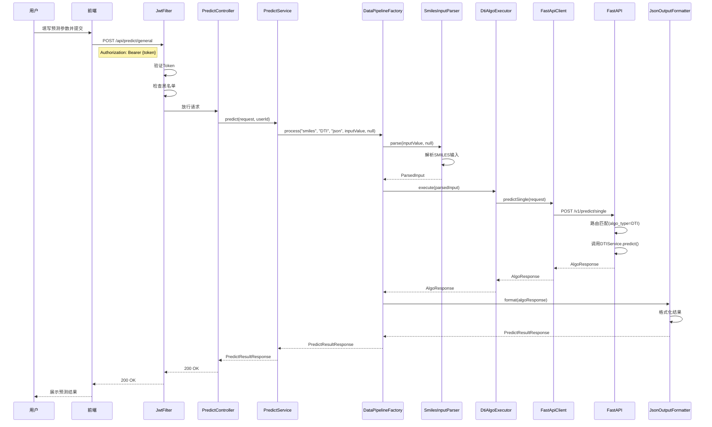
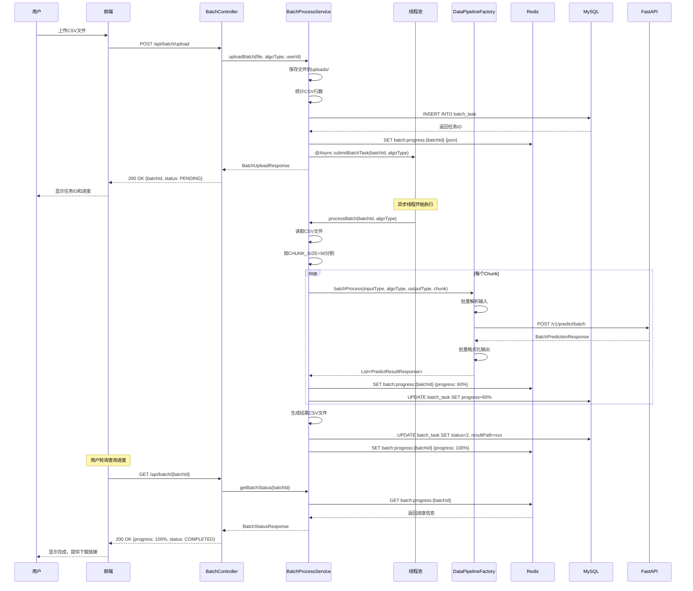
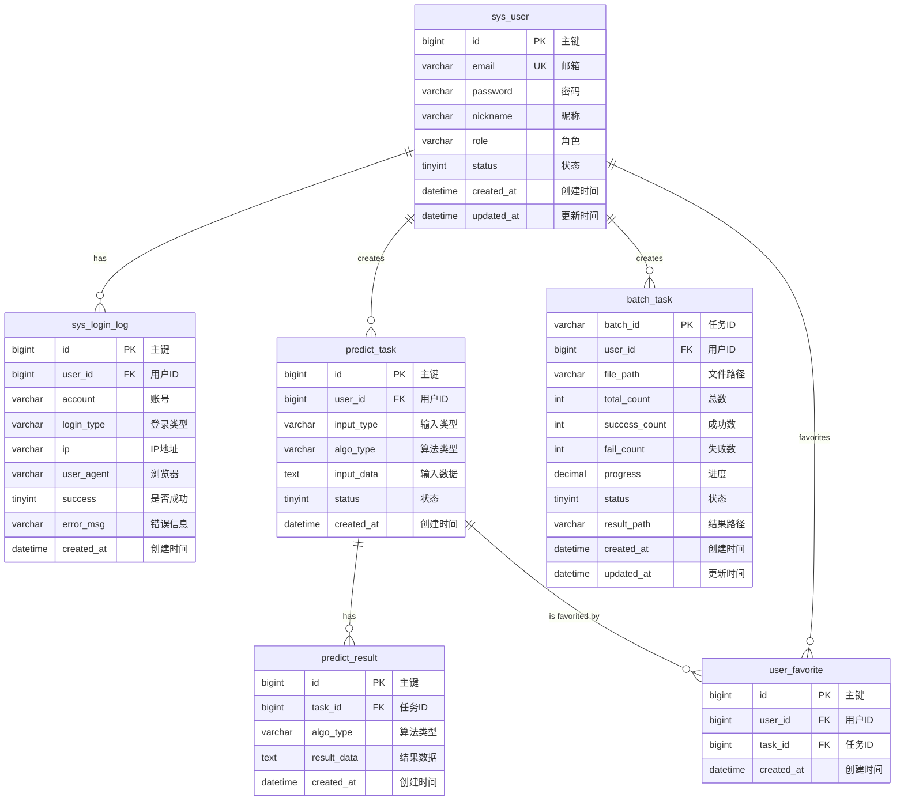
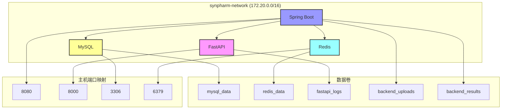
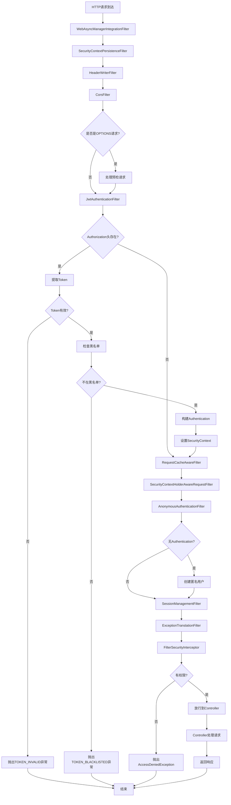
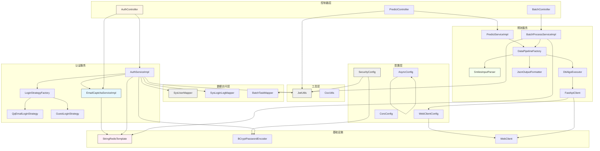
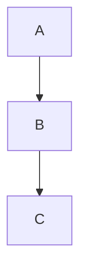

# SynPharm 架构设计文档

> 文档版本：v2.0.0  
> 创建日期：2026-07-26  
> 文档状态：正式版  
> 图表格式：Mermaid（GitHub自动渲染为图片）

---

## 目录

1. [系统架构图](#1-系统架构图)
2. [登录流程时序图](#2-登录流程时序图)
3. [预测流程时序图](#3-预测流程时序图)
4. [批量预测流程时序图](#4-批量预测流程时序图)
5. [管道机制类图](#5-管道机制类图)
6. [数据库ER图](#6-数据库er图)
7. [Docker容器架构图](#7-docker容器架构图)
8. [安全过滤链流程图](#8-安全过滤链流程图)
9. [Bean依赖关系图](#9-bean依赖关系图)

---

## 1. 系统架构图



**架构说明**：

| 层级 | 技术 | 职责 |
|:---|:---|:---|
| 前端层 | Vue 3 + Element Plus | 用户界面展示，交互逻辑 |
| 业务中台 | Spring Boot | 业务逻辑、管道编排、安全认证 |
| 算法引擎 | FastAPI + PyTorch | 纯算法运算，GPU加速推理 |
| 数据层 | MySQL + Redis + 文件系统 | 数据存储、缓存、文件管理 |

---

## 2. 登录流程时序图



---

## 3. 预测流程时序图



---

## 4. 批量预测流程时序图



---

## 5. 管道机制类图

```mermaid
classDiagram
    class InputParser {
        <<interface>>
        +getInputType() InputType
        +parse(inputValue: String, fileUrl: String) ParsedInput
    }

    class AlgoExecutor {
        <<interface>>
        +getAlgoType() AlgoType
        +execute(inputData: ParsedInput) AlgoResponse
        +batchExecute(inputDataList: List~ParsedInput~) List~AlgoResponse~
    }

    class OutputFormatter {
        <<interface>>
        +getOutputType() OutputType
        +format(resultData: AlgoResponse) PredictResultResponse
        +batchFormat(resultDataList: List~AlgoResponse~) List~PredictResultResponse~
    }

    class PipelineFactory {
        <<interface>>
        +process(inputType, algoType, outputType, inputValue, fileUrl) PredictResultResponse
        +batchProcess(inputType, algoType, outputType, inputs) List~PredictResultResponse~
        +supports(inputType, algoType, outputType) boolean
    }

    class DataPipelineFactory {
        -parserMap: Map~InputType, InputParser~
        -executorMap: Map~AlgoType, AlgoExecutor~
        -formatterMap: Map~OutputType, OutputFormatter~
        +process(inputType, algoType, outputType, inputValue, fileUrl) PredictResultResponse
        +batchProcess(inputType, algoType, outputType, inputs) List~PredictResultResponse~
        +supports(inputType, algoType, outputType) boolean
    }

    class SmilesInputParser {
        +getInputType() InputType
        +parse(inputValue: String, fileUrl: String) ParsedInput
    }

    class UniprotInputParser {
        +getInputType() InputType
        +parse(inputValue: String, fileUrl: String) ParsedInput
    }

    class PdbInputParser {
        +getInputType() InputType
        +parse(inputValue: String, fileUrl: String) ParsedInput
    }

    class CsvInputParser {
        +getInputType() InputType
        +parse(inputValue: String, fileUrl: String) ParsedInput
    }

    class DtiAlgoExecutor {
        -fastApiClient: FastApiClient
        +getAlgoType() AlgoType
        +execute(inputData: ParsedInput) AlgoResponse
        +batchExecute(inputDataList: List~ParsedInput~) List~AlgoResponse~
    }

    class PpiAlgoExecutor {
        -fastApiClient: FastApiClient
        +getAlgoType() AlgoType
        +execute(inputData: ParsedInput) AlgoResponse
        +batchExecute(inputDataList: List~ParsedInput~) List~AlgoResponse~
    }

    class DdiAlgoExecutor {
        -fastApiClient: FastApiClient
        +getAlgoType() AlgoType
        +execute(inputData: ParsedInput) AlgoResponse
        +batchExecute(inputDataList: List~ParsedInput~) List~AlgoResponse~
    }

    class JsonOutputFormatter {
        +getOutputType() OutputType
        +format(resultData: AlgoResponse) PredictResultResponse
        +batchFormat(resultDataList: List~AlgoResponse~) List~PredictResultResponse~
    }

    class CsvOutputFormatter {
        +getOutputType() OutputType
        +format(resultData: AlgoResponse) PredictResultResponse
        +batchFormat(resultDataList: List~AlgoResponse~) List~PredictResultResponse~
    }

    DataPipelineFactory ..|> PipelineFactory

    SmilesInputParser ..|> InputParser
    UniprotInputParser ..|> InputParser
    PdbInputParser ..|> InputParser
    CsvInputParser ..|> InputParser

    DtiAlgoExecutor ..|> AlgoExecutor
    PpiAlgoExecutor ..|> AlgoExecutor
    DdiAlgoExecutor ..|> AlgoExecutor

    JsonOutputFormatter ..|> OutputFormatter
    CsvOutputFormatter ..|> OutputFormatter

    DataPipelineFactory o-- InputParser
    DataPipelineFactory o-- AlgoExecutor
    DataPipelineFactory o-- OutputFormatter

    DtiAlgoExecutor --> FastApiClient
    PpiAlgoExecutor --> FastApiClient
    DdiAlgoExecutor --> FastApiClient
```



**设计说明**：

| 组件 | 职责 | 设计模式 |
|:---|:---|:---|
| InputParser | 解析不同类型的输入数据 | 策略模式 |
| AlgoExecutor | 执行不同算法的预测 | 策略模式 |
| OutputFormatter | 格式化不同类型的输出 | 策略模式 |
| DataPipelineFactory | 动态组合策略，执行管道 | 工厂模式 |

---

## 6. 数据库ER图



---

## 7. Docker容器架构图



**容器通信说明**：

| 容器 | 内部地址 | 主机映射端口 | 用途 |
|:---|:---|:---|:---|
| synpharm-mysql | mysql:3306 | 3306 | 数据库服务 |
| synpharm-redis | redis:6379 | 6379 | 缓存服务 |
| synpharm-fastapi | fastapi:8000 | 8000 | 算法服务 |
| synpharm-backend | backend:8080 | 8080 | 业务服务 |

---

## 8. 安全过滤链流程图



---

## 9. Bean依赖关系图



---

## 附录：Mermaid语法说明

### GitHub渲染

GitHub原生支持Mermaid语法，在 `.md` 文件中使用以下格式即可自动渲染为图片：

```markdown

```

### 本地预览

**VS Code**：
1. 安装插件：**Markdown Preview Mermaid Support**
2. 按 `Ctrl+Shift+V` 预览文档

**IDEA**：
1. 安装插件：**Mermaid**
2. 右键点击文档 → **Preview**

### 导出图片

使用以下在线工具将Mermaid代码导出为图片：

- [Mermaid Live Editor](https://mermaid.live/)
- [Draw.io](https://app.diagrams.net/)

---

## 文档版本记录

| 版本 | 日期 | 修改内容 |
|:---|:---|:---|
| v1.0.0 | 2026-07-26 | 初始版本，使用PlantUML语法 |
| v2.0.0 | 2026-07-26 | 升级为Mermaid语法，GitHub自动渲染图片 |