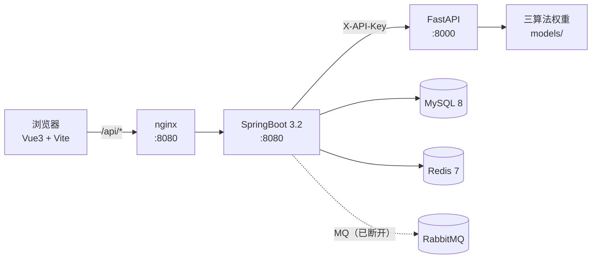

# SynPharm 问题总账与整改方案（整合版）

> **文档版本**：v1.0
> **整合日期**：2026-09-16
> **文档性质**：**唯一权威问题总账**。此前分散在多份文档中的问题项、方案项与代码审查结论，全部归并至本文；其他文档若与本文冲突，以本文为准。
> **核验方式**：对 `synpharm-backend`（133 个 Java 文件）、`synpharm-frontend`（38 个 `.vue`/`.ts`）、`synpharm-fastapi`（全部自研代码）做全量通读，并对标 🔍 标记的关键结论逐条复读源代码确认。
> **前置阅读**：`docs/architecture/架构设计文档.md`、`docs/deploy/上线流程详细版.md`

---

## 目录

1. [整合来源与状态说明](#1-整合来源与状态说明)
2. [项目现状快照](#2-项目现状快照)
3. [问题总账（主表）](#3-问题总账主表)
4. [A 类：功能不可用（P0）](#4-a-类功能不可用p0)
5. [B 类：安全与凭据（P0/P1）](#5-b-类安全与凭据p0p1)
6. [C 类：数据可信度（P0/P1）](#6-c-类数据可信度p0p1)
7. [D 类：三端契约错位（P1）](#7-d-类三端契约错位p1)
8. [E 类：可观测性（P1）](#8-e-类可观测性p1)
9. [F 类：配置与部署（P1/P2）](#9-f-类配置与部署p1p2)
10. [G 类：前端体验与正确性（P1/P2）](#10-g-类前端体验与正确性p1p2)
11. [H 类：工程债与技术债（P2/P3）](#11-h-类工程债与技术债p2p3)
12. [I 类：文档漂移（P1）](#12-i-类文档漂移p1)
13. [三端契约对照表](#13-三端契约对照表)
14. [系统性根因分析](#14-系统性根因分析)
15. [分阶段整改计划](#15-分阶段整改计划)
16. [附录](#16-附录)

---

## 1. 整合来源与状态说明

### 1.1 整合来源文档

| 来源文档 | 原有内容 | 归并去向 |
|---|---|---|
| `docs/development/已发现问题清单与改进方案.md` | 11 条业务侧问题 + 样式五层改造方案 + 四条系统根因 | §3 主表 `SRC-01`~`SRC-11`；样式方案保留于 §15 P3；根因并入 §14 |
| `docs/development/未实现功能修复技术方案.md` | 接口断裂/功能闲置/数据闭环 + 四阶段实施顺序 + 验收标准 | §4/§7/§8/§13；实施顺序并入 §15；验收标准并入各阶段 |
| `docs/modules/auth/用户认证模块代码审查日志_20260722.md` | 认证模块 32 项（严重/主要/次要/建议） | §5；已修复项在 §2.3 登记 |
| `docs/development/个人中心待建功能模块技术方案.md` | 需独立模块 7 项 + 直接实现 5 项 + 建议移除 2 项 | §3 主表 `SRC-12`；方案保留于 §15 P4 |
| `docs/deploy/上线流程详细版.md` | 上线必改 6 项 + 阶段 1 代码整改清单 | §9；**已过期部分独立成 §12** |
| `docs/development/组员任务清单.md` | 分工与开发流程 | 命令错误登记于 §12；分工策略并入 §15 |
| **本次三端代码全量审查**（新增） | 约 125 条代码级发现 | §4~§11 全部 |

### 1.2 状态图例

| 标记 | 含义 |
|---|---|
| 🔴 | 严重后果：功能不可用 / 凭据泄露 / 数据污染 |
| 🟠 | 主要问题：契约错位 / 可观测性缺失 / 明确缺陷 |
| 🟡 | 次要问题：细节正确性 / 可维护性 |
| 🔵 | 建议项：优化方向 |
| ✅ 已修复 | 已完成代码改动（见 §2.3） |
| ⬜ 未处理 | 代码中确认仍未处理 |
| 🔍 已复核 | 本文作者已复读源码确认，非推测 |

### 1.3 如何使用本文

- **要看全貌** → 读 §3 主表（119 条）
- **要动手修** → 读 §15 分阶段计划（含验收标准）
- **要联调** → 读 §13 契约对照表
- **要写报告** → 读 §14 根因（4 条）+ §2.2 能力清单（避免只呈现负面）
- **要改文档** → 读 §12 文档漂移清单

---

## 2. 项目现状快照

### 2.1 系统构成



| 端 | 技术栈 | 端口（宿主） | 规模 |
|---|---|---|---|
| 前端 | Vue 3 + TS + Element Plus + Mol\* | 80（容器内 8080） | 38 个源文件 |
| 业务中台 | SpringBoot 3.2 + MyBatis-Plus + Redis | 7000 | 133 个 Java 文件 |
| 算法引擎 | FastAPI + PyTorch | 9050 | 11 个自研 Python 文件 + 3 个算法模型 |

### 2.2 已实现能力清单（重要：避免只看问题）

以下能力**代码已完成**，是本次审查确认的资产：

| 能力 | 位置 | 说明 |
|---|---|---|
| 统一预测管道 | `pipeline/DataPipelineFactory` + `InputParser`/`AlgoExecutor`/`OutputFormatter` 三层 SPI | 设计良好，扩展点清晰 |
| UniProt / PDB 解析与缓存 | `pipeline/resolve/UniProtResolver`、`PdbResolver`、`ProteinSequenceValidator` | 含 Redis 缓存、负缓存、超时配置 |
| 批量闭环明细 | `batch_task_item` 表 + `createItemsFromFile` + `/api/batch/{id}/items` | 行级状态与错误原因可查 |
| 归属校验（除任务外） | `ResultServiceImpl:73-84`、`BatchProcessServiceImpl:285/317/353`、`FavoriteServiceImpl:53/84` | 结果/收藏/批量已隔离 |
| 算法健康检查代理 | `SystemController:30` `/api/system/algorithm-health` + `SimpleCircuitBreaker` | Java 侧熔断与重试已具备 |
| 邮箱绑定/换绑 | `UserController:112`(POST)、`:137`(PUT) | 换绑校验当前密码 + 新邮箱验证码 |
| 登录记录审计 | `UserController:153` `/api/users/login-logs` | 基于 `sys_login_log` |
| 科研档案 | `sql/09_sys_user_research_profile.sql` | 机构/实验室/ORCID/研究方向 |
| 验证码安全随机 | `EmailCaptchaServiceImpl:186-189` `SecureRandom` | 认证审查 CRT-B-002 已修 |
| 登出需认证 | `SecurityConfig:80` 注释明确"其他所有请求都需要认证（包括登出接口）" | 认证审查 CRT-B-001 已修 |
| 统一 401 响应 | `SecurityConfig:93-96` `AuthenticationEntryPoint` | 401 统一 JSON |
| CSV 注入转义 | `CsvUtils.escapeCsv` | 已考虑逗号/引号 |
| 前端设计 Token 层 | `styles/base.scss` CSS 变量 + `components/ui/`（AppCard/EmptyState/PageHeader/StatCard/StatusTag/TabBar） | 样式改造第 2 层已落地 |
| RabbitMQ 基础设施 | `RabbitConfig`（交换机/队列/死信/JSON 转换器）+ `BatchTaskProducer` + afterCommit 投递 | **代码完整，仅监听被注释**（见 A-01） |

### 2.3 状态登记：此前文档中的问题当前状态

| 原编号 | 问题 | 当前状态 | 依据 |
|---|---|---|---|
| `SRC-05` | 个人中心部分功能是假的 | ✅ **基本已处置** | 手机号/API密钥/数据追踪控件已移除；邮箱绑定已实现（`Profile.vue:55,278`） |
| `SRC-06` | 菜单栏靠上/应排成一行 | ✅ 已修复 | 下拉框已改横向 `nav`（`Sidebar.vue`） |
| `SRC-10` | 样式单一 | 🔄 实施中 | `components/ui/` 6 个通用组件 + CSS 变量已就位 |
| `CRT-B-001` | 登出无需认证 | ✅ 已修复 | `SecurityConfig:80` |
| `CRT-B-002` | 验证码非安全随机 | ✅ 已修复 | `EmailCaptchaServiceImpl:186` |
| `CRT-B-003` | 并发注册 DuplicateKey | ✅ 已修复 | `AuthServiceImpl:110-113` 捕获并转为友好提示 |
| `MAJ-B-001` | 无 IP 级限流 | ⬜ 未处理 | 见 `B-15` |
| `SRC-01/11` | 重复记录 / 保存接口设计 | ⬜ 未处理 | 见 `C-07` |
| `SRC-02` | PPI/DDI 不可用 | ⬜ 未处理 | 见 `A-02`、`A-03` |
| `SRC-03` | 测试数据太少 | ⬜ 未处理 | `sql/` 下无 `seed/` 目录 |
| `SRC-04` | 3D 可视化语义不清 | ⬜ 未处理 | 见 `C-09` |
| `SRC-07` | 靶点多级分类 | ⬜ 未处理 | `Targets.vue` 仍用前端 `Set` 去重 |
| `SRC-08` | 3D 需更多入口 | ⬜ 未处理 | 见 `D-02` |
| `SRC-09` | 验证码 60s 限制 | ⬜ 未处理 | 见 `B-15` |
| 上线 1.1 | 移除 `debug/login` 后门 | ✅ 已移除 | 全仓 grep 无残留 |
| 上线 1.4 | 模型缺失静默返回假数据 | ✅ 已改为报错 | `dti_service.py:25` 等三处注释"不再返回 mock" |

---

## 3. 问题总账（主表）

> 共 **119** 条（P0 14 / P1 41 / P2 46 / P3 18）。`证据` 列给 `文件:行`；`来源` 列中 `NEW` 表示本次代码审查新增，其余为原文档编号。

### 3.1 P0（阻塞级，14 条）

| ID | 问题 | 归属 | 证据 | 来源 |
|---|---|---|---|---|
| A-01 | RabbitMQ 监听被注释，批量永久 PENDING | 后端 | `mq/RabbitConfig.java:32`、`mq/BatchTaskConsumer.java:39` 🔍 | NEW |
| A-02 | FlashPPI 权重缺失，PPI 100% 不可用 | 算法 | `models/FlashPPI/weights/`（无 `model.safetensors`） | SRC-02 |
| A-03 | DDI 契约三方互斥（要 DrugBank ID，传 SMILES） | 三端 | `algorithm_adapters.py:80-86` vs `PredictionInputResolver.java:95-110` vs `Predict.vue:480-507` 🔍 | SRC-02 |
| A-04 | 前端仍调后端已废弃的 `/dti`\|`/ppi`\|`/ddi` | 前端 | `api/predict.ts:51-59` vs `PredictController.java:68,85,101` 🔍 | 修复方案 P0-2 |
| A-05 | 批量 CSV 字段错位，输入列恒空 | 后端 | `BatchProcessServiceImpl.java:508-518` vs `CsvUtils.java:120-137` 🔍 | NEW |
| A-06 | 批量"全失败"上报成功 + 空 CSV | 算法/后端 | `api/v1/predict.py:71-75`、`batch_service.py:27-29`、`BatchProcessServiceImpl.java:256-263` | NEW |
| A-07 | nginx 1MB 体限制拦截批量上传（后端允许 100MB） | 部署 | `nginx.conf:31-37`（无 `client_max_body_size`）🔍 | NEW |
| B-01 | MySQL root 口令 + QQ 邮箱授权码硬编码入仓 | 安全 | `application-dev.yml:9`、`application.yml:25`、`application-dev.yml:25` 🔍 | NEW |
| B-02 | 弱口令管理员随部署自动创建 | 安全 | `sql/07_test_data.sql:8`、`deploy/docker-compose.yml:31` 🔍 | NEW |
| B-03 | 任务详情/取消无归属校验（IDOR） | 后端 | `TaskController.java:54,68`、`TaskServiceImpl.java:57-62,94-101` 🔍 | NEW |
| B-04 | JWT 只验签不验人：禁用/注销/改密后旧 token 仍有效 | 后端 | `JwtAuthenticationFilter.java:71-95`、`UserServiceImpl.java:193-207` | 认证审查 |
| B-06 | 密码/验证码走 URL query 明文传输 | 前端 | `api/auth.ts:90-93,96-99,121-124` 🔍 | NEW |
| B-07 | CORS 任意源 + `allowCredentials(true)` | 后端 | `CorsConfig.java:37,46` 🔍 | NEW |
| C-01 | 首页"快速预测演示"纯前端伪造 | 前端 | `Home.vue:206-234`（`setTimeout` + `Math.random()`）🔍 | NEW |
| C-03 | KAN-MoDTI 内部崩溃静默返回假结果 `[0],[0],[0.5]` | 算法 | `models/KAN-MoDTI/model.py:265-269`、`inference.py:214` | NEW |

### 3.2 P1（高优先，41 条）

| ID | 问题 | 归属 | 证据 | 来源 |
|---|---|---|---|---|
| A-08 | 批量失败原因不可见（前端未接 `/api/batch/{id}/items`） | 前端 | `Predict.vue:161-190` | NEW |
| B-05 | 登出写黑名单失败只 `log.warn`，仍返回成功 | 后端 | `AuthServiceImpl.java:158-181` | 认证审查 |
| B-08 | 账户锁定可被恶意触发（仅按 account）+ 账号枚举 | 后端 | `AuthServiceImpl.java:203-236` | 认证审查 |
| B-09 | 游客登录无验证码/无限流，可无限建号 | 后端 | `GuestLoginStrategy.java:37,49,53` | 认证审查 |
| B-10 | FastAPI 生产默认无认证 + `/docs` 裸奔 + 无长度限制 | 算法 | `config.py:12`、`core/auth.py:14`、`main.py:41-56` | NEW |
| B-11 | `.env.example` Key 格式（JSON 数组）与解析（逗号）不符 | 算法 | `.env.example:4` vs `config.py:24-26` | NEW |
| B-12 | fail-open 归属校验（`userId == null` 直接放行） | 后端 | `FavoriteServiceImpl.java:53,84`、`BatchProcessServiceImpl.java:285,317,353` | NEW |
| B-13 | 生产 SQL 全量参数日志 + debug + actuator `always` | 后端 | `application.yml:45`、`application-docker.yml:49,72,84-85` 🔍 | 上线 1.5 |
| B-15 | 验证码无 60s 冷却、无 IP 限流、计数永不过期 | 后端 | `EmailCaptchaServiceImpl.java:199-217` 🔍 | SRC-09 |
| B-16 | 验证码 Redis key 未归一化邮箱 → 大写 QQ 邮箱必失败 | 后端 | `EmailCaptchaServiceImpl.java:109` vs `SendCaptchaRequest.java:22-24` | NEW |
| B-17 | 修改密码无强度校验（可设为 `123`） | 后端 | `UserServiceImpl.java:193-207` vs `AuthServiceImpl.java:132-135` | NEW |
| B-18 | 邮件发送失败被吞，用户以为已发送 | 后端 | `QQEmailNotifyService.java:56-63`、`EmailCaptchaServiceImpl.java:126-131` | NEW |
| C-02 | 首页营销数字硬编码且与预测中心互斥 | 前端 | `Home.vue:31,35,39` vs `Predict.vue:12-13` 🔍 | NEW |
| C-04 | DTI 靶点写死 `P00533/EGFR`，亲和力与 interactions 恒空 | 算法 | `dti_service.py:36-42`、`ddi_service.py:36-42`、`ppi_service.py:36-42` 🔍 | SRC-04 |
| C-05 | `PredictUtils` 随机假数据仍在生产代码路径 | 后端 | `utils/PredictUtils.java:62-72,96-110`，调用点 `TaskServiceImpl.java:127` | NEW |
| C-06 | `executeTask` 必然失败 + 失败状态被事务回滚 | 后端 | `TaskServiceImpl.java:112,131-137,144-147` | NEW |
| C-07 | 单条预测无指纹幂等 + 保存失败静默（重复记录） | 后端 | `PredictServiceImpl.java:89,112-150` 🔍 | SRC-01/11 |
| C-08 | 靶点库整体 mock，后端无 `/api/targets` | 前端/后端 | `Targets.vue:108`、8 个 Controller 无该映射 🔍 | SRC-03/07 |
| C-09 | 3D 结构无来源标注、不渲染配体、打分 fallback 不可靠 | 前端 | `Visualization.vue:72-76`、`utils/protein/structureResolver.ts:11-12,217-224` | SRC-04/08 |
| D-02 | `inputType` 无切换控件，首页宣传的多格式输入不存在 | 前端 | `Predict.vue:351,377,481-509` | 修复方案 4.1 |
| D-03 | 分页信封三套并存（`{total,list}` / `{total,page,pageSize,list}`） | 三端 | `ResultServiceImpl.java:65-68` vs `api/favorite.ts:9-15` | NEW |
| D-04 | 非 2xx 响应体被整体丢弃，后端中文原因 100% 丢失 | 前端 | `utils/request.ts:43-59` 🔍 | NEW |
| D-05 | 单条预测在事务内做 30~60s 外部 HTTP | 后端 | `PredictServiceImpl.java:75-88` + `WebClientConfig` timeout 30s/60s | NEW |
| E-01 | FastAPI `/health` 恒返回 `healthy`，不报模型就绪 | 算法 | `api/v1/health.py:6-8` 🔍 | 修复方案 6.5 |
| E-02 | 模型加载失败永久缓存 `None`，补权重必须重启容器 | 算法 | `algorithm_adapters.py:48-56`、`dti_service.py:13-17` | NEW |
| E-03 | 404 被吞成 500，丢失"模型未就绪"语义 | 算法 | `api/v1/predict.py:56-60` | NEW |
| E-04 | 错误响应无 `algo_type`/原因码；日志无 traceback | 算法 | `algorithm_adapters.py:54`、`core/exceptions.py:28-33` | 修复方案 6.3 |
| E-05 | 错误日志只记 `getMessage()`，丢堆栈 | 后端 | `PredictServiceImpl.java:150`、`BatchProcessServiceImpl.java:464`、`JwtAuthenticationFilter.java:106` | NEW |
| E-06 | 阻塞调用写在 `async` 端点，拖死 `/health/` → 熔断误判 | 算法 | `api/v1/predict.py:25,33,64,72`、`Dockerfile:60` 单 worker | NEW |
| F-03 | `DEVICE`/`MODEL_DIR`/`BATCH_SIZE` 三个配置对真实推理无效 | 算法 | `algorithm_adapters.py:28,34-36`、`config.py:7-9` | NEW |
| F-04 | `sql/09_*` 不幂等；`01`~`06` 全是 `DROP TABLE IF EXISTS` | 部署 | `sql/09_sys_user_research_profile.sql:14-15`、`sql/01~06` | NEW |
| F-06 | 前端 Dockerfile 跳过 `vue-tsc`；仓库无 CI；后端镜像无 JVM 内存参数 | 部署 | `synpharm-frontend/Dockerfile:32-33`、`synpharm-backend/Dockerfile:37` | NEW |
| F-08 | `.env` 把 `localhost:8080` 与 `VITE_ENABLE_MOCK=true` 打进本地构建 | 前端 | `.env:3,5`、`utils/request.ts:7` | 上线 1.2 |
| G-01 | "保存结果"按钮无 `@click` | 前端 | `Predict.vue:320-327` 🔍 | NEW |
| G-02 | "高级选项"两个控件从不进请求体 | 前端 | `Predict.vue:97-104,360-361` 🔍 | NEW |
| G-07 | 登出竞态：被守卫弹回 dashboard 再被 401 踢回登录页 | 前端 | `Sidebar.vue:73-76`、`stores/auth.ts:251-268`、`router/index.ts:90-98` | NEW |
| G-08 | `getProfile()` 返回类型与实际不符，绕过 `normalizeUser` | 前端 | `api/auth.ts:71` vs `stores/auth.ts:277-287` | NEW |
| G-09 | 校验规则双轨且互相矛盾（PDB/UniProt 规则不同） | 前端 | `utils/validators.ts:24,58` vs `Predict.vue:398-416` | NEW |
| H-05 | 测试全为 Mockito 单测，无 `@SpringBootTest`，FastAPI 零测试 | 三端 | `src/test/.../PredictControllerTest.java:29-35`、`BatchProcessServiceImplTest.java:64-86` | NEW |
| I-01 | `上线流程详细版.md` §1.4 模型缺失静默返回假数据（已过期） | 文档 | 同文档 `:167-215` vs `dti_service.py:25` 🔍 | NEW |
| I-09 | CHANGELOG v3.2.0 声称"批量联调 SUCCESS"（当前已回归） | 文档 | `log/CHANGELOG.md:26-32` vs `BatchTaskConsumer.java:39` 🔍 | NEW |

### 3.3 P2（中优先，46 条）

| ID | 问题 | 归属 | 证据 |
|---|---|---|---|
| C-10 | 结果字段语义不实（`confidence_level` 套在"相互作用概率"上） | 算法 | `dti_service.py:45-50` 等三份重复实现 |
| D-01 | `DDIPredictRequest.drugASmiles` 命名与语义不符 | 后端 | `dto/request/DDIPredictRequest.java` |
| D-06 | `Predict.vue:632` 用 `as unknown as` 绕过类型检查 | 前端 | `Predict.vue:632`、`api/predict.ts:14-37` vs `types/index.ts:27-37` |
| D-07 | 任务状态文案两套（`tk__status--` 拼接 vs `StatusTag`） | 前端 | `Tasks.vue:36`、`TaskDetail.vue:17`、`ResultCard.vue:9` |
| E-07 | `/api/system/algorithm-health` 已实现但受 E-01 拖累，值不可信 | 后端 | `SystemController.java:30` |
| E-08 | Redis 降级静默（仅 `log.warn`），无指标无告警 | 后端 | `UniProtResolver.java:139-155`、`PdbResolver.java:261-278` |
| F-01 | 三个 profile 均开 `StdOutImpl`（同 B-13） | 后端 | `application.yml:45`、`-dev.yml:40`、`-docker.yml:49` |
| F-02 | `application-docker.yml` 把 `api-key` 错放在 `logging` 节点下 | 后端 | `application-docker.yml` |
| F-05 | 无外键；`predict_result` 无内容唯一约束；`create_time/update_time` 未纳入填充 | 数据库 | `sql/03`、`sql/04`；`MyBatisPlusMetaObjectHandler.java:28-31` |
| F-07 | `requirements.txt` 混用固定/未固定版本，`torch` 不在其中 | 算法 | `requirements.txt:13-15`、`Dockerfile:24` |
| F-09 | 前端无 404 兜底路由；`vite.config.ts` 无 dev 代理 | 前端 | `router/index.ts:8-77` |
| G-03 | `rememberMe` 勾选框无任何行为 | 前端 | `Login.vue:121-126,432` |
| G-04 | 任务页"暂停"按钮空实现（后端也无该能力） | 前端 | `Tasks.vue:49,155-157` |
| G-05 | Dashboard 结果卡"删除"无绑定（同组件在 Results 正常） | 前端 | `Dashboard.vue:58-63` vs `components/ResultCard.vue:66` |
| G-06 | 结果面板 `v-if` 不受页签控制，串到批量/历史页 | 前端 | `Predict.vue:245` vs `:25,127,191` |
| G-10 | 批量轮询失败 `catch {}` 静默中止，进度条永久停住 | 前端 | `Predict.vue:669-684` |
| G-11 | 切换算法类型不清空输入、不重校验 | 前端 | `Predict.vue:33,392-395,422-455` |
| G-12 | `confidenceLevel` 筛选大小写硬比 | 前端 | `Results.vue:97` |
| G-13 | 时间格式化无非法值兜底 → `Invalid Date` | 前端 | `Predict.vue:571-580`、`ResultCard.vue:110-118` 🔍 |
| G-14 | 多处 `v-for` 用下标作 key | 前端 | `Predict.vue:203,303`、`Profile.vue:178` 等 |
| G-15 | 生产代码残留 20+ 处 `console.log` | 前端 | `ResultDetail.vue:115`、`MolstarViewer.vue` 10 处等 |
| G-16 | 无自动刷新，预测完成后仪表盘/任务页数字不更新 | 前端 | `Dashboard.vue:144`、`Tasks.vue:73` |
| G-17 | 无障碍缺失（modal 无 `role`/Esc/焦点陷阱） | 前端 | `Profile.vue` 五处 modal |
| G-18 | 巨型组件（`Predict.vue` 2400 行、`MolstarViewer.vue` 1500 行）+ 大段死 CSS | 前端 | `Predict.vue:766-1651`（约 880 行死样式）、`Tasks.vue:184-417` |
| G-19 | 游客账号无法自助删除（强制要求密码） | 前端/后端 | `Profile.vue:796-807`、`UserController.java:90-96` |
| G-20 | 3D 页文案声称"已使用兜底数据"，实现中无兜底 | 前端 | `Visualization.vue:72-76` vs `:736-780` |
| G-21 | 3D 页直连 RCSB 外网，无缓存/超时/取消，内网必失 | 前端 | `structureResolver.ts:217-224`、`MolstarViewer.vue:158-160` |
| H-01 | 三个 `*AlgoExecutor` 转换逻辑各抄一份；两个 formatter 逐行相同 | 后端 | `DtiAlgoExecutor.java:74-111` 等；`JsonOutputFormatter` vs `CsvOutputFormatter` |
| H-02 | 两套任务/结果 API 语义重叠、结构不一致 | 前后端 | `api/predict.ts:69-81` vs `api/task.ts:14-26`；`/api/predict/history` vs `/api/results` |
| H-04 | 死代码堆积 | 三端 | `PasswordUtils`、`TaskServiceImpl` 多方法、`CsvInputParser`、`PipelineFactory.batchProcess/supports`、`core/loader.py`、`utils/validators.ts`（0 引用）、`representation.ts`+`ribbon.ts`、`echarts`（0 引用）、`mockResults`（0 引用） |
| H-08 | 两种身份获取风格并存（`SecurityContextHolder` vs 手动解析 header） | 后端 | `TaskController.java:78-90` vs `PredictController.java:58` 等 |
| H-12 | 内存分页 + 全量查询（4 处） | 后端 | `ResultServiceImpl.java:49-58`、`FavoriteServiceImpl.java:85-101`、`BatchProcessServiceImpl.java:325-345`、`PredictServiceImpl.java:95-105` |
| H-13 | 批量任务无超时/无恢复，卡 99% 永久不动 | 后端 | `BatchProcessServiceImpl.java:145,154` |
| H-14 | 上传落盘与事务不一致、无扩展名/MIME 校验、行数无上限 | 后端 | `BatchProcessServiceImpl.java:83,86-90,109,127-130` |
| H-15 | 三份 `generateNo()` 靠时间戳+随机数，唯一性无保证 | 后端 | `PredictServiceImpl.java:184`、`BatchProcessServiceImpl.java:412,559` |
| H-16 | `getBatchStatus` 对 null 状态 NPE（同文件另一处已兜底） | 后端 | `BatchProcessServiceImpl.java:289` vs `:520` |
| H-17 | CSV 解析假定必有表头，无表头则静默丢首行 | 后端 | `CsvUtils.java:24-27,42-50` |
| I-02 | `上线流程详细版.md` §1.1 要求删 `debug/login`（已删） | 文档 | 同文档 `:101-125` 🔍 |
| I-03 | 同上 §1.4 称权重文件名由 `loader.py` 硬编码（`loader.py` 实为死代码） | 文档 | 同文档 `:167-186` vs `core/loader.py` 🔍 |
| I-04 | 同上 §1.2 列出 6 个无条件引用 mock 的页面（多数已去 mock） | 文档 | 同文档 `:126-146` 🔍 |
| I-05 | `组员任务清单.md` 写 `cd d:\SynPharm\docker`（实际为 `deploy/`） | 文档 | `组员任务清单.md:2.3` 🔍 |
| I-06 | 同上手动启动用 `mvn`（本机 mvn 不在 PATH） | 文档 | `组员任务清单.md:2.3` |
| I-07 | `接口文档.md` 示例用 6aa 序列 `MGLGLG`（模型要求 ≥31） | 文档 | `接口文档.md:411`、`部署指南.md:309` |
| I-08 | `接口文档.md` 仍以 `/predict/dti\|ppi\|ddi` 为主入口 | 文档 | `接口文档.md:215-240` |
| I-10 | `已发现问题清单` 第 5 条状态未更新（实际已处置） | 文档 | 见 §2.3 |
| I-11 | 上线文档 §1.4 与 §1.5 混入已完成的项，验收清单无法勾选 | 文档 | 同文档 `:167-243` |

### 3.4 P3（低优先，18 条）

| ID | 问题 | 归属 | 证据 |
|---|---|---|---|
| B-14 | `SecurityConfig:83-86` 保护的 `/api/users`、`/api/users/*/status` 无对应端点（死配置） | 后端 | `SecurityConfig.java:83-86` vs `UserController` 全文 |
| B-19 | API Key 比较非常量时间（`api_key not in valid_keys`） | 算法 | `core/auth.py:18` |
| C-11 | SMILES 超长被静默截断到 60 字符 | 算法 | `models/KAN-MoDTI/inference.py:45` |
| C-12 | `core/base_algo.py` 抽象方法是空实现（`pass`） | 算法 | `core/base_algo.py:11-15` |
| C-13 | FlashPPI 的 `clip_score` 被丢弃（上游标为主要交互信号） | 算法 | `services/ppi_service.py:35-41` |
| D-08 | 业务异常一律 HTTP 200；无 `accessDeniedHandler` → 403 空体 | 后端 | `GlobalExceptionHandler.java:36-40`、`SecurityConfig.java:92-96` |
| D-09 | 枚举非法导致 500 而非 400 | 后端 | `DataPipelineFactory.java:60-88`、`InputType.java:33-35` |
| D-10 | `Result<?>` 泛型丢失 + 直接返回实体 + `UserResponse` 兼作请求体 | 后端 | `TaskController.java:46,54`、`UserController.java:57-59` |
| D-11 | 两套错误码体系并存（整数码 vs 字符串码） | 后端 | `exception/ErrorCode.java` vs `exception/PredictionErrorCode.java` |
| H-03 | `PasswordUtils` 死代码 + 与 BCrypt 并存两套密码体系 | 后端 | `utils/PasswordUtils.java` 全文（0 引用） |
| H-06 | 命名与实现不符（`Sidebar.vue` 渲染顶栏；`getConfidenceLevel` 返回中文与英文约定冲突） | 前端/后端 | `components/Sidebar.vue:2`；`PredictUtils.java:143-150` vs `PredictResultResponse.java:40` |
| H-07 | `JsonOutputFormatter` 静默吞单条格式化异常（`log.warn` 继续） | 后端 | `JsonOutputFormatter.java:40-45` |
| H-09 | `sys.modules["model"]` 注入/弹出是全局可变状态 | 算法 | `algorithm_adapters.py:43,71,75,112-117` |
| H-10 | 适配层内部不一致（`_UNSET` 未用、DDI 不走 `_auto_device()`） | 算法 | `algorithm_adapters.py:30,77-90` |
| H-11 | 模块导入期构造引擎，进程内两套 service 实例 | 算法 | `api/v1/predict.py:18-21` vs `batch_service.py:11-13` |
| H-18 | `vite-env.d.ts` 的 `*.vue` shim 弱化 SFC props 检查 | 前端 | `vite-env.d.ts:16` |
| H-19 | Element Plus 全量引入（仅用 5 个组件）；EP 全量 CSS 约 330KB | 前端 | `main.ts:3-4` |
| H-20 | 权重反序列化安全面（`weights_only=False`、`trust_remote_code=True`） | 算法 | `models/DDI-LLM/inference.py:25`、`models/FlashPPI/inference.py:82-83` |

---

## 4. A 类：功能不可用（P0）

### A-01 🔴 RabbitMQ 监听被注释，批量任务永久停在 PENDING

**证据**（🔍 已复核）

```java
// synpharm-backend/src/main/java/com/synpharm/mq/RabbitConfig.java:32
// @EnableRabbit // TODO 暂时关闭 RabbitMQ 监听：如需恢复，取消本行注释...

// synpharm-backend/src/main/java/com/synpharm/mq/BatchTaskConsumer.java:39
// @RabbitListener(queues = RabbitConfig.BATCH_QUEUE, ackMode = "MANUAL") // TODO 暂时关闭...
```

而 `BatchProcessServiceImpl.java:114-121` 的事务 `afterCommit` **仍在主动投递**：

```java
TransactionSynchronizationManager.registerSynchronization(new TransactionSynchronization() {
    @Override
    public void afterCommit() {
        batchTaskProducer.sendBatchTask(batchId, algoType);
    }
});
```

**验证过程**：全仓 grep `processBatch` 只有 2 处命中——接口声明（`BatchProcessService.java:13`）与实现（`BatchProcessServiceImpl.java:134`），**唯一调用者是 `BatchTaskConsumer.java:47`**，而该类已不被 Spring 注册。全仓亦无 `@Scheduled`。

**后果**

1. 上传 CSV 返回 `PENDING` → 消息进 `batch.task.queue` 无人消费 → 任务永不推进，结果文件永不生成
2. 队列无 TTL 上限，长期运行持续堆积
3. 前端轮询 `/api/batch/status/{id}` 永远看到待处理
4. **状态=功能回归**：`log/CHANGELOG.md:26-32` 记录 v3.2.0（2026-08-23）"批量预览联调完成、状态 SUCCESS 测试通过"，说明功能曾经可用，后被手动关闭

**修复要点**

| 步骤 | 动作 |
|---|---|
| 1 | 取消 `RabbitConfig.java:32` 的 `@EnableRabbit` 注释 |
| 2 | 取消 `BatchTaskConsumer.java:39` 的 `@RabbitListener` 注释 |
| 3 | 确认 `application.yml` / `application-docker.yml` 的 `spring.rabbitmq.*` 已配置 |
| 4 | 若短期内不恢复 MQ，应**同时移除 `afterCommit` 投递**并改为显式 `@Async` 处理，不要让"投递了但没人收"成为默认行为 |
| 5 | 补一条 `@SpringBootTest` 用例：上传 → 断言状态推进（现有测试全是 mock，捕获不到此类回归） |

**验收**：上传一份 3 行 CSV，30 秒内 `/api/batch/status/{id}` 变为 `SUCCESS`，且 `batch_task_item` 每行有 `result_id`。

---

### A-02 🔴 FlashPPI 权重缺失，PPI 100% 不可用

**证据**

| 路径 | 实测内容 |
|---|---|
| `models/DDI-LLM/weights/` | `ddi_gcn_morgan.pt`（1.7 MB）✅ |
| `models/KAN-MoDTI/weights/` | `human_final.pth`（2.5 MB）✅ |
| `models/FlashPPI/weights/` | `config.json`、`tokenizer.json`、`tokenizer_config.json`、`special_tokens_map.json`、`modeling_flashppi.py`、`configuration_flashppi.py`、`glm_tokenizer.py`、`README.md` —— **无 `model.safetensors`** ❌ |

`services/algorithm_adapters.py:135-137` 即按该文件名判定 → `get_ppi_predictor()` 恒为 `None` → `services/ppi_service.py:26` 抛 `ModelNotFoundError`。

**设计背景**：`models/FlashPPI/download_weights.py:31-33` 说明权重约 **2.9 GB**，因 GitHub 单文件 100MB 上限未提交，来源为 HuggingFace `tattabio/flashppi`，许可证 **CC BY-NC 4.0（仅限学术研究）**。

**处置二选一**

| 选项 | 动作 | 代价 |
|---|---|---|
| 上线 | 在部署环境执行 `python models/FlashPPI/download_weights.py` 补齐权重，并挂载进容器 | 2.9GB 下载 + 磁盘 |
| 不做 | 在 API 层显式标记"PPI 未上线"（健康检查 + 前端置灰），避免用户点击后得到 500 | 小 |

**注意**：CC BY-NC 4.0 **禁止商用**，若项目有商业化计划，需先确认许可合规性。

---

### A-03 🔴 DDI 契约三方互斥

| 端 | 认为 DDI 输入是 | 证据 |
|---|---|---|
| FastAPI（真） | **DrugBank ID**（如 `DB00880`） | `algorithm_adapters.py:80-86` 用 `ckpt["node_id_map"]` 校验；`models/DDI-LLM/data_utils.py:75-82` docstring 明确 "maps a **DrugBank ID** to its integer index"；测试集 `dataset/test_pairs.tsv:2` = `DB00880 DB09220` |
| SpringBoot | **SMILES** | `PredictionInputResolver.java:95-110`（`resolveDDI` 两侧走 `validateSmiles`，注释"DDI：输入A、B 均为 SMILES"）；`api/predict.ts:14-20` 字段名 `drugASmiles/drugBSmiles` |
| 前端 | **SMILES** | `Predict.vue:480,489,498,507` 标签与占位符均为「药物 A/B (SMILES)」 |

**后果**：从 UI 或批量入口做 DDI **必然 400**「药物不在训练图内」。

**更深的限制**：DDI-LLM 是 **transductive（转导式）** 模型，只学到训练图内节点 embedding。训练图规模见 `models/DDI-LLM/output/metrics.txt`：`num_nodes 1323`、`test_auroc 0.873`。**图外新药数学上无法预测**，这不是 bug 而是能力边界，但当前在契约层完全没有体现。

**修复要点**

1. FastAPI 提供**图内药物白名单接口**（`GET /v1/ddi/drugs`，从 `node_id_map` 导出 + 关联 `models/DDI-LLM/data/Drug_description.csv` 拿药名）
2. 前端把 DDI 输入改为**可搜索下拉选择**（展示 `DBxxxxx — 药名`），从"必失败"变为"可引导"
3. 重命名 `drugASmiles/drugBSmiles` → `drugAId/drugBId`，同步改 DTO 与 CSV 表头（`CsvUtils.java:18` 的 `drug_a,drug_b`）
4. 错误响应明确返回"该药物不在模型训练图内，DDI 仅支持图中 1323 个已知药物"

---

### A-04 🔴 前端仍调用已废弃接口

**证据**

```ts
// synpharm-frontend/src/api/predict.ts:51-59
predictDTI(data: DTIPredictRequest) { return request.post('/api/predict/dti', data) },
predictPPI(data: PPIPredictRequest) { return request.post('/api/predict/ppi', data) },
predictDDI(data: DDIPredictRequest) { return request.post('/api/predict/ddi', data) },
```

```java
// synpharm-backend/src/main/java/com/synpharm/api/PredictController.java:68,85,101
@Deprecated // 已废弃，请使用 /api/predict/general
```

**关键失衡**：后端 `PredictServiceImpl` 的 `predict(GeneralPredictRequest, userId)` 已完整实现，`DataPipelineFactory` 支持 `smiles/uniprot/pdb/csv` × `DTI/PPI/DDI` × `json/csv` 的完整矩阵，**但前端一行都没用到**。同时 `UniProtResolver`/`PdbResolver`（含缓存、负缓存、超时）也随之闲置。

**后果**：后端一旦下线旧接口（它们已标 `@Deprecated` 且无 `Sunset` 计划），单条预测整体瘫痪。

**修复要点**

```ts
// 目标形态
predictApi.predictGeneral({
  inputType: 'uniprot',      // smiles | uniprot | pdb | sequence | csv
  algoType: 'DTI',           // DTI | PPI | DDI
  inputValue: 'CCO,P0DTC2',
  outputType: 'json'
})
```

旧接口保留为兼容层，内部转 `GeneralPredictRequest`，并加访问计数与下线日期。

---

### A-05 🔴 批量 CSV 字段错位，输入列恒空（🔍 已复核）

**写出侧**（`BatchProcessServiceImpl.java:508-518`）

```java
private Map<String, Object> toResultMap(PredictResultResponse response) {
    Map<String, Object> result = new HashMap<>();
    result.put("algoType", response.getAlgoType());
    result.put("targetId", response.getTargetId());
    result.put("targetName", response.getTargetName());
    result.put("bindingAffinity", response.getBindingAffinity());   // ← camelCase
    result.put("confidenceScore", response.getConfidenceScore());
    result.put("confidenceLevel", response.getConfidenceLevel());
    return result;
}
```

**消费侧**（`CsvUtils.java:120-137`）

```java
case "DTI" -> String.format("%s,%s,%s,%s,%s",
        escapeCsv(String.valueOf(result.getOrDefault("drug_smiles", ""))),   // ← snake_case，取不到
        escapeCsv(String.valueOf(result.getOrDefault("target_seq", ""))),    // ← 取不到
        result.getOrDefault("binding_affinity", ""),                          // ← 取不到
        result.getOrDefault("confidence_score", ""),                          // 大小写不同，取不到
        result.getOrDefault("confidence_level", ""));
```

| 列 | 实际值 |
|---|---|
| `drug_smiles` / `target_seq` / `protein_a` / `protein_b` / `drug_a` / `drug_b` | **恒为空字符串** |
| `binding_affinity` | 恒为空 |
| `confidence_score` / `confidence_level` | 也取不到（键名 camelCase） |

**说明**：FastAPI 批量返回的原始结构（`BatchPredictionResponse`）本身是 snake_case 且含输入字段，`toResultMap` 在中间把它"翻译"成了 camelCase，与下游 `CsvUtils` 的读取键不一致 → **用户拿到的 CSV 只有表头 + 空行**。

**这也解释了 repo 记忆中"结果文件目前只有表头无数据行"的现象**——根因并非"算法返回空"，而是 **键名不匹配**（A-06 是另一个独立根因）。

**修复要点**：统一为 snake_case（或让 `CsvUtils` 按算法类型读取对应键），并补一条断言 CSV 内容非空的测试（现测试只断言文件存在，见 `BatchProcessServiceImplTest.java:160`）。

---

### A-06 🔴 批量"整批失败"上报为成功

**证据**

```python
# synpharm-fastapi/api/v1/predict.py:71-75
return {"status": "success",           # ← 恒 success
        "total": len(results),         # ← 恒等于输入条数，不是成功数
        "results": [...]}              # ← 单条失败以 {"error": ...} 混在 results 里
```

```python
# synpharm-fastapi/services/batch_service.py:27-29
except Exception as e:
    result_dict = {"error": str(e)}    # ← 仍计入 results，HTTP 200
```

Java 侧：`BatchProcessServiceImpl.java:226-233` 依 `error` 键标记行失败；全批失败 → `allResults` 为空 → `CsvUtils` 只写表头 → 但 `:256-263` **仍 `setStatus(2)`（SUCCESS）**（只有 `predictBatch` 抛异常才走 `:212` 的 `failBatch`）。

**后果**：用户看到「批次成功 + 空 CSV」，真正的失败原因（权重缺失 / 序列过短 / 药物不在图内）只躺在 `batch_task_item.error_msg` 里，而前端未接入明细接口（见 A-08）。

**修复要点**

1. FastAPI 返回 `success_count` / `fail_count` 与 `row_number` 级 `error_code`
2. Java 侧：`successCount == 0 && failCount > 0` 时置 `FAIL` 而非 `SUCCESS`
3. 前端展示失败原因与"下载失败明细"入口

---

### A-07 🔴 nginx 1MB 体限制拦截批量上传（🔍 已复核）

```nginx
# synpharm-frontend/nginx.conf:31-37
location /api/ {
    proxy_pass http://backend:8080/api/;
    proxy_set_header Host $host;
    # 缺少 client_max_body_size / proxy_read_timeout
}
```

后端允许 100MB（`application.yml:36-38`、`application-docker.yml:40-42`），nginx 默认 `client_max_body_size 1m`。

**后果**：>1MB 的 CSV（批量筛选的常见体积）被 nginx 直接 413 返回 HTML 错误页，前端表现为英文 `Request failed with status code 413`（因为 D-04 丢弃了响应体）。

**修复要点**：加 `client_max_body_size 100m;` 与 `proxy_read_timeout 300s;`（后者配合 D-05/长批处理）。

---

## 5. B 类：安全与凭据（P0/P1）

### B-01 🔴 真实凭据硬编码入仓（🔍 已复核）

```yaml
# application-dev.yml:9
spring.datasource.password: Fth419516.          # MySQL root 明文口令

# application.yml:25 与 application-dev.yml:25
spring.mail.password: ${QQ_EMAIL_AUTH_CODE:cphjbrgtndkwdhde}   # 真实 QQ 邮箱授权码作默认值
spring.mail.username: ${QQ_EMAIL:3086499874@qq.com}
```

**后果**

1. 仓库即凭据泄露——任何能读仓库的人可直连数据库、可用授权码**冒充平台收发邮件**
2. 环境变量未配置时静默回落到真实凭据，不是"配置缺失就报错"

**修复要点**

| 动作 | 说明 |
|---|---|
| 移除默认值 | 改为 `${QQ_EMAIL_AUTH_CODE:}`，配合 `@ConfigurationProperties` 或启动校验 fail-fast |
| 轮换凭据 | QQ 邮箱授权码必须**重新生成**（已泄露，不可撤销原值） |
| 清理历史 | `git filter-repo` 清理历史提交中的该字符串 |
| 加固 dev | `application-dev.yml` 也改环境变量注入，或用 `.env.local`（已 gitignore） |

### B-02 🔴 弱口令管理员随部署自动创建（🔍 已复核）

```sql
-- sql/07_test_data.sql:8
INSERT INTO sys_user (email, password, nickname, role, ...) VALUES
('admin@synpharm.com', '$2a$10$N.ZOn9G6/...', '管理员', 'admin', 1, 1, 'qq_email', 0);
-- 密码是 123456 的 BCrypt 加密
```

```yaml
# deploy/docker-compose.yml:31
- ../synpharm-backend/sql:/docker-entrypoint-initdb.d:ro   # ← 首次启动自动执行 sql/ 全部脚本
```

**后果**：任何拿到部署产物的人用 `admin@synpharm.com / 123456` 登录即获得有效 admin JWT（默认 24h）。

**修复要点**

1. `07_test_data.sql` 改为**不自动执行**（从 `sql/` 移到 `sql/dev-seed/`，仅开发环境手动跑）
2. 或把 admin 密码改为从环境变量注入、首次登录强制改密
3. `deploy/` 的 initdb 挂载只挂建表脚本（`01`~`06`、`08`、`09`），不挂测试数据

### B-03 🔴 任务详情/取消无归属校验（IDOR，🔍 已复核）

```java
// TaskController.java:52-70
@GetMapping("/{id}")
public Result<?> getTask(@PathVariable Long id) {
    return Result.success(taskService.getTaskById(id));      // ← 无 userId
}

@DeleteMapping("/{id}")
public Result<Void> cancelTask(@PathVariable Long id) {
    taskService.cancelTask(id);                              // ← 无 userId
    return Result.success();
}

// TaskServiceImpl.java:57-62
public PredictTask getTaskById(Long taskId) {
    PredictTask task = taskMapper.selectById(taskId);        // ← 仅按主键
    if (task == null) throw new BusinessException(ErrorCode.TASK_NOT_FOUND);
    return task;
}
```

**后果**

1. 任意登录用户（含游客）遍历 `id` 即可读取**他人任务**，`Result<?>` 直接序列化 `PredictTask` 实体 → 泄露 `inputValue`（用户的 SMILES/蛋白序列）、`fileUrl`、`errorMessage`、`aiTaskId`
2. `DELETE /api/tasks/{id}` 可把他人运行中任务置为 `cancelled`（拒绝服务）
3. **对比**：`ResultServiceImpl.java:73-84`、`FavoriteServiceImpl.java:53,84`、`BatchProcessServiceImpl.java:285/317/353` 都已做归属校验——**只有任务这一组漏了**

**修复要点**：`TaskService` 全部按 `(id, userId)` 查询；`getTask`/`cancelTask` 从 `SecurityContextHolder` 取 userId（该 Controller 已有 `getCurrentUserId()`，`TaskController.java:78-90`，只是没用在 `getTask`/`cancelTask` 上）。

### B-04 🔴 JWT 只验签不验人

```java
// JwtAuthenticationFilter.java:71-95
// 仅从 token 解析 sub/role 构造 Authentication，不查库、不校验 status/deleted
```

**后果**（token 默认 24h，`application.yml:62`）

| 场景 | 现状 |
|---|---|
| 管理员禁用用户（`sys_user.status=0`） | 旧 token 仍可用满 24h |
| 用户注销账号（`UserServiceImpl.java:222` 逻辑删除） | 同上 |
| 用户修改密码 | **不吊销任何已发放 token** |
| 忘记密码重置（`AuthServiceImpl.java:132-156`） | 同样不吊销 |

即「改密救不回被盗账号」。

**修复要点**：两条路线（见 `个人中心待建功能模块技术方案.md` §2.7）

| 路线 | 做法 | 代价 |
|---|---|---|
| A. `jti` 黑名单 | token 带 `jti`，登出/踢出写 Redis（TTL=剩余有效期） | 每请求多一次 Redis 查询 |
| B. `token_version` | `sys_user` 加版本列，改密/禁用时递增，旧 token 全部失效 | 粒度粗但最简 |

**推荐 B**（改动最小，恰好覆盖"改密/禁用/注销"三个场景）。

### B-05 🟠 登出失败静默成功

`AuthServiceImpl.java:158-181`：写黑名单失败只 `log.warn`，接口仍返回成功。Redis 故障时用户以为已退出，实际 token 仍有效。

**修复要点**：黑名单写入失败应返回明确错误（或本地降级记录 + 告警），不可静默。

### B-06 🔴 密码/验证码走 URL query（🔍 已复核）

```ts
// src/api/auth.ts:90-93
changePassword(oldPassword, newPassword) {
  return request.put('/api/users/password', null, { params: { oldPassword, newPassword } })
}
// :96-99  deleteAccount(password)  → params
// :121-124 changeEmail(..., currentPassword) → params
```

```java
// UserController.java:65-79
public Result<Void> changePassword(@RequestHeader("Authorization") String token,
                                   @RequestParam String oldPassword,
                                   @RequestParam String newPassword)
```

**后果**：明文密码进 nginx access log、中间代理日志、浏览器历史、Referer。

**修复要点**：后端改 `@RequestBody`，前端改 body（同批改 `deleteAccount`、`changeEmail`、`bindEmail`）。

### B-07 🔴 CORS 任意源 + 携带凭证（🔍 已复核）

```java
// CorsConfig.java:37,40,43,46
config.addAllowedOriginPattern("*");
config.addAllowedHeader("*");
config.addAllowedMethod("*");
config.setAllowCredentials(true);     // ← 与 "*" 是明确禁止的组合
```

**修复要点**：改为配置化白名单（从 `cors.allowed-origins` 读），生产只放行正式域名；`allowCredentials` 保持 `true` 但 origin 必须精确。

### B-08 🟠 账户锁定可被恶意触发（DoS）+ 账号枚举

`AuthServiceImpl.java:203-215` 锁 key 只按 `account`；`:229-236` 5 次失败锁 15 分钟；`:217` 对任何 `BusinessException` 计数（含"用户不存在"）。

**后果**：知道目标邮箱的攻击者**无需验证码、无需密码**，用 5 次无效密码即可锁定该账号 15 分钟并无限续期；同时 `USER_DISABLED` 返回泄露账号存在性。

**修复要点**：加 IP 维度限流与递增退避；"用户不存在"不计数；错误文案统一为"账号或密码错误"。

### B-09 🟠 游客登录可无限创建账号

`GuestLoginStrategy.java:37,49,53` 每次生成新 `guest_xxx@guest.local` 并 `insert` + 直接发 token；`AuthController.java:48` guest 分支无任何校验/限流。

**后果**：脚本可无限写 `sys_user`，表膨胀并污染后续统计。

**修复要点**：IP 维度限流 + 游客账号 TTL 清理任务 + 或在演示期后关闭 guest 登录。

### B-10 🟠 FastAPI 生产默认无认证

```python
# config.py:12   api_keys 默认空
# core/auth.py:14   if not settings.api_keys: return   → 直接放行
# deploy/docker-compose.yml:158   API_KEYS: ${FASTAPI_API_KEYS:-${FASTAPI_API_KEY:-}}   # 默认也空
# main.py:41-56   仅 predict 路由挂 verify_api_key；/、/docs、/redoc、/openapi.json 无鉴权
```

另外 `core/schemas.py:25-44` 全字段 `Optional[str]` **无 `max_length`**；`config.py:14` 的 `request_timeout` **全仓无使用点**。

**后果**：9050 一旦暴露公网 → 任意人可调用预测（CPU 打满 DoS）+ 读接口文档；单条 `target_seq` 可塞几十 MB 触发 `O(n·30)` 特征计算（Java 侧有 2000 字符上限，但 FastAPI 是独立入口，绕过即失效）。

**修复要点**：生产强制 `API_KEYS` fail-fast；`/docs` 按环境关闭；给序列加 `max_length`；接入 `request_timeout`。

### B-11 🟠 `.env.example` Key 格式与解析逻辑不符

```ini
# synpharm-fastapi/.env.example:4
API_KEYS=["your-secret-key-1", "your-secret-key-2"]     # JSON 数组
```

```python
# config.py:24-26  → 按逗号切分
# 实际得到: ['["your-secret-key-1"', '"your-secret-key-2"]']
```

**后果**：照模板配置后真实 Key 永不匹配，`core/auth.py:18` 恒 401；而日志只打印 "API Key authentication: enabled"，排障成本极高。

**修复要点**：统一为逗号分隔（改模板）或改为 `json.loads`（改代码），并在启动日志打印 Key 数量与指纹前缀。

### B-12 🟠 fail-open 归属校验

```java
// FavoriteServiceImpl.java:53,84 / BatchProcessServiceImpl.java:285,317,353
if (userId != null && !userId.equals(result.getUserId())) {   // userId == null → 跳过校验
    throw new BusinessException(ErrorCode.FORBIDDEN, "...");
}
```

**后果**：`userId` 为 null 时**直接放行**。当前调用链都从 token 取 userId（不会 null），但这是"缺失即放行"反模式——只要出现一次解析失败/内部调用/定时任务重放，立刻变越权。

**修复要点**：改为 `if (userId == null || !userId.equals(...))` 即 fail-closed，null 一律拒绝。

### B-13 / F-01 🟠 生产 SQL 与 debug 日志全开（🔍 已复核）

| 文件:行 | 配置 |
|---|---|
| `application.yml:45` | `log-impl: org.apache.ibatis.logging.stdout.StdOutImpl` |
| `application-dev.yml:40` | 同上 |
| `application-docker.yml:49` | 同上（**生产镜像用的就是它**） |
| `application-docker.yml:84-85` | `logging.level.com.synpharm: debug` |
| `application-docker.yml:72` | `management.endpoint.health.show-details: always` |

**后果**：生产每条 SQL 及**全部参数**打到 stdout（含邮箱、SMILES、密码哈希、密码重置邮件参数等敏感数据），磁盘与 I/O 成本剧增；`show-details: always` 对外暴露 DB/Redis/Rabbit 组件名与状态。

**项目自己的 `上线流程详细版.md:210-211` 已给出正确配置**（`NoLoggingImpl` + `when-authorized`），代码未落实。

### B-14 🟡 死配置：保护不存在的端点

`SecurityConfig.java:83-86` 保护 `/api/users` 与 `/api/users/*/status`（`hasRole("admin")`），但 `UserController` **没有这两个映射** → 规则永不生效。审计时容易误判为"已有 admin 保护"，或将来有人加了 `/api/users/{id}/status` 又忘记权限。

### B-15 🟠 验证码冷却与限流缺失（🔍 已复核）

**已具备**（`EmailCaptchaServiceImpl`）

| 能力 | 位置 |
|---|---|
| 类型白名单 `login/register/reset`（+ `bind`/`change_email`） | `:102` 附近 |
| 小时级频次限制 `checkSendLimit` | `:199-217` |
| 有效期 1 分钟（`CAPTCHA_EXPIRE_MINUTES = 1`） | `:70` |
| 常量时间比较、验证后即删 | — |

**缺失**

| 缺失 | 后果 |
|---|---|
| **60s 重发冷却** | 连点立即重发，只有小时总量约束 → 体验与邮件成本双输 |
| **格式/业务前置校验** | 不校验邮箱格式与账号状态 → 可向**任意邮箱**触发发信（邮件轰炸/成本攻击） |
| **IP/设备维度限流** | 换邮箱即绕过 target 维度计数 |

**概念澄清**：**有效期 60s（验证码能用多久）≠ 冷却 60s（多久能再发一次）**，当前只实现了前者。

**额外缺陷**：`:199-217` 的 `increment` 与 `expire` 非原子——进程在两者之间崩溃会留下**永不过期**的计数器，该邮箱此后永远被判超限；超限时的 `decrement` 回退也允许"6 发 1 停"绕过。

**修复要点**：独立的 `captcha:cooldown:{type}:{target}`（TTL 60s）+ 用 Lua 脚本保证 `INCR`+`EXPIRE` 原子 + 前置校验 + 前端按钮倒计时禁用态。

### B-16 🟠 验证码 key 未归一化邮箱

`EmailCaptchaServiceImpl.java:109`：`key = "captcha:email:" + type + ":" + target`（原样）；而 `SendCaptchaRequest.java:22-24` 的正则 `^[a-zA-Z0-9]{5,20}@qq\.com$` **允许大写**；`UserServiceImpl` 的 `bindEmail`/`changeEmail` 用**小写归一化**后的邮箱去 `verifyCaptcha`。

**后果**：用户输入 `ABC123@QQ.COM` 能收到验证码，但绑定/换绑时**永远校验失败**。

**修复要点**：发送与校验统一走同一个 `normalizeEmail`（小写 + trim）。

### B-17 🟠 修改密码无强度校验

```java
// UserServiceImpl.java:193-207   newPassword 直接 encode，无任何校验
// 对比 AuthServiceImpl.java:132-135
//   LoginRequest.PASSWORD_REGEX = ^(?=.*[a-z])(?=.*[A-Z])(?=.*\d)[A-Za-z\d]{8,64}$
```

**后果**：用户可通过"修改密码"把密码设成 `123`，完全绕过注册/重置的强度策略。

### B-18 🟠 邮件发送失败被吞

`QQEmailNotifyService.java:56-63`：`catch (Exception e) { log.error(...) }` 不上抛；`EmailCaptchaServiceImpl.java:126-131` 调用后直接 `log.info("邮箱验证码发送成功")` 并返回。

**后果**：SMTP 认证失败/被限流时接口仍返回成功，用户永远等不到验证码，而频率限制还会很快耗尽重试机会。

### B-19 🟡 API Key 比较非常量时间

`core/auth.py:18`：`if api_key not in valid_keys`（list 的 `in` 短路比较）。建议改 `hmac.compare_digest`。

### B-20 🟡 权重反序列化安全面

| 位置 | 问题 |
|---|---|
| `models/DDI-LLM/inference.py:25` | `torch.load(..., weights_only=False)` → pickle 可执行任意对象 |
| `models/KAN-MoDTI/inference.py:194` | 未指定 `weights_only`（torch ≥2.6 默认值变化，非 Docker 环境行为不一致） |
| `models/FlashPPI/inference.py:82-83` | `trust_remote_code=True` → 执行权重目录下的 `modeling_flashppi.py` |

`deploy/docker-compose.yml:164` 把宿主 `models/` **只读**挂入（这点是正确的），但权重来源若是第三方下载，仍需校验 hash。

---

## 6. C 类：数据可信度（P0/P1）

> 这一类是**对科研场景最致命**的：错误会以"可信结果"的形态进入数据库与报告。

### C-01 🔴 首页"快速预测演示"是纯前端伪造（🔍 已复核）

```ts
// src/views/Home.vue:206-234
const handleDemoPredict = async () => {
  isLoading.value = true
  await new Promise(resolve => setTimeout(resolve, 1500))       // ← 假装计算耗时
  demoResult.value = {
    ...
    bindingAffinity: -8.5 + Math.random() * (-2),               // ← 随机数
    confidenceScore: 0.85 + Math.random() * 0.1,                // ← 随机数
    interactions: [                                              // ← 写死的 4 条
      { type: 'hydrogen_bond', residueName: 'ASP', residueNumber: 30, distance: 2.8 },
      { type: 'hydrogen_bond', residueName: 'GLN', residueNumber: 24, distance: 3.1 },
      { type: 'hydrophobic', residueName: 'PHE', residueNumber: 45, distance: 4.2 },
      { type: 'ionic', residueName: 'LYS', residueNumber: 19, distance: 3.5 }
    ],
    datasetInfo: { name: '演示数据集', size: 10000, description: '演示数据', source: 'internal' }
  }
}
```

**后果**：访客在首页点"开始预测"看到 `-8.5~-10.5 kcal/mol / 85%~95%`，**全程没有任何接口调用**。这是全项目最高的可信度风险——比功能缺失更严重，因为它主动制造"系统能跑"的假象。

**处置三选一**

| 选项 | 做法 |
|---|---|
| 删除 | 直接移除该演示区（推荐） |
| 改造 | 改调真实 `/api/predict/general`，明示"将消耗一次真实预测" |
| 收紧 | 保留但 `VITE_ENABLE_MOCK=true` 才出现，且页面显著标注"演示数据，非真实预测" |

### C-02 🔴 首页营销数字硬编码且自相矛盾（🔍 已复核）

| 位置 | 内容 |
|---|---|
| `Home.vue:31` | `10万+ 预测任务` |
| `Home.vue:35` | `95% 准确率` |
| `Home.vue:39` | `500+ 支持靶点` |
| `Predict.vue:12-13` | `2,500+ 预测任务`、`98% 准确率` |

**后果**：同一产品两套互斥数字出现在用户可见界面，无法追溯来源；"准确率 95/98%"属不可验证的宣传性陈述（若被评委追问，无法给出处）。

**修复要点**：要么接入真实统计接口（任务总数、结果总数由 `/api/results` 的 `total` 提供），要么删掉；保留的指标必须可追溯。

### C-03 🔴 KAN-MoDTI 静默产出假结果

| 位置 | 代码 |
|---|---|
| `models/KAN-MoDTI/model.py:265-269` | `except: continue` 后 `if not all_labels: return [0], [0], [0.5]` |
| `models/KAN-MoDTI/model.py:223-224` | 同类静默 `continue` |
| `models/KAN-MoDTI/model.py:130-131` | 图分支 KAN 失败时静默退回 `torch.mean` |
| `models/KAN-MoDTI/inference.py:214` | 无条件 `return int(preds[0]), float(scores[0])` |
| `services/dti_service.py:30-33` | 直接当成功结果接收 |

**后果**：任何内部异常（张量形状/设备/OOM）都产出 **HTTP 200 + `confidence_score = 0.5` + "不相互作用"**，并落库 `predict_result`、写入 CSV。**用户与下游无法区分"模型算出来的 0.5"和"崩了之后的兜底 0.5"**。

**修复要点**：把静默 `except: continue` 改为记录并抛出；`0.5` 兜底路径应带 `degraded: true` 标记，或直接失败。

### C-04 🟠 结果字段语义不实

```python
# services/dti_service.py:36-42
def _to_metrics(self, pred: int, score: float) -> PredictionMetrics:
    return PredictionMetrics(
        target_id="P00533",        # ← 硬编码，与传入靶点无关
        target_name="EGFR",        # ← 硬编码
        binding_affinity=None,     # ← 恒空
        confidence_score=round(score, 4),
        confidence_level=_confidence_level(score),
        interactions=[]            # ← 恒空
    )
```

`ddi_service.py:36-42`、`ppi_service.py:36-42` 同构（`DDI_TARGET`/`PPI_TARGET` 占位、`interactions=[]`）。

**后果**

1. 用任何靶点做 DTI 都会显示 "EGFR"
2. 结果页与 CSV 的"结合亲和力"列永远空、"相互作用"表永远空、"数据集大小"恒 0（`JsonOutputFormatter.java:78` 用 `interactions.size()`）
3. `dti_service.py:30` 取了 `pred` 却从未使用 → **二分类结论（是否相互作用）在响应里丢失**，用户只看到 0.5 这类概率
4. `confidence_level` 阈值（`>=0.8 → high`）套在"相互作用概率"上，被前端渲染成"高置信度"——**没有任何校准/OOD 证据支撑"置信度"这一说法**
5. `ppi_service.py:35-41` 丢弃了 FlashPPI 自标为"主要交互信号"的 `clip_score`（`models/FlashPPI/inference.py:91-92,111-117`）

**修复要点**

- 靶点信息由 Java 侧解析后回填（`ResolvedPredictionInput` 已有 `targetId/targetName`）
- 返回 `explanation_available: false` / `binding_affinity_available: false` 显式标记能力缺失，而非用空值让前端猜
- 前端不要把 `confidence_score` 当亲和力展示
- `confidence_score` 改名为 `interaction_probability`，避免语义混淆

### C-05 🟠 `PredictUtils` 随机假数据仍在生产代码路径

```java
// utils/PredictUtils.java:62-72
targetId("P00533"), bindingAffinity(-random.nextDouble()*10-5), confidenceScore(random...)
// :96-110  随机生成 residues[] / types[]
// :143-150  getConfidenceLevel 返回中文「高/中/低」
```

调用点只有 `TaskServiceImpl.java:127`。**一旦 `executeTask` 被任何新接口接上，伪造的亲和力与置信度会写进 `predict_result` 并展示给科研用户**。

另外 `PredictUtils:143-150` 返回中文等级，与 `PredictResultResponse.java:40` 注释约定的 `high/medium/low` 不一致 → 前端 `Results.vue:97` 的筛选会失效。

**修复要点**：删除该类（与 `TaskServiceImpl.executeTask` 一起下线），或改为调用真实 pipeline。

### C-06 🟠 `executeTask` 必然失败且失败状态被回滚

```java
// TaskServiceImpl.java:112-148
@Transactional                                        // :112
public void executeTask(Long taskId) {
    updateTaskStatus(taskId, "running");              // :124  自调用 → 被调方法 @Transactional 失效
    ...
    PredictResult result = new PredictResult();
    // :131-137  未设置 resultNo / userId
    resultMapper.insert(result);                      // ← sql/04_predict_result.sql:9-10 定义为 NOT NULL
    ...
    } catch (Exception e) {
        updateTaskStatus(taskId, "failed");           // :144-147
        throw new BusinessException(...);             // ← RuntimeException → 整个事务回滚，包括 failed 状态
    }
}
```

**后果**

1. `resultNo`/`userId` 为 NULL 撞 NOT NULL 约束 → 该路径**每次必然抛异常**，证明这段代码从未成功执行过（带毒的活代码）
2. 抛异常触发回滚 → `failed` 状态也被回滚 → 任务永久停在 `running`，且 `:124` 的 `TASK_RUNNING` 检查会一直拒绝重试
3. 自调用使 `:76` 等方法上的 `@Transactional` 声明完全失效（误导性声明）

**修复要点**：要么删除该路径（`TaskService.createTask/executeTask` 无 Controller 暴露，是死代码），要么重写为真实 pipeline 调用 + 状态回写放在独立事务。

### C-07 🟠 单条预测无幂等 + 保存失败静默（🔍 已复核）

```java
// PredictServiceImpl.java:76-91
@Transactional(rollbackFor = Exception.class)
public PredictResultResponse predict(GeneralPredictRequest request, Long userId) {
    PredictResultResponse response = pipelineFactory.process(...);
    savePrediction(request, userId, response);   // :89  ← 无条件落库
    return response;
}

// :112-150
private void savePrediction(...) {
    try {
        PredictTask task = new PredictTask();
        task.setTaskNo(generateNo("T"));         // ← 每次都新建
        ...
        } catch (Exception e) {
            // 落库失败不应阻断预测结果返回
            log.error("预测结果落库失败: {}", e.getMessage());   // :150  ← 只记 message，丢堆栈
        }
}
```

**后果**

| 现象 | 说明 |
|---|---|
| 重复记录 | 同输入多次预测，每次都新建 `predict_task` + `predict_result`（无 `fingerprint` 判断，全仓 grep 无实现） |
| 不能试算 | 无法"只看结果不保存" |
| 保存失败无感知 | 接口返回 200 + 结果，但"我的结果/历史"里查不到；前端 `createdAt` 为 null → `formatTime(null)` → 显示 **Invalid Date**（`Predict.vue:571-580` 无 `Number.isNaN` 兜底，而同项目 `TaskDetail.vue:118-120` 有） |
| `result_no` 撞键 | `generateNo()` 用 `currentTimeMillis()+随机数`（`:184`），高并发下撞 `UNIQUE` 键后落库失败被静默吞掉 |

**修复方案（已确认，见 `已发现问题清单` §6 附录）**

```sql
ALTER TABLE predict_result
  ADD COLUMN input_fingerprint CHAR(64) NULL COMMENT 'SHA-256(规范化输入+算法+模型版本)',
  ADD COLUMN model_version VARCHAR(32) NULL COMMENT '算法模型版本',
  ADD UNIQUE KEY uk_user_fingerprint (user_id, input_fingerprint);
```

```
fingerprint = SHA-256(algo_type | 规范化(输入) | model_version)
```

| 场景 | 行为 |
|---|---|
| 指纹命中 | 返回历史结果，响应带 `cacheHit: true`，**不新增记录** |
| 未命中 | 正常计算 + 落库 |
| 用户主动"重新预测" | `force=true` 绕过缓存，需限频 |

**注意**：`model_version` **必须参与指纹**，否则模型升级后会返回过期结果；建议从 FastAPI 的 `/health` 或模型元数据读取，不要硬编码。

**配套**：与 §C-07 一并把"保存"从隐式副作用改为显式接口（拆 `POST /predict` 与 `POST /results`）。

### C-08 🟠 靶点库整体 mock，后端无接口

| 证据 | 说明 |
|---|---|
| `src/views/Targets.vue:108` | `import { mockTargets } from '@/data/mockResults'` 🔍 |
| `src/views/Targets.vue:10` | `{{ filteredTargets.length }} / {{ mockTargets.length }} 个靶点` 🔍 |
| `src/views/Targets.vue:120,124` | 分类选项由前端 `new Set(mockTargets.map(...))` 去重生成 |
| `src/data/mockResults.ts:179+` | 数据体（UniProt/P基因/通路/相关药物全为硬编码文本）🔍 |
| 后端 | 8 个 Controller 中**无 `/api/targets`** 任何映射 🔍 |

**后果**：用户以为在浏览真实靶点数据库，实际是前端常量。且 `Visualization.vue:571` 用它按 `targetName` 反查 UniProt（大小写敏感），靶点名与 mock 表不一致即"暂无结构"。

**修复方案（已确认）**

1. 后端建分类表（邻接表或路径枚举如 `protein/kinase/tyrosine-kinase`）+ 靶点分类关联表
2. API 返回分类树与每类计数：`GET /api/targets`、`/api/targets/{id}`、`/api/targets/search`
3. 前端级联选择 + 面包屑导航
4. **真实接口完成前必须显著标注"示例数据"**，避免用户拿 mock 靶点做真实预测

### C-09 🟠 3D 可视化语义不清

**证据**

| 位置 | 内容 |
|---|---|
| `Visualization.vue:72-76` | 文案"预测结果加载失败，**已使用兜底数据**"🔍 |
| `Visualization.vue:736-780` | 实际只是退回 `route.query` 或默认 `'medium'/0`——**没有兜底数据** 🔍 |
| `utils/protein/structureResolver.ts:11-12,217-224` | 拿 UniProt ID 去 `search.rcsb.org` 搜索、按打分排序取最高分 🔍 |
| 同文件 | `bestScore < 2.5 → 使用 fallback` |
| `components/protein/MolstarViewer.vue:158-160` | 下载 `files.rcsb.org/download/{id}.pdb` |

**根因**：可视化对象缺少**语义标注（provenance）**。系统从未声明：

- 这是**受体蛋白**结构，不是"你的预测复合物"
- 来自 PDB 条目 `XXXX`，实验方法/分辨率/发布日期为何
- 它是**实验解析结构**，与预测结果无直接因果关系

更深的错位：**只渲染蛋白，不渲染配体**。DTI 的核心是"配体-靶点结合模式"，DDI 是"两药共现"，PPI 是"两蛋白界面"——三种语义被统一压成"单蛋白结构"。

**修复方案（保留）**：引入结构来源元数据（`source / PDB ID / 方法 / 分辨率 / 匹配得分`），UI 明确区分「实验结构」与「预测复合物」，支持配体叠加；结构解析下沉到后端代理 + 缓存（同时解决 G-21 的内网/被墙问题）。

### C-10 🟠 `confidence_level` 语义混淆（见 C-04 第 4 点）

### C-11 🟡 SMILES 静默截断

`models/KAN-MoDTI/inference.py:45` 把 SMILES 截断到 60 字符（注释还误写成"药物序列最大长度"）+ `models/KAN-MoDTI/model.py:161` 的 `min(..., self.max_seq_len)`。

**后果**：大分子（SMILES 常 >60 字符）得到与输入不对应的结果，且**无日志无告警**。

### C-12 🟡 `base_algo` 抽象方法是空实现

`core/base_algo.py:11-15`：`_featurize_smiles` / `_featurize_sequence` 是 `pass`（返回 `None`）。继承者误用不报错却拿到 `None`。

### C-13 🟡 FlashPPI `clip_score` 被丢弃

`services/ppi_service.py:35-41` 未使用上游标记为"主要交互信号"的 `clip_score`（`models/FlashPPI/inference.py:91-92,111-117`）。

---

## 7. D 类：三端契约错位（P1）

> 完整对照表见 §13。本节只列问题清单。

| ID | 问题 | 说明 |
|---|---|---|
| D-01 | `DDIPredictRequest.drugASmiles` 命名与语义不符 | 实际需 DrugBank ID（同 A-03） |
| D-02 | `inputType` 无切换控件 | `Predict.vue:351` 声明，仅 `:377`（从靶点库跳转）会改；模板无控件，而 `:481-509` 的标签/占位符全部依赖它 → 首页宣传的"多格式输入"（`Home.vue:75-79`）**实际不存在** |
| D-03 | 分页信封三套 | `/api/results` `{total,list}`；`/api/favorites` `{total,page,pageSize,list}`；`/api/predict/history` 直接数组且无分页 → 前端 `favorite.ts:9-15` 声明了 `page/pageSize` 但实际恒 `undefined` |
| D-04 | 非 2xx 响应体被丢弃（🔍 已复核） | `utils/request.ts:43-59` 只在 2xx 解包；后端参数校验返回 **HTTP 400** + 中文字段级 message（`GlobalExceptionHandler.java:46-72`）→ 前端只显示 `Request failed with status code 400`，中文原因 100% 丢失 |
| D-05 | 单条预测事务内做长外部调用 | `PredictServiceImpl.java:75-88` `@Transactional` 包住 `pipelineFactory.process` → `FastApiClient` `.block()`（`WebClientConfig` `timeout-single: 30000`、`timeout-batch: 60000`）→ 连接池耗尽、长事务不提交 |
| D-06 | 类型系统被绕过 | `Predict.vue:632` `predictionResult.value = response as unknown as PredictionResult`；`api/predict.ts:14-37` 字段全可选 vs `types/index.ts:27-37` 全必填 → `vue-tsc` 无法发现字段缺失 |
| D-07 | 状态文案三套 | `Tasks.vue:36` 拼 `tk__status--${status}`、`TaskDetail.vue:17` 用 `el-tag`、`ResultCard.vue:9` 用 `result-card__confidence--${level}`；而 `utils/display.ts:35-47` 已提供收敛点、`components/ui/StatusTag.vue` 已封装 |
| D-08 | 业务异常一律 HTTP 200 + 无 `accessDeniedHandler` | `GlobalExceptionHandler.java:36-40`；`SecurityConfig.java:92-96` 只配了 401 → `hasRole("admin")` 拒绝时返回 Spring 默认 403 **空体**，前端按 `{code,message}` 解析得到 `undefined` |
| D-09 | 枚举非法 → 500 | `DataPipelineFactory.java:60-88` 直接 `InputType.fromCode(...)`，未匹配抛 `IllegalArgumentException`，而 handler 只特判 `BusinessException/PredictionException/PipelineException` |
| D-10 | `Result<?>` 泛型丢失 + 实体直出 | `TaskController.java:46,54`；`UserController.java:57-59` 用 `UserResponse` 兼作请求体与响应体 |
| D-11 | 两套错误码体系 | `ErrorCode`（整数 1001/2001/…）vs `PredictionErrorCode`（字符串 `SEQUENCE_TOO_SHORT`）→ `Result.java:29-36` 已为此加第二字段 |

---

## 8. E 类：可观测性（P1）

> 文档里的根因 B「算法层可观测性缺失」在本节。

### E-01 🔴 `/health` 恒返回 healthy（🔍 已复核）

```python
# synpharm-fastapi/api/v1/health.py （全文）
@router.get("/")
async def health_check():
    return {"status": "healthy", "service": "SynPharm AI Prediction Engine"}
```

不检查任何权重；`main.py:16-24` 的 lifespan 仅打印 device/batch_size；`Dockerfile:57-58` HEALTHCHECK 只探 `/health`（且路径缺尾斜杠，见 E-02）。

**后果**：容器显示 healthy 而三算法可能全部 404/500。文档 `上线流程详细版.md:186` 已建议"增加 `model_loaded` / fail-fast"，至今未落地。

**修复方案（修复方案 6.5）**

```json
{
  "status": "ready",
  "models": {
    "DTI": {"state": "ready", "device": "cpu", "weights": "human_final.pth"},
    "PPI": {"state": "missing_weights", "hint": "执行 download_weights.py 拉取 2.9GB 权重"},
    "DDI": {"state": "ready", "graph_nodes": 1323}
  }
}
```

### E-02 🔴 模型加载失败永久缓存 `None`，补权重必须重启

`algorithm_adapters.py:48-56`：加载失败 `_cache[key] = None`，注释明说"不重试"；`dti_service.py:13-17` 又用 `_loaded = True` 二次锁定。

**后果**：运维在容器启动后补下权重，**必须重启容器才生效**。

**修复要点**：缓存失败状态 + TTL（如 60s 后允许重试），或提供 `POST /v1/admin/reload-models`。

### E-03 🔴 404 被吞成 500

```python
# api/v1/predict.py:56-60
except InvalidInputError: raise        # 只放行这一种
except Exception as e:
    raise PredictionError(f"预测失败: {str(e)}")   # PredictionError 默认 code=500
# 而 ModelNotFoundError（core/exceptions.py:16-18，code=404）落入这里
```

**后果**：Java `FastApiClient.translateError` 把 500 映射为"预测服务异常"，**丢失"模型未就绪"语义**；批量路径更彻底（`batch_service.py:27-29` 吞掉一切 → 批量里 404 永不生效）；detail 还泄露内部英文 `Model not found: DTI`。

### E-04 🟠 错误响应无结构化字段

`core/exceptions.py:28-33` 只记 message；`:48-51` 把所有未知异常压成 `"Internal server error"`；`api/v1/predict.py:59-60` 换类型重抛且**未 `from e`**（丢 `__cause__`，栈断链）。

**后果**：「DDI 权重缺失」「rdkit 导入失败」「药物不在图内」「序列过短」四种完全不同的根因对外呈现为极相似形态，线上只能人工翻日志；Java 侧 `ErrorCode`（`MODEL_UNAVAILABLE`/`BAD_REQUEST`）无法被准确驱动。

**修复方案（修复方案 6.3）**：响应体固定为 `{status, code, algo_type, detail}`，与 Java `ErrorCode` 一一对应。

### E-05 🟠 错误日志只记 message，丢堆栈

| 位置 | 代码 |
|---|---|
| `PredictServiceImpl.java:150` | `log.error("预测结果落库失败: {}", e.getMessage())` |
| `BatchProcessServiceImpl.java:464` | `log.error("批量行落库失败: itemId={}, error={}", ..., e.getMessage())` |
| `QQEmailNotifyService.java:60-62` | 同上 |
| `JwtAuthenticationFilter.java:106` | `log.error("JWT认证失败: {}", e.getMessage())` |
| `algorithm_adapters.py:54` | `logger.warning("加载 %s 失败: %s", key, e)`（无 `exc_info`） |

**后果**：线上「结果落库失败/批量行失败/JWT 异常」无法定位 SQL 或列冲突根因——**C-06 的 NOT NULL 冲突正是被这种写法掩盖的**。且无 traceId、无跨 MQ 上下文。

### E-06 🟠 阻塞调用写在 `async` 端点，拖死 `/health/`

| 位置 | 问题 |
|---|---|
| `api/v1/predict.py:25,33` | `async def predict_single` 内同步执行 `dti_engine.predict(...)` |
| `api/v1/predict.py:64,72` | `async def predict_batch` 内同步 `batch_predictor.run(...)` |
| `services/batch_service.py:21-29` | 串行逐条 |
| `models/KAN-MoDTI/inference.py:72-73` | 每次调用都从磁盘重复读两个 20×20 距离矩阵 |
| `Dockerfile:60` | 单 worker、无 `--workers` |

**后果**：一次长推理阻塞**所有**请求含 `/health/` → Java `FastApiClient.health()` 超时 5s（`application.yml:82`）→ `circuitBreaker.recordFailure()` → 健康页误报 DOWN → 熔断器进一步跳过探测。

**修复要点**：`def` 改同步端点（FastAPI 会放进线程池）或 `run_in_threadpool`；`/health/` 独立进程/独立 worker。

### E-07 🟠 `/api/system/algorithm-health` 值不可信

`SystemController.java:30` 已实现（带超时、重试、熔断，`client/SimpleCircuitBreaker.java`），设计良好——**但上游 E-01 让它只能反映"进程存活"**。修好 E-01 后该接口才真正有价值。

### E-08 🟠 Redis 降级静默无指标

`UniProtResolver.java:139-155`、`PdbResolver.java:261-278`：`safeGet/safeSet` 捕获所有异常仅 `log.warn`。

**后果**：Redis 故障时缓存全失效且无告警 → 每次预测直连 UniProt/RCSB 公网（`ExternalApiConfig.java:21-24` 连接 3s/读取 5s）→ 延迟放大、可能被外部限流，且故障难以定位。

---

## 9. F 类：配置与部署（P1/P2）

| ID | 问题 | 证据 | 后果 |
|---|---|---|---|
| F-01 | 三 profile 均开 `StdOutImpl` | `application.yml:45`、`-dev.yml:40`、`-docker.yml:49` 🔍 | 同 B-13 |
| F-02 | `api-key` 放错节点 | `application-docker.yml` 把 `api-key` 嵌在 `logging` 下 | 该配置永不生效 |
| F-03 | `DEVICE`/`MODEL_DIR`/`BATCH_SIZE` 无效 | `algorithm_adapters.py:28`（硬编码 `models/`）、`:34-36`（`_auto_device()` 忽略 `settings.device`）、`batch_size` 仅 `main.py:19` 打印 | 运维改配置行为不变；无 GPU 机器照抄 `cuda:0` 也不报错（因为没读），排障方向被误导 |
| F-04 | SQL 脚本不幂等/可清库 | `sql/09_sys_user_research_profile.sql:14-15` 自述不幂等；`sql/01`~`06` 全是 `DROP TABLE IF EXISTS` | 手工在已上线库执行 `sql/` 即清空用户/任务/结果数据 |
| F-05 | 无外键、无内容唯一约束 | `sql/03`、`sql/04` 无 FK；`predict_result` 无内容唯一键 | 逻辑删除用户后悬挂数据；统计口径混乱 |
| F-06 | 镜像与 CI 缺口 | `synpharm-frontend/Dockerfile:32-33`（`RUN npx vite build` 跳过 `vue-tsc`）🔍；仓库无 CI 配置；`synpharm-backend/Dockerfile:37` 无 JVM 内存参数 | 类型错误直接进镜像；容器内存超限易被 OOMKill |
| F-07 | Python 依赖不可复现 | `requirements.txt:13-15`（`rdkit`/`transformers>=4.40`/`einops>=0.7` 未固定）；`torch` 不在文件内（`Dockerfile:24` 单独装 `2.1.0+cpu`） | 本地 `pip install -r requirements.txt` 装不出可运行环境 |
| F-08 | 本地 `.env` 污染构建 | `.env:3` `VITE_API_BASE_URL=http://localhost:8080`、`:5` `VITE_ENABLE_MOCK=true`；`:4` 的 `VITE_API_TIMEOUT` 既未声明也未使用（`request.ts:11` 写死 30000）🔍 | (a) 任何人本机 `npm run build` 后把 dist 传服务器 → 所有接口指向"用户自己的电脑"；(b) 本地 dev 走 mock 登录，而 mock 账号 `demo@protein.com`（`stores/auth.ts:31-43`）过不了只允许 QQ 邮箱的校验（`utils/validators.ts:133`）→ **验证码/密码登录必然失败**，只能游客登录，极易被误判为"后端挂了" |
| F-09 | 前端无 404 路由 / 无 dev 代理 | `router/index.ts:8-77` 无 `/:pathMatch(.*)*` | 访问 `/xyz` 得到纯空白页（连顶栏都没有）；开发靠后端 CORS `*` 才连通 |

---

## 10. G 类：前端体验与正确性（P1/P2）

### G-01 🔴 "保存结果"按钮无点击处理（🔍 已复核）

```html
<!-- Predict.vue:320-327 -->
<button class="pc__btn pc__btn--secondary">    <!-- 无 @click、无 :disabled、无 title -->
  <svg .../>
  保存结果
</button>
```

**对照**：同一排的"3D 可视化"（`:328`）有 `@click="goToVisualization"`。用户点击零反馈。

**修复要点**：三选一——实现（配合 C-07 的显式保存接口）、置灰 + `title="即将上线"`、移除。**且与 `上线流程详细版.md:1.2` 的要求一致**（"若无后端支撑，上线前改为 disabled"）。

### G-02 🔴 "高级选项"两个控件从不生效（🔍 已复核）

```html
<!-- Predict.vue:97-99 -->
<input v-model="confidenceThreshold" type="range" min="0" max="100" class="pc__range" />
<!-- :104 -->
<input v-model="detailedOutput" type="checkbox" />
```

变量在 `:360-361` 声明，**全仓库仅此 5 行出现**，从未进入任何请求体（DTI 请求只有 `{smiles, targetId}`，`:614-617`）。

**后果**：用户拖动阈值、勾选详细输出后毫无变化——典型的"能操作但无响应"。

### G-03 🟡 `rememberMe` 无行为

`Login.vue:121-126` 绑定 + `:432` 声明，登录逻辑从不读取 → 勾选后关闭浏览器仍会掉登录。

### G-04 🟡 "暂停"按钮空实现

`Tasks.vue:49` 渲染按钮，`:155-157` `handlePause` 仅 `console.log`；后端 `TaskController.java:56-64` 只有 `DELETE`（取消），无暂停接口。

### G-05 🟡 Dashboard 结果卡"删除"无绑定

`Dashboard.vue:58-63` 只绑 `@detail`/`@3d`；`components/ResultCard.vue:66` 无条件渲染 `<el-button type="danger" @click="$emit('delete', result)">` → 同组件在 `Results.vue:52-53` 可用、在仪表盘完全无响应。

### G-06 🟡 结果面板不受页签控制

`Predict.vue:245` 是 `v-if="predictionResult"`（无 `mode` 条件），而上方三个面板均为 `v-show="mode === ..."`（`:25,127,191`）→ 预测完成后切到"批量预测"/"预测历史"，旧结果仍插在页面下方。

### G-07 🔴 退出登录竞态

```ts
// components/Sidebar.vue:73-76
authStore.logout()            // ← 未 await
router.push('/login')
```

```ts
// stores/auth.ts:251-268   logout 内部先 await authApi.logout() 才清 state
// router/index.ts:90-98    已登录访问 /login 会被重定向到 /dashboard
```

**后果**：登出瞬间 `isLoggedIn` 仍为 true → 守卫把用户送回 `/dashboard` → 仪表盘发请求得 401 → 再被 `handleAuthFailure` 踢到 `/login`。表现为闪屏 + 多余接口调用。

**修复要点**：`await authStore.logout()` 后再跳转。

### G-08 🔴 `store.user` 形态被降级

| 位置 | 问题 |
|---|---|
| `api/auth.ts:71` | `getProfile(): Promise<User>`（`User.avatar`） |
| 实际返回 | `UserResponse`（字段名 `avatarUrl`，`UserResponse.java:29`） |
| `stores/auth.ts:277-287` | `this.user = user` —— **未走 `normalizeUser`**（`:25-31` 定义了它） |

**后果**：进入个人中心后 `store.user` 变成 `{id:number, avatarUrl}` 形态、`avatar/createdAt` 丢失，并被**写回 localStorage**；`User` 类型与运行时数据长期不一致（后续任何依赖 `user.avatar`、字符串 `id` 的代码都会静默出错）。

### G-09 🔴 校验规则双轨且互相矛盾

| 规则 | `utils/validators.ts` | `Predict.vue` 自写 |
|---|---|---|
| PDB ID | `:24` `^[1-9][0-9A-Za-z]{3}$` | `:398` 只要 4 位字母数字 |
| UniProt ID | `:58` 首字母 + **恰好 6 位** | `:399` 接受 6-10 位（`123456` 也能过） |

且 `utils/validators.ts` 的 `validateSmiles/validatePdbId/validateUniProtId/validateCsvFile` **全仓库 0 引用**。

**后果**：校验强度实际由"哪份代码先被调用"决定；同一条规则两处实现。

### G-10 🟡 批量轮询失败静默中止

`Predict.vue:669-684` 的 `catch {}` 只清 `batchTimer`，无提示、无重试、无最大时长 → 一次网络抖动后界面停在"处理中 xx%"，用户无从判断任务其实还在跑还是已停。

### G-11 🟡 切换算法类型不清空输入

`Predict.vue:33` `@click="selectedType = type.value"`；错误值只在 `@input` 时更新（`:422-455`）→ PPI 页输入非法 PDB 报错后切到 DTI，错误仍在 → `isValidInput`（`:392-395`）恒 false，"开始预测"永久禁用且提示指向旧字段；反向则把 PPI 序列当作 DTI 的 SMILES 直接提交。

### G-12 🟡 `confidenceLevel` 筛选大小写硬比

`Results.vue:97`：`r.confidenceLevel === filters.confidence`（小写硬比），而后端该字段由算法层自由给定、无枚举约束 → 返回 `HIGH` 或 null 时筛选恒为空。

### G-13 🟡 时间格式化无兜底（🔍 已复核）

```ts
// Predict.vue:571-580 / ResultCard.vue:110-118
const formatTime = (dateStr: string): string => {
  const date = new Date(dateStr)
  return date.toLocaleString('zh-CN', {...})   // dateStr 为 null → "Invalid Date"
}
```

**对照**：`TaskDetail.vue:118-120` 与 `utils/display.ts:71-73` 均有 `Number.isNaN` 兜底 → 标准不统一。

**触发条件**：C-07 的落库失败时 `createdAt` 为 null。

### G-14 🟡 `v-for` 用下标作 key

`Predict.vue:203`（预测历史）、`:303`（相互作用）、`ResultDetail.vue:38`、`Profile.vue:178`（登录记录）、`Visualization.vue` 相互作用列表、`ResultCard.vue:46` → 列表增删/重排时复用错 DOM 节点（尤其预测历史与新结果混排）。

### G-15 🟡 生产代码残留 20+ 处 `console.log`

`ResultDetail.vue:115`（`console.log('ResultDetail加载了')`）、`Tasks.vue:156`、`Visualization.vue:634,928`、`utils/protein/structureResolver.ts:186,192,226,232`、`components/protein/MolstarViewer.vue:246,292,322,416,482,493,619,727,1084,1104`、`stores/auth.ts:256,290`、`Profile.vue:424`。

控制台泄露内部实现（PDB 候选矩阵与评分、接口路径），且无法按环境关闭。

### G-16 🟡 无自动刷新

`Dashboard.vue:144`、`Tasks.vue:73` 仅 `onMounted` 拉一次；`Predict.vue:729` 仅在切到 history 页签时 `loadHistory` → 预测完成后切回仪表盘/任务页看到的仍是旧数字。

### G-17 🟡 无障碍缺失

`Home.vue:9-11,60,65,70,75,80`（纯 emoji 图标无 `aria-label`）；`Profile.vue` 五处 modal 无 `role="dialog"`、无 Esc 关闭、无焦点陷阱。

**对比**：`PageHeader/EmptyState/StatusTag` 已做 aria 处理 → 说明标准不统一。

### G-18 🟠 巨型组件 + 大段死 CSS / 死文件

| 项 | 规模 |
|---|---|
| `Predict.vue` | 约 2400 行，其中 `:766-1651` 的 `.predict__*` 仅被 `:328-329` 两个按钮引用（**约 880 行死 CSS**） |
| `MolstarViewer.vue` | 约 1500 行，`:74-114` 一连串模块级 `any` 状态 |
| `Tasks.vue:184-417`（`.tasks__*`） | 全死样式 |
| `Results.vue:170-290`（`.results__*`） | 全死样式 |
| `Targets.vue` | 同样有整段 `.targets__*` 死样式 |

**后果**：同一个按钮在同一页混用两套类名（`Predict.vue:320` `pc__btn` vs `:328` `predict__btn`），渲染尺寸/配色不一致；改样式需两处同步。

### G-19 🟡 游客无法自助删除账号

`Profile.vue:796-807` 强制要求输入密码；游客登录无密码（`stores/auth.ts:144-166`）；后端 `UserController.java:90-96` 同样必填 `password` → 删除入口是死路，且提示不解释原因。

### G-20 🟡 3D 页文案不实

`Visualization.vue:72-76` 声称"已使用兜底数据"，`:736-780` 实际只退回 `route.query` 或默认值 → 误导用户以为展示的是可用数据。

### G-21 🟠 3D 直连外网，内网/被墙环境永久失败

`utils/protein/structureResolver.ts:217-224` `fetch('https://search.rcsb.org/...')`；`MolstarViewer.vue:158-160` 下载 `files.rcsb.org/download/{id}.pdb`。

**后果**：离线、内网、被墙环境下 3D 页永久失败；每次切换靶点最多并发 15 个外网请求且**无缓存、无超时、无 AbortController**。

**建议**：下沉到后端代理 + 缓存（同 C-09 的改造）。

---

## 11. H 类：工程债与技术债（P2/P3）

### H-01 🟠 重复实现（修一处漏三处）

| 重复项 | 位置 |
|---|---|
| 结果转换逻辑 **4 份** | `DtiAlgoExecutor.java:74-111`、`PpiAlgoExecutor.java:74-111`、`DdiAlgoExecutor.java:74-111`、`BatchProcessServiceImpl.java:508-518` + `:582-620`（`toStr/toDouble/parseInteractions` 各抄一遍） |
| 格式化器 **逐行相同** | `JsonOutputFormatter.java:27-71` 与 `CsvOutputFormatter.java:27-71` 除类名/日志外完全一致 |
| `generateNo()` **3 份** | `PredictServiceImpl.java:184`、`BatchProcessServiceImpl.java:412,559` |
| `_confidence_level` **3 份** | `dti_service.py:45-50`、`ddi_service.py:45-50`、`ppi_service.py:45-50` |
| 任务 API **2 套** | `api/predict.ts:69-81` vs `api/task.ts:14-26`（功能完全重复，被不同页面各用一套） |
| 历史/结果 API **语义重叠** | `/api/predict/history`（数组、无分页、`PredictController.java:132`）vs `/api/results`（`{total,list}`、`ResultController.java:38`） |
| 状态标签配色 **3 套** | 见 D-07 |

**根因**：缺少共用工具层。`修一处漏三处`是 D-08/D-11/B-16 这类"分叉产物"的来源。

### H-02～H-20 其余工程债

| ID | 问题 | 证据 |
|---|---|---|
| H-02 | 两套任务/结果 API 语义重叠 | 见 H-01 |
| H-03 | `PasswordUtils` 死代码 + 双密码体系 | `utils/PasswordUtils.java` 全文 0 引用（SHA-256+盐），与 `SecurityConfig.java:112` 的 BCrypt 并存 |
| H-04 | 死代码清单 | `TaskServiceImpl.createTask:40/getTaskByNo:66/updateTaskProgress:86/deleteTask:105/executeTask:113`；`UserService.updateUser:44/deleteUser:51/getUserByEmail:34/existsByEmail:59`；`PipelineFactory.batchProcess:18-21/supports:24-26`；`pipeline/impl/CsvInputParser.java`（`InputType.CSV` 无路由入口）；`core/loader.py`；`utils/validators.ts`（0 引用）；`utils/display.ts:56,68`（`formatPercent/formatDateTime`）；`utils/protein/representation.ts`+`ribbon.ts`（仅互引）；`utils/protein/pdbMapping.ts:49` `isPdbId`；`data/mockResults.ts:3` `mockResults`；`echarts` 依赖（0 引用） |
| H-05 | 测试全是 Mockito 单测 | 9 个测试文件，**无一个 `@SpringBootTest`**；`PredictControllerTest.java:29-35` 连 `JwtUtils` 都是 `@Mock`（token 校验形同虚设）；`BatchProcessServiceImplTest.java:64-86` 手工 `new` 服务；`AuthServiceImpl`/`UserServiceImpl`/`TaskServiceImpl`/`ResultServiceImpl`/`JwtUtils`/`SecurityConfig`/`CaptchaService` **零测试**；FastAPI **完全无 tests/** |
| H-06 | 命名与实现不符 | `components/Sidebar.vue:2` 渲染 `<header class="topbar">`（11 个视图当作 `<Sidebar />` 用）；`PredictUtils:143-150` 返回中文等级 vs `PredictResultResponse.java:40` 约定英文 |
| H-07 | `JsonOutputFormatter` 吞单条异常 | `:40-45` `log.warn("格式化单个结果失败", e)` 后继续 → 批量中部分结果静默丢失 |
| H-08 | 两种身份获取风格 | `TaskController.java:78-90`（`SecurityContextHolder`）vs `PredictController.java:58/78/98/118`、`ResultController`、`FavoriteController`、`BatchUploadController`、`UserController`（手动 `@RequestHeader("Authorization")` + 再次 `jwtUtils.getUserIdFromToken(token.replace("Bearer ", ""))`） |
| H-09 | `sys.modules["model"]` 全局可变状态 | `algorithm_adapters.py:43,71,75,112,116-117` → 加 worker 时 DTI/DDI 会互相覆盖 `model` 模块 |
| H-10 | 适配层内部不一致 | `algorithm_adapters.py:30` `_UNSET` 定义未用；`:77-90` `_load_ddi_predictor` 未走 `_auto_device()`（永远 CPU） |
| H-11 | 进程内两套 service 实例 | `api/v1/predict.py:18-21` 构造 3 个 service + `BatchPredictor`，而 `batch_service.py:11-13` 又各自 new 一份 → "是否已加载"状态重复 |
| H-12 | 内存分页 + 全量查询 | `ResultServiceImpl.java:49-58`、`FavoriteServiceImpl.java:85-101`、`BatchProcessServiceImpl.java:325-345`、`PredictServiceImpl.java:95-105` |
| H-13 | 批量任务无超时/恢复 | `BatchProcessServiceImpl.java:145`（`status==1/2` 直接 return）、`:154` 置 1 后长循环 → 消费者崩溃后任务永久停 99%，重投递也被幂等跳过 |
| H-14 | 上传落盘与事务不一致 | `BatchProcessServiceImpl.java:83`（整方法一个事务）、`:86-90`（`Files.copy` 未校验扩展名/MIME）、`:109`（事务内逐行 insert 无上限）、`:127-130`（异常统一吞成"文件上传失败"） |
| H-15 | `generateNo()` 唯一性无保证 | 见 H-01；撞 `task_no/result_no` 的 `UNIQUE` 键会导致落库失败被静默吞掉（C-07） |
| H-16 | `getBatchStatus` 对 null 状态 NPE | `BatchProcessServiceImpl.java:289` `switch (task.getStatus())` vs 同文件 `:520` 已做 null 兜底 |
| H-17 | CSV 解析假定必有表头 | `CsvUtils.java:24-27`、`:42-50` 无条件丢弃首行 → 无表头 CSV 静默丢首行；`:87-104` 不处理引号内转义 `""` 与换行 |
| H-18 | `*.vue` shim 弱化类型检查 | `vite-env.d.ts:16` `DefineComponent<{}, {}, any>` |
| H-19 | Element Plus 全量引入 | `main.ts:3-4`（实际只用 `el-button/el-card/el-tag/el-descriptions/ElMessage/ElMessageBox`）→ EP 全量 CSS 约 330KB |
| H-20 | 权重反序列化安全面 | 见 B-20 |

---

## 12. I 类：文档漂移（P1）

> **这一类是"隐性风险"**：文档与代码不一致会误导开发、评审与上线验收。以下每一条都已逐条核对源码。

| ID | 文档 | 文档说 | 代码实际 | 处置 |
|---|---|---|---|---|
| I-01 🔍 | `上线流程详细版.md:167-215`（§1.4） | "`ddi_service.py`/`dti_service.py`/`ppi_service.py` 在 `get_model()` 返回 `None` 时**不会报错**，而是走 `_generate_mock_result()` 静默返回**假结果**……这是上线最危险的坑" | **已改为报错**：`dti_service.py:25`、`ddi_service.py:25`、`ppi_service.py:25` 均有注释"权重/依赖缺失：直接报错，不再返回 mock"，且全仓 grep **无 `_generate_mock_result`** | **改写该节**：风险已消除，替换为 A-02（PPI 权重缺失）与 E-01（health 不报模型） |
| I-02 🔍 | 同文档 §1.1（`:101-125`） | 要求删除 `AuthController.debugLogin` 与前端 `debugLogin` | **已删除**（全仓 grep `debug/login` 无结果） | 该节标记为已完成，移入 §2.3 登记表 |
| I-03 🔍 | 同文档 §1.4（`:167-186`） | 模型文件名 `dti_model.pt`/`ppi_model.pt`/`ddi_model.pt` 由 `loader.py` 硬编码 | `core/loader.py` 是**无引用的死代码**；真实加载在 `services/algorithm_adapters.py`，实际权重为 `ddi_gcn_morgan.pt`、`human_final.pth`、FlashPPI `model.safetensors` | **改写**：给出真实权重路径表（见 A-02），并删除关于 `loader.py` 的错误描述 |
| I-04 🔍 | 同文档 §1.2（`:126-146`） | 列出 6 个"全部无条件引用 `mockResults`"的页面 | 仅 `Targets.vue:108`、`Visualization.vue:441` 仍在引用；`Predict/Results/Tasks/Dashboard/Profile` 已接入真实 API | 更新该表为当前状态 |
| I-05 🔍 | `组员任务清单.md` §2.3 | `cd d:\SynPharm\docker` | 实际目录是 **`deploy/`**（无 `docker/`） | 修正路径 |
| I-06 🔍 | 同文档 §2.3 | `mvn clean package -DskipTests` | 本机 `mvn` **不在 PATH**，需 `& "C:\devtools\apache-maven-3.9.6\bin\mvn.cmd" -f <pom>` | 补充 Windows 专用命令 |
| I-07 🔍 | `接口文档.md:411`、`部署指南.md:309` | 示例 `"target_seq": "MGLGLG"`（6 残基） | 模型要求 **≥31 残基**（`models/KAN-MoDTI/inference.py:112-117`）→ 照文档调用**必然 400** | 换成 ≥31 残基的真实序列示例 |
| I-08 🔍 | `接口文档.md:215-240` | 以 `/api/predict/dti`\|`/ppi`\|`/ddi` 为主入口 | 后端已标 `@Deprecated`，新入口 `/api/predict/general` **未进文档** | 补 `/general` 章节（含 `inputType` 枚举），旧接口标废弃 |
| I-09 🔍 | `log/CHANGELOG.md:26-32` | v3.2.0（2026-08-23）"完成批量预测联调……状态 SUCCESS 测试通过" | MQ 监听已被注释（A-01），**功能已回归** | 新增一条 "Changed/Regression" 记录，说明批量链路当前不可用及原因 |
| I-10 🔍 | `已发现问题清单与改进方案.md` 问题 5 | "个人中心部分功能是假的"，列出 `绑定邮箱`/`绑定手机号`/`API密钥管理` 无 `@click`、`storageUsed` 硬编码"暂无数据" | 这些控件**已被移除**；邮箱绑定**已实现**（`Profile.vue:55,278` 弹窗 + `UserController.java:112,137`） | 状态更新为"✅ 已处置（移除 + 实现邮箱绑定）" |
| I-11 🔍 | `上线流程详细版.md` §1.1/§1.2/§1.4 | 混入已完成的项，验收清单无法勾选 | 见 I-01~I-04 | 按"已完成/待完成"重排阶段 1 |

### 12.1 文档体系建议

| 建议 | 说明 |
|---|---|
| 单一事实来源 | 本文（`SynPharm问题总账与整改方案（整合版）.md`）作为唯一问题台账；其他文档中若出现问题清单，只保留链接 |
| 上线手册瘦身 | `上线流程详细版.md` 阶段 1 只保留"当前待改项"，已完成项移到 §2.3 登记表 |
| 接口文档以代码为准 | 建议由 Knife4j 导出 OpenAPI 后人工校订，避免手写示例与代码脱节（I-07 即典型案例） |
| CHANGELOG 加回归记录 | 功能被"临时关闭"时必须记录（I-09） |
| 文档与代码同 PR | 改契约/端口/路径时，同一 PR 内更新文档 |

---

## 13. 三端契约对照表

> 联调时的**唯一参考**。每行标注"✅ 一致 / ⚠️ 需改 / ❌ 冲突"。

### 13.1 接口路径

| 能力 | 前端调用 | 后端映射 | 状态 |
|---|---|---|---|
| 登录/注册/验证码/重置/登出 | `/api/auth/*` | `AuthController` | ✅ |
| 资料/密码/注销/邮箱/登录记录 | `/api/users/*` | `UserController:40,53,65,90,112,137,153` | ✅ |
| 单条预测 | `/api/predict/dti`\|`/ppi`\|`/ddi` | `PredictController:68,85,101`（**已 `@Deprecated`**） | ❌ 应迁 `/general`（`PredictController:52`） |
| 预测历史 | `/api/predict/history` | `PredictController:130` | ⚠️ 无分页 |
| 结果列表/详情/删除 | `/api/results`、`/{id}` | `ResultController:38,56,73` | ✅ |
| 任务列表/详情/取消 | `/api/tasks`、`/{id}` | `TaskController:37,52,66` | ⚠️ 详情/取消缺归属校验（B-03） |
| 批量上传/状态/下载/明细 | `/api/batch/upload`、`/status/{id}`、`/download/{id}`、`/{id}/items` | `BatchUploadController:26,36,45,54` | ⚠️ `/items` 前端未接入（A-08） |
| 收藏增/查/删 | `/api/favorites` | `FavoriteController:31,40,50` | ✅ |
| 算法健康 | 未接入 | `SystemController:30` | ⚠️ 值不可信（E-01） |
| 靶点库 | **无后端接口** | — | ❌ 前端用 mock（C-08） |

### 13.2 字段与结构

| 项 | 前端 | 后端 | 状态 |
|---|---|---|---|
| DDI 输入 | `drugASmiles/drugBSmiles`（提示"SMILES"） | `DDIPredictRequest` 同名，`validateSmiles` | ❌ 模型需 DrugBank ID（A-03） |
| 结果列表分页 | `{total,list}` | `{total,list}`（`ResultServiceImpl:65-68`） | ✅ |
| 收藏分页 | `{total,page,pageSize,list}`（`favorite.ts:9-15`） | `FavoritePageResponse` 同名 | ✅（结构一致，但样式与结果列表不同 → D-03） |
| 个人资料 | `User`（`avatar`） | `UserResponse`（`avatarUrl`） | ❌ `getProfile` 类型不符 + 未 `normalizeUser`（G-08） |
| 密码字段传输 | `params`（query） | `@RequestParam` | ❌ 应改 body（B-06） |
| 错误响应 | 只解 2xx | 400 时返回 `{code:400,message,data}` | ❌ 前端丢弃（D-04） |
| 403 | 按 `{code,message}` 解析 | Spring 默认空体 | ❌ 需 `accessDeniedHandler`（D-08） |
| 任务状态 | `pending/running/completed/failed/cancelled` | 同左 | ✅ |
| 批量状态 | `PENDING/PROCESSING/SUCCESS/FAIL` | 同左（`BatchProcessServiceImpl:243-249`） | ✅ |
| 置信度等级 | 中文文案渲染 | 算法返回 `high/medium/low`；`PredictUtils` 返回中文 | ⚠️ 两套（H-06） |
| 批量 CSV 表头 | — | 下游按 snake_case 读取 | ❌ 上游产出 camelCase（A-05） |
| FastAPI 批量返回 | — | `{status,total,results[]}`，恒 `success` | ❌ 需 `success_count`/`fail_count`/`error_code`（A-06） |
| FastAPI 健康 | — | `{status:"healthy"}` | ❌ 需 per-model readiness（E-01） |
| FastAPI 错误 | — | `{status,detail}`，404 被转 500 | ❌ 需 `{status,code,algo_type,detail}`（E-03/E-04） |

### 13.3 目标契约（改造后）

```jsonc
// 1. 单条预测（统一入口）
POST /api/predict/general
{
  "inputType": "uniprot",     // smiles | uniprot | pdb | sequence | csv
  "algoType": "DTI",          // DTI | PPI | DDI
  "inputValue": "CCO,P0DTC2",
  "outputType": "json"        // json | csv
}

// 2. 统一响应
{ "code": 200, "message": "success", "data": { ... } }

// 3. 错误响应（HTTP 语义化 + 业务码）
{ "code": "SEQUENCE_TOO_SHORT",
  "message": "蛋白质序列长度不足，至少需要 31 个残基",
  "algoType": "DTI",
  "detail": { "field": "target_seq" } }
// HTTP: 参数结构 422 / 内容非法 400 / Key 错误 401 / 模型不可用 503 / 未知 500

// 4. 预测响应（能力标记）
{ "id": 123, "algoType": "DTI", "targetId": "P00533", "targetName": "EGFR",
  "confidenceScore": 0.92, "confidenceLevel": "high",
  "bindingAffinity": null, "bindingAffinityAvailable": false,
  "interactions": [], "explanationAvailable": false,
  "cacheHit": false, "inputFingerprint": "sha256:...", "modelVersion": "kan-modti-human-v1" }

// 5. 批量返回（逐行结果 + 计数）
{ "status": "partial", "total": 100, "successCount": 87, "failCount": 13,
  "results": [
    { "rowNumber": 1, "status": "success", "metrics": {} },
    { "rowNumber": 2, "status": "failed",
      "errorCode": "DRUG_NOT_IN_GRAPH",
      "errorMessage": "DB12345 不在模型训练图内（仅支持图中 1323 个已知药物）" }
  ] }

// 6. 算法健康（per-model readiness）
GET /health/
{ "status": "degraded",
  "models": {
    "DTI": { "state": "ready", "device": "cpu", "weights": "human_final.pth", "graphNodes": null },
    "PPI": { "state": "missing_weights", "hint": "执行 models/FlashPPI/download_weights.py" },
    "DDI": { "state": "ready", "device": "cpu", "weights": "ddi_gcn_morgan.pt", "graphNodes": 1323 }
  } }
```

---

## 14. 系统性根因分析

### 14.1 四条根因

| 根因 | 涉及问题 ID | 本质 |
|---|---|---|
| **A. 领域模型职责混淆** | C-06, C-07, D-05, H-01 | `predict_task` 既当"作业"又当"单次预测载体"；计算/持久化/作业三种语义未分层 |
| **B. 算法层可观测性缺失** | E-01~E-08, A-02, A-06, C-03 | 模型状态、错误原因对开发者不可见；"服务健康"与"算法可用"被混为一谈 |
| **C. 数据源双轨与伪数据** | C-01, C-02, C-03, C-04, C-05, C-08, C-09 | 前端 mock、算法兜底、硬编码字段、伪造演示共存 |
| **D. 前端设计体系缺失** | G-01, G-02, G-18, D-07, H-19 | 无通用组件（部分已补）、无统一校验、无统一状态标签、巨型组件 |

### 14.2 本次新增的两条根因

| 根因 | 涉及问题 ID | 说明 |
|---|---|---|
| **E. 能力已建但未接线** | A-01, A-04, D-02, E-07 | Resolver/统一管道/批量闭环/MQ 基础设施/健康代理**代码全部完成**，却因入口、契约、开关三处断点形同闲置。**这是本项目最典型、性价比最高的一类问题**——不是"没做"，而是"做完了没接上" |
| **F. 安全与凭据基线缺失** | B-01~B-19 | 前三份文档（问题清单、修复方案、认证审查）均未覆盖：硬编码凭据、默认弱口令管理员、IDOR、CORS、JWT 不失效、密码走 query |

### 14.3 根因关系图

```mermaid
graph TD
  E["根因 E：能力已建未接线"] --> A01["A-01 MQ 监听被注释"]
  E --> A04["A-04 前端走废弃接口"]
  E --> D02["D-02 inputType 无控件"]
  B["根因 B：可观测性缺失"] --> E01["E-01 health 恒 healthy"]
  B --> A06["A-06 批量失败报成功"]
  B --> C03["C-03 假结果不可辨识"]
  C["根因 C：数据源双轨/伪数据"] --> C01["C-01 首页伪造演示"]
  C --> C08["C-08 靶点库 mock"]
  A["根因 A：领域模型混淆"] --> C07["C-07 重复记录"]
  A --> A05["A-05 CSV 字段错位"]
  F["根因 F：安全基线缺失"] --> B01["B-01 凭据入仓"]
  F --> B03["B-03 任务 IDOR"]
  D["根因 D：设计体系缺失"] --> G01["G-01 按钮无 @click"]
  D --> G18["G-18 死 CSS 880 行"]

  style E fill:#ffe6e6
  style F fill:#ffe6e6
```



---

## 15. 分阶段整改计划

### 15.1 P0：止血（目标 1~2 天）

> 原则：**只做小改动、大收益项**；每项都可独立验证。

| # | 动作 | 涉及文件 | 验收 |
|---|---|---|---|
| 1 | 恢复 MQ 监听（或移除投递改 `@Async`） | `RabbitConfig.java:32`、`BatchTaskConsumer.java:39` | 上传 3 行 CSV → 30s 内状态 `SUCCESS`，`batch_task_item` 每行有 `result_id` |
| 2 | 任务详情/取消加归属校验 | `TaskController.java:52-70`、`TaskServiceImpl.java:57-62,94-101` | 用 A 账号 token 请求 B 账号任务 → 返回 403/404 而非数据 |
| 3 | 删除/轮换硬编码凭据 | `application-dev.yml:9`、`application.yml:25`、`application-dev.yml:25` | grep `Fth419516`/`cphjbrgtndkwdhde` 无结果；授权码已重新生成 |
| 4 | 默认 admin 移出自动初始化 | `sql/07_test_data.sql`、`deploy/docker-compose.yml:31` | 新环境首次启动后 `sys_user` 无 admin 行 |
| 5 | CORS 白名单化 | `CorsConfig.java:37,46` | 非白名单 Origin 的跨域请求被拒 |
| 6 | 密码类接口改 body | `UserController.java:65,90,112,137`、`api/auth.ts:90-99,121-124` | 网络面板无明文密码出现在 URL |
| 7 | 前端删/改伪造演示 | `Home.vue:206-234`、`Home.vue:31,35,39`、`Predict.vue:12-13` | 首页无随机结果；无互斥数字 |

**P0 验收总标准**：改完后走一遍「游客登录 → 单条预测 → 批量上传下载 → 个人中心」，全程无手改数据的可用结果，且上述 7 项逐条验证通过。

### 15.2 P1：可信与可用（目标 1~2 周）

| # | 动作 | 关键文件 | 验收 |
|---|---|---|---|
| 8 | FastAPI `/health` 改 per-model readiness + fail-fast | `api/v1/health.py`、`algorithm_adapters.py:48-56` | `docker ps` 的 healthy 与三算法真实可用性一致；补权重后重启即生效 |
| 9 | 404 不再被吞成 500 + 错误响应结构化 | `api/v1/predict.py:56-60`、`core/exceptions.py` | 拔掉 DTI 权重 → 返回 503 + `code:"MODEL_UNAVAILABLE"` + `algoType` |
| 10 | 修 CSV 字段错位 | `BatchProcessServiceImpl.java:508-518` 或 `CsvUtils.java:120-137` | 下载的 CSV 含输入列与亲和力列的真实值 |
| 11 | 批量失败原因透出 | `api/v1/predict.py:71-75`、`batch_service.py:27-29`、`BatchProcessServiceImpl.java:256-263`、前端接 `/items` | 全失败批次状态为 `FAIL`；前端展示逐行失败原因 |
| 12 | 前端非 2xx 也解包错误体 | `utils/request.ts:43-59` | 提交弱密码 → 显示后端中文提示而非 `status code 400` |
| 13 | 单条预测移出长事务 + 落库失败不静默 | `PredictServiceImpl.java:75-91,148-151` | 落库失败时接口返回明确错误码；事务持有时间 <100ms |
| 14 | 生产关闭 SQL 全量日志/debug/actuator details | `application.yml:45`、`application-docker.yml:49,72,84-85` | 生产 stdout 无 SQL 参数 |
| 15 | nginx 放开上传体积与超时 | `nginx.conf:31-37` | 上传 10MB CSV 成功 |
| 16 | 修 3 处"能点但无响应" | `Predict.vue:320-327,97-104`、`Tasks.vue:49,155-157`、`Dashboard.vue:58-63` | 全站无无响应控件（实现或置灰 + tooltip） |
| 17 | 修登出竞态与 `store.user` 形态 | `Sidebar.vue:73-76`、`api/auth.ts:71`、`stores/auth.ts:277-287` | 登出无闪屏；个人中心 `avatar/createdAt` 正常 |
| 18 | Token 失效闭环（`token_version`） | `JwtAuthenticationFilter.java`、`UserServiceImpl.java:193-222`、`sql/` 新增变更脚本 | 改密/注销后旧 token 立即 401 |
| 19 | 前端迁 `/api/predict/general` + 补 `inputType` 控件 + 统一校验 | `api/predict.ts`、`Predict.vue`、`utils/validators.ts` | 选 `uniprot` 输入 `P0DTC2` 能完成 DTI 预测；删除 `Predict.vue:398-416` 自写校验 |

### 15.3 P2：数据闭环与质量（目标 2~4 周）

| # | 动作 | 依据 |
|---|---|---|
| 20 | 指纹幂等 + 读写分离（`POST /predict` 纯计算 + `POST /results` 显式保存） | §C-07 方案；`sql/` 加 `input_fingerprint`/`model_version`/唯一索引 |
| 21 | DDI 图内药物白名单 + 前端可搜索下拉 | §A-03 |
| 22 | 补齐测试数据（`sql/seed/`）与 6 类样本文件 | `已发现问题清单` §3 的 6 类文件表 |
| 23 | 靶点库落库（分类表 + `/api/targets` + 级联选择） | §C-08 |
| 24 | 3D 可视化来源标注 + 配体叠加 + 后端代理缓存 | §C-09、§G-21 |
| 25 | 验证码 60s 冷却 + 前置校验 + IP 限流（Lua 原子） | §B-15 |
| 26 | 补集成测试（`@SpringBootTest` + Testcontainers/H2 + MQ 冒烟 + 权限回归） | §H-05 |
| 27 | 清死代码与重复实现（H-01、H-04 清单） | §H |
| 28 | 前端设计体系：统一校验/状态标签/加载态/404 路由 | §G、`已发现问题清单` §4 五层方案 |

### 15.4 P3：体验上限与规划项（按需排期）

| # | 动作 | 依据 |
|---|---|---|
| 29 | 领域可视化（序列轨道、相互作用网络、置信度分布、统一置信度配色） | `已发现问题清单` §4 第 4 层 |
| 30 | 暗色模式（`data-theme` + CSS 变量 + EP 暗色） | `个人中心待建功能模块技术方案.md` §2.3 |
| 31 | 通知偏好 / 算法与数据偏好（**必须同时改消费点**） | 同上 §2.4/§2.5 |
| 32 | 会话远程踢出 / API 密钥管理 / 手机号绑定 / 2FA | 同上 §2.7/§2.2/§2.1/§2.6 |
| 33 | 存储用量 / 导出我的数据 | 同上附录 A.3/A.4 |
| 34 | 移除"数据追踪"与无实现的"深色模式"开关（placebo） | 同上附录 B |

### 15.5 分工建议

| 角色 | 承接 | 依据 `组员任务清单.md` |
|---|---|---|
| 后端 A | P0-2、P0-3、P1-13、P1-18、P2-20 | 安全与领域模型 |
| 后端 B | P0-1、P1-10、P1-11、P2-26 | 批量链路与测试 |
| 算法 | P1-8、P1-9、A-02（权重补齐）、P2-21 | FastAPI 与模型 |
| 前端 A | P0-7、P1-12、P1-16、P1-17、P1-19 | 契约接入与缺陷 |
| 前端 B | P2-23、P2-24、P2-28 | 靶点库与可视化 |
| 运维/部署 | P0-4、P1-14、P1-15、P2-22 | 配置与镜像 |

---

## 16. 附录

### 16.1 证据索引（快速定位）

| 主题 | 关键文件 |
|---|---|
| MQ 链路 | `mq/RabbitConfig.java`、`mq/BatchTaskConsumer.java`、`mq/BatchTaskProducer.java`、`service/impl/BatchProcessServiceImpl.java` |
| 预测链路 | `service/impl/PredictServiceImpl.java`、`pipeline/DataPipelineFactory.java`、`pipeline/impl/*`、`pipeline/resolve/*` |
| 安全 | `config/SecurityConfig.java`、`config/CorsConfig.java`、`config/JwtAuthenticationFilter.java`、`service/impl/AuthServiceImpl.java`、`service/impl/EmailCaptchaServiceImpl.java`、`service/strategy/*` |
| 契约 | `api/*.java`、`dto/request/*`、`dto/response/*`、`synpharm-frontend/src/api/*.ts`、`synpharm-fastapi/core/schemas.py` |
| 算法 | `synpharm-fastapi/services/algorithm_adapters.py`、`api/v1/predict.py`、`core/exceptions.py`、`models/*/weights/` |
| 配置 | `application.yml`、`application-dev.yml`、`application-docker.yml`、`deploy/docker-compose.yml`、`deploy/.env` |
| 前端体验 | `views/Predict.vue`、`views/Home.vue`、`views/Profile.vue`、`utils/request.ts`、`stores/auth.ts` |

### 16.2 复现命令（Windows PowerShell）

```powershell
# 后端编译
& "C:\devtools\apache-maven-3.9.6\bin\mvn.cmd" -f d:\SynPharm\synpharm-backend\pom.xml -q compile

# 后端测试
& "C:\devtools\apache-maven-3.9.6\bin\mvn.cmd" -f d:\SynPharm\synpharm-backend\pom.xml test

# 前端类型检查与构建
cd d:\SynPharm\synpharm-frontend
npx vue-tsc --noEmit; "EXIT=$LASTEXITCODE"
npm run build

# Docker 端口探测（需先把 Docker bin 加入 PATH）
$env:Path = "$env:LOCALAPPDATA\Programs\DockerDesktop\resources\bin;" + $env:Path
docker compose -f d:\SynPharm\deploy\docker-compose.yml ps

# 一键核对本文提到的关键事实
Select-String -Path d:\SynPharm\synpharm-backend\src\main\java\com\synpharm\mq\RabbitConfig.java -Pattern '@EnableRabbit'
Select-String -Path d:\SynPharm\synpharm-backend\src\main\resources\application*.yml -Pattern 'StdOutImpl'
Select-String -Path d:\SynPharm\synpharm-frontend\src\views\Home.vue -Pattern 'Math.random'
```

### 16.3 术语表

| 术语 | 含义 |
|---|---|
| **转导式（transductive）** | 只在训练时见过的节点上学习 embedding，图外新节点无法预测（DDI-LLM 即此类） |
| **指纹幂等** | 用 `SHA-256(规范化输入 + 算法 + 模型版本)` 作为唯一键，命中则复用历史结果 |
| **fail-open / fail-closed** | 校验条件不满足时放行（危险）／拒绝（安全） |
| **afterCommit** | Spring 事务同步回调，确保消息在事务提交后才投递 |
| **provenance** | 数据来源标注（本项目中指 3D 结构的 PDB 条目、实验方法、分辨率等） |
| **placebo 控件** | 能操作但无任何效果的 UI 元素 |

### 16.4 变更记录

| 日期 | 版本 | 变更 |
|---|---|---|
| 2026-09-16 | v1.0 | 首次整合：归并 5 份文档 + 新增三端代码全量审查，合计 119 条；识别 11 处文档漂移；更正"批量已可用"的旧结论 |

---

> **维护约定**
> 1. 本文为**唯一问题台账**。新增问题直接追加到 §3 主表并在对应分类章节展开。
> 2. 修复完成后更新主表状态列与 §2.3 登记表，**不要删除条目**（保留追溯）。
> 3. 每次修复必须同步更新对应文档（见 §12.1「文档与代码同 PR」）。
> 4. 提交信息采用 Conventional Commits，subject 用中文，例如
>    `fix(mq): 恢复批量任务监听，修复批量永久 PENDING`，正文用 `-` 列要点。
