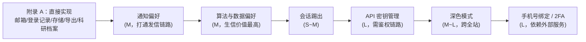

# 个人中心待建功能模块技术方案

> 记录日期：2026-09-15
> 适用范围：`synpharm-frontend` 个人中心（`views/Profile.vue`）相关的待实现能力
>
> 本文档只覆盖**需要独立功能块支撑**的项。**仅对已有数据做增删改查**的项直接进入开发，
> 见本文「附录 A」。

---

## 一、分类规则与结论

判定规则（本轮确定）：

- **只是对已有数据做增删改查** → 直接实现
- **需要独立功能块支撑**（外部服务接入 / 新建子系统 / 跨模块改造）→ 先出方案文档（即本文）

### 1.1 现状盘点（已确认）

**已有的数据表**：

| 表 | 与本主题相关的字段 |
|---|---|
| `sys_user` | `email`、`email_verified`、`phone`(预留)、`password`、`nickname`、`avatar_url`、`last_login_at`、`last_login_ip`、`login_count` |
| `sys_login_log` | `user_id`、`account`、`login_type`、`login_ip`、`login_location`、`user_agent`、`captcha_type`、`status`、`fail_reason`、`created_at` |
| `predict_task` / `predict_result` / `batch_task` / `user_favorite` | 任务、结果、批量、收藏 |

**已有的接口**：

| 接口 | 说明 |
|---|---|
| `GET /api/users/profile` | 读取个人资料 |
| `PUT /api/users/profile` | 更新资料（昵称等） |
| `PUT /api/users/password` | 修改密码 |
| `DELETE /api/users/account` | 注销账号 |
| `POST /api/auth/captcha/send` | 发送邮箱验证码（`type` 白名单 login/register/reset） |
| `GET /api/system/algorithm-health` | 算法健康状态（已存在，可用于可观测性） |

### 1.2 分类结论

| 项 | 结论 | 依据 |
|---|---|---|
| 绑定/换绑邮箱 | ✅ 直接实现 | `sys_user.email` + `email_verified` 已有，复用 `captcha/send` |
| 登录记录 / 登录设备列表 | ✅ 直接实现 | `sys_login_log` 已有完整数据 |
| 存储空间用量 | ✅ 直接实现 | 统计既有 `uploads`/`results` 目录与结果表，只读 |
| 导出我的数据 | ✅ 直接实现 | 读取既有表并打包 |
| 科研档案（机构/实验室/ORCID/研究方向） | ✅ 直接实现 | `sys_user` 加 3~4 个文本列即可，仍是 CRUD |
| **绑定手机号** | 📄 需独立模块 | 依赖**短信服务商接入**（阿里云/腾讯云 SMS）、模板报备、成本与频率控制 |
| **API 密钥管理** | 📄 需独立模块 | 需新表 + 签发/哈希/轮换 + **鉴权链路**（后端按 Key 鉴权、限流、审计） |
| **深色模式** | 📄 需独立模块 | 跨全站组件颜色变量化改造，非 CRUD |
| **通知偏好** | 📄 需独立模块 | 需偏好存储 + **在发信链路读取**（影响 `QQEmailNotifyService`） |
| **算法与数据偏好** | 📄 需独立模块 | 需偏好存储 + **注入预测默认值**（影响 `pipeline`） |
| **两步验证（TOTP）** | 📄 需独立模块 | 密钥生命周期管理 + 登录流程改造 |
| **会话远程踢出** | 📄 需独立模块 | 需 `jti` 黑名单/会话表 + Redis 会话管理 |
| 数据追踪 | ❌ 建议移除 | 语义未定义，无法实现 |

---

## 二、需独立模块项的详细方案

### 2.1 绑定手机号

**为什么需要独立模块**：SMS 不是"改个字段"，它是一条外部付费链路。

| 关注点 | 说明 |
|---|---|
| 服务商接入 | 阿里云 SMS / 腾讯云 SMS，需 AccessKey、签名（Signature）、模板 ID，且**模板需报备审核** |
| 成本控制 | 每条短信计费。必须做：单手机号 60s 冷却 + 每小时上限 + **IP 维度限流** |
| 安全 | 手机号是账号找回凭证，换绑必须校验**旧凭证**（密码或旧手机验证码） |
| 合规 | 手机号属个人信息，需要明示用途与留存策略 |

**数据模型**（`sys_user` 已有 `phone`，仅需补验证状态）

```sql
ALTER TABLE sys_user
  ADD COLUMN phone_verified TINYINT NOT NULL DEFAULT 0 COMMENT '手机号验证：0未验证 1已验证';
```

**接口草案**

```
POST /api/auth/captcha/sms/send     { phone, scene: bind|login|reset }
POST /api/users/phone               { phone, code, currentPassword }   # 绑定
PUT  /api/users/phone               { newPhone, code, currentPassword } # 换绑
DELETE /api/users/phone             { currentPassword }                 # 解绑
```

**前置校验（必须）**：手机号格式、是否已被占用（`uk_phone`）、**解绑前校验至少保留一种登录方式**。

**工作量**：L（含服务商开通与模板报备，报备本身有等待期）

---

### 2.2 API 密钥管理

**为什么需要独立模块**：不只是"建一张表"，还要有**按 Key 鉴权的整条链路**，否则 Key 无法真正使用。

> 值得做的理由：算法引擎侧已有 `X-API-Key` 语义（`FASTAPI_API_KEYS`），平台天然适合开放程序化调用。

**数据模型**

```sql
CREATE TABLE api_key (
    id            BIGINT PRIMARY KEY AUTO_INCREMENT,
    user_id       BIGINT       NOT NULL,
    name          VARCHAR(64)  NOT NULL              COMMENT '用户自定义名称',
    key_prefix    VARCHAR(16)  NOT NULL              COMMENT '明文前缀，用于展示 sk_live_ab12****',
    key_hash      CHAR(64)     NOT NULL              COMMENT 'SHA-256(完整密钥)，不存明文',
    scopes        VARCHAR(200) NOT NULL DEFAULT 'predict:read' COMMENT '权限范围，逗号分隔',
    rate_limit    INT          NOT NULL DEFAULT 60   COMMENT '每分钟请求上限',
    expires_at    DATETIME     DEFAULT NULL,
    last_used_at  DATETIME     DEFAULT NULL,
    revoked_at    DATETIME     DEFAULT NULL,
    created_at    DATETIME     NOT NULL DEFAULT CURRENT_TIMESTAMP,
    UNIQUE KEY uk_key_hash (key_hash),
    INDEX idx_user (user_id)
) COMMENT='用户 API 密钥';
```

**安全底线**

- 完整密钥**仅在创建时明文返回一次**，之后只存 `key_hash`
- 校验用**常量时间比较**（与验证码一致）
- 支持吊销、轮换；过期自动失效
- 记录 `last_used_at` 供用户自查异常调用

**接口草案**

```
POST   /api/users/api-keys          { name, scopes, expiresInDays }  → 仅此一次返回完整 key
GET    /api/users/api-keys                                            → 列表（只含前缀）
DELETE /api/users/api-keys/{id}                                       → 吊销
POST   /api/users/api-keys/{id}/rotate                                → 轮换
```

**鉴权链路（关键）**：需要新增一个过滤器/拦截器，与现有 JWT 并存：

```
优先级：Authorization: Bearer <JWT>  →  其次  X-API-Key: <key>
命中 API Key 时：查哈希 → 校验未吊销未过期 → 按 scopes 授权 → 按 rate_limit 限流（Redis 计数）
```

**工作量**：L（表 + 接口 + 过滤器 + 限流 + 审计）

---

### 2.3 深色模式

**为什么需要独立模块**：不是加个 class，而是**全站硬编码颜色的变量化改造**。

**现状**：Token 层已铺好基础——`styles/base.scss` 中已定义一组 CSS 变量：

```css
--sp-color-brand / --sp-color-canvas / --sp-color-surface / --sp-color-border
--sp-color-text / --sp-color-text-soft / --sp-radius-card / --sp-shadow-card
```

但各组件仍大量使用**编译期 SCSS 变量**（`$bg-primary` 等），这类值不会随 `data-theme` 变化。

**改造路径（推荐按此顺序）**

| 阶段 | 内容 | 影响面 |
|---|---|---|
| 1 | 选一个页面（建议 Dashboard）作为试点，把其 scoped 样式中的颜色改为 `var(--sp-*)` | 1 个文件 |
| 2 | 建立 `[data-theme='dark']` 变量覆盖层 | `base.scss` |
| 3 | 提供 `useTheme()` composable（读写 `localStorage` + 设置 `documentElement.dataset.theme`） | 新增 |
| 4 | 按页面逐个迁移（9 个视图 + 6 个组件） | 15 个文件 |
| 5 | 处理 Element Plus 暗色主题（`element-plus/theme-chalk/dark/css-vars.css`） | `main.ts` |

**风险**

- 迁移期间会出现"半深半浅"的中间态，**建议一次做完一个页面**，不要跨页面分批上线
- 图表（echarts）与 3D（Mol\*）有各自的主题体系，需要单独适配
- 若不打算投入，**建议直接移除开关**，避免继续保留 placebo

**工作量**：M~L（取决于是否要求图表与 3D 同步适配）

---

### 2.4 通知偏好

**为什么需要独立模块**：开关本身是 CRUD，但**生效**需要改动发信链路。

**数据模型**

```sql
CREATE TABLE user_preference (
    user_id     BIGINT PRIMARY KEY,
    notify_email_task_done      TINYINT NOT NULL DEFAULT 1 COMMENT '批量任务完成邮件',
    notify_email_login_alert    TINYINT NOT NULL DEFAULT 1 COMMENT '异地登录提醒',
    notify_email_weekly_report  TINYINT NOT NULL DEFAULT 0 COMMENT '周报',
    updated_at  DATETIME NOT NULL DEFAULT CURRENT_TIMESTAMP ON UPDATE CURRENT_TIMESTAMP
) COMMENT='用户偏好设置';
```

**必须改动的位置**：`QQEmailNotifyService.send(...)` 与批量任务完成处——**发送前读取偏好**，否则开关只是装饰。

**工作量**：M（表 + 接口 + 在 2~3 处发信点接入判断）

---

### 2.5 算法与数据偏好

**为什么需要独立模块**：偏好要**注入预测默认值**，会触碰 `pipeline` 链路。

这是与生信领域最相关的一组设置。

| 偏好项 | 取值 | 影响点 |
|---|---|---|
| 默认算法 | DTI / PPI / DDI | 预测中心默认选中项 |
| **默认置信度阈值** | 0~1 | 结果列表过滤、结果标注高/中/低 |
| 默认物种 / 组织 | 如 human / mouse | 模型输入上下文（KAN-MoDTI 为 `human_final.pth`，物种维度已有区分） |
| 单位偏好 | kcal/mol、Å、% | 结果与可视化的展示单位 |
| 结果留存策略 | 永久 / 90 天 / 30 天 | 定时清理任务的依据 |

**数据模型**（可合并进 `user_preference`）

```sql
ALTER TABLE user_preference
  ADD COLUMN default_algo            VARCHAR(8)  NOT NULL DEFAULT 'DTI',
  ADD COLUMN confidence_threshold    DECIMAL(3,2) NOT NULL DEFAULT 0.60,
  ADD COLUMN default_species         VARCHAR(32) NOT NULL DEFAULT 'human',
  ADD COLUMN unit_affinity           VARCHAR(16) NOT NULL DEFAULT 'kcal/mol',
  ADD COLUMN unit_distance           VARCHAR(8)  NOT NULL DEFAULT 'A',
  ADD COLUMN result_retention_days   INT          DEFAULT NULL COMMENT 'NULL=永久';
```

**风险**：`confidence_threshold` 一旦可配，**同一个结果在不同用户下可能显示不同档位**，需要在结果落库时固化档位（当前 `predict_result.confidence_level` 已落库，符合此要求）。

**工作量**：M

---

### 2.6 两步验证（TOTP）

**为什么需要独立模块**：涉及密钥生命周期与登录流程改造，属安全子系统。

| 关注点 | 说明 |
|---|---|
| 密钥 | 每用户独立 TOTP secret，**需加密存储**（不可明文） |
| 恢复 | 必须提供一次性恢复码（否则丢失设备即锁死账号） |
| 流程 | 登录第二步校验；需与**已有登录策略**（`LoginStrategy` 的 qq_email/password/guest）协同 |
| 兼容 | 游客账号不应开放 2FA |

**数据模型**

```sql
CREATE TABLE user_mfa (
    user_id        BIGINT PRIMARY KEY,
    totp_secret    VARBINARY(255) NOT NULL COMMENT '加密后的 TOTP 密钥',
    enabled        TINYINT NOT NULL DEFAULT 0,
    recovery_codes VARCHAR(1000)  DEFAULT NULL COMMENT '恢复码哈希列表',
    confirmed_at   DATETIME       DEFAULT NULL,
    created_at     DATETIME NOT NULL DEFAULT CURRENT_TIMESTAMP
) COMMENT='用户两步验证';
```

**工作量**：L

---

### 2.7 会话远程踢出

**为什么需要独立模块**：需要会话注册表或 `jti` 黑名单；当前 JWT 是无状态的，无法主动失效单个会话。

**两条路线**

| 路线 | 做法 | 代价 |
|---|---|---|
| A. 黑名单 | JWT 携带 `jti`，登出/踢出时把 `jti` 写入 Redis（TTL = 剩余有效期） | 每次请求多一次 Redis 查询；实现简单 |
| B. 版本号 | `sys_user` 增加 `token_version`，JWT 携带；改密/踢出时递增，旧 token 全部失效 | **粒度粗**（踢一个设备会踢掉全部设备），但实现最简 |

**说明**：若只做"查看登录记录"（不踢出），无需本节——那属于附录 A 的可实现项。

**工作量**：A → M；B → S

---

## 三、建议实施顺序



理由：附录 A 全是既有数据，零风险且立刻可见；通知与算法偏好是"开关真正生效"的第一步；API 密钥与深色模式影响面大；手机号与 2FA 依赖外部条件（服务商报备、安全评审），放最后。

---

## 四、通用风险

| 风险 | 说明 | 应对 |
|---|---|---|
| 偏好"存了不生效" | 最常见的半成品形态——开关能点但无任何行为 | **每个偏好在实现时必须同时改动它的消费点**，否则不做 |
| schema 变更 | 本项目用 `sql/0X_*.sql` 顺序执行初始化，**已部署环境不会自动重跑** | 新增变更脚本 `09_*.sql`，并在文档中记录手工执行 |
| API Key 泄露面 | 一旦开放鉴权，Key 即成为攻击面 | 限流 + 审计 + 强制 `last_used_at` 可观测 + 支持即时吊销 |
| 深色模式中间态 | 跨页面分批会出现"半深半浅" | 一页一提交，未迁移的页面保持浅色 |
| 个人信息合规 | 手机号、ORCID 属个人信息 | 明示用途、最小化收集、支持删除 |

---

## 附录 A：判定为「直接实现」的项（接口设计）

以下项只对已有数据做增删改查，**不需要新模块**，可直接进入开发。

### A.1 绑定 / 换绑邮箱

- 复用 `POST /api/auth/captcha/send`（需把 `bind` / `change_email` 加入 `type` 白名单）
- 新增：

```
POST /api/users/email           { email, code }                       # 绑定（未绑定→已绑定）
PUT  /api/users/email           { newEmail, code, currentPassword }    # 换绑（需旧凭证）
```

- 规则：验证码发往**新邮箱**；换绑必须校验当前密码；`email_verified` 置 1

### A.2 登录记录 / 登录设备

- 纯查询 `sys_login_log`：

```
GET /api/users/login-logs?page=1&size=20
    → { list: [{ loginIp, userAgent, loginType, status, failReason, createdAt }], total }
```

- 可附 `sys_user.last_login_at / last_login_ip / login_count` 作为"当前会话"摘要
- **不含"踢出"**（那需要 2.7）

### A.3 存储空间用量

```
GET /api/users/storage
    → { uploadBytes, resultBytes, totalBytes, taskCount, resultCount, quotaBytes }
```

- 统计既有 `uploads` / `results` 目录与结果表记录数；`quotaBytes` 可先返回固定配额

### A.4 导出我的数据

```
GET /api/users/export?format=csv|json     → 打包 zip（任务 / 结果 / 收藏）
```

- 仅读取既有表；注意大结果集需**流式写出**，避免一次性加载进内存

### A.5 科研档案

```sql
ALTER TABLE sys_user
  ADD COLUMN institution   VARCHAR(128) DEFAULT NULL COMMENT '机构/单位',
  ADD COLUMN lab           VARCHAR(128) DEFAULT NULL COMMENT '实验室/课题组',
  ADD COLUMN orcid         VARCHAR(19)  DEFAULT NULL COMMENT 'ORCID iD，格式 0000-0000-0000-0000',
  ADD COLUMN research_area VARCHAR(128) DEFAULT NULL COMMENT '研究方向';
```

- 扩展既有 `PUT /api/users/profile` 的入参即可，无需新接口
- ORCID 建议只做**格式校验**（前缀 + 最后一位校验位），不做真伪联网校验
- 变更脚本记为 `09_sys_user_research_profile.sql`

---

## 附录 B：建议移除项

| 项 | 原因 |
|---|---|
| 数据追踪 | 语义未定义（追踪什么数据？用途是什么？），无法实现也无法验收。保留只会继续损害可信度 |
| 深色模式（若不做 2.3） | 当前点击无任何效果且不持久化，属 placebo；不做就移除，避免"看起来能用" |
