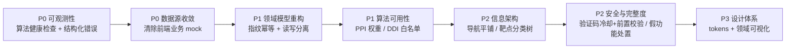

# SynPharm 已发现问题清单与改进方案

> 记录日期：2026-09-15
> 记录范围：前端（Vue3）、SpringBoot 后端、FastAPI 算法引擎、部署链路
> 本文档为问题台账，持续更新；**状态栏标明每条的当前处置结论**。

## 状态图例

| 标记 | 含义 |
|---|---|
| ✅ 已修复 | 已完成代码改动并验证 |
| 🔵 方案已确认 | 方案可行，等待排期实施 |
| ⚪ 保留 | 已知问题，暂不处理 |

---

## 一、问题总览

| # | 问题 | 归属 | 状态 |
|---|---|---|---|
| 1 | 预测出的任务被重复记录 | 后端领域模型 | 🔵 方案已确认 |
| 2 | PPI 和 DDI 都不能使用，且开发者无法定位原因 | 算法引擎 | ⚪ 保留 |
| 3 | 内部测试数据太少 | 数据/测试 | 🔵 方案已确认 |
| 4 | 3D 可视化未交代清楚是谁的可视化 | 前端信息表达 | ⚪ 保留 |
| 5 | 个人中心部分功能是假的 | 前端/契约 | ⚪ 保留 |
| 6 | 菜单栏靠上且应排成一行 | 前端信息架构 | ✅ 已修复（另修 1 处布局缺陷） |
| 7 | 靶点库需要多级分类 | 数据模型/前端 | ⚪ 保留 |
| 8 | 3D 可视化需要更多入口，结构信息可隐藏 | 前端信息架构 | 🔵 方案已确认 |
| 9 | 验证码需要 60s 限制与前置校验 | 后端安全 | ⚪ 保留 |
| 10 | 项目整体样式单一，用户没有兴趣 | 前端设计体系 | 🔵 实施中 |
| 11 | 预测中心"保存结果"接口需要重新设计 | 后端接口设计 | ⚪ 保留 |

---

## 二、逐条详述

### 1. 预测出的任务被重复记录

**现象**：同一输入多次预测，每次都会新增任务与结果记录。

**代码证据**：`PredictServiceImpl.predict()` 计算完成后**无条件**调用 `savePrediction()`：

```java
response = pipelineFactory.process(...);   // 纯计算
savePrediction(request, userId, response); // 无条件落库：新建 task + 新建 result
return response;
```

`savePrediction()` 每次生成新的 `taskNo` / `resultNo` 并直接 `insert`，**没有任何"是否已存在"的判断**；`predict_result` 也无内容唯一约束。代码注释自称"创建**隐式任务**"，说明单条预测被硬塞进了为批量作业设计的 `predict_task` 表。

**根因**：领域模型职责混淆 —— 单条预测、持久化、作业三者未分层。

**方案（已确认）**：引入**内容指纹幂等键**

```
fingerprint = SHA-256(规范化输入 + 算法类型 + 模型版本)
```

- 指纹**必须包含模型版本**，否则模型升级后会返回过期结果
- 对 `fingerprint` 建唯一索引，命中则直接返回历史结果，响应带 `cacheHit: true` 供前端区分
- 注意：三个模型均为确定性推理（DDI-LLM 为图内节点向量点积 + sigmoid），重复计算纯属浪费

---

### 2. PPI 和 DDI 都不能使用，且开发者无法定位原因

**这是两个不同的根因，被同一个问题放大**。

#### 2.1 PPI —— 权重文件不存在

实测各算法目录权重情况：

| 算法目录 | 权重文件 |
|---|---|
| `models/DDI-LLM/weights/` | `ddi_gcn_morgan.pt` 1.7 MB ✅ |
| `models/KAN-MoDTI/weights/` | `human_final.pth` 2.5 MB ✅ |
| `models/FlashPPI/` | **无任何权重文件** ❌ |

`weights/` 下只有 `config.json`、`modeling_flashppi.py`、`tokenizer.json` 等，**没有真正的模型参数**。

**这是设计如此**：`models/FlashPPI/download_weights.py` 说明权重为 **2.7GB**，因 GitHub 单文件 100MB 上限未提交，需克隆后自行拉取：

```python
REPO_ID = "tattabio/flashppi"   # HuggingFace，CC BY-NC 4.0（仅限学术研究）
```

缺失导致 `get_ppi_predictor()` 返回 `None` → `PPIService` 抛 `ModelNotFoundError("PPI")` → 404。

#### 2.2 DDI —— 转导式模型的固有限制 + 输入契约错位

权重存在，但 `algorithm_adapters.py` 要求两个药物都在训练图节点集合内：

```python
if drug_a not in node_id_map or drug_b not in node_id_map:
    raise ValueError(f"药物不在训练图内，无法预测: {...}")
```

DDI-LLM 是 **transductive（转导式）**模型，只学到训练图内节点的 embedding，**图外药物数学上无法预测**。训练图规模见 `models/DDI-LLM/output/metrics.txt`：

```
test_auroc      0.873182
test_aupr       0.850662
num_nodes       1323
```

**更严重的是输入契约错位**：前端与 DTO 把 DDI 输入命名为 `drugASmiles` / `drug_a`，但模型实际需要的是 **DrugBank ID**（如 `DB04571`）。用户即使填对格式，也不知道该填什么，必然失败。

#### 2.3 为什么"对开发者也不知道问题所在"

1. `_get_or_load()` 加载失败时仅 `logger.warning`，随后**永久缓存 `None`（不重试）**，服务照样 healthy
2. `/health` 只报进程存活，**不检查任何模型权重** —— "服务健康"与"算法可用"是两回事
3. 错误响应未携带 `algoType` / 失败原因 / 缺失文件路径
4. 缺少结构化错误事件，故障只能靠翻容器日志

**方案（保留，待后续实施）**：
- 健康检查升级为 per-algorithm readiness（每个算法报权重状态、设备、图规模）
- DDI 提供**图内药物白名单接口**，前端做输入提示，把"必失败"变成"可引导"
- 错误响应结构化 `{algoType, reason, hint}`
- FlashPPI：要么执行 `download_weights.py` 补齐权重，要么在 API 层显式标记"未上线"

---

### 3. 内部测试数据太少

**代码证据**：

- 后端 `synpharm-backend/sql/07_test_data.sql`：仅 **1 个用户、3 个任务、2 条结果**
- 前端 `src/data/mockResults.ts` 是唯一 mock 数据文件
- 靶点库数据来自前端硬编码 `mockTargets`

**根因**：缺少数据分层。演示数据、回归测试数据、基准评估数据三者混同，且分散于前端 TS 常量与后端 SQL，没有单一数据源。

**需要准备的 6 类文件（方案已确认）**：

| 类别 | 内容 | 现成来源 |
|---|---|---|
| 算法输入样本 | 三算法官方测试集 | `KAN-MoDTI/dataset/test_pairs.tsv`<br>`DDI-LLM/dataset/test_pairs.tsv`、`data/DrugbankDDI.csv`<br>`FlashPPI/dataset/pairs.csv`、`sequences.fasta` |
| ID ↔ 名称映射 | DrugBank ID → 药名 | `DDI-LLM/data/Drug_description.csv` |
| 金标准基线 | 精度指标，用于回归对比 | `DDI-LLM/output/metrics.txt`（AUROC 0.873） |
| 数据库种子 SQL | 多角色用户、**全状态**任务、各置信度档结果、batch_task 各状态、favorite、靶点库条目 | 需新建 `sql/seed/` |
| 批量上传样本 | 表头固定：DTI `drug_smiles,target_seq`；PPI `protein_a,protein_b`；DDI `drug_a,drug_b` | 见 `CsvUtils.java` |
| 边界/异常 | 空文件、错表头、**图外药物**、超 100MB 文件 | 需新建 |

**各算法输入格式（关键）**：

| 算法 | 输入格式 |
|---|---|
| DTI (KAN-MoDTI) | SMILES + **蛋白序列** |
| DDI (DDI-LLM) | **DrugBank ID**（非 SMILES） |
| PPI (FlashPPI) | 两条蛋白序列 |

---

### 4. 3D 可视化未交代清楚是谁的可视化

**代码证据**：`Visualization.vue` 标题仅为「3D可视化 / 交互式分子结构展示」；结构来源是 `utils/protein/structureResolver.ts` 拿 UniProt ID 去 RCSB 搜索、**按打分挑候选**：

```
searchRCSB(uniprotId) → 打分排序 → 取最高分
若 bestScore < 2.5 → 使用 fallback
```

**根因**：可视化对象缺少**语义标注（provenance）**。系统从未声明：

- 这是**受体蛋白**结构，不是"你的预测复合物"
- 来自 PDB 条目 `XXXX`，实验方法/分辨率/发布日期为何
- 它是**实验解析结构**，与预测结果无直接因果关系

更深层：**只渲染蛋白，不渲染配体**。DTI 的核心是"配体-靶点结合模式"，DDI 是"两药共现"，PPI 是"两蛋白界面" —— 三种语义被统一压成"单蛋白结构"，语义必然错位。且打分阈值 2.5 的 fallback 说明**连结构是否对应输入靶点都不确定**。

**方案（保留）**：引入结构来源元数据（source / PDB ID / 方法 / 分辨率 / 匹配得分），UI 明确区分「实验结构」与「预测复合物」，支持配体叠加。

---

### 5. 个人中心部分功能是假的

**代码证据**（`Profile.vue`）：

| 元素 | 真实状态 |
|---|---|
| `绑定邮箱` / `绑定手机号` / `API密钥管理` 三个按钮 | **完全没有 `@click` 绑定**，点击无任何反应 |
| `stats.storageUsed` | 硬编码字符串 `'暂无数据'` |
| `darkMode` / `notifications` / `dataTracking` | 纯本地 `ref`，无持久化、无副作用 |

**根因**：UI 先行、契约后置 —— 界面表达了尚未存在的后端能力。危害大于"功能缺失"，它**损害整体可信度**，用户会连带怀疑真实可用的功能（改密码、注销账号）。

**方案（保留）**：处置三选一，**不允许存在"能点但无响应"的控件**：
1. 实现（补后端接口 + 表）
2. 降级（置灰 + "规划中" Tooltip）
3. 移除

**常见设计参考**：

- **账户安全**：修改密码后使旧 Token 失效（密码版本号 / jti 黑名单）；绑定邮箱需**发给新邮箱**验证码双向确认；换绑需同时校验旧方式；解绑前校验至少保留一种登录方式；可选 TOTP 两步验证
- **API 密钥**：创建时填名称 + 权限 scope + 可选过期时间；**明文仅创建时显示一次**，库中只存 `前缀 + SHA-256`；列表显示名称/前缀/scope/最后使用时间；支持吊销与轮换
- **使用统计**：任务数、结果数、**存储用量**（需真实口径：卷占用或写文件时累加）、配额与剩余量、按算法维度调用次数
- **偏好设置**：通知偏好**必须落库**（服务端发信要读）；主题偏好可走 localStorage + CSS 变量
- **会话管理**：登录设备列表（IP / UA / 最后活跃 / 可踢出）；`sys_login_log` 表已存在可直接利用
- **数据管理**：导出我的数据、清除历史、注销账号（冷静期 + 二次确认）

---

### 6. 菜单栏靠上且应排成一行 ✅ 已修复

**原问题**：`Sidebar.vue` 实际渲染的是 `<header class="topbar">`，导航区使用 **`el-select` 下拉框**，7 个栏目全藏在一次点击之后。

**根因**：用下拉框做一级导航是信息架构反模式 —— 可发现性差、无法扫视、多一次点击成本。附带命名债：文件名为 `Sidebar`（侧边栏）而实现是顶栏，易误导后续维护。

**已实施改动**：

- 下拉框 → **横向平铺的 `<nav>` + 7 个 `router-link`**，当前栏目蓝底高亮
- 窄屏（<1200px）退化为只留图标，`title` 提供悬浮名称
- 高亮映射处理了路径不一致：结果列表为 `/results`（复数），结果详情为 `/result/:id`（**单数**），故为每项配置 `match` 前缀数组，否则进入详情页会丢失高亮

**顺带修复 `ResultDetail.vue` 的两个真实缺陷**（同批"旧侧边栏"残留）：

| 问题 | 原值 | 后果 |
|---|---|---|
| `margin-left: $sidebar-width` | 220px | 当前为全宽 fixed 顶栏，无侧边栏 → 白白空出 220px |
| 缺 `padding-top: $header-height` | 0 | 顶栏为 `fixed`，内容**被顶栏遮住** |

**验证证据**：

```
/tasks       → 高亮「📋 任务管理」✓
/result/999  → 高亮「📈 预测结果」✓
result-detail  paddingTop = 60px、marginLeft = 0px ✓
1440px 宽     7 个栏目完整平铺为一行 ✓
```

**遗留**：`Predict.vue` 的 `.predict__content`、`Targets.vue` 的 `.targets__content` 为**死 CSS**（类名未出现在模板中），可后续清理。

---

### 7. 靶点库需要多级分类

**代码证据**：`Targets.vue` 使用两个**扁平** `<select>`（靶点类型 + 疾病领域），选项由前端从 mock 数据去重生成：

```ts
const targetTypes = computed(() => Array.from(new Set(mockTargets.map(t => t.targetType))))
```

**根因**：靶点分类本质是**受控词表（controlled vocabulary）/ 本体**问题，属于领域知识资产，应由后端维护并版本化。当前把分类逻辑放进前端组件的 `Set` 去重，导致无法多级、无法维护、无法与算法侧对齐。

**方案（保留）**：后端建分类表（邻接表或路径枚举如 `protein/kinase/tyrosine-kinase`）+ 靶点分类关联表；API 返回分类树与每类计数；前端用级联选择 + 面包屑导航。

---

### 8. 3D 可视化需要更多入口，结构信息可隐藏

**代码证据**：`Visualization.vue` 通过 `route.query` 接收 `targetId` / `targetName`，否则回落到 `mockTargets` 反查；信息面板固定显示，无折叠。

**根因**：缺少**上下文传递契约**。可视化页作为消费端，其所需上下文（靶点、配体、结果 ID、预测类型）没有统一的**可深链（deep-link）状态模型**，导致：

- 入口少 —— 每个入口都要各自拼 query，成本高易漏
- 结构信息无法隐藏 —— 纯属布局/视图模式缺失

**方案（已确认）**：可视化状态完全 **URL 化**：

```
/visualization?type=dti&target=P00533&ligand=<smiles>&result=123
```

任意页面（预测结果、任务详情、靶点库、结果详情）一行 `router.push` 即可跳转；信息面板支持折叠与视图模式切换（结构优先 / 数据优先）。

---

### 9. 验证码需要 60s 限制与前置校验

**已具备的能力**（`EmailCaptchaServiceImpl`）：

- 类型白名单（`login/register/reset`）
- 频率限制 `checkSendLimit()`：**仅按小时总次数**，超限提示"请1小时后再试"
- 验证码有效期 `CAPTCHA_EXPIRE_MINUTES = 1`（60 秒）
- 常量时间比较防时序攻击；验证后即删（一次性）

**缺失项**：

| 缺失 | 后果 |
|---|---|
| **60 秒重发冷却** | 连续点击立即重发，仅受小时总量约束 → 体验与邮件成本双输 |
| **格式/业务前置校验** | 不校验邮箱格式、不校验账号状态 → 可向**任意邮箱**触发发信（邮件轰炸 / 成本攻击） |
| IP / 设备维度限流 | 换邮箱即可绕过 target 维度计数 |

**根因**：混淆了两个概念 —— **有效期 60s（验证码能用多久）** 与 **冷却 60s（多久能再发一次）**，当前只实现了前者；且业务规则未前置。

**方案（保留）**：独立的 cooldown 键 `captcha:cooldown:{type}:{target}`（TTL 60s）+ 场景化前置校验（注册要求未注册、重置要求已注册；登录场景按安全策略避免账号枚举）+ IP 维度限流 + 前端按钮倒计时禁用态。

---

### 10. 项目整体样式单一，用户没有兴趣

**代码证据**：

- 页面结构高度同构（header + main + card），存在内联样式（如 `style="color: #64748b;"`）
- `src/styles/` 下仅有 `variables.scss`（原始值：色板/间距/字号/圆角/阴影），**无语义层、无 CSS 自定义属性**
- `src/components/` 仅有 `Sidebar.vue`、`ResultCard.vue` 和 `protein/` —— **没有通用 UI 组件**
- 全局样式仅在 `App.vue` 的一个非 scoped 样式块中（reset + 字体 + 滚动条）

**根因**：缺少设计系统，页面级样式各自为政（`pc__` / `tg__` / `dash__` / `tasks__` 各自重复实现 header 与 card）。但更关键的是——**缺少领域化信息表达**：

- 无序列轨道（sequence track）
- 无相互作用网络图
- 无置信度分布/热图
- 无结构-序列-功能对齐视图

因此"样式单一"的表象下，真正的问题是**信息密度与领域表达不足** —— 所有页面都用通用后台的卡片语言描述专业内容。

**方案（实施中）**：五层改造，详见本文档「四、样式改造方案」。

---

### 11. 预测中心"保存结果"接口需要重新设计

**代码证据**：保存**不是接口**，而是 `predict()` 的隐式副作用（同一逻辑内完成），且 `savePrediction()` 用 try-catch **吞掉异常**：

```java
response = pipelineFactory.process(...);
savePrediction(request, userId, response);  // 内部 catch → log.error 后继续
return response;                            // 保存失败时 response.id 为 null
```

后端 `predict_result.task_id` 为 NOT NULL 外键，因此代码"先建隐式任务再建结果"。

**根因**：读写职责混合。三种语义被绑在同一动作：

| 关注点 | 语义 | 期望特性 |
|---|---|---|
| 预测（compute） | 纯函数式、确定性 | 幂等、可缓存、可试算 |
| 保存（persist） | 用户资产、显式意图 | 需确认、可撤销、失败必须报错 |
| 作业（job） | 长耗时、可追踪 | 状态机、可取消 |

导致：不能"只试算不保存"、不能"先看再存"、保存失败无感知，且因第 1 条无指纹而记录膨胀。

**方案（保留）**：拆分为 `POST /predict`（纯计算，返回含 `fingerprint`）与 `POST /results`（显式保存，按 fingerprint **幂等 upsert**）；或在 `/predict` 上加 `persist=false|true`；引入 `saved/starred` 标记区分"系统记录"与"用户收藏"；保存失败返回明确错误码。

---

## 三、本轮排查的额外代码级发现

| 发现 | 位置 | 影响 |
|---|---|---|
| DDI 输入实为 **DrugBank ID**，但 DTO 命名为 `drugASmiles` | `DDIPredictRequest` / `PredictRequest` | 命名与语义不符，直接导致用户输入错误 |
| `FlashPPI` 权重因体积（2.7GB）未纳入版本库，需 `download_weights.py` 拉取 | `models/FlashPPI/download_weights.py` | PPI 开箱不可用，但属设计如此 |
| `ResultDetail.vue` 缺失 `padding-top` + 残留 220px 左边距 | `views/ResultDetail.vue` | 内容被顶栏遮挡（已修复） |
| `.predict__content` / `.targets__content` 为死 CSS | `Predict.vue` / `Targets.vue` | 无语义影响，属遗留清理项 |
| `.gitattributes` 未对 `*.sh` 声明 LF | 仓库根目录 | Linux/WSL 下脚本报 `\r` 错误（已修复） |
| 前端 `mockTargets` / `mockResults` 被当作真实数据源使用 | `src/data/`、`src/utils/protein/` | 与后端数据双轨，是不一致的根源 |

---

## 四、样式改造方案（五层）

### 第 1 层：Token 化

- 保留 `variables.scss` 中的原始值（向后兼容，各页面已在引用）
- **新增语义层**：`$color-surface` / `$color-text-muted` / `$color-brand` 等，页面只引用语义名
- 用 **CSS 自定义属性**暴露，为暗色模式铺路（否则改主题需逐组件改色）
- 补充：字体尺度、字重阶、**`tabular-nums`**（科学数值对齐的关键）、focus ring、动效曲线

### 第 2 层：组件收敛

当前每页各写一套 header/card。抽取：

`PageHeader`（标题+副标题+操作区）、`AppCard`、`StatCard`、`EmptyState`、`StatusTag`

### 第 3 层：页面原型分层

| 原型 | 页面 | 视觉语言 |
|---|---|---|
| 营销页 | Home、Login | 大标题、渐变、插画、大量留白 |
| 工作台页 | Dashboard、Predict、Results | **高信息密度**、卡片网格 + 表格、紧凑间距 |
| 浏览页 | Targets、Visualization | 主从布局（列表 + 详情面板） |

### 第 4 层：领域可视化

生信平台靠**信息密度**取胜，而非装饰：

- 序列轨道（domain / motif 标注）
- 相互作用网络图（2D 力导向）
- 置信度分布（直方图 + 分档语义）
- 结构 + 配体叠加（Mol\* 已有，补配体与来源标注）
- 全局统一的**「置信度 → 颜色」语义映射**（high/medium/low 三档跨页面一致）

### 第 5 层：暗色模式与反馈

- 走 `data-theme` + CSS 变量，一份变量切两套主题
- 骨架屏替代纯文本"加载中…"；空态/错误态/Toast 统一风格

---

## 五、系统性根因与推进顺序

### 四个系统性根因

| 根因 | 涉及问题 | 本质 |
|---|---|---|
| **A. 领域模型职责混淆** | 1、11、3 | `predict_task` 既当"作业"又当"单次预测载体" |
| **B. 算法层可观测性缺失** | 2、3 | 模型状态、错误原因对开发者不可见 |
| **C. 数据源双轨** | 3、4、5、7 | 前端 mock 被当作真实数据源 |
| **D. 前端设计体系缺失** | 6、8、10 | 无 token、无通用组件、导航为下拉框 |

### 建议推进顺序



**理由**：A、B 是"诊断能力"，缺失则后续改动无法验证；C 决定数据质量；D 决定核心功能能否演示；E、F 是可用性与可信度；G 是体验上限。

> 注：本清单中样式改造（第 10 条）已提前启动，因其为当前阶段最高可见度收益项。

---

## 六、附：指纹幂等设计草案（对应第 1 条）

### 表结构

```sql
ALTER TABLE predict_result
  ADD COLUMN input_fingerprint CHAR(64) NULL COMMENT 'SHA-256(规范化输入+算法+模型版本)',
  ADD COLUMN model_version VARCHAR(32) NULL COMMENT '算法模型版本',
  ADD UNIQUE KEY uk_user_fingerprint (user_id, input_fingerprint);
```

### 指纹计算

```
fingerprint = SHA-256(
    algo_type | 规范化(输入) | model_version
)
```

- **规范化**：SMILES 需统一大小写与空白；序列需去空白并转大写；DDI 需统一 ID 格式
- **`model_version` 必须参与**：否则模型升级后会把旧结果当作最新结果返回
- 建议模型版本从 FastAPI 的 `/health` 或模型元数据读取，而非硬编码

### 行为约定

| 场景 | 行为 |
|---|---|
| 指纹命中 | 直接返回历史结果，响应 `cacheHit: true`，**不新增记录** |
| 指纹未命中 | 正常计算 + 落库 |
| 用户主动"重新预测" | 可传 `force=true` 绕过缓存，但应限制频率 |

### 配套改造建议

- 与第 11 条一并实施：把"保存"从隐式副作用改为显式接口，`cacheHit` 语义才完整
- 历史数据需回填或允许 `input_fingerprint` 为 NULL（唯一索引对 NULL 不生效，可平滑过渡）
