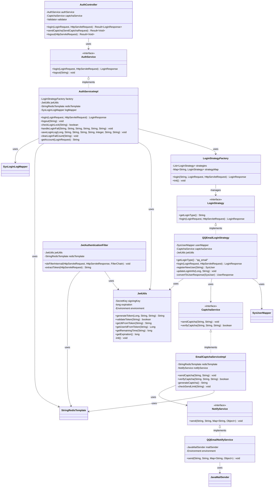
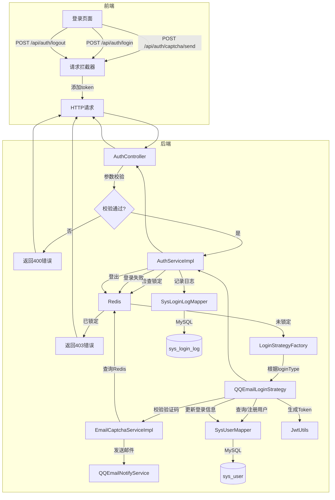
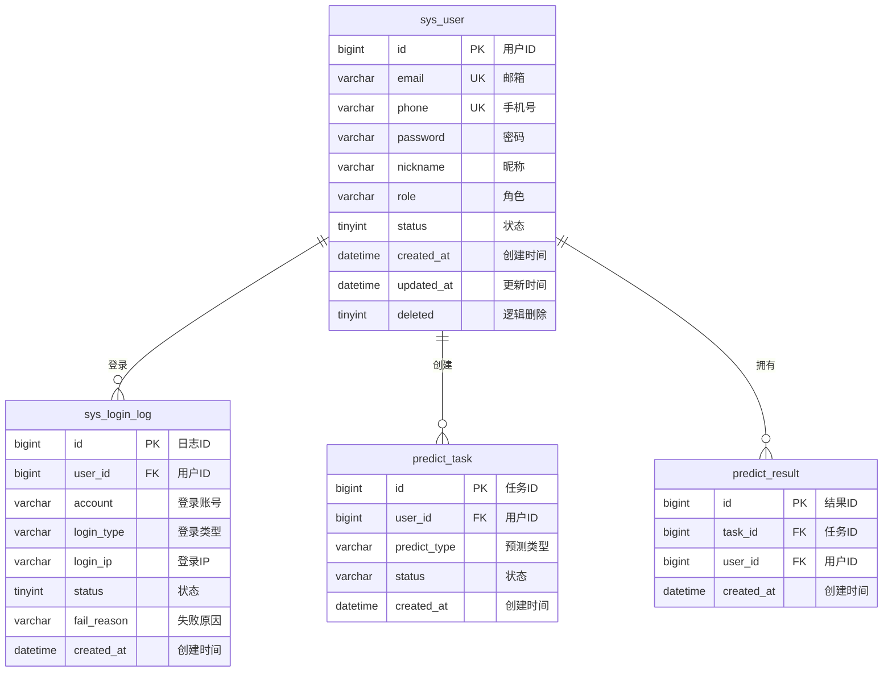
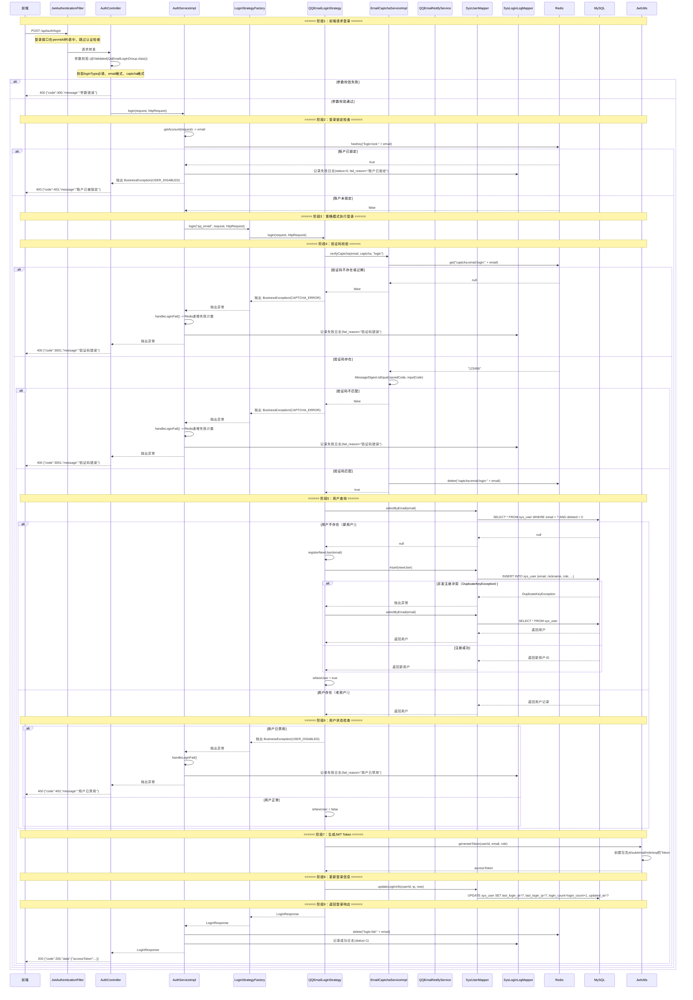
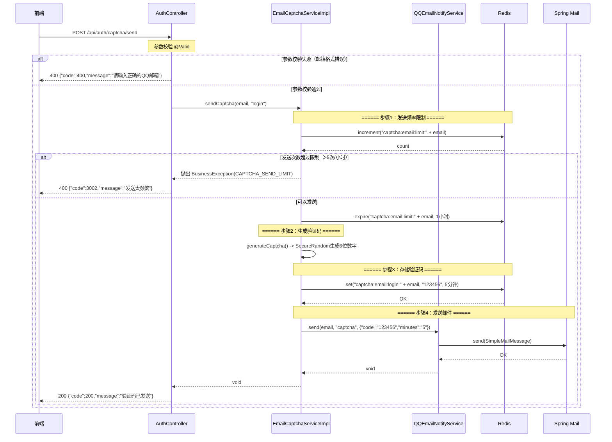
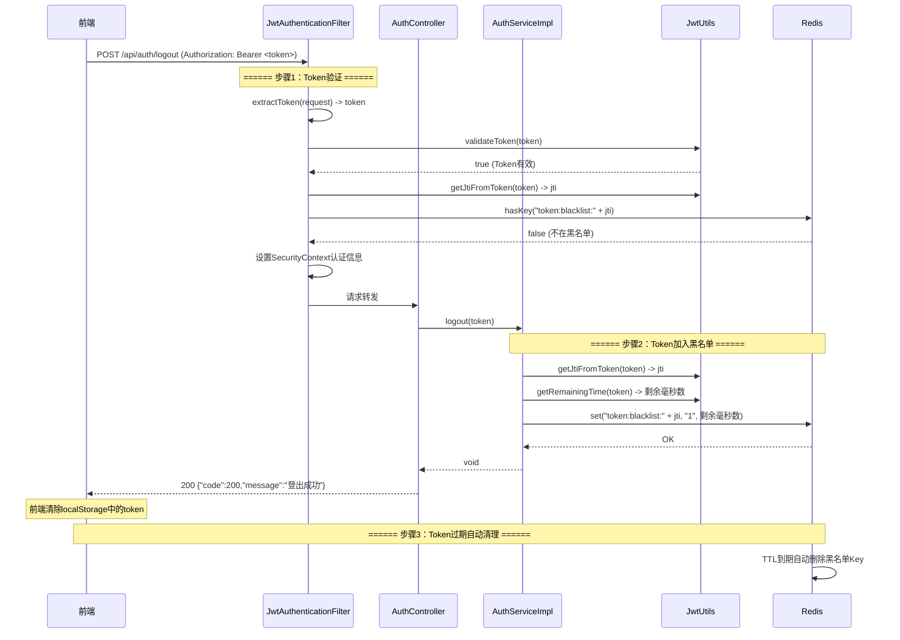
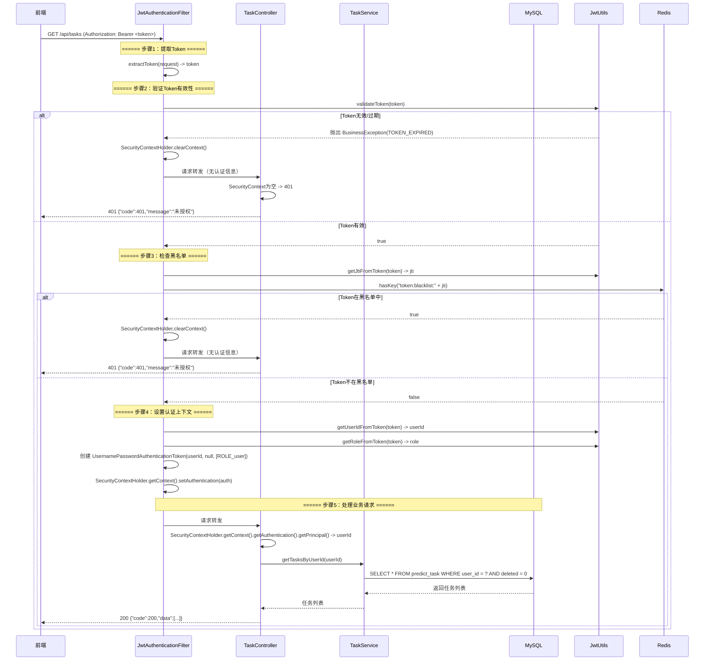
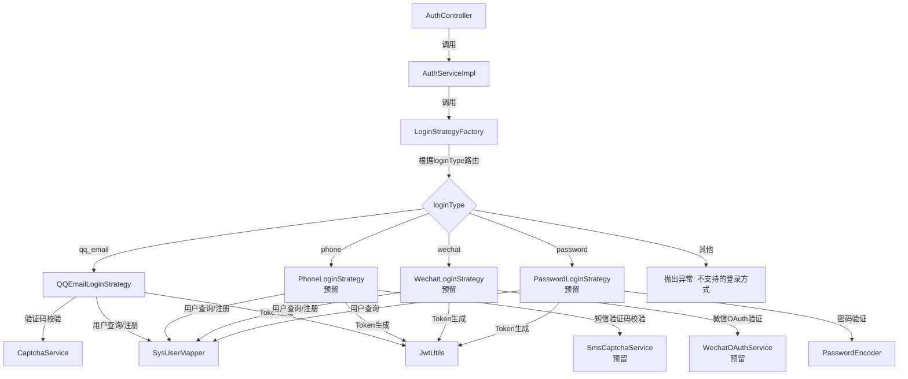
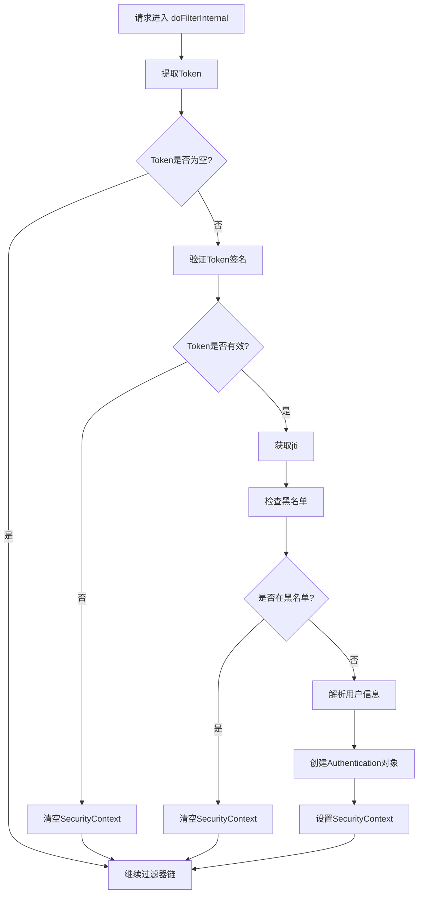

# 用户认证模块技术设计文档

## 1. 模块概述

### 1.1 模块定位

用户认证模块是 SynPharm 系统的**核心安全模块**，负责用户身份识别、权限验证和会话管理。该模块是系统所有业务功能的入口，只有通过认证的用户才能访问预测等核心业务接口。

**核心职责**：
- 用户身份认证（登录/登出）
- 会话管理（Token发放与验证）
- 权限控制（角色管理）
- 安全防护（限流、黑名单、验证码）
- 登录行为审计（日志记录）

### 1.2 核心特性

| 特性 | 说明 | 技术实现 | 设计目的 |
| :--- | :--- | :--- | :--- |
| 登录注册合一 | 新用户自动注册，老用户直接登录 | `QQEmailLoginStrategy.registerNewUser()` | 简化用户操作流程，无需单独注册页面 |
| 独立注册接口 | 用户可通过注册接口创建账号 | `AuthServiceImpl.register()` | 支持传统注册流程，需邮箱验证码 |
| 策略模式扩展 | 新增登录方式只需实现接口 | `LoginStrategy` + `LoginStrategyFactory` | 开闭原则，无侵入扩展 |
| JWT 无状态认证 | Token 存储在客户端，服务端无会话状态 | `JwtUtils` + `JwtAuthenticationFilter` | 水平扩展，支持分布式部署 |
| 登录限流 | 5次失败锁定15分钟 | Redis原子递增 + 过期时间 | 防止暴力破解 |
| Token 黑名单 | 登出后立即失效 | Redis存储jti + TTL | 安全登出，防止Token滥用 |
| 验证码一次性 | 使用后立即删除，有效期1分钟 | Redis验证后DELETE | 防止重放攻击，提高安全性 |
| BCrypt 加密 | 密码加盐哈希存储 | `BCryptPasswordEncoder` | 密码安全，彩虹表攻击防护 |
| 并发安全 | 捕获DuplicateKeyException实现幂等 | 异常处理 + 重新查询 | 防止并发注册数据不一致 |
| 管理员调试登录 | 输入固定验证码直接登录 | `/api/auth/debug/login` | 开发调试专用，便于快速登录 |

### 1.3 设计原则

| 原则 | 应用示例 | 代码体现 |
| :--- | :--- | :--- |
| **单一职责** | `QQEmailLoginStrategy` 只处理QQ邮箱登录 | 每个策略类只实现一种登录方式 |
| **开闭原则** | 新增登录方式只需新增实现类，不改现有代码 | `LoginStrategy` 接口 + 工厂模式 |
| **依赖倒置** | `AuthServiceImpl` 依赖 `LoginStrategy` 接口 | 构造函数注入接口而非实现类 |
| **接口隔离** | `CaptchaService` 和 `NotifyService` 独立接口 | 不同验证码类型实现不同接口 |
| **里氏替换** | 任何 `LoginStrategy` 实现都可替换使用 | 策略模式的核心特性 |
| **迪米特法则** | 模块间只通过接口交互，不暴露内部细节 | DTO + 接口隔离 |

### 1.4 业务场景

| 场景 | 描述 | 涉及接口 |
| :--- | :--- | :--- |
| 用户首次访问 | 新用户输入QQ邮箱，获取验证码，完成注册并登录 | `/captcha/send` → `/login` |
| 用户再次登录 | 老用户输入QQ邮箱，获取验证码，直接登录 | `/captcha/send` → `/login` |
| 用户注册 | 用户通过注册页面创建账号，需邮箱验证码 | `/captcha/send` → `/register` |
| 用户登出 | 用户主动退出，Token立即失效 | `/logout` |
| 访问受保护资源 | 用户携带Token访问预测接口 | JWT过滤器自动验证 |
| 登录失败过多 | 5次失败后账号锁定15分钟 | 登录限流机制 |
| 开发调试 | 开发者输入固定验证码直接登录系统 | `/debug/login` |

---

## 2. 架构设计

### 2.1 整体架构图

```
┌─────────────────────────────────────────────────────────────────────────────┐
│                          前端层 (Vue 3 + TypeScript)                         │
│                                                                             │
│  ┌──────────────────────────────────────────────────────────────────────┐   │
│  │                        认证状态管理 (Pinia)                           │   │
│  │                                                                      │   │
│  │  ┌──────────────────────────────────────────────────────────────┐    │   │
│  │  │                       authStore                               │    │   │
│  │  │  - state: { token, user, isAuthenticated }                   │    │   │
│  │  │  - actions: login(email, captcha), logout(), refresh()       │    │   │
│  │  │  - getters: isAuthenticated, currentUser                     │    │   │
│  │  └──────────────────────────────────────────────────────────────┘    │   │
│  │                                                                      │   │
│  │  ┌──────────────────────────────────────────────────────────────┐    │   │
│  │  │                        请求拦截器 (Axios)                     │    │   │
│  │  │  - 请求前: 添加 Authorization: Bearer <token>                │    │   │
│  │  │  - 响应401: 清除token并跳转登录页                             │    │   │
│  │  │  - 响应错误: 统一处理错误提示                                 │    │   │
│  │  └──────────────────────────────────────────────────────────────┘    │   │
│  │                                                                      │   │
│  │  ┌──────────────────────────────────────────────────────────────┐    │   │
│  │  │                       表单验证 (validators.ts)                │    │   │
│  │  │  - validateQQEmail(email): boolean                           │    │   │
│  │  │  - validatePassword(password): boolean                       │    │   │
│  │  │  - validateCaptcha(captcha): boolean                         │    │   │
│  │  └──────────────────────────────────────────────────────────────┘    │   │
│  └──────────────────────────────────────────────────────────────────────┘   │
└─────────────────────────────────────────────────────────────────────────────┘
                                    │ HTTP/HTTPS
                                    ▼
┌─────────────────────────────────────────────────────────────────────────────┐
│                         网络层 (Nginx 反向代理)                              │
│  ┌──────────────────────────────────────────────────────────────────────┐   │
│  │  - 静态资源托管                                                      │   │
│  │  - API请求转发                                                      │   │
│  │  - X-Forwarded-For 头透传（获取真实客户端IP）                         │   │
│  │  - HTTPS终止                                                        │   │
│  │  - 请求限流（可选）                                                  │   │
│  └──────────────────────────────────────────────────────────────────────┘   │
└─────────────────────────────────────────────────────────────────────────────┘
                                    │
                                    ▼
┌─────────────────────────────────────────────────────────────────────────────┐
│                     Spring Security 过滤器链 (Filter Chain)                  │
│                                                                             │
│  ┌──────────────────────────────────────────────────────────────────────┐   │
│  │  请求进入                                                             │   │
│  │      │                                                                │   │
│  │      ▼                                                                │   │
│  │  ┌──────────┐     ┌──────────┐     ┌──────────────┐     ┌─────────┐ │   │
│  │  │ Disable  │────▶│ Cors     │────▶│ JWT Auth    │────▶│Authz    │ │   │
│  │  │ Encode   │     │ Filter   │     │ Filter      │     │ Filter  │ │   │
│  │  │ Url      │     │          │     │ 验证Token   │     │ 检查权限│ │   │
│  │  │ (移除)   │     │跨域处理  │     │检查黑名单   │     │         │ │   │
│  │  └──────────┘     └──────────┘     └──────────────┘     └─────────┘ │   │
│  │      │                                                                │   │
│  │      ▼                                                                │   │
│  │  Controller 层                                                         │   │
│  └──────────────────────────────────────────────────────────────────────┘   │
└─────────────────────────────────────────────────────────────────────────────┘
                                    │
                                    ▼
┌─────────────────────────────────────────────────────────────────────────────┐
│                          控制器层 (Controller)                              │
│                                                                             │
│  ┌──────────────────────────────────────────────────────────────────────┐   │
│  │                        AuthController                                │   │
│  │                                                                      │   │
│  │  ┌──────────────────────────────────────────────────────────────┐    │   │
│  │  │ POST /api/auth/login          → authService.login()          │    │   │
│  │  │   └── 参数校验: @Validated(QqEmailLoginGroup.class)          │    │   │
│  │  └──────────────────────────────────────────────────────────────┘    │   │
│  │                                                                      │   │
│  │  ┌──────────────────────────────────────────────────────────────┐    │   │
│  │  │ POST /api/auth/captcha/send   → captchaService.sendCaptcha() │    │   │
│  │  │   └── 参数校验: @Valid                                          │    │   │
│  │  └──────────────────────────────────────────────────────────────┘    │   │
│  │                                                                      │   │
│  │  ┌──────────────────────────────────────────────────────────────┐    │   │
│  │  │ POST /api/auth/logout         → authService.logout()         │    │   │
│  │  │   └── 需认证 (Authorization header)                          │    │   │
│  │  └──────────────────────────────────────────────────────────────┘    │   │
│  └──────────────────────────────────────────────────────────────────────┘   │
└─────────────────────────────────────────────────────────────────────────────┘
                                    │
                                    ▼
┌─────────────────────────────────────────────────────────────────────────────┐
│                          业务层 (Service)                                  │
│                                                                             │
│  ┌──────────────────────────────────────────────────────────────────────┐   │
│  │                        AuthServiceImpl                               │   │
│  │                                                                      │   │
│  │  ┌──────────────────────────────────────────────────────────────┐    │   │
│  │  │ 1. checkLoginLock(account)      → Redis检查锁定状态           │    │   │
│  │  │    └── hasKey("login:lock:" + account)                        │    │   │
│  │  │ 2. loginStrategyFactory.login() → 策略模式执行登录             │    │   │
│  │  │    └── 根据loginType路由到对应策略                             │    │   │
│  │  │ 3. clearLoginFailCount()        → Redis清除失败计数           │    │   │
│  │  │    └── delete("login:fail:" + account)                        │    │   │
│  │  │ 4. saveLoginLog()               → MySQL记录登录日志           │    │   │
│  │  │    └── insert(sys_login_log)                                  │    │   │
│  │  │ 5. handleLoginFail()            → Redis递增失败计数+锁定       │    │   │
│  │  │    └── increment("login:fail:" + account)                     │    │   │
│  │  └──────────────────────────────────────────────────────────────┘    │   │
│  │                                                                      │   │
│  │  ┌──────────────────────────────────────────────────────────────┐    │   │
│  │  │                    LoginStrategyFactory                      │    │   │
│  │  │                                                                   │    │
│  │  │  - strategies: List<LoginStrategy> (Spring自动注入所有实现)    │    │   │
│  │  │  - strategyMap: Map<String, LoginStrategy> (@PostConstruct)  │    │   │
│  │  │    └── key=loginType, value=策略实现类                        │    │   │
│  │  │  - login(type, request, httpRequest): LoginResponse          │    │   │
│  │  │    └── O(1)时间查找策略并执行                                 │    │   │
│  │  └──────────────────────────────────────────────────────────────┘    │   │
│  │                                                                      │   │
│  │  ┌──────────────────────────────────────────────────────────────┐    │   │
│  │  │                   QQEmailLoginStrategy                       │    │   │
│  │  │                                                                   │    │
│  │  │  - loginType = "qq_email"                                    │    │   │
│  │  │  - login(): 验证码校验 → 用户查询/注册 → Token生成 → 返回     │    │   │
│  │  │    ├── captchaService.verifyCaptcha()                        │    │   │
│  │  │    ├── userMapper.selectByEmail() / insert()                 │    │   │
│  │  │    ├── jwtUtils.generateToken()                              │    │   │
│  │  │    └── userMapper.updateLoginInfo()                          │    │   │
│  │  └──────────────────────────────────────────────────────────────┘    │   │
│  │                                                                      │   │
│  │  ┌──────────────────────────────────────────────────────────────┐    │   │
│  │  │                  EmailCaptchaServiceImpl                     │    │   │
│  │  │                                                                   │    │
│  │  │  - generateCaptcha() → SecureRandom生成6位数字               │    │   │
│  │  │  - checkSendLimit() → Redis递增计数+过期限制                  │    │   │
│  │  │  - sendCaptcha() → Redis存储 + 邮件发送                      │    │   │
│  │  │  - verifyCaptcha() → Redis校验 + 常量时间比较 + 删除          │    │   │
│  │  └──────────────────────────────────────────────────────────────┘    │   │
│  │                                                                      │   │
│  │  ┌──────────────────────────────────────────────────────────────┐    │   │
│  │  │                   QQEmailNotifyService                       │    │   │
│  │  │                                                                   │    │
│  │  │  - send(email, template, data) → Spring Mail发送邮件         │    │   │
│  │  │    └── SimpleMailMessage / MimeMessage                       │    │   │
│  │  └──────────────────────────────────────────────────────────────┘    │   │
│  └──────────────────────────────────────────────────────────────────────┘   │
└─────────────────────────────────────────────────────────────────────────────┘
                                    │
                                    ▼
┌─────────────────────────────────────────────────────────────────────────────┐
│                        数据访问层 (Repository/Mapper)                       │
│                                                                             │
│  ┌──────────────────┐     ┌──────────────────┐     ┌──────────────────┐   │
│  │   SysUserMapper  │     │SysLoginLogMapper │     │ StringRedisTemplate│  │
│  │                  │     │                  │     │                  │   │
│  │  - selectByEmail │     │  - insert        │     │  - opsForValue() │   │
│  │  - insert        │     │  - selectByUserId│     │  - hasKey()      │   │
│  │  - updateLoginInfo│    │                  │     │  - expire()      │   │
│  │  - updateById    │     │                  │     │  - increment()   │   │
│  │                  │     │                  │     │  - delete()      │   │
│  └──────────────────┘     └──────────────────┘     └──────────────────┘   │
└─────────────────────────────────────────────────────────────────────────────┘
                                    │
                                    ▼
┌─────────────────────────────────────────────────────────────────────────────┐
│                            数据存储层                                       │
│                                                                             │
│  ┌──────────────────────────────────────────────────────────────────────┐   │
│  │                          MySQL 8.0                                   │   │
│  │                                                                      │   │
│  │  ┌──────────────────────────────────────────────────────────────┐    │   │
│  │  │                    sys_user 表                              │    │   │
│  │  │  - id (PK, AUTO_INCREMENT)                                  │    │   │
│  │  │  - email (UK)                                               │    │   │
│  │  │  - phone (UK)                                               │    │   │
│  │  │  - password (BCrypt)                                        │    │   │
│  │  │  - nickname, role, status, register_type...                 │    │   │
│  │  └──────────────────────────────────────────────────────────────┘    │   │
│  │                                                                      │   │
│  │  ┌──────────────────────────────────────────────────────────────┐    │   │
│  │  │                  sys_login_log 表                           │    │   │
│  │  │  - id (PK, AUTO_INCREMENT)                                  │    │   │
│  │  │  - user_id (FK), account, login_type, login_ip...           │    │   │
│  │  │  - status (0失败/1成功), fail_reason                        │    │   │
│  │  └──────────────────────────────────────────────────────────────┘    │   │
│  └──────────────────────────────────────────────────────────────────────┘   │
│                                                                             │
│  ┌──────────────────────────────────────────────────────────────────────┐   │
│  │                          Redis 7.x                                   │   │
│  │                                                                      │   │
│  │  ┌──────────────────────────────────────────────────────────────┐    │   │
│  │  │ Key Pattern                     │ TTL         │ 用途          │    │   │
│  │  │ captcha:email:{type}:{target}   │ 1分钟       │ 验证码存储    │    │   │
│  │  │ captcha:email:limit:{target}    │ 1小时       │ 发送频率限制  │    │   │
│  │  │ login:fail:{account}            │ 15分钟      │ 失败计数      │    │   │
│  │  │ login:lock:{account}            │ 15分钟      │ 锁定标记      │    │   │
│  │  │ token:blacklist:{jti}           │ Token剩余时间│ Token黑名单   │    │   │
│  │  └──────────────────────────────────────────────────────────────┘    │   │
│  └──────────────────────────────────────────────────────────────────────┘   │
└─────────────────────────────────────────────────────────────────────────────┘
```

### 2.2 模块划分

| 模块 | 职责 | 关键类 | 文件路径 |
| :--- | :--- | :--- | :--- |
| `api/controller` | 接收HTTP请求，参数校验，返回响应 | `AuthController` | `api/AuthController.java` |
| `service` | 业务逻辑接口定义 | `AuthService`, `LoginStrategy`, `CaptchaService`, `NotifyService` | `service/` |
| `service/impl` | 业务逻辑实现 | `AuthServiceImpl`, `EmailCaptchaServiceImpl`, `QQEmailNotifyService` | `service/impl/` |
| `service/strategy` | 登录策略实现 | `LoginStrategyFactory`, `QQEmailLoginStrategy` | `service/strategy/` |
| `repository/mapper` | 数据访问 | `SysUserMapper`, `SysLoginLogMapper` | `repository/mapper/` |
| `config` | Spring配置 | `SecurityConfig`, `JwtAuthenticationFilter`, `CorsConfig` | `config/` |
| `dto/request` | 请求数据传输对象 | `LoginRequest`, `SendCaptchaRequest` | `dto/request/` |
| `dto/response` | 响应数据传输对象 | `LoginResponse`, `UserResponse` | `dto/response/` |
| `exception` | 异常处理 | `ErrorCode`, `BusinessException`, `GlobalExceptionHandler` | `exception/` |
| `utils` | 工具类 | `JwtUtils`, `IpUtils`, `Result` | `utils/` |
| `validation/group` | 验证分组 | `QqEmailLoginGroup` | `validation/group/` |
| `model/entity` | 数据库实体 | `SysUser`, `SysLoginLog` | `model/entity/` |

### 2.3 核心类关系图



### 2.4 模块交互流程



---

## 3. 数据库设计

### 3.1 用户表 (sys_user)

| 字段名 | 类型 | 约束 | 说明 | 设计考虑 |
| :--- | :--- | :--- | :--- | :--- |
| `id` | BIGINT | PRIMARY KEY AUTO_INCREMENT | 用户ID | 主键，自增，Long类型支持大用户量 |
| `email` | VARCHAR(100) | UNIQUE KEY | QQ邮箱 | 唯一约束，防止重复注册；索引加速登录查询 |
| `phone` | VARCHAR(20) | UNIQUE KEY | 手机号（预留） | 唯一约束，预留手机号登录用；索引加速查询 |
| `password` | VARCHAR(255) | - | BCrypt加密密码 | 验证码登录可为空；BCrypt哈希长度不定 |
| `nickname` | VARCHAR(50) | NOT NULL | 用户昵称 | 默认取邮箱前缀，支持自定义 |
| `avatar_url` | VARCHAR(500) | - | 头像URL | 支持自定义头像，URL最长500字符 |
| `role` | VARCHAR(20) | NOT NULL DEFAULT 'user' | 角色 | admin/user/guest；索引加速权限查询 |
| `status` | TINYINT | NOT NULL DEFAULT 1 | 状态 | 1正常 0禁用；索引加速状态筛选 |
| `email_verified` | TINYINT | NOT NULL DEFAULT 0 | 邮箱验证 | 0未验证 1已验证；验证码登录自动设为1 |
| `last_login_at` | DATETIME | - | 最后登录时间 | 记录登录时间，支持用户活跃度分析 |
| `last_login_ip` | VARCHAR(50) | - | 最后登录IP | 记录登录来源，支持安全审计 |
| `login_count` | INT | NOT NULL DEFAULT 0 | 登录次数 | 统计用户活跃度，INT足够（最大21亿） |
| `register_type` | VARCHAR(20) | NOT NULL DEFAULT 'qq_email' | 注册方式 | qq_email/phone/wechat；支持多登录方式统计 |
| `created_at` | DATETIME | NOT NULL DEFAULT CURRENT_TIMESTAMP | 创建时间 | 自动填充，支持数据追溯 |
| `updated_at` | DATETIME | NOT NULL ON UPDATE CURRENT_TIMESTAMP | 更新时间 | 自动更新，支持数据版本追溯 |
| `deleted` | TINYINT | NOT NULL DEFAULT 0 | 逻辑删除 | 0未删除 1已删除；支持软删除 |

**索引设计**：

| 索引名 | 字段 | 类型 | 说明 |
| :--- | :--- | :--- | :--- |
| `PRIMARY` | `id` | 主键索引 | 主键自增，加速主键查询 |
| `uk_email` | `email` | 唯一索引 | 邮箱唯一性约束，加速邮箱登录查询 |
| `uk_phone` | `phone` | 唯一索引 | 手机号唯一性约束，加速手机号登录查询（预留） |
| `idx_role` | `role` | 普通索引 | 按角色查询用户，加速权限控制 |
| `idx_status` | `status` | 普通索引 | 按状态筛选用户，加速禁用用户过滤 |
| `idx_deleted` | `deleted` | 普通索引 | 逻辑删除查询优化 |

**DDL语句**：

```sql
CREATE TABLE `sys_user` (
  `id` BIGINT NOT NULL AUTO_INCREMENT COMMENT '用户ID',
  `email` VARCHAR(100) DEFAULT NULL COMMENT 'QQ邮箱',
  `phone` VARCHAR(20) DEFAULT NULL COMMENT '手机号',
  `password` VARCHAR(255) DEFAULT NULL COMMENT 'BCrypt加密密码',
  `nickname` VARCHAR(50) NOT NULL COMMENT '用户昵称',
  `avatar_url` VARCHAR(500) DEFAULT NULL COMMENT '头像URL',
  `role` VARCHAR(20) NOT NULL DEFAULT 'user' COMMENT '角色',
  `status` TINYINT NOT NULL DEFAULT 1 COMMENT '状态：1正常 0禁用',
  `email_verified` TINYINT NOT NULL DEFAULT 0 COMMENT '邮箱验证：0未验证 1已验证',
  `last_login_at` DATETIME DEFAULT NULL COMMENT '最后登录时间',
  `last_login_ip` VARCHAR(50) DEFAULT NULL COMMENT '最后登录IP',
  `login_count` INT NOT NULL DEFAULT 0 COMMENT '登录次数',
  `register_type` VARCHAR(20) NOT NULL DEFAULT 'qq_email' COMMENT '注册方式',
  `created_at` DATETIME NOT NULL DEFAULT CURRENT_TIMESTAMP COMMENT '创建时间',
  `updated_at` DATETIME NOT NULL DEFAULT CURRENT_TIMESTAMP ON UPDATE CURRENT_TIMESTAMP COMMENT '更新时间',
  `deleted` TINYINT NOT NULL DEFAULT 0 COMMENT '逻辑删除：0未删除 1已删除',
  PRIMARY KEY (`id`),
  UNIQUE KEY `uk_email` (`email`),
  UNIQUE KEY `uk_phone` (`phone`),
  KEY `idx_role` (`role`),
  KEY `idx_status` (`status`),
  KEY `idx_deleted` (`deleted`)
) ENGINE=InnoDB DEFAULT CHARSET=utf8mb4 COLLATE=utf8mb4_unicode_ci COMMENT='系统用户表';
```

### 3.2 登录日志表 (sys_login_log)

| 字段名 | 类型 | 约束 | 说明 | 设计考虑 |
| :--- | :--- | :--- | :--- | :--- |
| `id` | BIGINT | PRIMARY KEY AUTO_INCREMENT | 日志ID | 主键，自增 |
| `user_id` | BIGINT | - | 用户ID（登录成功后填充） | 关联用户表，登录失败时为NULL |
| `account` | VARCHAR(100) | NOT NULL | 登录账号（邮箱/手机号） | 登录失败时也能记录尝试登录的账号 |
| `login_type` | VARCHAR(20) | NOT NULL | 登录类型 | qq_email/phone/wechat/password；索引加速统计 |
| `login_ip` | VARCHAR(50) | - | 登录IP地址 | 记录登录来源，支持安全审计 |
| `login_location` | VARCHAR(100) | - | 登录地点（IP解析，预留） | 预留字段，后续可对接IP解析服务 |
| `user_agent` | VARCHAR(500) | - | 浏览器/设备信息 | 记录客户端信息，支持安全审计 |
| `captcha_type` | VARCHAR(20) | - | 验证码类型 | email/sms/image；支持多验证码类型统计 |
| `status` | TINYINT | NOT NULL DEFAULT 0 | 状态 | 0失败 1成功；索引加速统计 |
| `fail_reason` | VARCHAR(200) | - | 失败原因 | 记录失败原因，支持问题排查 |
| `created_at` | DATETIME | NOT NULL DEFAULT CURRENT_TIMESTAMP | 创建时间 | 自动填充，支持时间范围查询 |

**索引设计**：

| 索引名 | 字段 | 类型 | 说明 |
| :--- | :--- | :--- | :--- |
| `PRIMARY` | `id` | 主键索引 | 主键自增 |
| `idx_user_id` | `user_id` | 普通索引 | 按用户查询登录记录 |
| `idx_login_type` | `login_type` | 普通索引 | 按登录类型统计 |
| `idx_created_at` | `created_at` | 普通索引 | 按时间范围查询 |
| `idx_status` | `status` | 普通索引 | 统计成功/失败次数 |

**DDL语句**：

```sql
CREATE TABLE `sys_login_log` (
  `id` BIGINT NOT NULL AUTO_INCREMENT COMMENT '日志ID',
  `user_id` BIGINT DEFAULT NULL COMMENT '用户ID',
  `account` VARCHAR(100) NOT NULL COMMENT '登录账号',
  `login_type` VARCHAR(20) NOT NULL COMMENT '登录类型',
  `login_ip` VARCHAR(50) DEFAULT NULL COMMENT '登录IP',
  `login_location` VARCHAR(100) DEFAULT NULL COMMENT '登录地点',
  `user_agent` VARCHAR(500) DEFAULT NULL COMMENT '浏览器信息',
  `captcha_type` VARCHAR(20) DEFAULT NULL COMMENT '验证码类型',
  `status` TINYINT NOT NULL DEFAULT 0 COMMENT '状态：0失败 1成功',
  `fail_reason` VARCHAR(200) DEFAULT NULL COMMENT '失败原因',
  `created_at` DATETIME NOT NULL DEFAULT CURRENT_TIMESTAMP COMMENT '创建时间',
  PRIMARY KEY (`id`),
  KEY `idx_user_id` (`user_id`),
  KEY `idx_login_type` (`login_type`),
  KEY `idx_created_at` (`created_at`),
  KEY `idx_status` (`status`)
) ENGINE=InnoDB DEFAULT CHARSET=utf8mb4 COLLATE=utf8mb4_unicode_ci COMMENT='登录日志表';
```

### 3.3 数据关系图



---

## 4. API 接口设计

### 4.1 接口列表

| 方法 | 路径 | Controller | 功能 | 认证 |
| :--- | :--- | :--- | :--- | :---: |
| POST | `/api/auth/captcha/send` | AuthController | 发送邮箱验证码 | ❌ |
| POST | `/api/auth/login` | AuthController | 用户登录（登录注册合一） | ❌ |
| POST | `/api/auth/register` | AuthController | 用户注册（需验证码） | ❌ |
| POST | `/api/auth/debug/login` | AuthController | 管理员调试登录（开发专用） | ❌ |
| POST | `/api/auth/logout` | AuthController | 用户登出 | ✅ |

### 4.2 发送验证码接口

**请求 URL**：`POST /api/auth/captcha/send`

**请求头**：
```
Content-Type: application/json
```

**请求体**：
```json
{
  "email": "12345678@qq.com",
  "type": "login"
}
```

| 字段 | 类型 | 必填 | 说明 | 验证规则 |
| :--- | :--- | :---: | :--- | :--- |
| `email` | String | ✅ | QQ邮箱 | 正则：`^[a-zA-Z0-9]{5,20}@qq\.com$` |
| `type` | String | ✅ | 验证码用途 | 枚举：`login` |

**成功响应**（200）：
```json
{
  "code": 200,
  "message": "验证码已发送，1分钟内有效",
  "data": null
}
```

**失败响应**（400）：
```json
{
  "code": 3001,
  "message": "请输入正确的QQ邮箱",
  "data": null
}
```

```json
{
  "code": 3002,
  "message": "验证码发送太频繁，请1小时后再试",
  "data": null
}
```

### 4.3 用户登录接口

**请求 URL**：`POST /api/auth/login`

**请求头**：
```
Content-Type: application/json
```

**请求体**：
```json
{
  "loginType": "qq_email",
  "email": "12345678@qq.com",
  "captcha": "123456"
}
```

| 字段 | 类型 | 必填 | 说明 | 验证规则 |
| :--- | :--- | :---: | :--- | :--- |
| `loginType` | String | ✅ | 登录类型 | 必填，当前支持：`qq_email` |
| `email` | String | ✅(qq_email) | QQ邮箱 | 正则：`^[a-zA-Z0-9]{5,20}@qq\.com$` |
| `captcha` | String | ✅(qq_email) | 6位数字验证码 | 正则：`^\d{6}$` |
| `password` | String | - | 密码登录时使用（预留） | 正则：`^(?=.*[a-z])(?=.*[A-Z])(?=.*\d)[A-Za-z\d]{8,64}$` |
| `phone` | String | - | 手机号登录时使用（预留） | 正则：`^1[3-9]\d{9}$` |
| `wechatCode` | String | - | 微信登录时使用（预留） | - |

**成功响应**（200）：
```json
{
  "code": 200,
  "message": "登录成功",
  "data": {
    "accessToken": "eyJhbGciOiJIUzI1NiIsInR5cCI6IkpXVCJ9...",
    "tokenType": "Bearer",
    "expiresIn": 86400,
    "isNewUser": false,
    "user": {
      "id": 1,
      "email": "12345678@qq.com",
      "nickname": "12345678",
      "avatarUrl": null,
      "role": "user",
      "status": 1,
      "registerType": "qq_email"
    }
  }
}
```

| 字段 | 类型 | 说明 |
| :--- | :--- | :--- |
| `accessToken` | String | JWT令牌，Base64编码 |
| `tokenType` | String | 固定为 "Bearer" |
| `expiresIn` | Long | 有效期（秒），默认86400秒（24小时） |
| `isNewUser` | Boolean | 是否新注册用户，true表示首次登录自动注册 |
| `user.id` | Long | 用户ID |
| `user.email` | String | 用户邮箱 |
| `user.nickname` | String | 用户昵称 |
| `user.avatarUrl` | String | 头像URL |
| `user.role` | String | 角色：admin/user/guest |
| `user.status` | Integer | 状态：1正常 0禁用 |
| `user.registerType` | String | 注册方式：qq_email/phone/wechat |

**失败响应**（400）：
```json
{
  "code": 3001,
  "message": "验证码错误或已过期",
  "data": null
}
```

```json
{
  "code": 403,
  "message": "账户已被锁定，请15分钟后再试",
  "data": null
}
```

```json
{
  "code": 403,
  "message": "用户已被禁用",
  "data": null
}
```

### 4.4 用户注册接口

**请求 URL**：`POST /api/auth/register`

**请求头**：
```
Content-Type: application/json
```

**请求体**：
```json
{
  "email": "12345678@qq.com",
  "nickname": "用户昵称",
  "password": "Password123",
  "captcha": "123456"
}
```

| 字段 | 类型 | 必填 | 说明 | 验证规则 |
| :--- | :--- | :---: | :--- | :--- |
| `email` | String | ✅ | QQ邮箱 | 正则：`^[a-zA-Z0-9]{5,20}@qq\.com$` |
| `nickname` | String | ✅ | 用户昵称 | 2-50个字符 |
| `password` | String | ✅ | 用户密码 | 正则：`^(?=.*[a-z])(?=.*[A-Z])(?=.*\d)[A-Za-z\d]{8,64}$` |
| `captcha` | String | ✅ | 6位数字验证码 | 正则：`^\d{6}$` |

**成功响应**（200）：
```json
{
  "code": 200,
  "message": "注册成功",
  "data": {
    "accessToken": "eyJhbGciOiJIUzI1NiIsInR5cCI6IkpXVCJ9...",
    "tokenType": "Bearer",
    "expiresIn": 86400,
    "isNewUser": true,
    "user": {
      "id": 1,
      "email": "12345678@qq.com",
      "nickname": "用户昵称",
      "avatarUrl": null,
      "role": "user",
      "status": 1,
      "registerType": "qq_email"
    }
  }
}
```

**失败响应**（400）：
```json
{
  "code": 3001,
  "message": "验证码错误或已过期",
  "data": null
}
```

```json
{
  "code": 400,
  "message": "该邮箱已被注册",
  "data": null
}
```

### 4.5 管理员调试登录接口 ⚠️

**⚠️ 注意**：此接口仅用于开发调试，生产环境需删除或禁用。

**请求 URL**：`POST /api/auth/debug/login`

**请求头**：
```
Content-Type: application/json
```

**请求体**：
```json
{
  "captcha": "zhihuyaoyan"
}
```

| 字段 | 类型 | 必填 | 说明 |
| :--- | :--- | :---: | :--- |
| `captcha` | String | ✅ | 固定调试验证码：`zhihuyaoyan` |

**成功响应**（200）：
```json
{
  "code": 200,
  "message": "调试登录成功",
  "data": {
    "accessToken": "eyJhbGciOiJIUzI1NiIsInR5cCI6IkpXVCJ9...",
    "tokenType": "Bearer",
    "expiresIn": 86400,
    "isNewUser": false,
    "user": {
      "id": 1,
      "email": "admin@debug.local",
      "nickname": "调试管理员",
      "avatarUrl": null,
      "role": "admin",
      "status": 1,
      "registerType": "debug"
    }
  }
}
```

**失败响应**（400）：
```json
{
  "code": 400,
  "message": "调试验证码错误",
  "data": null
}
```

### 4.6 用户登出接口

**请求 URL**：`POST /api/auth/logout`

**请求头**：
```
Content-Type: application/json
Authorization: Bearer <token>
```

**请求体**：无

**成功响应**（200）：
```json
{
  "code": 200,
  "message": "登出成功",
  "data": null
}
```

**失败响应**（401）：
```json
{
  "code": 401,
  "message": "未授权，请先登录",
  "data": null
}
```

### 4.7 响应格式规范

所有接口返回统一格式：

```json
{
  "code": 200,
  "message": "操作成功",
  "data": null
}
```

| 字段 | 类型 | 说明 |
| :--- | :--- | :--- |
| `code` | Integer | 状态码：200成功，其他为错误码 |
| `message` | String | 提示信息，用户可读 |
| `data` | Object | 业务数据（可为null） |

### 4.6 错误码定义

| 错误码 | 含义 | HTTP状态码 | 场景 |
| :--- | :--- | :--- | :--- |
| 200 | 成功 | 200 | 操作成功 |
| 400 | 请求参数错误 | 400 | 参数校验失败 |
| 401 | 未授权 | 401 | Token无效/过期/在黑名单 |
| 403 | 禁止访问 | 403 | 用户被禁用/账户被锁定 |
| 3001 | 验证码错误 | 400 | 验证码不匹配或已过期 |
| 3002 | 验证码发送频繁 | 400 | 发送超过限制（5次/小时） |
| 500 | 系统错误 | 500 | 服务器内部异常 |

---

## 5. 核心业务流程

### 5.1 登录流程（完整时序图）



### 5.2 验证码发送流程（时序图）



### 5.3 登出流程（时序图）



### 5.4 访问受保护接口流程（时序图）



### 5.5 登录失败处理流程图

```mermaid
flowchart TD
    A[登录失败] --> B[获取失败原因]
    B --> C[记录登录日志]
    C --> D[Redis递增失败计数]
    D --> E{失败次数 >= 5?}
    E -->|是| F[设置锁定标记]
    F --> G[设置锁定过期时间15分钟]
    G --> H[返回"账户已锁定"]
    E -->|否| I[设置失败计数过期时间15分钟]
    I --> J[返回失败原因]
```

---

## 6. 策略模式详细设计

### 6.1 策略模式架构图



### 6.2 LoginStrategy 接口定义

```java
public interface LoginStrategy {

    /**
     * 获取该策略支持的登录类型标识
     * 
     * <p>用于策略工厂初始化时构建映射关系，O(1)时间查找。
     * 标识必须唯一，建议使用小写字母+下划线格式。
     * 
     * @return 登录类型标识，如 "qq_email"、"phone"、"wechat"
     */
    String getLoginType();

    /**
     * 执行登录逻辑
     * 
     * <p>具体的登录校验、用户查询/创建、Token生成等逻辑都在这里实现。
     * 必须使用 @Transactional 注解确保数据一致性。
     * 
     * @param request     登录请求参数
     * @param httpRequest HTTP请求对象（用于获取IP、User-Agent等）
     * @return 登录响应（包含Token和用户信息）
     */
    LoginResponse login(LoginRequest request, HttpServletRequest httpRequest);
}
```

### 6.3 LoginStrategyFactory 工厂类

```java
@Component
@RequiredArgsConstructor
@Slf4j
public class LoginStrategyFactory {

    /** 
     * 所有登录策略列表（Spring自动注入所有 LoginStrategy 实现类）
     * 
     * <p>Spring会自动扫描所有实现了 LoginStrategy 接口且标注了 @Component 的类，
     * 在初始化时注入到这个List中。这是Spring的自动装配特性，无需手动配置。
     */
    private final List<LoginStrategy> strategies;

    /** 
     * 策略缓存Map：key=loginType，value=策略实现类
     * 
     * <p>启动时构建，后续查找O(1)时间复杂度。使用HashMap保证查询效率。
     */
    private final Map<String, LoginStrategy> strategyMap = new HashMap<>();

    /**
     * 初始化策略映射
     * 
     * <p>在Bean创建完成后自动执行（@PostConstruct），遍历所有策略按 getLoginType() 存入Map。
     * 这个方法只在应用启动时执行一次，确保策略Map在服务运行前已就绪。
     */
    @PostConstruct
    public void init() {
        for (LoginStrategy strategy : strategies) {
            String loginType = strategy.getLoginType();
            // 如果有重复的loginType，后面的会覆盖前面的（不推荐重复定义）
            strategyMap.put(loginType, strategy);
            log.info("注册登录策略: {} -> {}", loginType, strategy.getClass().getSimpleName());
        }
        log.info("登录策略初始化完成，共注册 {} 种登录方式", strategyMap.size());
    }

    /**
     * 执行登录
     * 
     * <p>根据登录类型找到对应的策略，执行登录逻辑。
     * 如果未找到对应策略，抛出 BAD_REQUEST 异常。
     * 
     * @param loginType   登录类型
     * @param request     登录请求
     * @param httpRequest HTTP请求
     * @return 登录响应
     * @throws BusinessException 不支持的登录类型时抛出
     */
    public LoginResponse login(String loginType, LoginRequest request, HttpServletRequest httpRequest) {
        LoginStrategy strategy = strategyMap.get(loginType);
        if (strategy == null) {
            log.warn("不支持的登录类型: {}", loginType);
            throw new BusinessException(ErrorCode.BAD_REQUEST, "不支持的登录方式: " + loginType);
        }
        log.debug("使用登录策略: {} 处理登录请求", strategy.getClass().getSimpleName());
        return strategy.login(request, httpRequest);
    }
}
```

### 6.4 QQEmailLoginStrategy 实现类

```java
@Component
@RequiredArgsConstructor
@Slf4j
public class QQEmailLoginStrategy implements LoginStrategy {

    /** 用户数据访问层 */
    private final SysUserMapper userMapper;

    /** 验证码服务（依赖接口，不依赖具体实现） */
    private final CaptchaService captchaService;

    /** JWT工具类 */
    private final JwtUtils jwtUtils;

    @Override
    public String getLoginType() {
        return "qq_email";
    }

    @Override
    @Transactional(rollbackFor = Exception.class)
    public LoginResponse login(LoginRequest request, HttpServletRequest httpRequest) {
        String email = request.getEmail();
        String captcha = request.getCaptcha();
        String ip = IpUtils.getClientIp(httpRequest);

        // ========== 第一步：校验验证码 ==========
        boolean captchaValid = captchaService.verifyCaptcha(email, captcha, "login");
        if (!captchaValid) {
            log.warn("邮箱验证码校验失败, email: {}", email);
            throw new BusinessException(ErrorCode.CAPTCHA_ERROR);
        }
        log.info("验证码校验通过, email: {}", email);

        // ========== 第二步：查询用户 ==========
        SysUser user = userMapper.selectByEmail(email);
        boolean isNewUser = false;

        // ========== 第三步：用户不存在则自动注册 ==========
        if (user == null) {
            try {
                log.info("新用户注册, email: {}", email);
                user = registerNewUser(email);
                isNewUser = true;
            } catch (DuplicateKeyException e) {
                // 并发场景：另一个请求已经创建了该用户，直接查询即可
                log.info("并发注册冲突，重新查询用户, email: {}", email);
                user = userMapper.selectByEmail(email);
                if (user == null) {
                    // 极端情况：查询不到则抛异常
                    throw new BusinessException(ErrorCode.SYSTEM_ERROR, "用户创建异常，请重试");
                }
            }
        } else {
            // ========== 第四步：检查用户状态 ==========
            if (user.getStatus() != 1) {
                log.warn("用户已被禁用, userId: {}, email: {}", user.getId(), email);
                throw new BusinessException(ErrorCode.USER_DISABLED);
            }
            log.info("老用户登录, userId: {}, email: {}", user.getId(), email);
        }

        // ========== 第五步：生成JWT Token ==========
        String token = jwtUtils.generateToken(user.getId(), user.getEmail(), user.getRole());
        log.debug("JWT Token生成成功, userId: {}", user.getId());

        // ========== 第六步：更新登录信息 ==========
        updateLoginInfo(user.getId(), ip);

        // ========== 第七步：返回登录响应 ==========
        return LoginResponse.builder()
                .accessToken(token)
                .tokenType("Bearer")
                .expiresIn(jwtUtils.getExpiration() / 1000)
                .isNewUser(isNewUser)
                .user(convertToUserResponse(user))
                .build();
    }

    /**
     * 注册新用户
     * 
     * <p>QQ邮箱登录时，用户不存在就自动创建账户。
     * 昵称默认取邮箱@前面的部分，密码为null（验证码登录不需要密码）。
     */
    private SysUser registerNewUser(String email) {
        SysUser user = new SysUser();
        user.setEmail(email);
        // 昵称默认取邮箱@前面的部分
        String nickname = email.contains("@") ? email.substring(0, email.indexOf("@")) : email;
        user.setNickname(nickname);
        user.setAvatarUrl(null);
        user.setRole("user");
        user.setStatus(1);
        user.setEmailVerified(1); // 邮箱验证码登录，邮箱天然已验证
        user.setRegisterType("qq_email");
        user.setLoginCount(0);
        user.setPassword(null); // 验证码登录不需要密码
        userMapper.insert(user);
        log.info("新用户创建成功, userId: {}, email: {}", user.getId(), email);
        return user;
    }

    /**
     * 更新用户登录信息（最后登录时间、IP、登录次数+1）
     */
    private void updateLoginInfo(Long userId, String ip) {
        userMapper.updateLoginInfo(userId, LocalDateTime.now(), ip, LocalDateTime.now());
    }

    /**
     * 将SysUser实体转换为UserResponse DTO
     */
    private UserResponse convertToUserResponse(SysUser user) {
        return UserResponse.builder()
                .id(user.getId())
                .email(user.getEmail())
                .nickname(user.getNickname())
                .avatarUrl(user.getAvatarUrl())
                .role(user.getRole())
                .status(user.getStatus())
                .registerType(user.getRegisterType())
                .build();
    }
}
```

### 6.5 新增登录方式步骤

**步骤1：创建策略实现类**

```java
@Component
@RequiredArgsConstructor
public class PhoneLoginStrategy implements LoginStrategy {
    private final SysUserMapper userMapper;
    private final CaptchaService captchaService;
    private final JwtUtils jwtUtils;
    
    @Override
    public String getLoginType() {
        return "phone";
    }
    
    @Override
    @Transactional
    public LoginResponse login(LoginRequest request, HttpServletRequest httpRequest) {
        // 实现手机号验证码登录逻辑
        return null;
    }
}
```

**步骤2：创建验证分组接口**

```java
public interface PhoneLoginGroup {
}
```

**步骤3：在 LoginRequest 中添加字段验证**

```java
@NotBlank(message = "手机号不能为空", groups = PhoneLoginGroup.class)
@Pattern(regexp = "^1[3-9]\\d{9}$", message = "请输入正确的手机号",
        groups = PhoneLoginGroup.class)
private String phone;
```

**步骤4：（可选）创建新的验证码服务**

```java
@Component
public class SmsCaptchaServiceImpl implements CaptchaService {
    // 实现短信验证码发送和验证
}
```

---

## 7. JWT 认证机制

### 7.1 Token 结构详解

JWT Token 由三部分组成，用 `.` 分隔：

```
Header.Payload.Signature
```

**Header（头部）**：
```json
{
  "alg": "HS256",
  "typ": "JWT"
}
```

| 字段 | 说明 |
| :--- | :--- |
| `alg` | 签名算法，固定为 HS256 |
| `typ` | Token类型，固定为 JWT |

**Payload（载荷）**：
```json
{
  "jti": "550e8400-e29b-41d4-a716-446655440000",
  "sub": "1",
  "email": "12345678@qq.com",
  "role": "user",
  "iat": 1719202800,
  "exp": 1719289200
}
```

| 字段 | 说明 | 设计目的 |
| :--- | :--- | :--- |
| `jti` | JWT ID，UUID格式 | 用于Token黑名单，每个Token唯一 |
| `sub` | 主题，存储用户ID | 标识用户身份 |
| `email` | 用户邮箱 | 便于在过滤器中快速获取用户信息 |
| `role` | 用户角色 | 权限控制 |
| `iat` | 签发时间（时间戳） | Token生成时间 |
| `exp` | 过期时间（时间戳） | Token有效期，默认24小时 |

**Signature（签名）**：
```
HMACSHA256(
    base64UrlEncode(header) + "." + base64UrlEncode(payload),
    secret
)
```

### 7.2 JwtUtils 核心方法

```java
@Component
@Slf4j
public class JwtUtils {

    private static final String SECRET_KEY_PROPERTY = "jwt.secret";
    private static final String EXPIRATION_PROPERTY = "jwt.expiration";
    private static final int MIN_SECRET_LENGTH = 32;

    private SecretKey secretKey;
    private long expiration;

    @Autowired
    private Environment environment;

    /**
     * 初始化方法，在Bean创建后执行
     * 
     * <p>1. 从配置读取密钥
     * <p>2. 校验密钥长度（HS256至少需要32字节）
     * <p>3. 使用AES算法生成密钥
     * <p>4. 读取Token有效期配置
     */
    @PostConstruct
    public void init() {
        String secret = environment.getProperty(SECRET_KEY_PROPERTY);
        if (secret == null || secret.length() < MIN_SECRET_LENGTH) {
            throw new IllegalStateException(
                    "JWT密钥长度不足32字节，请检查 jwt.secret 配置");
        }
        this.secretKey = new SecretKeySpec(
                secret.getBytes(StandardCharsets.UTF_8), 
                SignatureAlgorithm.HS256.getJcaName());
        this.expiration = Long.parseLong(
                environment.getProperty(EXPIRATION_PROPERTY, "86400000"));
        log.info("JwtUtils初始化完成，Token有效期: {}ms", expiration);
    }

    /**
     * 生成JWT Token
     * 
     * <p>包含以下声明：
     * <p>- jti: UUID，用于黑名单
     * <p>- sub: 用户ID
     * <p>- email: 用户邮箱
     * <p>- role: 用户角色
     * <p>- iat: 签发时间
     * <p>- exp: 过期时间
     * 
     * @param userId 用户ID
     * @param email 用户邮箱
     * @param role 用户角色
     * @return JWT Token字符串
     */
    public String generateToken(Long userId, String email, String role) {
        return Jwts.builder()
                .id(UUID.randomUUID().toString())
                .subject(userId.toString())
                .claim("email", email)
                .claim("role", role)
                .issuedAt(new Date())
                .expiration(new Date(System.currentTimeMillis() + expiration))
                .signWith(secretKey, SignatureAlgorithm.HS256)
                .compact();
    }

    /**
     * 验证Token有效性
     * 
     * <p>验证签名和过期时间，不抛出异常，返回布尔值。
     * 
     * @param token JWT Token
     * @return true表示有效，false表示无效
     */
    public boolean validateToken(String token) {
        try {
            Jwts.parser()
                    .verifyWith(secretKey)
                    .build()
                    .parseSignedClaims(token);
            return true;
        } catch (Exception e) {
            log.warn("Token验证失败: {}", e.getMessage());
            return false;
        }
    }

    /**
     * 从Token中解析jti（用于黑名单）
     * 
     * @param token JWT Token
     * @return jti字符串，解析失败返回null
     */
    public String getJtiFromToken(String token) {
        try {
            Claims claims = Jwts.parser()
                    .verifyWith(secretKey)
                    .build()
                    .parseSignedClaims(token)
                    .getPayload();
            return claims.getId();
        } catch (Exception e) {
            return null;
        }
    }

    /**
     * 获取Token剩余有效期（毫秒）
     * 
     * <p>用于设置黑名单Key的TTL。
     * 
     * @param token JWT Token
     * @return 剩余毫秒数，已过期返回0
     */
    public long getRemainingTime(String token) {
        try {
            Claims claims = Jwts.parser()
                    .verifyWith(secretKey)
                    .build()
                    .parseSignedClaims(token)
                    .getPayload();
            Date expiration = claims.getExpiration();
            long remaining = expiration.getTime() - System.currentTimeMillis();
            return Math.max(0, remaining);
        } catch (Exception e) {
            return 0;
        }
    }

    /**
     * 获取Token总有效期（毫秒）
     * 
     * @return 有效期毫秒数
     */
    public long getExpiration() {
        return expiration;
    }
}
```

### 7.3 JwtAuthenticationFilter 执行流程



### 7.4 SecurityConfig 配置

```java
@Configuration
@EnableWebSecurity
@RequiredArgsConstructor
public class SecurityConfig {

    private final JwtAuthenticationFilter jwtAuthenticationFilter;

    @Bean
    public SecurityFilterChain securityFilterChain(HttpSecurity http) throws Exception {
        http
            .csrf(csrf -> csrf.disable())
            .cors(Customizer.withDefaults())
            .sessionManagement(session -> session
                .sessionCreationPolicy(SessionCreationPolicy.STATELESS))
            .authorizeHttpRequests(auth -> auth
                .requestMatchers("/api/auth/login", "/api/auth/captcha/send").permitAll()
                .requestMatchers("/doc.html", "/webjars/**", 
                        "/swagger-resources/**", "/v3/api-docs/**").permitAll()
                .anyRequest().authenticated())
            .addFilterBefore(jwtAuthenticationFilter, 
                    UsernamePasswordAuthenticationFilter.class);
        
        return http.build();
    }

    @Bean
    public PasswordEncoder passwordEncoder() {
        return new BCryptPasswordEncoder();
    }
}
```

---

## 8. 安全机制

### 8.1 登录限流实现

```java
@Service
@RequiredArgsConstructor
@Slf4j
public class AuthServiceImpl implements AuthService {

    private static final String LOGIN_FAIL_KEY = "login:fail:";
    private static final String LOGIN_LOCK_KEY = "login:lock:";
    private static final int MAX_LOGIN_FAIL_COUNT = 5;
    private static final int LOCK_DURATION_MINUTES = 15;

    private final LoginStrategyFactory loginStrategyFactory;
    private final JwtUtils jwtUtils;
    private final StringRedisTemplate redisTemplate;
    private final SysLoginLogMapper loginLogMapper;

    /**
     * 检查账户是否被锁定
     */
    private boolean checkLoginLock(String account) {
        Boolean locked = redisTemplate.hasKey(LOGIN_LOCK_KEY + account);
        return Boolean.TRUE.equals(locked);
    }

    /**
     * 处理登录失败
     * 
     * <p>1. 原子递增失败计数（Redis INCR是原子操作）
     * <p>2. 第一次失败时设置过期时间（15分钟）
     * <p>3. 达到阈值（5次）时设置锁定标记
     * <p>4. 记录失败日志
     */
    private void handleLoginFail(String account, String ip, String userAgent,
                                 String loginType, String reason, String captchaType) {
        String failKey = LOGIN_FAIL_KEY + account;
        
        Long failCount = redisTemplate.opsForValue().increment(failKey);
        
        if (failCount != null && failCount == 1) {
            redisTemplate.expire(failKey, LOCK_DURATION_MINUTES, TimeUnit.MINUTES);
        }
        
        if (failCount != null && failCount >= MAX_LOGIN_FAIL_COUNT) {
            redisTemplate.opsForValue().set(
                    LOGIN_LOCK_KEY + account,
                    "1",
                    LOCK_DURATION_MINUTES,
                    TimeUnit.MINUTES
            );
            log.warn("账户已锁定: {}, 失败次数: {}", account, failCount);
        }
        
        saveLoginLog(null, account, loginType, ip, userAgent, 0, reason, captchaType);
    }

    /**
     * 清除登录失败计数（登录成功后调用）
     */
    private void clearLoginFailCount(String account) {
        redisTemplate.delete(LOGIN_FAIL_KEY + account);
    }
}
```

### 8.2 Token 黑名单实现

```java
@Override
public void logout(String token) {
    if (token == null || token.isEmpty()) {
        return;
    }
    try {
        String jti = jwtUtils.getJtiFromToken(token);
        if (jti == null) {
            return;
        }
        
        long remainingTime = jwtUtils.getRemainingTime(token);
        
        if (remainingTime > 0) {
            redisTemplate.opsForValue().set(
                    "token:blacklist:" + jti,
                    "1",
                    remainingTime,
                    TimeUnit.MILLISECONDS
            );
            log.info("Token已加入黑名单, jti: {}", jti);
        }
    } catch (Exception e) {
        log.warn("Token加入黑名单失败: {}", e.getMessage());
    }
}
```

### 8.3 验证码安全实现

```java
@Component
@RequiredArgsConstructor
@Slf4j
public class EmailCaptchaServiceImpl implements CaptchaService {

    private static final String CAPTCHA_KEY = "captcha:email:";
    private static final String CAPTCHA_LIMIT_KEY = "captcha:email:limit:";
    private static final int CAPTCHA_LENGTH = 6;
    private static final int MAX_SEND_COUNT = 5;
    private static final long CAPTCHA_EXPIRE_MINUTES = 5;
    private static final long LIMIT_EXPIRE_HOURS = 1;

    private final StringRedisTemplate redisTemplate;
    private final NotifyService notifyService;

    @Override
    public void sendCaptcha(String target, String type) {
        checkSendLimit(target);
        
        String captcha = generateCaptcha();
        
        String key = CAPTCHA_KEY + type + ":" + target;
        redisTemplate.opsForValue().set(key, captcha, 
                CAPTCHA_EXPIRE_MINUTES, TimeUnit.MINUTES);
        
        notifyService.send(target, "captcha", 
                Map.of("code", captcha, "minutes", CAPTCHA_EXPIRE_MINUTES));
        
        log.info("验证码已发送, target: {}, type: {}", target, type);
    }

    @Override
    public boolean verifyCaptcha(String target, String code, String type) {
        if (code == null || code.length() != CAPTCHA_LENGTH) {
            return false;
        }
        
        String key = CAPTCHA_KEY + type + ":" + target;
        String savedCode = redisTemplate.opsForValue().get(key);
        
        if (savedCode == null) {
            return false;
        }
        
        if (!MessageDigest.isEqual(
                savedCode.getBytes(StandardCharsets.UTF_8),
                code.getBytes(StandardCharsets.UTF_8))) {
            return false;
        }
        
        redisTemplate.delete(key);
        return true;
    }

    /**
     * 使用SecureRandom生成6位数字验证码
     */
    private String generateCaptcha() {
        SecureRandom random = new SecureRandom();
        int code = random.nextInt(900000) + 100000;
        return String.valueOf(code);
    }

    /**
     * 检查发送频率限制（每小时最多5次）
     */
    private void checkSendLimit(String target) {
        String limitKey = CAPTCHA_LIMIT_KEY + target;
        Long count = redisTemplate.opsForValue().increment(limitKey);
        
        if (count != null && count == 1) {
            redisTemplate.expire(limitKey, LIMIT_EXPIRE_HOURS, TimeUnit.HOURS);
        }
        
        if (count != null && count > MAX_SEND_COUNT) {
            throw new BusinessException(ErrorCode.CAPTCHA_SEND_LIMIT);
        }
    }
}
```

### 8.4 安全措施汇总

| 安全措施 | 实现方式 | 防护目标 |
| :--- | :--- | :--- |
| **暴力破解防护** | Redis原子递增失败计数 + 5次锁定15分钟 | 防止密码暴力破解 |
| **Token安全** | JWT签名 + 黑名单机制 + 短有效期 | 防止Token伪造和滥用 |
| **验证码安全** | SecureRandom生成 + 常量时间比较 + 一次性使用 + 频率限制 | 防止验证码攻击 |
| **密码安全** | BCrypt加密（自动加盐） | 防止彩虹表攻击 |
| **并发安全** | 捕获DuplicateKeyException + 重新查询 | 防止并发注册数据不一致 |
| **输入验证** | 双重验证（前端正则 + 后端@Validated） | 防止SQL注入和XSS |
| **HTTPS** | Nginx配置SSL证书 | 防止中间人攻击 |

---

## 9. 异常处理机制

### 9.1 ErrorCode 枚举定义

```java
@Getter
public enum ErrorCode {

    SUCCESS(200, "操作成功"),
    BAD_REQUEST(400, "请求参数错误"),
    UNAUTHORIZED(401, "未授权，请先登录"),
    FORBIDDEN(403, "禁止访问"),
    SYSTEM_ERROR(500, "系统错误，请稍后重试"),

    CAPTCHA_ERROR(3001, "验证码错误或已过期"),
    CAPTCHA_SEND_LIMIT(3002, "验证码发送太频繁，请1小时后再试"),
    USER_DISABLED(403, "用户已被禁用"),
    TOKEN_EXPIRED(401, "Token已过期，请重新登录"),
    TOKEN_INVALID(401, "Token无效");

    private final int code;
    private final String message;

    ErrorCode(int code, String message) {
        this.code = code;
        this.message = message;
    }
}
```

### 9.2 BusinessException 业务异常

```java
@Getter
public class BusinessException extends RuntimeException {

    private final ErrorCode errorCode;

    public BusinessException(ErrorCode errorCode) {
        super(errorCode.getMessage());
        this.errorCode = errorCode;
    }

    public BusinessException(ErrorCode errorCode, String message) {
        super(message);
        this.errorCode = errorCode;
    }
}
```

### 9.3 GlobalExceptionHandler 全局异常处理

```java
@RestControllerAdvice
@Slf4j
public class GlobalExceptionHandler {

    /**
     * 处理业务异常
     */
    @ExceptionHandler(BusinessException.class)
    public Result<Void> handleBusinessException(BusinessException e) {
        log.warn("业务异常: {}", e.getMessage());
        return Result.error(e.getErrorCode());
    }

    /**
     * 处理参数校验异常
     */
    @ExceptionHandler(MethodArgumentNotValidException.class)
    public Result<Void> handleValidationException(MethodArgumentNotValidException e) {
        String message = e.getBindingResult().getFieldErrors().stream()
                .map(FieldError::getDefaultMessage)
                .findFirst()
                .orElse("参数校验失败");
        log.warn("参数校验异常: {}", message);
        return Result.error(ErrorCode.BAD_REQUEST, message);
    }

    /**
     * 处理其他异常
     */
    @ExceptionHandler(Exception.class)
    public Result<Void> handleException(Exception e) {
        log.error("系统异常", e);
        return Result.error(ErrorCode.SYSTEM_ERROR);
    }
}
```

---

## 10. 前端实现

### 10.1 表单验证工具

```typescript
export const QQ_EMAIL_REGEX = /^[a-zA-Z0-9]{5,20}@qq\.com$/;
export const PASSWORD_REGEX = /^(?=.*[a-z])(?=.*[A-Z])(?=.*\d)[A-Za-z\d]{8,64}$/;
export const CAPTCHA_REGEX = /^\d{6}$/;

export function validateQQEmail(email: string): boolean {
    return QQ_EMAIL_REGEX.test(email);
}

export function validatePassword(password: string): boolean {
    return PASSWORD_REGEX.test(password);
}

export function validateCaptcha(captcha: string): boolean {
    return CAPTCHA_REGEX.test(captcha);
}
```

### 10.2 Auth Store 状态管理

```typescript
import { defineStore } from 'pinia';
import { ref, computed } from 'vue';

export interface User {
    id: number;
    email: string;
    nickname: string;
    avatarUrl: string | null;
    role: string;
    status: number;
    registerType: string;
}

export const useAuthStore = defineStore('auth', () => {
    const token = ref<string | null>(localStorage.getItem('token'));
    const user = ref<User | null>(null);

    const isAuthenticated = computed(() => {
        return token.value !== null && token.value !== '';
    });

    function login(email: string, captcha: string): Promise<void> {
        return authApi.login({
            loginType: 'qq_email',
            email,
            captcha
        }).then(response => {
            token.value = response.data.accessToken;
            user.value = response.data.user;
            localStorage.setItem('token', response.data.accessToken);
            localStorage.setItem('user', JSON.stringify(response.data.user));
        });
    }

    function logout(): void {
        authApi.logout().finally(() => {
            token.value = null;
            user.value = null;
            localStorage.removeItem('token');
            localStorage.removeItem('user');
        });
    }

    function loadUser(): void {
        const userStr = localStorage.getItem('user');
        if (userStr) {
            try {
                user.value = JSON.parse(userStr);
            } catch {
                localStorage.removeItem('user');
            }
        }
    }

    return {
        token,
        user,
        isAuthenticated,
        login,
        logout,
        loadUser
    };
});
```

### 10.3 请求拦截器

```typescript
import axios from 'axios';
import { useAuthStore } from '@/stores/auth';

const instance = axios.create({
    baseURL: import.meta.env.VITE_API_BASE_URL,
    timeout: 30000
});

instance.interceptors.request.use(
    (config) => {
        const authStore = useAuthStore();
        if (authStore.token) {
            config.headers.Authorization = `Bearer ${authStore.token}`;
        }
        return config;
    },
    (error) => {
        return Promise.reject(error);
    }
);

instance.interceptors.response.use(
    (response) => {
        return response;
    },
    (error) => {
        if (error.response?.status === 401) {
            const authStore = useAuthStore();
            authStore.logout();
            window.location.href = '/login';
        }
        return Promise.reject(error);
    }
);

export default instance;
```

---

## 11. 配置说明

### 11.1 application.yml 配置

```yaml
server:
  port: 8080

spring:
  datasource:
    url: ${DB_URL:jdbc:mysql://localhost:3306/synpharm?useUnicode=true&characterEncoding=utf8&serverTimezone=Asia/Shanghai}
    username: ${DB_USERNAME:root}
    password: ${DB_PASSWORD:password}
    driver-class-name: com.mysql.cj.jdbc.Driver
  
  data:
    redis:
      host: ${REDIS_HOST:localhost}
      port: ${REDIS_PORT:6379}
      password: ${REDIS_PASSWORD:}
  
  mail:
    host: smtp.qq.com
    port: 465
    username: ${MAIL_USERNAME:xxx@qq.com}
    password: ${MAIL_PASSWORD:xxx}
    properties:
      mail:
        smtp:
          auth: true
          ssl:
            enable: true

jwt:
  secret: ${JWT_SECRET:your-32-character-secret-key-here}
  expiration: ${JWT_EXPIRATION:86400000}
```

### 11.2 环境变量说明

| 环境变量 | 默认值 | 说明 |
| :--- | :--- | :--- |
| `DB_URL` | `jdbc:mysql://localhost:3306/synpharm` | 数据库连接URL |
| `DB_USERNAME` | `root` | 数据库用户名 |
| `DB_PASSWORD` | `password` | 数据库密码 |
| `REDIS_HOST` | `localhost` | Redis主机地址 |
| `REDIS_PORT` | `6379` | Redis端口 |
| `REDIS_PASSWORD` | 空 | Redis密码 |
| `MAIL_USERNAME` | - | 邮箱账号 |
| `MAIL_PASSWORD` | - | 邮箱授权码 |
| `JWT_SECRET` | - | JWT密钥（≥32字符） |
| `JWT_EXPIRATION` | `86400000` | Token有效期（毫秒） |

---

## 12. 部署指南

### 12.1 环境要求

| 组件 | 版本 | 说明 |
| :--- | :--- | :--- |
| JDK | 21+ | Java运行环境 |
| Maven | 3.8+ | 构建工具 |
| MySQL | 8.0+ | 关系型数据库 |
| Redis | 7.0+ | 缓存数据库 |
| Node.js | 18+ | 前端构建 |

### 12.2 后端部署步骤

```bash
# 1. 克隆项目
git clone <repository-url>
cd synpharm-backend

# 2. 配置环境变量
export DB_URL=jdbc:mysql://localhost:3306/synpharm
export DB_USERNAME=root
export DB_PASSWORD=your-password
export JWT_SECRET=your-32-character-secret-key

# 3. 编译打包
mvn clean package -DskipTests

# 4. 运行
java -jar target/synpharm-backend.jar
```

### 12.3 前端部署步骤

```bash
# 1. 进入前端目录
cd synpharm-frontend

# 2. 安装依赖
npm install

# 3. 配置环境变量
echo "VITE_API_BASE_URL=http://your-server:8080" > .env.production

# 4. 构建
npm run build

# 5. 部署到Nginx
cp -r dist/* /usr/share/nginx/html/
```

### 12.4 Nginx 配置示例

```nginx
server {
    listen 80;
    server_name your-domain.com;

    location / {
        root /usr/share/nginx/html;
        try_files $uri $uri/ /index.html;
    }

    location /api/ {
        proxy_pass http://localhost:8080;
        proxy_set_header Host $host;
        proxy_set_header X-Real-IP $remote_addr;
        proxy_set_header X-Forwarded-For $proxy_add_x_forwarded_for;
    }
}
```

---

## 附录 A：Redis Key 设计

| Key | 格式 | TTL | 用途 | 所属模块 |
| :--- | :--- | :--- | :--- | :--- |
| `captcha:email:{type}:{target}` | String | 5分钟 | 存储邮箱验证码 | 验证码 |
| `captcha:email:limit:{target}` | String | 1小时 | 限制发送频率 | 验证码 |
| `login:fail:{account}` | String | 15分钟 | 登录失败计数 | 登录限流 |
| `login:lock:{account}` | String | 15分钟 | 账户锁定标记 | 登录限流 |
| `token:blacklist:{jti}` | String | Token剩余时间 | Token黑名单 | 会话管理 |

---

## 附录 B：代码规范

### B.1 命名规范

| 类型 | 规范 | 示例 |
| :--- | :--- | :--- |
| 类名 | PascalCase | `AuthController`, `LoginStrategyFactory` |
| 方法名 | camelCase | `login()`, `verifyCaptcha()` |
| 变量名 | camelCase | `userMapper`, `accessToken` |
| 常量名 | UPPER_SNAKE_CASE | `MAX_LOGIN_FAIL_COUNT`, `LOGIN_FAIL_KEY` |
| 包名 | lowercase | `com.synpharm.service.strategy` |

### B.2 日志规范

```java
@Slf4j
public class AuthServiceImpl {
    
    public LoginResponse login(...) {
        // 记录重要业务操作
        log.info("用户登录, email: {}", email);
        
        // 记录警告信息
        log.warn("验证码校验失败, email: {}", email);
        
        // 记录调试信息
        log.debug("JWT Token生成成功, userId: {}", userId);
        
        // 记录错误信息（异常）
        log.error("登录异常", e);
    }
}
```

### B.3 异常处理规范

- 使用 `BusinessException` 处理业务异常
- 使用 `GlobalExceptionHandler` 统一处理异常
- 不要在 Controller 中捕获异常
- 异常信息要清晰，便于排查问题

---

**版本**: v2.3.0  
**创建日期**: 2026-07-23  
**最后更新**: 2026-07-24  
**适用范围**: SynPharm 用户认证模块开发与扩展

### 更新日志

| 版本 | 日期 | 更新内容 |
| :--- | :--- | :--- |
| v2.3.0 | 2026-07-24 | 1. 新增独立注册接口 `/api/auth/register`，支持邮箱验证码注册<br/>2. 验证码有效期从5分钟改为1分钟<br/>3. 新增管理员调试登录接口 `/api/auth/debug/login`，输入 `zhihuyaoyan` 直接登录<br/>4. 更新前端注册页面，添加验证码输入框和发送按钮<br/>5. 更新Redis Key文档，验证码TTL改为1分钟 |
| v2.2.0 | 2026-07-23 | 初始版本，实现QQ邮箱验证码登录注册合一功能 |
