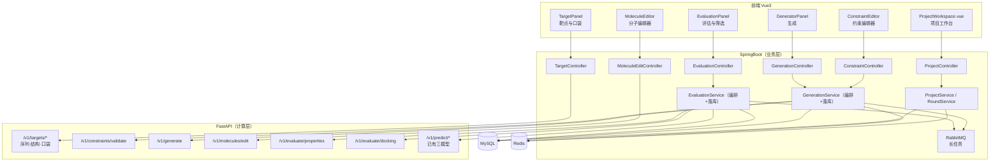
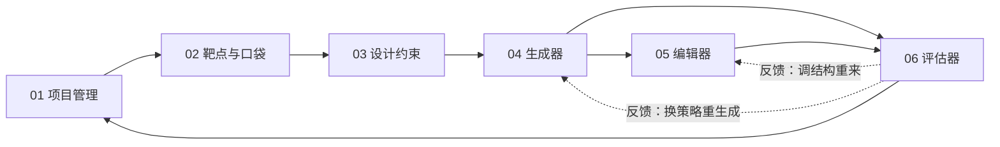
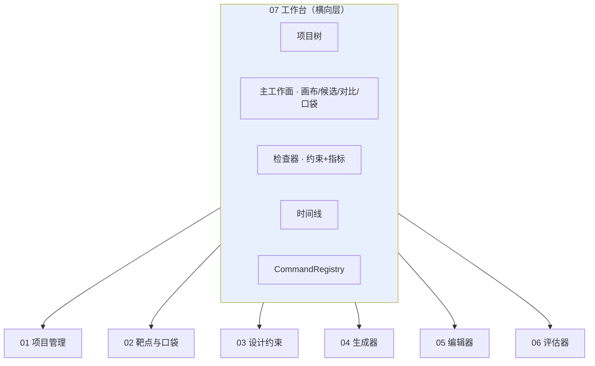
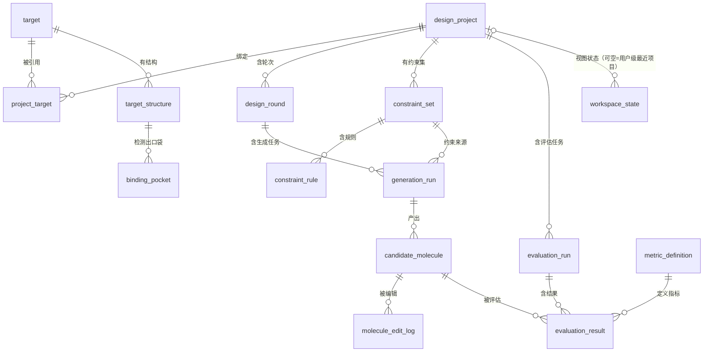
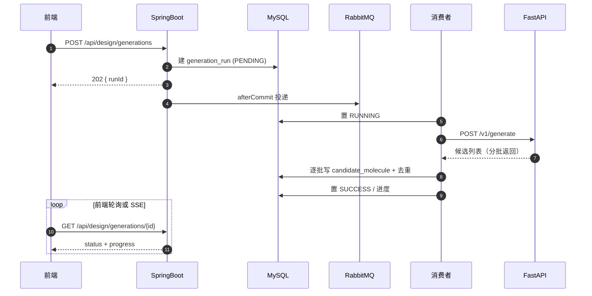

# 干实验药物设计平台 · 总览与架构分工

> 文档版本：v1.1 ｜ 编写日期：2026-09-22 ｜ 修订：2026-09-23
> 适用范围：`synpharm-backend` / `synpharm-fastapi` / `synpharm-frontend`
> 定位：**第一阶段（手动操作构建药物）** 的模块级设计总纲。
> **第一阶段是造工具，但最终交付物不是「6 个模块的 API」，而是一个干实验 IDE（工作台）** ——
> 布局、保存即编译、Diff、撤销、命令注册表见 `07-工作台与交互设计.md`。
> 第二阶段（智能体自动化）在本文档定义的模块之上加一层 Agent 编排，见
> `docs/development/第二阶段开发文档-多智能体协同与智能体闭环.md`。

---

## 0. 本文档群索引

| 文档 | 模块 | 一句话职责 |
|---|---|---|
| `00-总览与架构分工.md` | — | 架构铁律、流程、全局 ER、模块依赖 |
| `01-项目管理与生命周期.md` | 项目管理 | 项目=靶点+目标+约束集+候选集+轮次 |
| `02-靶点与结合口袋.md` | 靶点准备 | 为生成提供"落点"（序列/结构/口袋） |
| `03-设计约束.md` | 约束设计 | 把"什么样的分子合格"显式化为可执行规则 |
| `04-分子生成器.md` | 生成器 | 按约束产出候选分子 |
| `05-分子编辑器.md` | 编辑器 | 对单个候选做微调并保留父子关系 |
| `06-评估器.md` | 评估器 | 给候选多维度打分，驱动筛选与迭代 |
| `07-工作台与交互设计.md` | **工作台** | 把 01~06 粘成一个 IDE：布局、保存即编译、Diff、撤销、命令注册表 |

> `01`~`06` 描述**部件**（管线上的六个环节），`07` 描述**台面**（把部件粘成一个软件）。
> 只做 01~06 会得到六个页面；补上 07 才得到**一个软件**。

---

## 1. 目标定位

|  | 第一阶段（本文档群） | 第二阶段 |
|---|---|---|
| 交互方式 | **人手动操作** | 智能体自主编排 |
| 本质 | 造工具 + 把手动流程跑通 | 用工具 + 自动化流程 |
| 形态 | **干实验 IDE（工作台）** | 智能体驱动**同一个** IDE |
| 产出物 | 可复现的**手动设计闭环** | 自动闭环 + 可溯源报告 |

### 1.1 第一阶段不是向导，是工作台

管线形态（新建 → 约束 → 生成 → 编辑 → 评估）容易实现成**向导**（步骤化、下一步禁用）。
但第一阶段的最终目的应该是**工作台**：

| 维度 | 向导（不采用） | 工作台（目标） |
|---|---|---|
| 导航 | 步骤 1→2→3，未完成则下一步禁用 | 任意面板、任意时刻可进入 |
| 状态 | 线性、刷新即丢 | 常驻、可恢复（`workspace_state`） |
| 中心 | 表单 | **候选与分子画布** |
| 反馈 | 走完流程才出结果 | **保存即编译**（增量、内联 < 2s） |
| 回退 | 上一步 | **撤销/重做**（谱系游标）+ Diff |
| 扩展 | 改流程 | 加命令（命令注册表） |

### 1.2 IDE 概念映射（部件已齐）

| IDE 概念 | 本项目 | 文档 |
|---|---|---|
| 工作区 / 项目 | `design_project` | 01 |
| 外部依赖 / 库 | 靶点序列、结构、口袋、支持药物集 | 02 |
| 项目设置 / 代码风格 | `constraint_set` + `constraint_rule` | 03 |
| 脚手架 / 代码生成 | 分子生成器 | 04 |
| **编辑器** | 分子编辑器 + 2D 画布（Ketcher） | 05 |
| 编译 / 测试 / lint | 评估器 | 06 |
| 版本控制 | 轮次 `design_round` + 谱系 `parent_mol_id` | 01 / 05 |
| 构建产物 | `candidate_molecule` + 导出（CSV/SDF） | 04 / 01 |
| **布局 / 面板 / 命令 / Diff / 撤销** | **工作台** | **07** |

**手动设计闭环**（在第一阶段的工作台上应能完成）：

```
新建项目 → 选靶点定口袋 → 定约束 → 生成候选 → 编辑微调
   → 评估打分 → 筛选 → 改结构进入下一轮 → 输出候选集
```

---

## 2. 架构分工铁律

> **一切与"计算"有关的都放 FastAPI；SpringBoot 只做业务、持久化、权限、编排。**

| 关注点 | SpringBoot（`synpharm-backend`） | FastAPI（`synpharm-fastapi`） |
|---|---|---|
| 对外 REST | ✅ 全部对外接口（`/api/**`） | ❌ 只对 SpringBoot 提供 `/v1/**` |
| 认证鉴权 | ✅ JWT + 归属校验 | ⚠️ 仅 `X-API-Key` 服务间鉴权 |
| 参数校验 | ✅ 语法/必填/权限级校验 | ✅ 业务语义级校验（结构合法性等） |
| 业务状态机 | ✅ 项目/生成/评估 的状态流转 | ❌ 无状态计算节点 |
| 持久化 | ✅ MySQL + Redis 全部读写 | ❌ **不碰数据库** |
| 任务编排 | ✅ 异步任务、线程池、MQ、进度 | ✅ 单次计算内部并行 |
| **分子解析/描述符/指纹** | ❌ | ✅ RDKit |
| **分子生成/枚举/片段操作** | ❌ | ✅ RDKit / CReM |
| **口袋检测、对接** | ❌ | ✅ P2Rank / Vina |
| **三个预测模型推理** | ❌（只转发） | ✅ 已有 |
| 文件存储 | ✅ 落盘 + URL | ❌ 只处理内存流/临时文件 |

### 2.1 组件图



---

## 3. 模块依赖关系



**关键**：`03 约束`同时被 `04 生成器`（生成时引导）与 `06 评估器`（筛选用同一套规则）复用 —— **一份定义，两处执行**，避免"生成按一套标准、筛选按另一套"的不一致。

### 3.1 横向层：07 工作台

`01`~`06` 是**纵向**的六个环节（有先后依赖）；`07` 是**横向**的，它不处在管线上，而是**同时包住全部六个**：



> **因此 07 不是管线的第七步**，而是一层壳。它带来一条硬约束：
> **所有写操作必须经 `CommandRegistry` 执行，前端与二阶段的智能体走同一扇门**（见 `07` §8）。

---

## 4. 全局实体关系（ER）



> `workspace_state`（07 工作台）保存"上次停在哪"，使工作台可恢复；
> 其 `project_id` 可空，为空时表示用户级"最近打开的项目"。

---

## 5. 模块清单与状态归属

| # | 模块 | 对外接口前缀 | 主要新增表 | 计算侧依赖 |
|---|---|---|---|---|
| 01 | 项目管理 | `/api/design/projects` | `design_project` `project_target` `design_round` | 无 |
| 02 | 靶点与口袋 | `/api/design/targets` | `target` `target_structure` `binding_pocket` | Bio.PDB / P2Rank |
| 03 | 设计约束 | `/api/design/constraints` | `constraint_set` `constraint_rule` | RDKit |
| 04 | 分子生成器 | `/api/design/generations` | `generation_run` `candidate_molecule` | RDKit / CReM |
| 05 | 分子编辑器 | `/api/design/molecules` | `molecule_edit_log` | RDKit |
| 06 | 评估器 | `/api/design/evaluations` | `evaluation_run` `evaluation_result` `metric_definition` | RDKit / Vina / 已有三模型 |
| 07 | **工作台（横向层）** | `/api/design/workspace` `/api/design/commands` `/api/design/compare` | `workspace_state` | RDKit（MCS 用于分子 Diff） |

> **DDL 编号约定**：现有脚本最大编号为 `10_ddi_supported_drug.sql`，
> 本阶段新增脚本从 **`11_`** 起（`11_`~`24_` 为 01~06 模块，`25_` 为工作台），
> 在 `docs/modules/design/` 各模块文档中给出完整 DDL。

---

## 6. 长任务与异步约定

生成、批量评估、口袋检测都属于**秒级到分钟级**任务，统一走既有 RabbitMQ 模式：



**约定**：
- 队列隔离：`design.generation.queue` / `design.evaluation.queue` / 已有 `batch.task.queue` 分离，避免互相挤占线程池
- 死信队列沿用既有 `x-dead-letter-*` 配置模式
- 进度写 Redis（`design:progress:{runId}`，TTL 24h），DB 为权威
- **优先 SSE 而非轮询**：长任务的增量结果（新候选、指标填充）经 `/api/design/stream/{runId}` 推送，
  轮询仅作降级兜底（见 `07` §4.1）
- **但「保存即编译」不走 MQ**：编辑后的性质类快评（<1.5s）同步直调，保证画布手感（见 `07` §5）

---

## 7. 与第二阶段的衔接约束（重要）

第一阶段每个模块都必须满足以下三条，否则第二阶段无法自动化：

| 约束 | 说明 |
|---|---|
| **1. 操作无人工交互** | 每个功能都有等价的 REST 语义（`POST /api/design/...`），前端只是调用方 |
| **2. 输入输出规格明确** | 都具备 JSON Schema 级别的入参/出参定义，可直接作为 `AgentTool.getParameterSchema()` |
| **3. 流程可数据化** | 一轮完整操作（生成→编辑→评估）能由 DB 里的记录**完整重放**，不依赖隐式状态 |
| **4. 单一执行入口** | 所有写操作经 `CommandRegistry`，人（⌘K 命令面板）与智能体（`AgentTool`）走同一扇门（见 `07` §8） |

对应的执行动作：第二阶段只需为每个模块新增一个 `AgentTool` 实现类，把 `POST /api/design/commands/{commandId}` 包一层即可，**不需要改计算逻辑，也不需要改界面**。

> 第 4 条是第二阶段能"零改造接入"的关键：智能体不需要新开通道，因而自动继承权限、审计、
> 幂等与能力过滤（未装引擎的命令会被自动置为不可用，避免智能体幻觉调用）。

| 第一阶段模块 | 第二阶段工具名（预留） |
|---|---|
| 靶点与口袋 | `target_resolve` / `pocket_detect` |
| 设计约束 | `constraint_validate` |
| 分子生成器 | `molecule_generate` |
| 分子编辑器 | `molecule_edit` |
| 评估器 | `mol_properties` / `mol_docking` / `dti_predict`（已有） |
| 项目管理 | `project_context`（读轮次与候选，供 Planner 决策） |

---

## 8. 技术栈与工具包总表

### 8.1 SpringBoot 侧（业务）

| 用途 | 选型 | 说明 |
|---|---|---|
| Web / 持久化 | Spring Boot 3.2 + MyBatis-Plus | 已有 |
| 长任务 | RabbitMQ + Spring AMQP | 已有，新增独立队列 |
| 缓存/进度 | Redis（StringRedisTemplate） | 已有 |
| 服务间调用 | WebClient + SimpleCircuitBreaker | 已有 |
| 状态机 | **自写轻量状态机**（枚举 + 迁移表） | 沿用项目既有手写惯例，不引 Spring Statemachine |
| 参数校验 | Jakarta Validation | 已有 |
| 导出 | 既有 `CsvUtils` / `JsonOutputFormatter` | 已有，新增 SDF 导出 |

### 8.2 FastAPI 侧（计算）

| 用途 | 工具包 | 状态 |
|---|---|---|
| 分子解析/描述符/指纹/子结构 | **RDKit** | ✅ 已装 |
| R 基团分解与枚举 | RDKit `rdRGroupDecomposition` | ✅ 已装 |
| 片段分解（BRICS/RECAP） | RDKit `rdChem.BRICS` / `Recap` | ✅ 已装 |
| 骨架提取 | RDKit `MurckoScaffold` | ✅ 已装 |
| 结构警报/PAINS | RDKit `FilterCatalog` | ✅ 已装 |
| 合成可及性 SA Score | RDKit Contrib `sascorer` | ✅ 随 RDKit |
| 片段替换/生长 | **CReM**（`pip install crem`） | 🆕 建议 |
| 结构解析（PDB/mmCIF） | **Biopython** `Bio.PDB` / **ProDy** | 🆕 |
| 口袋检测 | **P2Rank**（Java，可容器化）／**fpocket** | 🆕 |
| 对接 | **AutoDock Vina** ／ **smina** ／ **gnina** | 🆕 P1 |
| 对接输入准备 | **Meeko** + **Open Babel** | 🆕 P1 |
| ADMET | **admet_ai** ／ DeepPurpose | 🆕 P2 |
| 数值/统计 | numpy / pandas / scikit-learn | ✅ 已装 |
| 已有三模型 | KAN-MoDTI / FlashPPI / DDI-LLM | ✅ 可用 |

### 8.3 前端侧

| 用途 | 选型 | 说明 |
|---|---|---|
| 2D 结构编辑器 | **Ketcher**（开源，Vue 可嵌）／ Kekule.js ／ JSME | 🆕 编辑器模块用 |
| 3D 结构渲染 | **Mol\***（`MolstarViewer.vue` 已接） | ✅ 已有，需补配体渲染 |
| 图表 | ECharts（已装） | ✅ |
| 表格/虚拟滚动 | Element Plus | ✅ |

---

## 9. 开发顺序建议

```mermaid
gantt
    title 第一阶段补全顺序（示意）
    dateFormat X
    axisFormat %s
    section 基础
    01 项目管理        :a1, 0, 3
    02 靶点与口袋      :a2, 1, 4
    section 核心闭环
    03 设计约束        :b1, 3, 2
    04 生成器          :b2, 4, 4
    05 编辑器          :b3, 7, 3
    06 评估器          :b4, 6, 4
    section 收尾
    3D 配体渲染        :c1, 9, 2
    section 台面
    07 工作台与交互    :d1, 10, 4
```



**最小可用闭环**：`01 + 03 + 04 + 06`（项目管理 + 约束 + 生成 + 评估）即可手动完成
"生成 20 个类似物 → 按约束过滤 → 打分排序 → 挑 Top5"。

**交付判据（第一阶段结束）**：不是"六个模块都能跑"，而是 `07` §12 的十条验收项全部满足 ——
即用户能**停留在工作台上完成一整轮设计，全程不做浏览器后退**。

---

## 10. 通用约定

| 项 | 约定 |
|---|---|
| 分子唯一标识 | **InChIKey**（14 位骨架键）作去重键；SMILES 作展示与计算入参 |
| 分子规范化 | 统一经 `/v1/molecules/standardize`（RDKit `rdMolStandardize`：去盐、中和、去立体可选） |
| 时间 | 全部 `DATETIME`，`created_at` / `updated_at` 由 MyBatis-Plus 自动填充（需先补 `F-05`） |
| 逻辑删除 | `deleted TINYINT DEFAULT 0`，沿用 MyBatis-Plus 全局配置 |
| 归属校验 | 所有 `design_*` 资源必须校验 `project.user_id == currentUserId`，防 IDOR（对齐 `B-03` 修复模式） |
| 幂等 | `generation_run` / `evaluation_run` 支持按 `runNo` 幂等重放 |
| 审计 | 每个 run 记录 `input_json` / `output_digest` / `latency_ms` |

---

## 11. 当前实现进度（2026-09-23）

本文件群描述的是**目标设计**。截至 2026-09-23，**前端工作台已按本文约定落地**，
后端与库表尚未开始。逐条对应关系如下，便于判断「文档说的」与「已经有的」差在哪。

### 11.1 已落地（前端）

| 文档 | 已实现部分 | 备注 |
|---|---|---|
| 00 §2 架构分工 | 前端只经 `api/design.ts` 门面取数 | 边界已由**分层**固化，但"实算"目前发生在浏览器侧（Indigo 由子应用承载） |
| 01 项目管理 | 项目卡片、轮次切换、底部轮次时间线 | 状态机与库表未实现 |
| 02 靶点与口袋 | 靶点（野生型/突变体）列表、口袋上下文、3D 结构 | 结构解析沿用既有 `UniProtResolver` / `PdbResolver`（只做 IO，不迁移）；**口袋腔体与共结晶配体已可视化** |
| 03 设计约束 | 11 条规则的**真实逐条判定**（硬/软分级） | 规则集与判定逻辑在前端实现，未接后端 |
| 04 分子生成器 | 生成任务列表；演示数据为确定性枚举 | S1~S6 策略未实现 |
| 05 分子编辑器 | 2D 编辑器（Ketcher 子应用）、保存为新候选并保留父子谱系 | 编辑操作 E1~E9 未实现 |
| 06 评估器 | 指标定义表驱动右栏 + 加权综合得分 | 当前由演示数据给出；**接入时必须走 `PipelineFactory`** |
| 07 工作台与交互 | 三栏布局、四页签、约束判定与指标面板、全局错误条 | 命令注册表与撤销/重做未实现 |
| 00 §8.3 前端工具包 | Ketcher 3.18（Indigo）、Molstar 5.11、ECharts 5 | 已接入并实测 |
| 00 §10 通用约定 | 分子唯一标识用 **InChIKey** | 已由本地 Indigo **实算**，不再是估算/散列 |

### 11.2 未落地

- **设计域库表**（DDL 编号 `11_` ~ `25_`）—— 仅本文档群给出定义，未建表
- **`/api/design/**` 九个端点** —— 契约已定（见 `README.md`），后端未实现
- **把计算迁移到 FastAPI** —— 当前"实算"发生在浏览器内的 Indigo（子应用），
  按 §2 铁律最终应改由 FastAPI 提供；`EngineAnalysis` 类型可原样复用
- **对接引擎（AutoDock Vina）/ ADMET** —— 未部署，对应指标已置灰并按比例重分配权重
- **命令注册表与撤销/重做**（07 §8）—— 未实现

### 11.3 与第二阶段的衔接

前端已把每个模块做成**独立的 store 动作 + 窄接口**（如 `generate()`、`saveEdited()`、`enrichCurrentPage()`），
第二阶段的 AgentTool 可直接复用同一批接口，无需推翻重写 ——
这也正是 §7「衔接约束」想要的状态。
