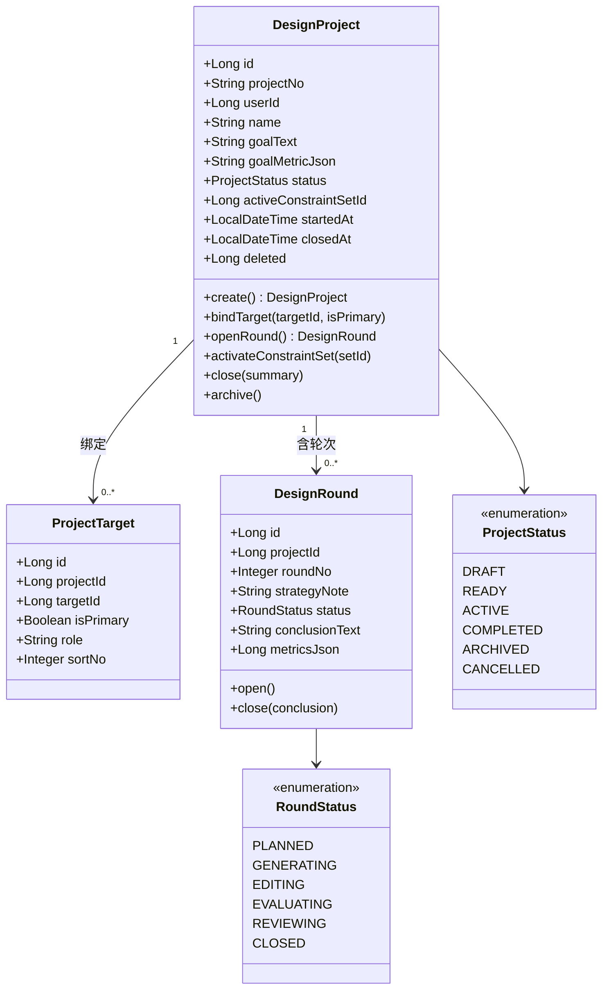
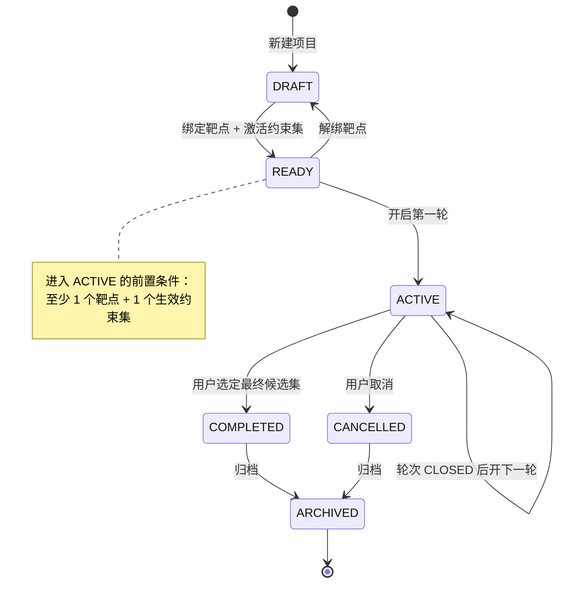
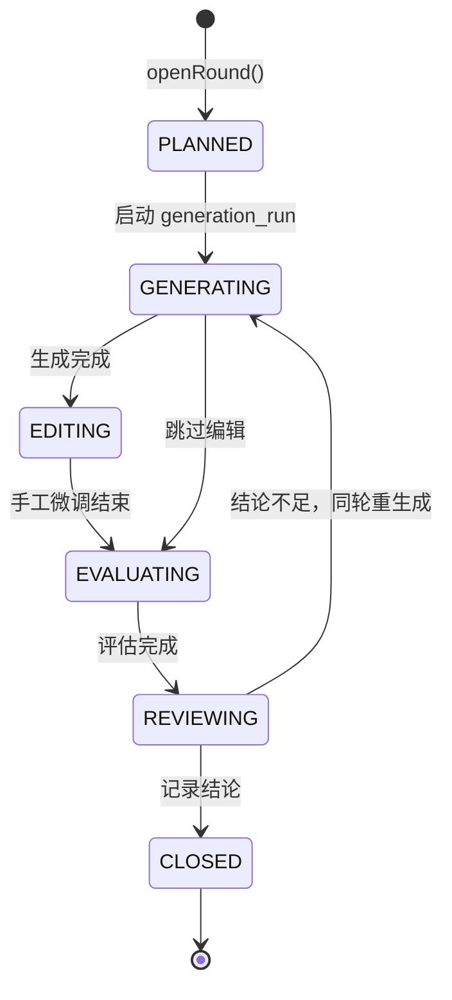
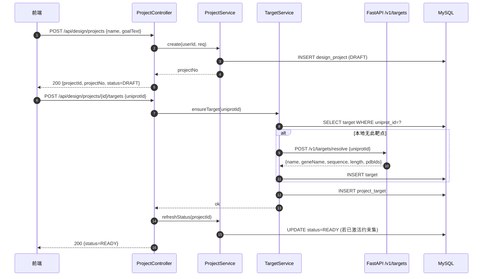

# 01 · 项目管理与生命周期

> 所属：干实验药物设计平台 · 第一阶段
> 上级文档：`00-总览与架构分工.md`
> 计算侧依赖：**无**（纯业务模块，全部在 SpringBoot）

---

## 1. 定位

**一个"药物设计项目" = 靶点 + 设计目标 + 约束集 + 候选分子集 + 迭代轮次。**

本模块是其它所有模块的**容器与生命周期管理者**：

- 向上：给用户提供"新建项目 → 推进轮次 → 归档"的入口
- 向下：为生成器/编辑器/评估器提供 `projectId` / `roundId` 上下文
- 向第二阶段：`project_context` 工具的数据来源（Planner 读轮次与候选做决策）

> ⚠️ **本模块不含任何计算**，所有分子相关计算转发给 FastAPI 模块。

---

## 2. 核心概念

| 概念 | 说明 |
|---|---|
| **设计项目 `design_project`** | 研究课题的容器。一个项目锁定一组靶点与一个设计目标 |
| **项目-靶点绑定 `project_target`** | 一个项目可绑定多个靶点（如野生型 + T790M 突变体），并区分主/次 |
| **迭代轮次 `design_round`** | 一轮 = "生成 → 编辑 → 评估 → 评审"。多轮构成优化历史 |
| **设计目标** | 自然语言 + 结构化指标（如"选择性指数 > 3"），用于评审与二阶段 Planner |

---

## 3. UML

### 3.1 类图



### 3.2 项目状态机



### 3.3 轮次状态机



### 3.4 活动图：新建项目到可生成

```mermaid
flowchart TD
    A[用户点击"新建项目"] --> B[填写名称 + 设计目标]
    B --> C{名称/目标合法?}
    C -- 否 --> B
    C -- 是 --> D[创建 design_project, status=DRAFT]
    D --> E[选择靶点]
    E --> F{靶点是否有序列?}
    F -- 否 --> G[调用 02 模块补齐序列]
    G --> H
    F -- 是 --> H[绑定 project_target]
    H --> I[选择或新建约束集]
    I --> J{约束集合法?}
    J -- 否 --> I
    J -- 是 --> K[activateConstraintSet]
    K --> L[status=READY]
    L --> M[用户点"开始设计"]
    M --> N[openRound → status=ACTIVE]
    N --> O[进入 04 生成器]
```

### 3.5 时序图：新建项目（含服务间调用）



---

## 4. 现成工具包

本模块是纯业务，**不需要新引入第三方库**，直接复用一阶段既有栈：

| 用途 | 选型 | 状态 |
|---|---|---|
| Web / 校验 | Spring Boot 3.2 + Jakarta Validation | ✅ 已有 |
| 持久化 | MyBatis-Plus（`@TableField(fill=...)` 自动填充） | ✅ 已有 |
| 状态机 | **自写轻量状态机**：`Enum` + `Map<Status, Set<Status>>` 迁移表 | 🆕 约 60 行 |
| 事务 | `@Transactional` + `TransactionSynchronization`（afterCommit 投递 MQ） | ✅ 已有模式参考 `BatchProcessServiceImpl.uploadBatch` |
| 编号生成 | 沿用 `generateNo("P")` 模式（前缀 + 时间戳 + 随机） | ✅ 已有 |
| IDOR 防护 | `assertOwnership(projectId, userId)`，对齐 `getBatchStatus` 模式 | ✅ 已有模式 |

> **为什么不用 Spring Statemachine**：本项目状态迁移简单且分支少，引入框架会带来配置与调试成本；
> 手写迁移表可读性更高，也与项目既有"手写状态判定"的惯例一致（见 `BatchProcessServiceImpl` 的 `switch (task.getStatus())`）。

---

## 5. 数据库设计

### 5.1 `11_design_project.sql`

```sql
-- =============================================
-- 干实验药物设计 · 项目管理
-- 版本：v1.0  依赖：sys_user
-- =============================================
USE synpharm;

CREATE TABLE IF NOT EXISTS design_project (
    id                    BIGINT PRIMARY KEY AUTO_INCREMENT COMMENT '项目ID',
    project_no            VARCHAR(64)  NOT NULL COMMENT '项目编号 P+时间戳+随机',
    user_id               BIGINT       NOT NULL COMMENT '归属用户',
    name                  VARCHAR(200) NOT NULL COMMENT '项目名称',
    goal_text             TEXT                  COMMENT '设计目标（自然语言）',
    goal_metric_json      JSON                  COMMENT '结构化目标指标，如 {"selectivity_index":{">":3}}',
    status                VARCHAR(20)  NOT NULL DEFAULT 'DRAFT'
                          COMMENT 'DRAFT/READY/ACTIVE/COMPLETED/ARCHIVED/CANCELLED',
    active_constraint_set_id BIGINT              COMMENT '当前生效的约束集（见 03 模块）',
    summary               TEXT                  COMMENT '结项小结',
    started_at            DATETIME              COMMENT '首次进入 ACTIVE 的时间',
    closed_at             DATETIME              COMMENT '结项时间',
    deleted               TINYINT      NOT NULL DEFAULT 0 COMMENT '逻辑删除',
    created_at            DATETIME     NOT NULL DEFAULT CURRENT_TIMESTAMP,
    updated_at            DATETIME     NOT NULL DEFAULT CURRENT_TIMESTAMP ON UPDATE CURRENT_TIMESTAMP,
    UNIQUE KEY uk_project_no (project_no),
    KEY idx_user_status (user_id, status),
    KEY idx_created (created_at)
) ENGINE=InnoDB DEFAULT CHARSET=utf8mb4 COLLATE=utf8mb4_unicode_ci COMMENT='药物设计项目';
```

### 5.2 `12_project_target.sql`

```sql
CREATE TABLE IF NOT EXISTS project_target (
    id          BIGINT PRIMARY KEY AUTO_INCREMENT,
    project_id  BIGINT      NOT NULL COMMENT '项目ID',
    target_id   BIGINT      NOT NULL COMMENT '靶点ID（见 02 模块 target 表）',
    is_primary  TINYINT     NOT NULL DEFAULT 0 COMMENT '1=主靶点（生成以它为准）',
    role        VARCHAR(40)          COMMENT 'WILD_TYPE/MUTANT/ANTI_TARGET/OFF_TARGET',
    sort_no     INT         NOT NULL DEFAULT 0,
    created_at  DATETIME    NOT NULL DEFAULT CURRENT_TIMESTAMP,
    UNIQUE KEY uk_project_target (project_id, target_id),
    KEY idx_project (project_id),
    KEY idx_target (target_id),
    CONSTRAINT fk_pt_project FOREIGN KEY (project_id) REFERENCES design_project(id),
    CONSTRAINT fk_pt_target  FOREIGN KEY (target_id)  REFERENCES target(id)
) ENGINE=InnoDB DEFAULT CHARSET=utf8mb4 COLLATE=utf8mb4_unicode_ci COMMENT='项目-靶点绑定';
```

> 💡 `role` 字段是**选择性设计**的关键：把野生型与突变体都绑到一个项目里并标 `role`，
> 06 评估器才能算出"选择性指数 = 突变体亲和力 / 野生型亲和力"。

### 5.3 `13_design_round.sql`

```sql
CREATE TABLE IF NOT EXISTS design_round (
    id             BIGINT PRIMARY KEY AUTO_INCREMENT,
    project_id     BIGINT       NOT NULL,
    round_no       INT          NOT NULL COMMENT '第几轮，从 1 开始',
    strategy_note  TEXT                  COMMENT '本轮策略说明（人写的或二阶段 Planner 写的）',
    status         VARCHAR(20)  NOT NULL DEFAULT 'PLANNED'
                   COMMENT 'PLANNED/GENERATING/EDITING/EVALUATING/REVIEWING/CLOSED',
    conclusion_text TEXT                 COMMENT '本轮结论',
    metrics_json   JSON                  COMMENT '本轮指标快照，如 {"top1_binding":8.2,"pass_rate":0.35}',
    opened_at      DATETIME     NOT NULL DEFAULT CURRENT_TIMESTAMP,
    closed_at      DATETIME,
    deleted        TINYINT      NOT NULL DEFAULT 0,
    UNIQUE KEY uk_project_round (project_id, round_no),
    KEY idx_project_status (project_id, status),
    CONSTRAINT fk_round_project FOREIGN KEY (project_id) REFERENCES design_project(id)
) ENGINE=InnoDB DEFAULT CHARSET=utf8mb4 COLLATE=utf8mb4_unicode_ci COMMENT='设计迭代轮次';
```

---

## 6. 接口设计（SpringBoot）

| 方法 | 路径 | 说明 |
|---|---|---|
| `POST` | `/api/design/projects` | 新建项目 |
| `GET` | `/api/design/projects` | 我的项目列表（分页） |
| `GET` | `/api/design/projects/{id}` | 项目详情（含靶点、轮次、候选数统计） |
| `PUT` | `/api/design/projects/{id}` | 改名称/目标 |
| `POST` | `/api/design/projects/{id}/targets` | 绑定靶点 |
| `DELETE` | `/api/design/projects/{id}/targets/{targetId}` | 解绑 |
| `POST` | `/api/design/projects/{id}/constraint-set` | 激活约束集 |
| `POST` | `/api/design/projects/{id}/rounds` | 开启新一轮 |
| `POST` | `/api/design/rounds/{id}/close` | 关闭轮次并写结论 |
| `POST` | `/api/design/projects/{id}/close` | 结项 |
| `POST` | `/api/design/projects/{id}/archive` | 归档 |
| `GET` | `/api/design/projects/{id}/timeline` | 项目时间线（各轮 + 各 run 汇总） |

**统一响应**：沿用既有 `Result<T>` 信封（`code` / `errorCode` / `message` / `data`）。

**新增错误码**：

| 错误码 | HTTP | 语义 |
|---|---|---|
| `DESIGN_PROJECT_NOT_FOUND` | 404 | 项目不存在或不属于当前用户 |
| `DESIGN_PROJECT_NOT_READY` | 409 | 靶点或约束集未就绪，不能开始设计 |
| `DESIGN_PROJECT_STATUS_INVALID` | 409 | 当前状态不允许该操作（如已归档仍想开轮次） |
| `DESIGN_ROUND_ALREADY_OPEN` | 409 | 已有未关闭的轮次 |
| `DESIGN_TARGET_DUPLICATED` | 409 | 同一靶点重复绑定 |

---

## 7. 关键设计点

| 点 | 说明 |
|---|---|
| **状态迁移集中校验** | 所有状态变更走 `ProjectStatusMachine.canTransfer(from, to)`，禁止散落在 Service 里 |
| **READY 的计算而非设置** | `READY` 由"有靶点 ∧ 有激活约束集"推导，每次变更后重算，避免状态与事实不符 |
| **轮次序号不跳号** | `round_no` 在事务内 `SELECT MAX+1` 并靠 `uk_project_round` 兜底防并发 |
| **查询级联** | 删轮次为逻辑删除；删项目不级联删候选（保留科研数据） |
| **时间线接口** | `timeline` 是前端"项目工作台"的主数据源，一次返回足够渲染全貌，避免 N+1 请求 |
| **IDOR** | 所有 `/api/design/**` 入口统一 `assertOwnership`，跨用户返回 404（不是 403，避免探测） |
| **二阶段衔接** | `timeline` 的 JSON 结构即 `project_context` 工具的返回，供 Planner 判断"上一轮结论是否不足" |
