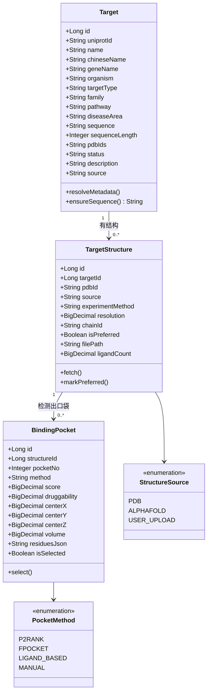
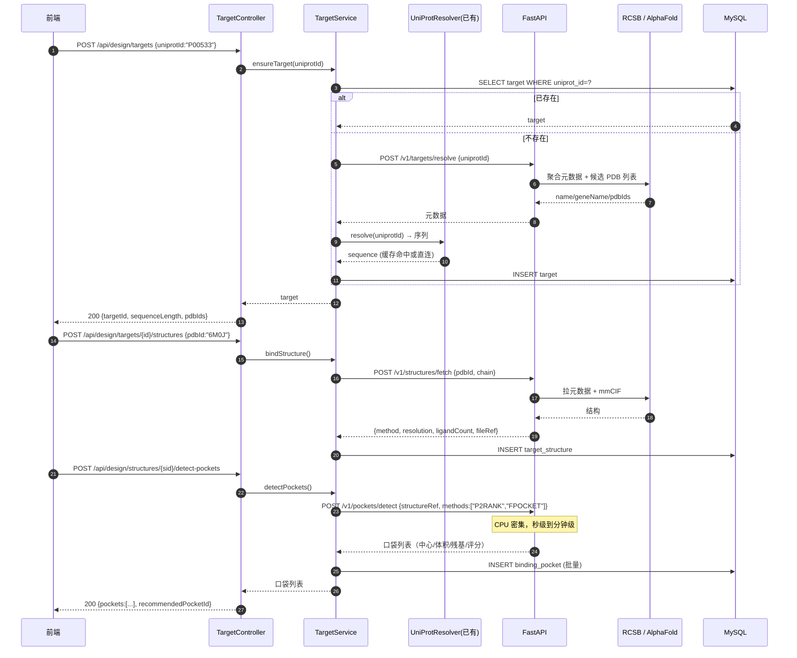
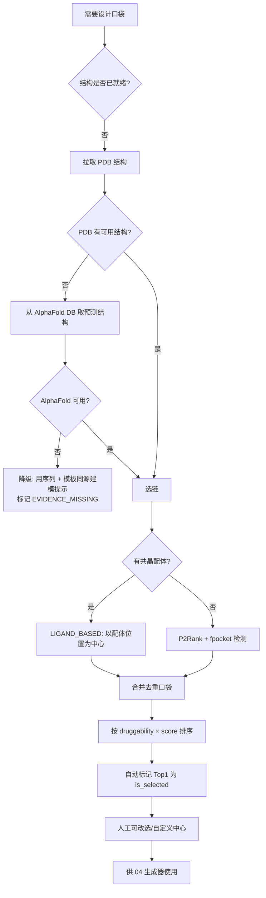

# 02 · 靶点与结合口袋

> 所属：干实验药物设计平台 · 第一阶段
> 上级文档：`00-总览与架构分工.md`
> 计算侧依赖：**FastAPI**（结构解析、口袋检测）
> 现状缺口：`C-08`（靶点库整体 mock，后端无 `/api/targets`）—— 本模块即为该缺口的正式方案

---

## 1. 定位

**为"生成分子"提供落点。** 没有靶点序列就没有 DTI 输入；没有结合口袋就不知道把分子往哪儿设计。

本模块产出三样东西，供 03/04/06 模块使用：

| 产出 | 用途 |
|---|---|
| **靶点序列** | DTI 预测入参；口袋残基的载体 |
| **靶点结构**（PDB / AlphaFold） | 3D 展示；对接受体准备 |
| **结合口袋** | 生成器的"设计区域"；对接的搜索空间；评估的靶向性依据 |

---

## 2. 核心概念

| 概念 | 说明 |
|---|---|
| **靶点 `target`** | 以 UniProt 登录号为自然主键的蛋白条目（含序列、基因名、疾病领域、通路） |
| **靶点结构 `target_structure`** | 一个靶点可有多个结构（多个 PDB、或 AlphaFold 预测模型）；标记 `is_preferred` |
| **结合口袋 `binding_pocket`** | 结构上的一个可设计空腔：中心坐标、体积、残基列表、可成药性评分 |
| **口袋方法 `method`** | `P2RANK` / `FPOCKET` / `MANUAL`（用户自定义中心）/ `LIGAND_BASED`（从共晶配体位置推导） |

---

## 3. 与 SpringBoot 既有资产的关系（重要）

一阶段已经有两个可用的外部数据获取器，**本模块直接复用，不重写、不迁移**：

| 既有组件 | 位置 | 在本模块中的角色 |
|---|---|---|
| `UniProtResolver` | SpringBoot `pipeline/resolve/` | UniProt ID → FASTA 序列（Redis 正/负缓存 + 降级直连） |
| `PdbResolver` | SpringBoot `pipeline/resolve/` | PDB 引用 → 链序列（支持 `6M0J:A`） |
| `ProteinSequenceValidator` | SpringBoot `pipeline/resolve/` | 序列长度/字符校验（≥31 残基） |

> **分工说明**：这两个 resolver 做的是**外部数据获取 + 缓存**（IO 密集），不是计算。
> 按"计算放 FastAPI"的原则它们**可以保留在 SpringBoot**，本次**不迁移**（迁移的收益低于风险）。
> 真正需要新建在 FastAPI 的是**结构解析与口袋检测**（CPU 密集）。

---

## 4. UML

### 4.1 组件图

```mermaid
graph TB
    subgraph BE["SpringBoot · 靶点业务"]
        TC["TargetController<br/>/api/design/targets"]
        TS["TargetService<br/>CRUD + 归属校验"]
        PP["PocketService<br/>口袋任务编排 + 落库"]
        UR["UniProtResolver (已有)<br/>序列获取 + Redis 缓存"]
        PR["PdbResolver (已有)<br/>链序列获取"]
        FA1["FastApiClient"]
    end

    subgraph FA["FastAPI · 计算"]
        E1["POST /v1/targets/resolve<br/>UniProt 元数据聚合"]
        E2["POST /v1/structures/fetch<br/>PDB 结构元数据 + 文件"]
        E3["POST /v1/pockets/detect<br/>口袋检测"]
        E4["GET  /v1/structures/{id}/ligands<br/>共晶配体列表"]
    end

    subgraph EXT["外部数据源（FastAPI 侧）"]
        U["UniProt REST"]
        R["RCSB PDB REST"]
        AF["AlphaFold DB API"]
    end

    DM["MySQL"]

    TC --> TS --> DM
    TC --> PP --> FA1
    FA1 --> E1 & E2 & E3 & E4
    E1 --> U
    E2 --> R
    E4 --> R
    E3 --> AF
    TS -.->|"仅取序列时复用"| UR
    TS -.->|"仅取链序列时复用"| PR
    PP --> DM
```



### 4.2 类图



### 4.3 时序图：从 UniProt ID 到可用口袋



### 4.4 活动图：口袋选择与降级



---

## 5. 现成工具包

| 用途 | 工具包 | 语言 | 备注 |
|---|---|---|---|
| PDB/mmCIF 解析 | **Biopython** `Bio.PDB` | Python | 最通用，`MMCIFParser` 处理大结构 |
| 结构分析（残基、距离、口袋残基提取） | **ProDy** | Python | 比手工遍历 Bio.PDB 高效，支持 ANM/GNM |
| 轨迹/构象分析（多模型结构） | **MDAnalysis** | Python | 若结构含多模型或有 MD 轨迹时用 |
| **口袋检测（首选）** | **P2Rank** | Java（可容器化，提供 CLI + 输出 CSV） | 精度好、易集成；输出 pocket 中心/残基/score |
| **口袋检测（备选）** | **fpocket** | C（`fpocket` 可 apt 安装） | 体积/可成药性评分原生支持 |
| **口袋检测（轻量）** | **PocketFinder（自定义几何法）** | Python | 无外部依赖的兜底：网格 + 探针可及性 |
| 共晶配体提取 | Biopython `HETATM` / RCSB `nonpolymer_entity` API | Python | 用于 `LIGAND_BASED` |
| 靶点元数据 | **UniProt REST API** | HTTP | `?fields=accession,protein_name,gene_names,sequence,xref_pdb&format=tsv` |
| 结构元数据 | **RCSB PDB REST** | HTTP | `https://data.rcsb.org/rest/v1/core/entry/{id}` |
| 无实验结构靶点 | **AlphaFold DB API** | HTTP | `https://alphafold.ebi.ac.uk/api/prediction/{uniprotId}` |
| 结构格式转换 | **Open Babel** | CLI/Python | PDB ↔ PDBQT ↔ MOL2，对接前必需 |
| 缓存 | Redis（已有） | — | 结构文件不必进 Redis，元数据与口袋结果可缓存 |

> **缓存策略**（沿用既有 `UniProtResolver` 模式）：
> 元数据正缓存 24h、负缓存 10min；结构文件落盘（`file.upload-dir` 同级 `structures/`）不做 TTL；
> 口袋结果按 `structureId + method` 缓存，结构不变则永不过期。

---

## 6. 数据库设计

### 6.1 `14_target.sql`

```sql
-- =============================================
-- 干实验药物设计 · 靶点库
-- 版本：v1.0
-- 说明：回应问题总账 C-08（靶点库整体 mock，后端无接口）
-- =============================================
USE synpharm;

CREATE TABLE IF NOT EXISTS target (
    id               BIGINT PRIMARY KEY AUTO_INCREMENT COMMENT '靶点ID',
    uniprot_id       VARCHAR(20)  NOT NULL COMMENT 'UniProt 登录号，如 P00533',
    name             VARCHAR(200) NOT NULL COMMENT '英文名，如 EGFR',
    chinese_name     VARCHAR(200)          COMMENT '中文名',
    gene_name        VARCHAR(100)          COMMENT '基因名',
    organism         VARCHAR(60)  NOT NULL DEFAULT 'human' COMMENT '物种',
    target_type      VARCHAR(80)           COMMENT '靶点类型（前端筛选项）',
    family           VARCHAR(200)          COMMENT '蛋白家族',
    pathway          VARCHAR(500)          COMMENT '主要通路',
    disease_area     VARCHAR(200)          COMMENT '疾病领域（前端筛选项）',
    related_diseases VARCHAR(500)          COMMENT '相关疾病',
    known_drugs      VARCHAR(500)          COMMENT '已知药物/干预方式',
    sequence         TEXT                  COMMENT '蛋白序列（DTI 预测必需）',
    sequence_length  INT                   COMMENT '序列长度',
    pdb_ids          VARCHAR(200)          COMMENT '已知 PDB ID，逗号分隔',
    status           VARCHAR(20)  NOT NULL DEFAULT 'supported'
                     COMMENT 'supported/beta/planned（对齐前端 Target.status）',
    source           VARCHAR(40)  NOT NULL DEFAULT 'UNIPROT' COMMENT '数据来源',
    description      TEXT                  COMMENT '功能描述',
    deleted          TINYINT      NOT NULL DEFAULT 0,
    created_at       DATETIME     NOT NULL DEFAULT CURRENT_TIMESTAMP,
    updated_at       DATETIME     NOT NULL DEFAULT CURRENT_TIMESTAMP ON UPDATE CURRENT_TIMESTAMP,
    UNIQUE KEY uk_uniprot (uniprot_id),
    KEY idx_status (status),
    KEY idx_target_type (target_type),
    KEY idx_disease_area (disease_area)
) ENGINE=InnoDB DEFAULT CHARSET=utf8mb4 COLLATE=utf8mb4_unicode_ci COMMENT='靶点库';
```

> 💡 字段与前端 `src/types/index.ts` 的 `Target` 接口**逐一对齐**（`uniprotId`/`name`/`pdbId`/`status`/`geneName`/`organism`/`chineseName`/`targetType`/`family`/`pathway`/`diseaseArea`/`relatedDiseases`/`knownDrugs`），
> 并**额外增加 `sequence`** —— 前端接口没有它，但 DTI 预测必需（见 `测试数据准备清单.md` 的说明）。
> 去 mock 时前端 `mockTargets` 可直接删除，页面字段一一对应。

### 6.2 `15_target_structure.sql`

```sql
CREATE TABLE IF NOT EXISTS target_structure (
    id                BIGINT PRIMARY KEY AUTO_INCREMENT,
    target_id         BIGINT       NOT NULL,
    pdb_id            VARCHAR(10)           COMMENT '4 位 PDB ID；AlphaFold 时为空',
    source            VARCHAR(20)  NOT NULL DEFAULT 'PDB'
                      COMMENT 'PDB/ALPHAFOLD/USER_UPLOAD',
    experiment_method VARCHAR(40)           COMMENT 'X_RAY/CRYO_EM/NMR/PREDICTED',
    resolution        DECIMAL(5,2)          COMMENT '分辨率 Å；预测模型为 NULL',
    chain_id          VARCHAR(10)           COMMENT '所选链',
    file_path         VARCHAR(500)          COMMENT '落盘的 mmCIF/PDB 路径',
    ligand_count      INT          NOT NULL DEFAULT 0 COMMENT '共晶配体数',
    pocket_count      INT          NOT NULL DEFAULT 0 COMMENT '已检测口袋数',
    is_preferred      TINYINT      NOT NULL DEFAULT 0 COMMENT '1=项目默认使用的结构',
    deleted           TINYINT      NOT NULL DEFAULT 0,
    created_at        DATETIME     NOT NULL DEFAULT CURRENT_TIMESTAMP,
    UNIQUE KEY uk_target_pdb_chain (target_id, pdb_id, chain_id),
    KEY idx_target_pref (target_id, is_preferred),
    CONSTRAINT fk_struct_target FOREIGN KEY (target_id) REFERENCES target(id)
) ENGINE=InnoDB DEFAULT CHARSET=utf8mb4 COLLATE=utf8mb4_unicode_ci COMMENT='靶点结构';
```

### 6.3 `16_binding_pocket.sql`

```sql
CREATE TABLE IF NOT EXISTS binding_pocket (
    id            BIGINT PRIMARY KEY AUTO_INCREMENT,
    structure_id  BIGINT       NOT NULL,
    pocket_no     INT          NOT NULL COMMENT '结构内的口袋序号（按 score 降序）',
    method        VARCHAR(20)  NOT NULL COMMENT 'P2RANK/FPOCKET/LIGAND_BASED/MANUAL',
    score         DECIMAL(8,4)          COMMENT '方法原始打分',
    druggability  DECIMAL(5,4)          COMMENT '可成药性 0-1',
    volume        DECIMAL(10,2)         COMMENT '空腔体积 ų',
    center_x      DECIMAL(9,3) NOT NULL COMMENT '中心 X',
    center_y      DECIMAL(9,3) NOT NULL COMMENT '中心 Y',
    center_z      DECIMAL(9,3) NOT NULL COMMENT '中心 Z',
    residues_json JSON                  COMMENT '[{"chain":"A","resno":745,"resname":"LYS"}]',
    is_selected   TINYINT      NOT NULL DEFAULT 0 COMMENT '1=当前使用的设计口袋',
    note          VARCHAR(500)          COMMENT '人工备注（如"已知 ATP 位点"）',
    created_at    DATETIME     NOT NULL DEFAULT CURRENT_TIMESTAMP,
    UNIQUE KEY uk_struct_pocket (structure_id, method, pocket_no),
    KEY idx_struct_selected (structure_id, is_selected),
    CONSTRAINT fk_pocket_struct FOREIGN KEY (structure_id) REFERENCES target_structure(id)
) ENGINE=InnoDB DEFAULT CHARSET=utf8mb4 COLLATE=utf8mb4_unicode_ci COMMENT='结合口袋';
```

---

## 7. 接口设计

### 7.1 SpringBoot 对外（业务）

| 方法 | 路径 | 说明 |
|---|---|---|
| `GET` | `/api/design/targets` | 靶点库列表（支持 `keyword` / `targetType` / `diseaseArea` / `status` 筛选、分页） |
| `GET` | `/api/design/targets/{id}` | 靶点详情（含结构与口袋） |
| `POST` | `/api/design/targets` | 按 UniProt ID 新建/导入靶点 |
| `POST` | `/api/design/targets/{id}/structures` | 绑定结构（拉取+落盘） |
| `POST` | `/api/design/structures/{id}/detect-pockets` | 触发口袋检测（异步） |
| `GET` | `/api/design/structures/{id}/pockets` | 口袋列表 |
| `POST` | `/api/design/pockets/{id}/select` | 选定设计口袋 |
| `POST` | `/api/design/structures/{id}/pockets/custom` | 自定义口袋中心（手工指定坐标/残基） |
| `POST` | `/api/design/structures/upload` | 上传自有结构（`USER_UPLOAD`） |

> ⚠️ `GET /api/design/targets` 正是问题总账 `C-08` 缺失的 `/api/targets`；前端 `Targets.vue` 去 mock 后直接调用它。

### 7.2 FastAPI 计算端点（仅服务间调用，需 `X-API-Key`）

| 方法 | 路径 | 入参 | 出参 |
|---|---|---|---|
| `POST` | `/v1/targets/resolve` | `{uniprotId}` | 元数据 + `pdbIds[]` |
| `POST` | `/v1/structures/fetch` | `{pdbId, chain?}` | `{source, method, resolution, chainId, ligandCount, fileRef}` |
| `POST` | `/v1/structures/fetch-af` | `{uniprotId}` | AlphaFold 模型引用 |
| `POST` | `/v1/pockets/detect` | `{structureRef, methods[], topN}` | `[{pocketNo, method, score, druggability, volume, center, residues[]}]` |
| `GET` | `/v1/structures/{ref}/ligands` | — | 共晶配体列表（SMILES + 名称） |
| `POST` | `/v1/structures/{ref}/chain-sequence` | — | 链核酸/氨基酸序列 |

**幂等与超时**：口袋检测单结构 ≤ 120s；`/v1/pockets/detect` 内部对多方法并行、单方法超时 60s，某方法失败不影响其它方法结果（部分成功即返回，缺失方法在响应中标记）。

---

## 8. 关键设计点

| 点 | 说明 |
|---|---|
| **`sequence` 是一等公民** | DTI 预测必需；导入靶点时必须确保序列就绪，否则项目无法进入 `READY` |
| **口袋"选定"是单例** | 同一结构下 `is_selected=1` 至多一条，切换时先清零（事务内） |
| **`LIGAND_BASED` 优先** | 有共晶配体时以其位置为中心最可靠，优先于纯几何检测 |
| **降级要可见** | 无实验结构、AlphaFold 也不可用时，返回明确标记而非空口袋（对齐"不静默兜底"原则） |
| **多方法合并去重** | 不同方法检出的口袋可能重叠，按中心距离 < 5 Å 合并，保留 score 更高者 |
| **结构文件落盘** | 不进数据库（避免 MEDIUMTEXT 膨胀），只存路径；沿用 `file.upload-dir` 配置风格 |
| **二阶段衔接** | 对应工具 `target_resolve` / `pocket_detect`；口袋的 `residues_json` 是生成器"口袋引导"的直接输入 |
