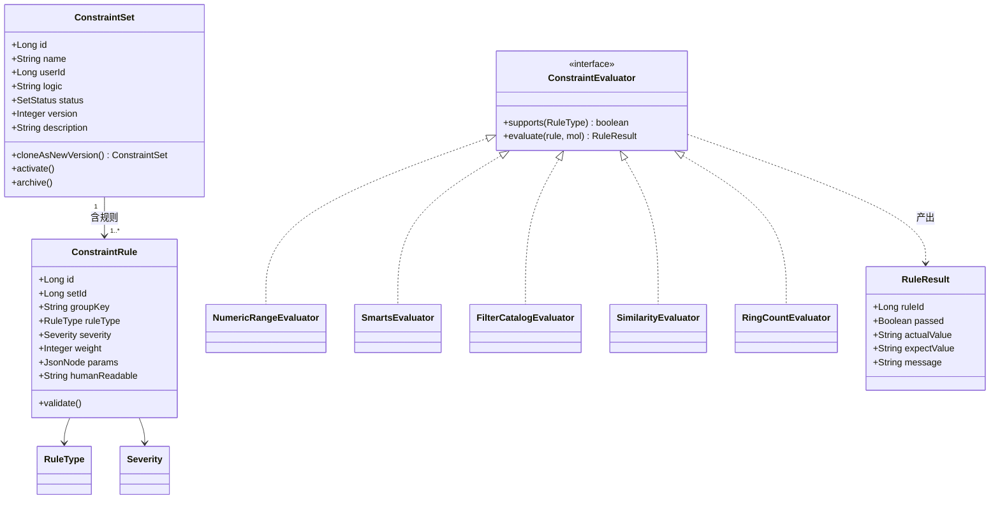
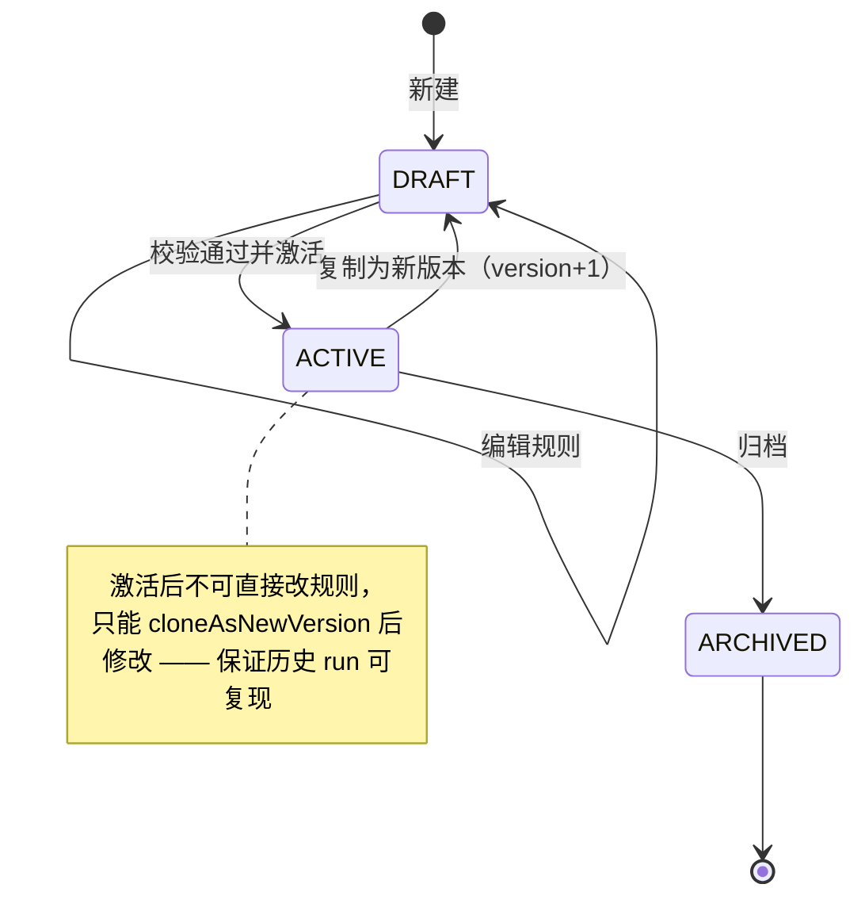
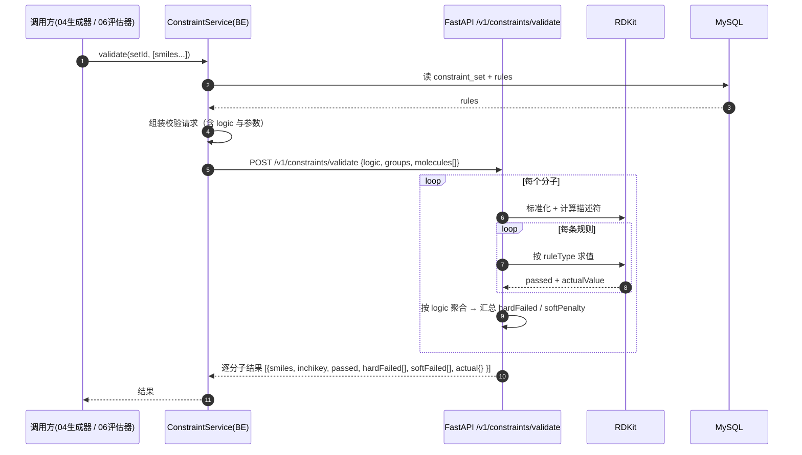
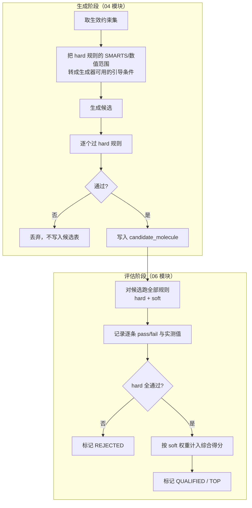

# 03 · 设计约束

> 所属：干实验药物设计平台 · 第一阶段
> 上级文档：`00-总览与架构分工.md`
> 计算侧依赖：**FastAPI**（RDKit 描述符 / SMARTS / FilterCatalog）

---

## 1. 定位

**把"什么样的分子算合格候选"从人的脑中搬到可执行的规则里。**

本模块是**整个平台的判据中枢**，一份约束定义被两处复用：

| 复用点 | 时机 | 作用 |
|---|---|---|
| **生成时引导**（04 模块） | 生成过程中 | 提前淘汰不合格产物，减少无效计算 |
| **评估时过滤**（06 模块） | 评估后 | 输出每条规则的 pass/fail 与实测值，驱动筛选与打分 |

> **设计铁律**：生成与筛选**必须用同一份约束**。否则会出现"按 A 标准生成的分子被 B 标准筛掉"，
> 用户无法解释为什么。这是本模块存在的核心理由。

---

## 2. 约束体系

### 2.1 规则类型（`rule_type`）

| 类型 | 参数 | 说明 | 示例 |
|---|---|---|---|
| `NUMERIC_RANGE` | `field, min, max` | 数值型描述符区间 | `MolWt ∈ [200, 550]` |
| `SMARTS_REQUIRED` | `smarts` | 必须包含某子结构 | 含磺酰胺 `S(=O)(=O)N` |
| `SMARTS_FORBIDDEN` | `smarts` | 禁止包含某子结构 | 禁含 Michael 受体 |
| `SCAFFOLD_REQUIRED` | `smarts` | 骨架必须匹配 | 保留喹唑啉核心 |
| `SCAFFOLD_FORBIDDEN` | `smarts` | 骨架禁止匹配 | — |
| `FILTER_CATALOG` | `catalog, mode` | RDKit 内置警报目录 | `PAINS` / `BRENK` / `NIH` 必须通过 |
| `SIMILARITY_RANGE` | `refSmiles, metric, min, max` | 与参考分子的相似度区间 | Tanimoto ∈ [0.4, 0.8]（相似物设计） |
| `SIMILARITY_TO_SET` | `refSetId, metric, max` | 与某候选集的**多样性**约束 | 与已有候选最大相似度 ≤ 0.85 |
| `RING_COUNT` | `min, max` | 环数 | 芳环 ≥ 1 且总环数 ≤ 5 |
| `SUBSTITUENT_ALLOWED` | `allowedSmarts[]` | R 基团白名单（配合 04 的 R 基枚举） | 只允许 -F/-Cl/-OH/-NH2 |
| `RULE_SET` | `name` | 预置规则组合宏 | `LIPINSKI` / `VEber` / `GHOSE` / `EGAN` |

**支持的 `NUMERIC_RANGE.field`**（由 FastAPI 侧 RDKit 计算）：

`MolWt` `MolLogP` `TPSA` `NumHDonors` `NumHAcceptors` `NumRotatableBonds`
`NumHeavyAtoms` `NumAromaticRings` `FractionCSP3` `QED` `SA_Score` `NumRings` `MolMR`

### 2.2 严重级别（`severity`）

| 级别 | 含义 | 在 06 评估器中的处理 |
|---|---|---|
| `HARD` | 硬性淘汰 | 任一条不过 → 候选标记 `REJECTED` |
| `SOFT` | 软性偏好 | 不过不淘汰，按权重扣分（进入综合得分） |

> **HARD/SOFT 分级是本设计的要点**：没有分级就只能做"一刀切"，无法表达"我更喜欢 LogP 低一点的，但 LogP 高一点也不是不行"。

### 2.3 组合逻辑

顶层 **AND**，组内 **OR**：

```jsonc
{
  "logic": "AND",
  "groups": [
    { "logic": "OR",  "rules": [ {"type":"FILTER_CATALOG","catalog":"PAINS"}, ... ] },
    { "logic": "AND", "rules": [ {"type":"NUMERIC_RANGE","field":"MolWt","min":200,"max":550} ] }
  ]
}
```

> 刻意**不做任意嵌套布尔表达式**：可解释性优先。用户在报告里要能一眼看懂"为什么这个分子被淘汰"。

---

## 3. UML

### 3.1 类图



### 3.2 约束集状态机



### 3.3 时序图：约束校验（生成侧与评估侧同一入口）



### 3.4 活动图：约束的双重角色



---

## 4. 现成工具包

| 用途 | 工具包 / API | 备注 |
|---|---|---|
| 描述符计算 | **RDKit** `Descriptors` / `rdMolDescriptors` | `MolWt` `MolLogP` `TPSA` `NumHDonors` `NumHAcceptors` `NumRotatableBonds` `NumAromaticRings` `FractionCSP3` |
| 成药性打分 | **RDKit** `QED.qed` | 0-1 综合类药性 |
| 合成可及性 | **RDKit Contrib `sascorer`** | 1-10，越小越易合成 |
| 子结构匹配 | **RDKit** `Chem.MolFromSmarts` + `HasSubstructMatch` | SMARTS |
| 骨架提取与匹配 | **RDKit** `Scaffolds.MurckoScaffold` / `MurckoScaffoldSmiles` | 骨架约束 |
| 结构警报目录 | **RDKit** `FilterCatalog`：`PAINS` / `BRENK` / `NIH` / `ZINC` | 假阳性过滤的关键 |
| 分子标准化 | **RDKit** `rdMolStandardize`（`Cleanup`/`FragmentParent`/`Uncharger`/`Normalizer`） | 去盐、中和、互变异构规范化 |
| 指纹与相似度 | **RDKit** `AllChem.GetMorganFingerprintAsBitVect` + `DataStructs.TanimotoSimilarity` | 与 DDI-LLM 现有指纹口径一致 |
| 规则集宏（Lipinski 等） | **RDKit** `FilterCatalog` 内置 + 自实现阈值 | 也可用 `rdkit.Chem.Descriptors.CalcMolDescriptors` 后自判 |
| 结果聚合与统计 | numpy / pandas（已装） | 批量通过率、分布统计 |

> **口径统一**：指纹与相似度**必须**沿用 `DDI-LLM/data_utils.py` 里那份 Morgan 指纹参数（`radius=1`、`nBits=100` 是 DDI 专用；
> 通用相似度建议独立用 `radius=2, nBits=2048`，两者**分开配置**，避免互相污染）。

---

## 5. 数据库设计

### 5.1 `17_constraint_set.sql`

```sql
-- =============================================
-- 干实验药物设计 · 设计约束集
-- 版本：v1.0
-- =============================================
USE synpharm;

CREATE TABLE IF NOT EXISTS constraint_set (
    id          BIGINT PRIMARY KEY AUTO_INCREMENT,
    set_no      VARCHAR(64)  NOT NULL COMMENT '约束集编号 CS+时间戳+随机',
    user_id     BIGINT       NOT NULL COMMENT '归属用户（可跨项目复用）',
    name        VARCHAR(200) NOT NULL COMMENT '如"EGFR 抑制剂类药性+PAINS"',
    description VARCHAR(500)          COMMENT '说明',
    logic       VARCHAR(10)  NOT NULL DEFAULT 'AND' COMMENT '顶层逻辑，固定 AND',
    status      VARCHAR(20)  NOT NULL DEFAULT 'DRAFT' COMMENT 'DRAFT/ACTIVE/ARCHIVED',
    version     INT          NOT NULL DEFAULT 1 COMMENT '版本号，激活后修改须 +1',
    parent_id   BIGINT                COMMENT '版本来源（clone 自哪个约束集）',
    deleted     TINYINT      NOT NULL DEFAULT 0,
    created_at  DATETIME     NOT NULL DEFAULT CURRENT_TIMESTAMP,
    updated_at  DATETIME     NOT NULL DEFAULT CURRENT_TIMESTAMP ON UPDATE CURRENT_TIMESTAMP,
    UNIQUE KEY uk_set_no (set_no),
    KEY idx_user_status (user_id, status),
    CONSTRAINT fk_cs_parent FOREIGN KEY (parent_id) REFERENCES constraint_set(id)
) ENGINE=InnoDB DEFAULT CHARSET=utf8mb4 COLLATE=utf8mb4_unicode_ci COMMENT='设计约束集';
```

### 5.2 `18_constraint_rule.sql`

```sql
CREATE TABLE IF NOT EXISTS constraint_rule (
    id             BIGINT PRIMARY KEY AUTO_INCREMENT,
    set_id         BIGINT       NOT NULL,
    group_key      VARCHAR(20)  NOT NULL DEFAULT 'G1'
                   COMMENT '逻辑分组；同一 group_key 内按 group_logic 组合',
    group_logic    VARCHAR(10)  NOT NULL DEFAULT 'AND' COMMENT '该组的组内逻辑 AND/OR',
    rule_type      VARCHAR(30)  NOT NULL
                   COMMENT 'NUMERIC_RANGE/SMARTS_REQUIRED/SMARTS_FORBIDDEN/SCAFFOLD_REQUIRED/'
                           'SCAFFOLD_FORBIDDEN/FILTER_CATALOG/SIMILARITY_RANGE/SIMILARITY_TO_SET/'
                           'RING_COUNT/SUBSTITUENT_ALLOWED/RULE_SET',
    severity       VARCHAR(10)  NOT NULL DEFAULT 'HARD' COMMENT 'HARD 淘汰 / SOFT 扣分',
    weight         INT          NOT NULL DEFAULT 10 COMMENT 'SOFT 规则的扣分权重',
    params_json    JSON         NOT NULL COMMENT '规则参数，结构随 rule_type 而定',
    human_readable VARCHAR(500)          COMMENT '人类可读描述，直接展示给用户',
    sort_no        INT          NOT NULL DEFAULT 0,
    enabled        TINYINT      NOT NULL DEFAULT 1,
    created_at     DATETIME     NOT NULL DEFAULT CURRENT_TIMESTAMP,
    KEY idx_set_group (set_id, group_key, sort_no),
    CONSTRAINT fk_cr_set FOREIGN KEY (set_id) REFERENCES constraint_set(id) ON DELETE CASCADE
) ENGINE=InnoDB DEFAULT CHARSET=utf8mb4 COLLATE=utf8mb4_unicode_ci COMMENT='约束规则';
```

**`params_json` 示例**：

```jsonc
// NUMERIC_RANGE
{"field":"MolWt","min":200,"max":550}
// SMARTS_REQUIRED
{"smarts":"S(=O)(=O)N","name":"磺酰胺"}
// FILTER_CATALOG
{"catalog":"PAINS","mode":"must_pass"}
// SIMILARITY_RANGE（相似物设计）
{"refSmiles":"CC(=O)Oc1ccccc1C(=O)O","metric":"TANIMOTO","min":0.4,"max":0.8}
// SUBSTITUENT_ALLOWED（配合 04 的 R 基枚举）
{"allowedSmarts":["[F,Cl,Br,I]","[OH]","[NH2]","[C;H3]"]}
```

---

## 6. 接口设计

### 6.1 SpringBoot 对外

| 方法 | 路径 | 说明 |
|---|---|---|
| `GET` | `/api/design/constraints` | 我的约束集列表 |
| `POST` | `/api/design/constraints` | 新建（含规则，一次性提交） |
| `GET` | `/api/design/constraints/{id}` | 详情（含规则） |
| `PUT` | `/api/design/constraints/{id}` | 编辑（仅 `DRAFT` 可改） |
| `POST` | `/api/design/constraints/{id}/clone` | 复制为新版本（`version+1`） |
| `POST` | `/api/design/constraints/{id}/activate` | 激活（先做一次自检） |
| `POST` | `/api/design/constraints/{id}/archive` | 归档 |
| `POST` | `/api/design/constraints/{id}/validate` | **对手工输入的分子做即时预览校验**（前端实时反馈） |
| `GET` | `/api/design/constraints/meta` | 可用的 `rule_type` / `field` / `catalog` 枚举（驱动前端表单） |

**新增错误码**：

| 错误码 | HTTP | 语义 |
|---|---|---|
| `CONSTRAINT_SET_NOT_FOUND` | 404 | 不存在或非本人 |
| `CONSTRAINT_SET_NOT_EDITABLE` | 409 | 非 DRAFT 状态不可直接编辑 |
| `CONSTRAINT_RULE_INVALID` | 400 | SMARTS 非法 / 参数缺失 / 区间倒置 |
| `CONSTRAINT_SET_EMPTY` | 409 | 无启用规则，不可激活 |

### 6.2 FastAPI 计算端点

| 方法 | 路径 | 入参 | 出参 |
|---|---|---|---|
| `POST` | `/v1/constraints/validate` | `{logic, groups[], molecules:[{smiles}\|{inchikey}]}` | 逐分子 `{passed, hardFailed[], softFailed[], softPenalty, actualMap}` |
| `POST` | `/v1/molecules/descriptors` | `{smilesList, fields[]}` | 描述符矩阵（供 06 评估器复用，避免重复计算） |
| `POST` | `/v1/molecules/standardize` | `{smilesList, rules?}` | 标准化后的 SMILES + InChIKey（**全平台统一入口**） |

> `/v1/molecules/standardize` 是全平台**唯一**的分子规范化入口：02（结构配体）、03（约束）、04（生成产物）、06（评估）都要先过它。
> 这同时修掉了 DDI 转换层"SMILES 精确哈希匹配脆弱"的隐患。

---

## 7. 关键设计点

| 点 | 说明 |
|---|---|
| **一份定义两处执行** | 生成与评估共用同一 `constraint_set`，杜绝标准不一致 |
| **HARD / SOFT 分级** | 硬淘汰 vs 软扣分；`weight` 参与 06 的综合得分 |
| **可解释优先** | 每条规则产出 `actualValue` + `expectedValue` + 中文说明，报告里能直接展示"为什么没过" |
| **激活后不可改** | 只能 clone 新版本；保证历史 `generation_run` / `evaluation_run` 可复现（对齐 00 文档"流程可数据化"约束） |
| **组内 OR 的表达力** | 用 `group_key + group_logic` 实现"（PAINS 通过）AND（分子量在区间 OR 与参考分子相似度在区间）"，不做任意嵌套 |
| **前端表单驱动** | `GET /meta` 返回可用枚举，前端按 `rule_type` 动态渲染参数表单，新增规则类型无需改前端 |
| **描述符缓存** | 同一分子在同一 run 内的描述符只算一次（FastAPI 侧按 InChIKey 做请求内 LRU） |
| **二阶段衔接** | 对应工具 `constraint_validate`；`human_readable` 直接作为工具描述的一部分给 LLM 看 |
