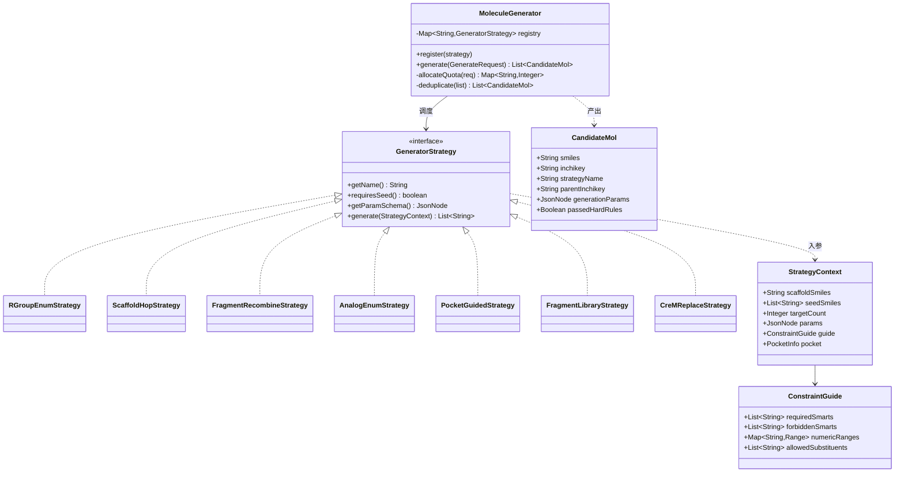
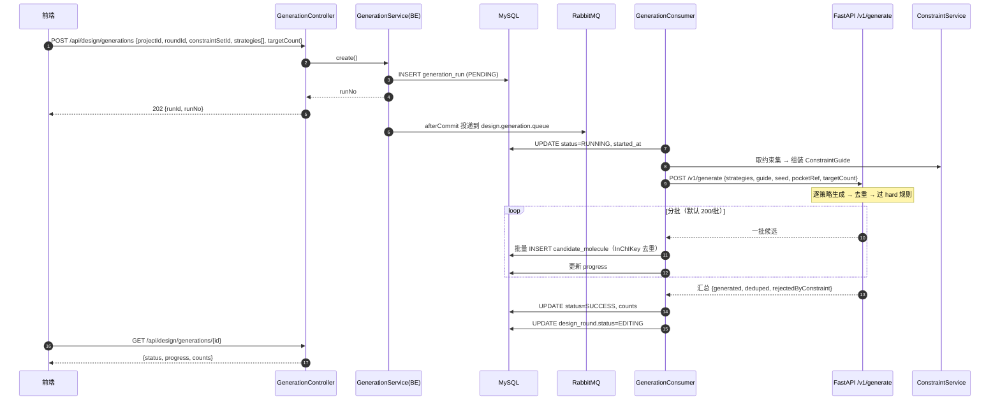
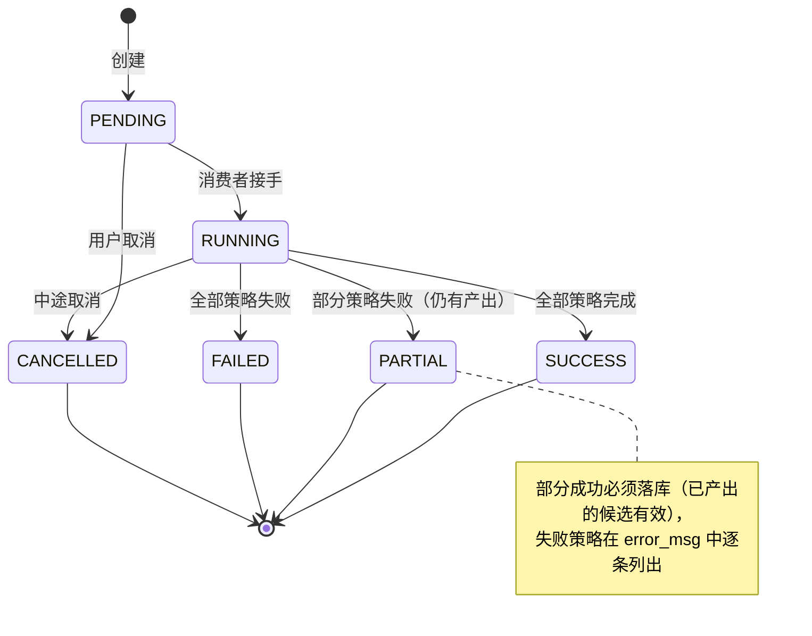
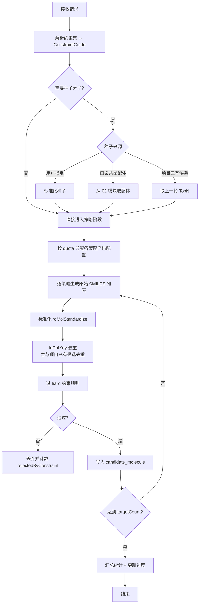

# 04 · 分子生成器

> 所属：干实验药物设计平台 · 第一阶段
> 上级文档：`00-总览与架构分工.md`
> 计算侧依赖：**FastAPI**（RDKit / CReM）— 本项目**目前完全没有生成能力**，本模块是最大新增块

---

## 1. 定位

**按约束产出候选分子。** 这是"构建药物"的本体动作。

**核心决策：第一阶段不引入生成模型。**

| 路线 | 成本 | 第一阶段采用 |
|---|---|---|
| **确定性枚举**（R 基/骨架/片段/相似物） | RDKit 已装，**零新模型** | ✅ 全部 |
| 口袋引导的规则化生成 | 少量规则代码 | ✅ |
| 深度学习生成（VAE / diffusion / RL） | 需新模型 + 训练数据 | ❌ 留待 P2 |

理由：确定性枚举**可解释、可复现、可控**，且已足够支撑"手动设计闭环"。
生成模型会引入"为什么生成这个分子"无法回答的问题，在答辩场景反而是负担。

---

## 2. 生成策略清单

| # | 策略 | 实现 | 需要新模型 | 适用场景 |
|---|---|---|---|---|
| S1 | **R 基团枚举** | RDKit `rdRGroupDecomposition` 拆骨架，按 `SUBSTITUENT_ALLOWED` 白名单枚举取代基 | ❌ | 已有骨架，批量换侧链 |
| S2 | **骨架修饰 / 生物等排体替换** | RDKit `RWMol` 原子/键替换 + 等排体映射表（`-COOH↔四氮唑`、`苯环↔吡啶`） | ❌ | 保留活性、改性质 |
| S3 | **片段替换 / 生长（BRICS / RECAP）** | RDKit `BRICS.BreakBRICSBonds` / `Recap.RecapDecompose` 拆片段 → 重组 | ❌ | 骨架跳跃、拼接 |
| S4 | **相似物枚举（已知配体出发）** | 以参考分子为中心，用 S1/S2/S3 组合生成近邻 | ❌ | 从已知抑制剂优化 |
| S5 | **口袋引导的定向修饰** | 取 02 模块口袋残基（如 MET793 氢键供体）→ 选择互补官能团 | ❌ | 提升结合、最有说服力 |
| S6 | **片段库随机组合** | 内置片段库（-F/-Cl/-OH/-NH2/-CN/-CF3/…）随机连接 | ❌ | 探索多样性 |
| S7 | 深度学习生成 | REINVENT / MolMIM / SAFE | ✅ | P2 |

**依赖 CReM 的增强**：S3/S4 的"片段替换"可用 **CReM**（`pip install crem`）显著增强 ——
它自带片段库并按"环境匹配"替换，比裸 BRICS 重组更合理。

---

## 3. UML

### 3.1 类图（策略模式 + 注册表）



### 3.2 时序图：一次生成任务（异步 + 分批回写）



### 3.3 状态机：生成任务



### 3.4 活动图：生成内部流水线



---

## 4. 现成工具包

| 用途 | 工具包 / API | 状态 | 备注 |
|---|---|---|---|
| **R 基团分解** | RDKit `rdRGroupDecomposition` | ✅ 已装 | S1 核心；需先定义核心骨架 |
| **骨架提取** | RDKit `Scaffolds.MurckoScaffold` | ✅ 已装 | 自动求核心骨架 |
| **片段分解** | RDKit `Chem.BRICS.BreakBRICSBonds` | ✅ 已装 | S3 |
| **片段分解（另一套规则）** | RDKit `Chem.Recap.RecapDecompose` | ✅ 已装 | S3 备选，规则更严格 |
| **原子/键级编辑** | RDKit `Chem.RWMol` | ✅ 已装 | S2 骨架修饰必需 |
| **结构式解析/输出** | RDKit `Chem.MolFromSmiles` / `MolToSmiles` / `MolToSmiles(isomeric)` | ✅ 已装 | — |
| **标准化** | RDKit `rdMolStandardize`（`FragmentParent` / `Uncharger` / `Normalizer` / `TautomerEnumerator`） | ✅ 已装 | S1-S6 输出统一入口 |
| **子结构匹配** | RDKit `HasSubstructMatch` | ✅ 已装 | 过 hard 规则的 SMARTS |
| **描述符校验** | RDKit `Descriptors` | ✅ 已装 | 过 hard 规则的数值区间 |
| **去重键** | RDKit `Chem.MolToInchiKey` | ✅ 已装 | 14 位骨架键 |
| **片段替换增强** | **CReM** `pip install crem` | 🆕 建议 | S3/S4 质量提升明显；纯 Python，无编译依赖 |
| **合成可及性预筛** | RDKit Contrib `sascorer` | ✅ 随 RDKit | 生成时可直接丢弃 SA>6 的产物 |
| **等排体映射表** | 自建 `resources/design/bioisostere.json` | 🆕 | S2 需要，约 50 组常见等排体 |
| **片段库** | 自建 `resources/design/fragments.smi` | 🆕 | S6 需要，建议从 ChEMBL 常见片段抽取 200-500 条 |
| **并行加速** | Python `concurrent.futures` / `multiprocessing` | ✅ 标准库 | RDKit 为 C++ 扩展，多进程并行有效 |

> **对接输入准备**（若 S5 需要对接打分）：**Meeko** + **Open Babel** —— 见 06 模块，本模块只产出 SMILES。

---

## 5. 数据库设计

### 5.1 `19_generation_run.sql`

```sql
-- =============================================
-- 干实验药物设计 · 分子生成任务
-- 版本：v1.0
-- =============================================
USE synpharm;

CREATE TABLE IF NOT EXISTS generation_run (
    id                    BIGINT PRIMARY KEY AUTO_INCREMENT,
    run_no                VARCHAR(64)  NOT NULL COMMENT '生成任务编号 G+时间戳+随机',
    project_id            BIGINT       NOT NULL,
    round_id              BIGINT       NOT NULL,
    user_id               BIGINT       NOT NULL,
    constraint_set_id     BIGINT                COMMENT '使用的约束集（快照语义：存 ID + 复制 humanReadable）',
    constraint_snapshot   JSON                  COMMENT '约束的人可读快照，保证历史可解释',
    strategies            VARCHAR(500) NOT NULL COMMENT '策略名列表，逗号分隔，如 "R_GROUP,FRAGMENT_RECOMBINE"',
    strategy_params       JSON                  COMMENT '各策略参数与配额',
    seed_json             JSON                  COMMENT '种子来源，如 {"type":"POCKET_LIGAND","pocketId":12}',
    pocket_id             BIGINT                COMMENT '口袋引导时使用的口袋',
    target_count          INT          NOT NULL DEFAULT 100 COMMENT '目标产出数',
    generated_count       INT          NOT NULL DEFAULT 0 COMMENT '原始生成数',
    deduped_count         INT          NOT NULL DEFAULT 0 COMMENT '去重后数',
    rejected_count        INT          NOT NULL DEFAULT 0 COMMENT '被 hard 规则淘汰数',
    final_count           INT          NOT NULL DEFAULT 0 COMMENT '最终落库候选数',
    status                VARCHAR(20)  NOT NULL DEFAULT 'PENDING'
                          COMMENT 'PENDING/RUNNING/SUCCESS/PARTIAL/FAILED/CANCELLED',
    progress              DECIMAL(5,2) NOT NULL DEFAULT 0.00,
    error_msg             VARCHAR(1000)         COMMENT '失败/部分失败的逐策略原因',
    latency_ms            INT,
    started_at            DATETIME,
    completed_at          DATETIME,
    deleted               TINYINT      NOT NULL DEFAULT 0,
    created_at            DATETIME     NOT NULL DEFAULT CURRENT_TIMESTAMP,
    UNIQUE KEY uk_run_no (run_no),
    KEY idx_round (round_id),
    KEY idx_project_status (project_id, status),
    CONSTRAINT fk_gen_project FOREIGN KEY (project_id) REFERENCES design_project(id),
    CONSTRAINT fk_gen_round   FOREIGN KEY (round_id)   REFERENCES design_round(id)
) ENGINE=InnoDB DEFAULT CHARSET=utf8mb4 COLLATE=utf8mb4_unicode_ci COMMENT='分子生成任务';
```

### 5.2 `20_candidate_molecule.sql`

```sql
CREATE TABLE IF NOT EXISTS candidate_molecule (
    id               BIGINT PRIMARY KEY AUTO_INCREMENT,
    project_id       BIGINT       NOT NULL COMMENT '冗余，便于按项目查询',
    round_id         BIGINT                COMMENT '产生于哪一轮（编辑产物为此轮）',
    origin_run_id    BIGINT                COMMENT '若由生成产生，指向 generation_run',
    smiles           VARCHAR(2000) NOT NULL COMMENT '标准化后的 SMILES',
    inchikey         CHAR(27)     NOT NULL COMMENT '标准化 InChIKey，去重键',
    canonical_smiles VARCHAR(2000)         COMMENT 'RDKit canonical（展示用）',
    molecule_name    VARCHAR(200)          COMMENT '可选名称',
    origin_type      VARCHAR(20)  NOT NULL DEFAULT 'GENERATED'
                     COMMENT 'GENERATED/EDITED/IMPORTED/SEED',
    strategy_name    VARCHAR(40)           COMMENT '生成策略名（origin_type=GENERATED 时）',
    parent_mol_id    BIGINT                COMMENT '编辑来源的父候选（origin_type=EDITED 时）',
    generation_params JSON                 COMMENT '该分子的生成参数（策略内部参数，保证可复现）',
    mw               DECIMAL(9,3)          COMMENT '分子量（冗余，便于排序）',
    logp             DECIMAL(7,3)          COMMENT 'LogP（冗余，便于排序）',
    sa_score         DECIMAL(5,2)          COMMENT '合成可及性（冗余）',
    qed              DECIMAL(5,4)          COMMENT 'QED（冗余）',
    hard_passed      TINYINT      NOT NULL DEFAULT 1 COMMENT '是否通过全部 hard 约束',
    review_status    VARCHAR(20)  NOT NULL DEFAULT 'NEW'
                     COMMENT 'NEW/QUALIFIED/REJECTED/TOP/SELECTED',
    batch_tag        VARCHAR(60)           COMMENT '用户打的标签',
    note             VARCHAR(500)          COMMENT '用户备注',
    deleted          TINYINT      NOT NULL DEFAULT 0,
    created_at       DATETIME     NOT NULL DEFAULT CURRENT_TIMESTAMP,
    updated_at       DATETIME     NOT NULL DEFAULT CURRENT_TIMESTAMP ON UPDATE CURRENT_TIMESTAMP,
    UNIQUE KEY uk_project_inchikey (project_id, inchikey),
    KEY idx_round (round_id),
    KEY idx_run (origin_run_id),
    KEY idx_review (project_id, review_status),
    KEY idx_sort_mw (project_id, mw),
    CONSTRAINT fk_cand_project FOREIGN KEY (project_id) REFERENCES design_project(id),
    CONSTRAINT fk_cand_parent  FOREIGN KEY (parent_mol_id) REFERENCES candidate_molecule(id)
) ENGINE=InnoDB DEFAULT CHARSET=utf8mb4 COLLATE=utf8mb4_unicode_ci COMMENT='候选分子';
```

> 💡 **`uk_project_inchikey` 是去重的唯一权威**：同一项目内相同 InChIKey 只能有一条。
> 因此"生成时去重"与"编辑后与已有比"用同一个约束，数据库层兜底防并发重复。
>
> 💡 **`mw/logp/sa_score/qed` 冗余存一份**：排序与筛选面板要按这些字段翻页，避免每次调 FastAPI 重算。
> 它们的权威来源仍是 06 评估器，此处只做缓存。

---

## 6. 接口设计

### 6.1 SpringBoot 对外

| 方法 | 路径 | 说明 |
|---|---|---|
| `POST` | `/api/design/generations` | 创建生成任务（异步） |
| `GET` | `/api/design/generations/{id}` | 任务状态与统计 |
| `GET` | `/api/design/generations` | 项目/轮次下的生成历史 |
| `POST` | `/api/design/generations/{id}/cancel` | 取消 |
| `GET` | `/api/design/candidates` | 候选列表（按 `roundId`/`reviewStatus`/排序字段筛选，分页） |
| `GET` | `/api/design/candidates/{id}` | 候选详情（含生成参数与评估结果） |
| `PUT` | `/api/design/candidates/{id}/review` | 改评审状态（`QUALIFIED`/`REJECTED`/`TOP`/`SELECTED`）+ 标签备注 |
| `POST` | `/api/design/candidates/import` | 手工导入 SMILES（`origin_type=IMPORTED`） |
| `GET` | `/api/design/candidates/export` | 导出（CSV / SDF） |
| `POST` | `/api/design/candidates/{id}/regenerate` | 以该分子为新种子重跑生成 |

**新增错误码**：

| 错误码 | HTTP | 语义 |
|---|---|---|
| `GENERATION_RUN_NOT_FOUND` | 404 | 任务不存在或非本人 |
| `GENERATION_NO_STRATEGY` | 400 | 未指定任何策略 |
| `GENERATION_SEED_REQUIRED` | 400 | 所选策略需要种子但未提供 |
| `GENERATION_RUN_ALREADY_ACTIVE` | 409 | 同轮次已有运行中的生成任务 |
| `CANDIDATE_DUPLICATED` | 409 | 导入的分子已存在（返回已存在的 id） |

### 6.2 FastAPI 计算端点

| 方法 | 路径 | 入参 | 出参 |
|---|---|---|---|
| `POST` | `/v1/generate` | `{strategies[], guide, seed, pocketRef, targetCount, batchSize}` | 分批候选流 + 汇总统计 |
| `POST` | `/v1/generate/preview` | 同上，`targetCount≤20` | 同步返回（前端"预览生成"按钮） |
| `GET` | `/v1/generate/strategies` | — | 可用策略及其 `paramSchema`（驱动前端参数表单） |
| `POST` | `/v1/molecules/scaffold` | `{smiles}` | Murcko 骨架 + R 基团分解结果 |

**超时与配额**：单策略超时 120s；`targetCount` 上限 5000（可通过配置调整）；
去重与 hard 过滤在 FastAPI 侧**边生成边做**，避免把无效分子传回后端。

---

## 7. 关键设计点

| 点 | 说明 |
|---|---|
| **第一阶段不引生成模型** | 确定性枚举可解释、可复现；模型生成留 P2 |
| **去重键统一 InChIKey** | 标准化 → InChIKey → 与项目已有候选去重 → DB 唯一键兜底 |
| **约束前置过滤** | hard 规则在生成侧就过一遍，不入库，减少后续无谓计算 |
| **配额分配** | 多策略组合时按 `quota` 分配目标数（默认均分，可配置权重） |
| **来源可追溯** | `origin_type` + `strategy_name` + `generation_params` + `parent_mol_id` 保证每个分子都能回答"它怎么来的" |
| **种子来源三选一** | 用户指定 / 口袋共晶配体 / 上一轮 TopN —— 与 01 轮次机制天然衔接 |
| **PARTIAL 而非 FAIL** | 多策略下一个失败不应整体失败；已产出候选有效，失败原因逐条落 `error_msg` |
| **约束快照** | `constraint_snapshot` 存人可读版本，避免约束集升版本后历史 run 无法解释 |
| **分批回写** | 每批 200 条回写 DB 并更新进度，前端可看到"已生成 N 个"而不是干等 |
| **二阶段衔接** | 对应工具 `molecule_generate`；`strategies` + `guide` 即工具的 `parameters` schema；RePlan 时 Planner 只需换 `strategies` 或改 `guide` |
