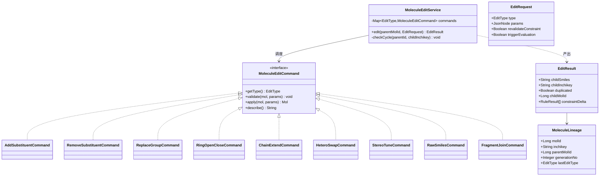
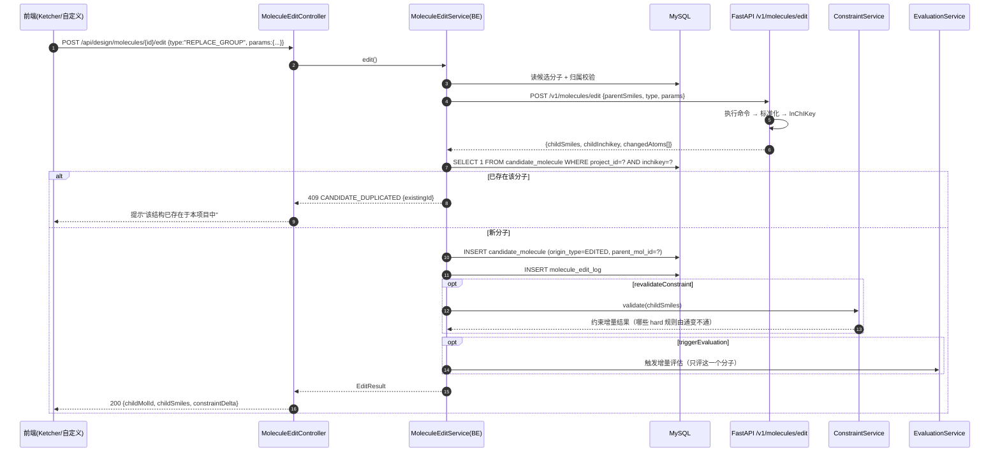
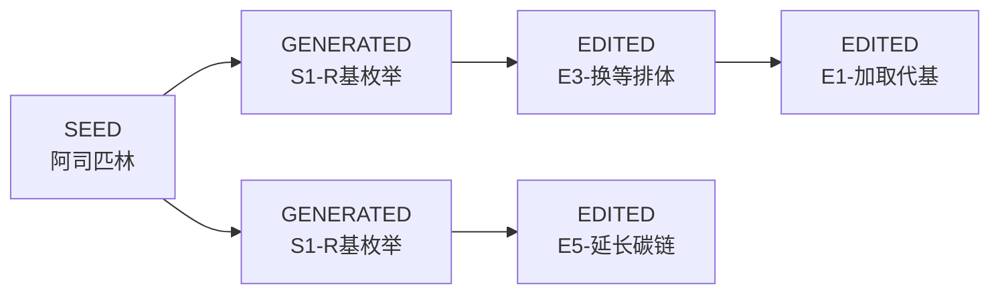

# 05 · 分子编辑器

> 所属：干实验药物设计平台 · 第一阶段
> 上级文档：`00-总览与架构分工.md`
> 计算侧依赖：**FastAPI**（RDKit 结构操作）；前端依赖 **2D 结构编辑器**

---

## 1. 定位

**对单个候选做"微调"，并完整保留父子关系与编辑历史。**

与 04 生成器的区别：

| | 04 生成器 | 05 编辑器 |
|---|---|---|
| 操作对象 | 骨架 / 片段 / 种子集合 | **单个分子** |
| 操作粒度 | 批量、策略驱动 | 单点、手工精确 |
| 人的角色 | 选策略、看结果 | **直接改结构** |
| 产出 | 一批候选 | 一个子分子（及其谱系） |

> **这就是"手动操作构建药物"最直接的体现** —— 用户点着结构改原子，而不是只填参数。

---

## 2. 编辑操作清单

| # | 操作 | 语义 | RDKit 实现要点 |
|---|---|---|---|
| E1 | **加取代基** | 在指定原子/环位置上挂官能团 | `RWMol.AddAtom` + `AddBond`，官能团来自 `SUBSTITUENT_ALLOWED` 白名单 |
| E2 | **删取代基** | 移除某基团，补氢 | `RWMol.RemoveAtom`（注意删除后索引偏移） |
| E3 | **替换官能团 / 生物等排体** | `-COOH → 四氮唑`、`-H → -F` 等 | 子结构匹配 + 原子替换 + 键级调整 |
| E4 | **环开环 / 闭环** | 苯环 → 环己烷、开链 → 成环 | `RWMol` 增删键 + `Chem.SanitizeMol` |
| E5 | **同系物延长 / 缩短** | 碳链 ±CH2 | 在连接点插入/删除碳原子 |
| E6 | **环上杂原子替换** | 苯 → 吡啶、呋喃 | 替换原子符号 + 重新芳香化 |
| E7 | **立体/电荷调整** | 指定手性、成盐转游离碱 | `AssignStereochemistry`、`rdMolStandardize.Uncharger` |
| E8 | **手工 SMILES 编辑** | 直接文本框改字符串 | 解析 + 标准化 + 与已有候选去重 |
| E9 | **两分子拼接** | 把两个候选的片段接起来 | 选断点 + `RWMol` 组合（本质是 S3 的手工版） |

> **撤销/重做**：操作以**命令模式**实现，前端维护撤销栈；后端只落最终结果与操作记录。

---

## 3. UML

### 3.1 类图（命令模式）



### 3.2 时序图：一次编辑



### 3.3 活动图：编辑校验与去重

```mermaid
flowchart TD
    A[用户提交编辑] --> B[解析命令类型与参数]
    B --> C{参数合法?}
    C -- 否 --> D[400 参数错误，前端不改变画布]
    C -- 是 --> E[在父分子上执行命令 → 新结构]
    E --> F[SanitizeMol 校验化学合法性]
    F --> G{合法?}
    G -- 否 --> H[400 结构不合法，提示具体原因]
    G -- 是 --> I[标准化 + 计算 InChIKey]
    I --> J{与父分子相同?}
    J -- 是 --> K[提示"编辑未产生变化"]
    J -- 否 --> L{项目内已有该 InChIKey?}
    L -- 是 --> M[409 返回已存在的候选，前端跳转]
    L -- 否 --> N[落库 candidate_molecule]
    N --> O[落库 molecule_edit_log]
    O --> P[重跑 hard 约束：对比父子差异]
    P --> Q{hard 结果由通变不通?}
    Q -- 是 --> R[前端高亮提示"该编辑使 X 规则不再满足"]
    Q -- 否 --> S[可选触发增量评估]
    R --> S
    S --> T[更新画布与谱系树]
```

### 3.4 类图：分子谱系（父子链）



> 谱系用 `candidate_molecule.parent_mol_id` 自关联表达；
> 前端以树/图渲染，是"我们是怎么一步步改出这个分子的"的直接证据。

---

## 4. 现成工具包

### 4.1 后端计算侧（FastAPI）

| 用途 | 工具包 | 状态 | 备注 |
|---|---|---|---|
| 原子/键级编辑 | **RDKit** `Chem.RWMol` | ✅ 已装 | E1–E6、E9 的核心 |
| 子结构定位 | RDKit `GetSubstructMatches` | ✅ 已装 | E2/E3 找目标原子 |
| 芳香化/价键校验 | RDKit `Chem.SanitizeMol` | ✅ 已装 | 每次编辑后必调 |
| 立体化学 | RDKit `AssignStereochemistryFrom3D` / `FindMolChiralCenters` | ✅ 已装 | E7 |
| 标准化与去盐 | RDKit `rdMolStandardize.Uncharger` / `FragmentParent` | ✅ 已装 | E7/E8 |
| 等排体映射 | 自建 `resources/design/bioisostere.json` | 🆕 | E3 与 04 的 S2 **共用同一份表** |
| 格式转换 | **Open Babel**（`pybel`） | 🆕 | 与外部工具交换（SDF/MOL2/PDBQT） |

### 4.2 前端 2D 结构编辑器（关键选型）

| 方案 | 许可 | 优点 | 缺点 | 建议 |
|---|---|---|---|---|
| **Ketcher**（EPAM） | Apache-2.0 | 功能最全；支持 SMILES/SDF/InChI；可嵌 React/Vue；有独立 `ketcher-standalone` 包，**纯前端无需服务** | 包体较大（约 5–8 MB） | ⭐ **首选** |
| **Kekule.js** | MIT | 轻量；API 简洁；支持 SMILES 解析与 2D 渲染 | 编辑交互弱于 Ketcher | 备选 |
| **JSME** | BSD | 经典分子编辑器，交互成熟 | 较老，样式与 Vue3 集成需适配 | 备选 |
| **Mol\*（已有）** | MIT | 3D 渲染强 | **不支持 2D 结构编辑** | 仅用于 3D 展示，不作编辑器 |
| **RDKit-JS** | BSD | 前端本地做化学校验（无需请求后端） | 仅校验与转换，无编辑 UI | 作为 Ketcher 的校验补充 |

> **推荐组合**：Ketcher 做编辑 UI → 导出 SMILES → 调后端 `/v1/molecules/edit` 做权威校验与落库。
> 前端本地校验（RDKit-JS）只用于即时反馈，**权威结论始终来自 FastAPI**。

---

## 5. 数据库设计

### 5.1 `21_molecule_edit_log.sql`

```sql
-- =============================================
-- 干实验药物设计 · 分子编辑历史
-- 版本：v1.0
-- =============================================
USE synpharm;

CREATE TABLE IF NOT EXISTS molecule_edit_log (
    id              BIGINT PRIMARY KEY AUTO_INCREMENT,
    project_id      BIGINT        NOT NULL,
    round_id        BIGINT                 COMMENT '编辑发生在哪一轮',
    parent_mol_id   BIGINT                 COMMENT '父候选；手工导入时为 NULL',
    child_mol_id    BIGINT        NOT NULL COMMENT '编辑产物候选',
    edit_type       VARCHAR(30)   NOT NULL
                    COMMENT 'ADD_SUBSTITUENT/REMOVE_SUBSTITUENT/REPLACE_GROUP/RING_OPEN_CLOSE/'
                            'CHAIN_EXTEND/HETERO_SWAP/STEREO_TUNE/RAW_SMILES/FRAGMENT_JOIN',
    params_json     JSON          NOT NULL COMMENT '操作参数，如 {"atomIdx":12,"group":"[OH]"}',
    parent_smiles   VARCHAR(2000) NOT NULL COMMENT '编辑前 SMILES（快照）',
    child_smiles    VARCHAR(2000) NOT NULL COMMENT '编辑后 SMILES（快照）',
    changed_atoms   JSON                   COMMENT '发生变化的原子索引与前后值，供前端高亮',
    describe_text   VARCHAR(500)           COMMENT '人类可读描述，如"在 12 位 N 上添加羟基"',
    valid           TINYINT       NOT NULL DEFAULT 1 COMMENT '化学合法性校验是否通过',
    error_msg       VARCHAR(500),
    operator_id     BIGINT        NOT NULL COMMENT '谁改的（人 或 二阶段的智能体）',
    operator_type   VARCHAR(20)   NOT NULL DEFAULT 'USER' COMMENT 'USER/AGENT（二阶段用）',
    latency_ms      INT,
    created_at      DATETIME      NOT NULL DEFAULT CURRENT_TIMESTAMP,
    KEY idx_project_round (project_id, round_id, created_at),
    KEY idx_parent (parent_mol_id),
    KEY idx_child (child_mol_id),
    CONSTRAINT fk_mel_parent FOREIGN KEY (parent_mol_id) REFERENCES candidate_molecule(id),
    CONSTRAINT fk_mel_child  FOREIGN KEY (child_mol_id)  REFERENCES candidate_molecule(id)
) ENGINE=InnoDB DEFAULT CHARSET=utf8mb4 COLLATE=utf8mb4_unicode_ci COMMENT='分子编辑历史';
```

> 💡 `operator_type` 预留了 `AGENT`：二阶段智能体改分子时，历史记录与人工操作**共用同一张表**，
> 只是在 UI 上用不同颜色区分"人改的"与"智能体改的"。这是二阶段可解释性的重要基础。

---

## 6. 接口设计

### 6.1 SpringBoot 对外

| 方法 | 路径 | 说明 |
|---|---|---|
| `POST` | `/api/design/molecules/{id}/edit` | 执行一次编辑 |
| `POST` | `/api/design/molecules/{id}/edit/preview` | 只预览产物，不落库（前端实时反馈） |
| `GET` | `/api/design/molecules/{id}/history` | 该分子的编辑历史 |
| `GET` | `/api/design/molecules/{id}/lineage` | 谱系树（向上追父、向下追子） |
| `POST` | `/api/design/molecules/{id}/revert` | 以某个祖先为父重新建立分支 |
| `GET` | `/api/design/edit-ops/meta` | 可用操作类型 + 参数 schema（驱动前端） |

**新增错误码**：

| 错误码 | HTTP | 语义 |
|---|---|---|
| `MOLECULE_NOT_FOUND` | 404 | 候选不存在或非本人 |
| `MOLECULE_EDIT_INVALID` | 400 | 参数非法 / 结构不合法 / Sanitize 失败 |
| `MOLECULE_EDIT_NO_CHANGE` | 400 | 编辑未产生任何变化 |
| `MOLECULE_DUPLICATED` | 409 | 产物已存在于本项目（响应携带既有 `existingId`） |
| `MOLECULE_LINEAGE_CYCLE` | 409 | 会造成谱系成环 |

### 6.2 FastAPI 计算端点

| 方法 | 路径 | 入参 | 出参 |
|---|---|---|---|
| `POST` | `/v1/molecules/edit` | `{parentSmiles, type, params}` | `{childSmiles, childInchikey, changedAtoms, describe}` |
| `POST` | `/v1/molecules/edit/validate` | `{smiles}` | `{valid, issues[], canonicalSmiles, inchikey}` |
| `POST` | `/v1/molecules/edit/suggest` | `{smiles, pocketRef?}` | 建议的可编辑位点（可加取代基的原子/环位置）⭐ |
| `POST` | `/v1/molecules/join` | `{smilesA, smilesB, breakPointA?, breakPointB?}` | 拼接产物 |

> `edit/suggest` 是提升可用性的关键：编辑器里直接**高亮"这些位置可以改"**，
> 例如优先推荐口袋边缘暴露的原子（与 02 模块口袋残基联动）。

---

## 7. 关键设计点

| 点 | 说明 |
|---|---|
| **命令模式** | 每种编辑独立成 `Command` 实现，新增操作类型不动核心逻辑；同时支撑前端撤销/重做 |
| **父分子不可变** | 编辑**只新增**子分子，绝不原地改父分子 —— 保证谱系与历史可追溯 |
| **去重与生成共用规则** | 与 04 生成器共用 `uk_project_inchikey`，编辑产物与生成产物在同一空间去重 |
| **谱系防环** | `checkCycle` 在落库前校验，避免 A→B→A |
| **约束增量反馈** | 编辑后立刻给出"哪些 hard 规则由通变不通"，避免用户改完才发现不合格 |
| **权威校验在后端** | 前端本地校验仅做即时反馈，最终结论以 FastAPI 为准（防绕过） |
| **`operator_type` 预留 AGENT** | 二阶段智能体编辑与人工编辑同表同流程，UI 区分展示 |
| **`edit/suggest` 联动口袋** | 高亮可编辑位点时优先推荐口袋暴露位，把"编辑器"和"设计"接起来 |
| **二阶段衔接** | 对应工具 `molecule_edit`；`edit/suggest` 天然是智能体"下一步改哪里"的决策依据 |
