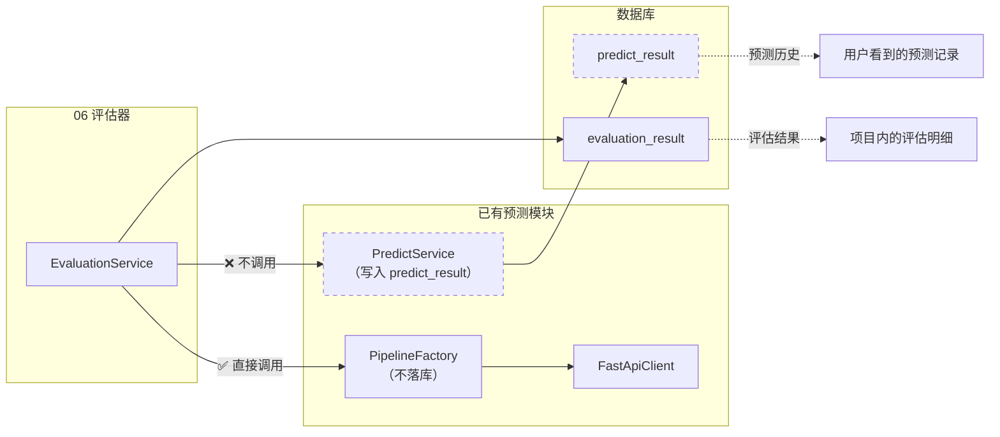
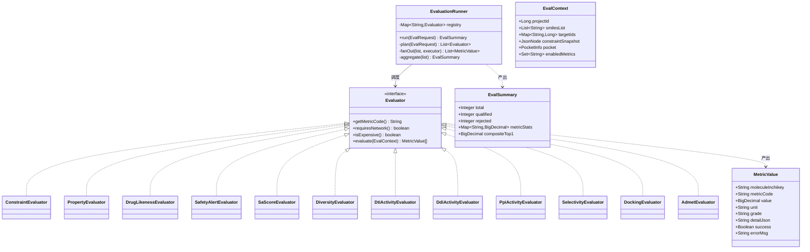
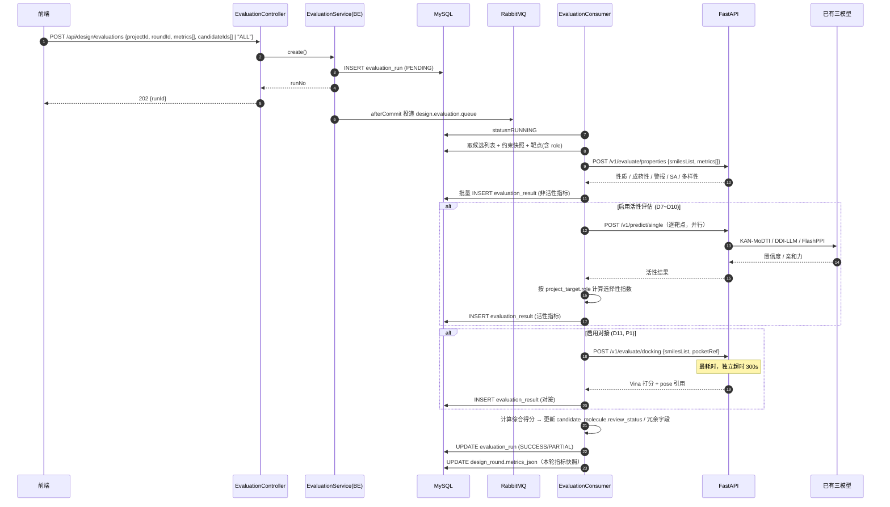
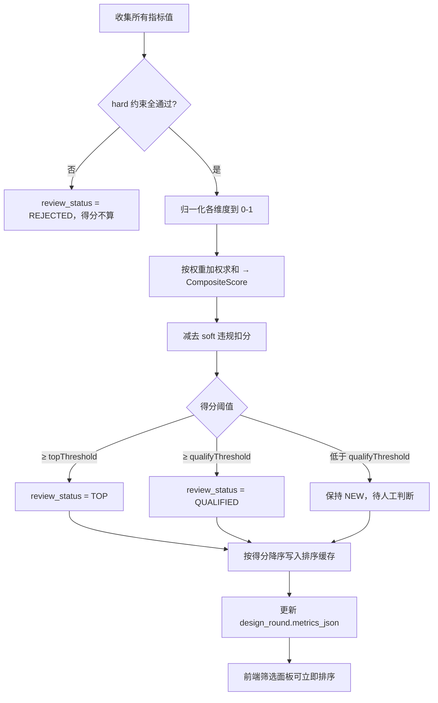
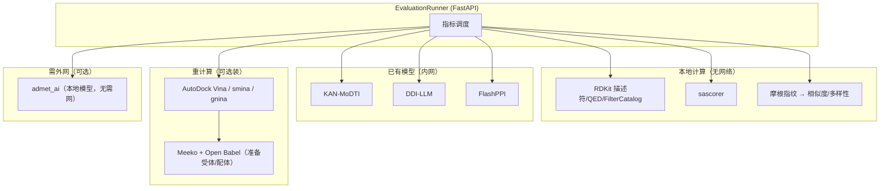
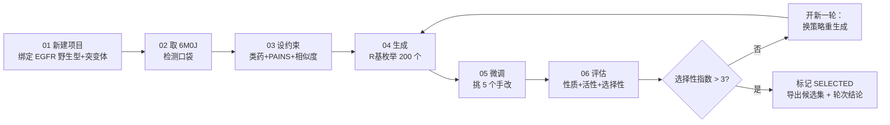

# 06 · 评估器

> 所属：干实验药物设计平台 · 第一阶段
> 上级文档：`00-总览与架构分工.md`
> 计算侧依赖：**FastAPI**（RDKit / 对接引擎 / **复用已有三模型**）
> 关键：这是**唯一与已有预测功能直接复用**的模块

---

## 1. 定位

**给候选分子多维度打分，驱动筛选与迭代。**

评估器的输出决定三件事：

1. **筛选**：哪些候选进入下一轮（`QUALIFIED` / `TOP` / `REJECTED`）
2. **排序**：候选列表按什么顺序展示（综合得分）
3. **迭代依据**：`design_round.metrics_json` 的指标快照，回答"这一轮比上一轮好在哪里"

---

## 2. 评估维度

| # | 维度 | 指标 | 实现 | 阶段 |
|---|---|---|---|---|
| D1 | **约束合规** | 逐条 hard/soft 规则 pass/fail | 复用 **03 模块** `/v1/constraints/validate` | P0 |
| D2 | **理化性质** | MolWt / LogP / TPSA / HBD / HBA / 可旋转键 / 芳香环数 / Fsp3 | RDKit 描述符 | P0 |
| D3 | **成药性** | QED、Lipinski/Veber/Ghose/Egan 通过数 | RDKit `QED` + 阈值规则 | P0 |
| D4 | **安全性警报** | PAINS / BRENK / NIH 命中数 | RDKit `FilterCatalog` | P0 |
| D5 | **合成可及性** | SA Score（1–10） | RDKit Contrib `sascorer` | P0 |
| D6 | **多样性** | 与同批候选的最大/平均 Tanimoto | RDKit 指纹 | P0 |
| D7 | **活性（DTI）** | 结合置信度 / 亲和力 | **复用已有 KAN-MoDTI** | P0 |
| D8 | **相互作用（DDI）** | 与其他药物的相互作用概率 | **复用已有 DDI-LLM**（含 1323 白名单边界） | P0 |
| D9 | **相互作用（PPI）** | 若靶点是蛋白对 | **复用已有 FlashPPI** | P0 |
| D10 | **选择性指数** | 突变体 / 野生型 亲和力比 | **由 D7 组合派生**（用 `project_target.role`） | P0 |
| D11 | **对接打分** | Vina / smina 亲和力、RMSD | AutoDock Vina / smina / gnina | **P1** |
| D12 | **ADMET** | 吸收/分布/代谢/排泄/毒性 | `admet_ai` 或 DeepPurpose | **P2** |

> **D10 是本项目最有价值的一环**：`project_target.role` 里同时绑定了 `WILD_TYPE` 与 `MUTANT` 时，
> 评估器对每个候选跑两次 DTI，算出选择性指数 —— 这直接回应"野生型 vs T790M 选择性"这类真实科研问题。

---

## 3. 与已有预测模块的关系（重要）



> ⚠️ **实现约束**：评估器**必须绕过 `PredictService.predict()`**，直接走 `PipelineFactory` + `FastApiClient`。
> 原因：`PredictService.predict()` 会写 `predict_result`，如果评估器用它，
> 一次"评估 500 个候选"会把用户的**预测历史刷入 500 条记录**，彻底污染该功能。
>
> 复用的是**引擎与三模型**，不是**预测业务的落库逻辑**。

---

## 4. UML

### 4.1 类图（策略模式 + 表驱动指标）



### 4.2 时序图：一次批量评估



### 4.3 活动图：综合评分与分级



### 4.4 组件图：评估器与外部能力的接线



---

## 5. 现成工具包

| 用途 | 工具包 / API | 状态 | 安装 |
|---|---|---|---|
| 描述符 / QED / 指纹 | **RDKit** | ✅ 已装 | — |
| 安全性警报目录 | **RDKit** `FilterCatalog`（`PAINS`/`BRENK`/`NIH`/`ZINC`） | ✅ 已装 | — |
| 合成可及性 | **RDKit Contrib `sascorer`** | ✅ 随 RDKit | `rdkit.Chem.RDConfig.RDContribDir` |
| 多样性/聚类 | **scikit-learn**（`AgglomerativeClustering` / `Butina` 自实现） | ✅ 已装 | — |
| 活性（DTI/DDI/PPI） | **已有三模型** | ✅ 可用 | — |
| 对接引擎 | **AutoDock Vina** / **smina** / **gnina** | 🆕 P1 | `conda install -c conda-forge vina` 或二进制 |
| 对接输入准备 | **Meeko** + **Open Babel** | 🆕 P1 | `pip install meeko`、`apt install openbabel` |
| pose 质量校验 | **PoseBusters**（可选） | 🆕 P2 | `pip install posebusters` |
| ADMET | **admet_ai** | 🆕 P2 | `pip install admet_ai`（本地模型，无需外网） |
| 备选 ADMET | **DeepPurpose** | 🆕 P2 | `pip install DeepPurpose` |
| 统计 | numpy / pandas | ✅ 已装 | — |

> **对接的可选性设计**：对接引擎体积大、依赖 Open Babel，建议做成**可插拔**：
> `synpharm.agent.docking.enabled=false` 时 `DockingEvaluator` 不注册，
> 评估器其余维度照常工作（对齐"降级可见、不阻断"原则）。

---

## 6. 数据库设计

### 6.1 `22_metric_definition.sql`

```sql
-- =============================================
-- 干实验药物设计 · 指标定义（表驱动，便于扩展）
-- 版本：v1.0
-- =============================================
USE synpharm;

CREATE TABLE IF NOT EXISTS metric_definition (
    id            BIGINT PRIMARY KEY AUTO_INCREMENT,
    metric_code   VARCHAR(40)   NOT NULL COMMENT '指标码，如 MOL_WT / QED / SA_SCORE / DTI_CONFIDENCE',
    metric_name   VARCHAR(100)  NOT NULL COMMENT '中文名，如"分子量"',
    category      VARCHAR(30)   NOT NULL
                  COMMENT 'CONSTRAINT/PROPERTY/DRUGLIKENESS/SAFETY/SYNTHESIS/DIVERSITY/'
                          'ACTIVITY/SELECTIVITY/DOCKING/ADMET',
    value_type    VARCHAR(20)   NOT NULL DEFAULT 'NUMERIC' COMMENT 'NUMERIC/BOOLEAN/GRADE/JSON',
    unit          VARCHAR(20)            COMMENT '单位，如 Da / Å / kcal/mol',
    better        VARCHAR(10)   NOT NULL DEFAULT 'HIGHER'
                  COMMENT 'HIGHER 越大越好 / LOWER 越小越好 / NONE',
    min_value     DECIMAL(12,4)          COMMENT '归一化下限',
    max_value     DECIMAL(12,4)          COMMENT '归一化上限',
    weight        DECIMAL(5,4)  NOT NULL DEFAULT 0.0000 COMMENT '综合得分中的权重（0 表示仅展示不参与打分）',
    enabled       TINYINT       NOT NULL DEFAULT 1,
    sort_no       INT           NOT NULL DEFAULT 0,
    remark        VARCHAR(300),
    created_at    DATETIME      NOT NULL DEFAULT CURRENT_TIMESTAMP,
    UNIQUE KEY uk_metric_code (metric_code),
    KEY idx_category (category, sort_no)
) ENGINE=InnoDB DEFAULT CHARSET=utf8mb4 COLLATE=utf8mb4_unicode_ci COMMENT='评估指标定义';

-- 初始化内置指标（可重复执行）
INSERT INTO metric_definition
  (metric_code, metric_name, category, value_type, unit, better, min_value, max_value, weight, sort_no, remark)
VALUES
  ('MOL_WT',            '分子量',        'PROPERTY',      'NUMERIC', 'Da',       'NONE',   0,    1000, 0.0000, 10, '区间型，由约束判定'),
  ('MOL_LOGP',          '脂水分配系数',  'PROPERTY',      'NUMERIC', '',         'NONE',   -3,   8,    0.0000, 20, '区间型'),
  ('TPSA',              '极性表面积',    'PROPERTY',      'NUMERIC', 'Ų',       'NONE',   0,    250,  0.0000, 30, '区间型'),
  ('NUM_H_DONORS',      '氢键供体数',    'PROPERTY',      'NUMERIC', '',         'LOWER',  0,    10,   0.0000, 40, NULL),
  ('NUM_H_ACCEPTORS',   '氢键受体数',    'PROPERTY',      'NUMERIC', '',         'LOWER',  0,    15,   0.0000, 50, NULL),
  ('NUM_ROTATABLE',     '可旋转键数',    'PROPERTY',      'NUMERIC', '',         'LOWER',  0,    15,   0.0000, 60, NULL),
  ('FRACTION_CSP3',     'sp³ 碳占比',    'PROPERTY',      'NUMERIC', '',         'HIGHER', 0,    1,    0.0000, 70, NULL),
  ('QED',               '类药性 QED',    'DRUGLIKENESS',  'NUMERIC', '',         'HIGHER', 0,    1,    0.1500, 80, '综合得分主项之一'),
  ('LIPINSKI_PASS',     'Lipinski 通过数','DRUGLIKENESS','NUMERIC', '条',       'HIGHER', 0,    4,    0.0500, 90, NULL),
  ('SA_SCORE',          '合成可及性',    'SYNTHESIS',     'NUMERIC', '',         'LOWER',  1,    10,   0.1000,100,'1 易合成，10 极难'),
  ('PAINS_HITS',        'PAINS 命中数',  'SAFETY',        'NUMERIC', '个',       'LOWER',  0,    5,    0.1000,110,'命中即降分'),
  ('BRENK_HITS',        'BRENK 命中数',  'SAFETY',        'NUMERIC', '个',       'LOWER',  0,    5,    0.0500,120,NULL),
  ('MAX_SIMILARITY',    '最大相似度',    'DIVERSITY',     'NUMERIC', '',         'LOWER',  0,    1,    0.0500,130,'与同批其他候选'),
  ('DTI_CONFIDENCE',    'DTI 结合置信度','ACTIVITY',      'NUMERIC', '',         'HIGHER', 0,    1,    0.3000,140,'复用 KAN-MoDTI'),
  ('DDI_PROBABILITY',   'DDI 相互作用概率','ACTIVITY',    'NUMERIC', '',         'LOWER',  0,    1,    0.0500,150,'复用 DDI-LLM'),
  ('SELECTIVITY_INDEX', '选择性指数',    'SELECTIVITY',   'NUMERIC', '',         'HIGHER', 0,    10,   0.1000,160,'突变体/野生型'),
  ('VINA_AFFINITY',     'Vina 对接打分', 'DOCKING',       'NUMERIC', 'kcal/mol', 'LOWER',  -14,  0,    0.1000,170,'P1，未启用时权重自动重分配')
ON DUPLICATE KEY UPDATE metric_name = VALUES(metric_name);
```

### 6.2 `23_evaluation_run.sql`

```sql
CREATE TABLE IF NOT EXISTS evaluation_run (
    id                 BIGINT PRIMARY KEY AUTO_INCREMENT,
    run_no             VARCHAR(64)   NOT NULL COMMENT '评估任务编号 E+时间戳+随机',
    project_id         BIGINT        NOT NULL,
    round_id           BIGINT                 COMMENT '属于哪一轮',
    user_id            BIGINT        NOT NULL,
    scope              VARCHAR(20)   NOT NULL DEFAULT 'SELECTED' COMMENT 'ALL/SELECTED/INCREMENTAL',
    candidate_ids      JSON                   COMMENT 'scope=SELECTED 时的候选 id 列表',
    enabled_metrics    VARCHAR(1000) NOT NULL COMMENT '启用的指标码列表',
    metric_weights     JSON                   COMMENT '本次使用的权重快照（防止后续改权重导致历史不可复现）',
    total_count        INT           NOT NULL DEFAULT 0,
    evaluated_count    INT           NOT NULL DEFAULT 0,
    rejected_count     INT           NOT NULL DEFAULT 0,
    qualified_count    INT           NOT NULL DEFAULT 0,
    top_count          INT           NOT NULL DEFAULT 0,
    status             VARCHAR(20)   NOT NULL DEFAULT 'PENDING'
                       COMMENT 'PENDING/RUNNING/SUCCESS/PARTIAL/FAILED/CANCELLED',
    progress           DECIMAL(5,2)  NOT NULL DEFAULT 0.00,
    metric_stats       JSON                   COMMENT '指标分布统计（均值/中位/最大/最小）',
    error_msg          VARCHAR(1000),
    latency_ms         INT,
    started_at         DATETIME,
    completed_at       DATETIME,
    created_at         DATETIME      NOT NULL DEFAULT CURRENT_TIMESTAMP,
    UNIQUE KEY uk_eval_run_no (run_no),
    KEY idx_project_round (project_id, round_id),
    CONSTRAINT fk_ev_project FOREIGN KEY (project_id) REFERENCES design_project(id)
) ENGINE=InnoDB DEFAULT CHARSET=utf8mb4 COLLATE=utf8mb4_unicode_ci COMMENT='评估任务';
```

### 6.3 `24_evaluation_result.sql`

```sql
CREATE TABLE IF NOT EXISTS evaluation_result (
    id             BIGINT PRIMARY KEY AUTO_INCREMENT,
    run_id         BIGINT        NOT NULL,
    project_id     BIGINT        NOT NULL COMMENT '冗余，便于直接按项目查询',
    molecule_id    BIGINT        NOT NULL,
    inchikey       CHAR(27)      NOT NULL COMMENT '冗余，便于按结构查询',
    metric_code    VARCHAR(40)   NOT NULL,
    value_num      DECIMAL(14,5)          COMMENT '数值型指标值',
    value_text     VARCHAR(300)           COMMENT '文本/等级型指标值',
    passed         TINYINT                COMMENT '布尔型（约束类）结果；NULL=不适用',
    normalized     DECIMAL(6,5)           COMMENT '归一化后 0-1，用于综合得分',
    grade          VARCHAR(20)            COMMENT '等级：EXCELLENT/GOOD/FAIR/POOR',
    detail_json    JSON                   COMMENT '明细，如命中警报的 SMARTS、相互作用残基',
    success        TINYINT       NOT NULL DEFAULT 1 COMMENT '该指标是否算成功（模型不可用时为 0）',
    error_msg      VARCHAR(500),
    latency_ms     INT,
    created_at     DATETIME      NOT NULL DEFAULT CURRENT_TIMESTAMP,
    UNIQUE KEY uk_run_mol_metric (run_id, molecule_id, metric_code),
    KEY idx_project_metric (project_id, metric_code),
    KEY idx_molecule (molecule_id),
    KEY idx_run_metric_value (run_id, metric_code, value_num),
    CONSTRAINT fk_er_run FOREIGN KEY (run_id) REFERENCES evaluation_run(id),
    CONSTRAINT fk_er_mol FOREIGN KEY (molecule_id) REFERENCES candidate_molecule(id)
) ENGINE=InnoDB DEFAULT CHARSET=utf8mb4 COLLATE=utf8mb4_unicode_ci COMMENT='评估结果明细';
```

> `uk_run_mol_metric` 保证同一 run 内同一分子同一指标只有一条 —— **重复评估幂等**（重跑只更新不翻倍）。
> `idx_run_metric_value` 支撑"按某指标排序取 TopN"的典型查询。

---

## 7. 综合得分算法

$$S_{\text{total}} = 100 \times \frac{\sum_{i \in \text{启用指标}} w_i \cdot \tilde{v}_i}{\sum_{i \in \text{启用指标}} w_i} - P_{\text{soft}} - P_{\text{alert}}$$

| 项 | 说明 |
|---|---|
| $\tilde{v}_i$ | 指标归一化到 $[0,1]$；`better=LOWER` 时取反 |
| $w_i$ | 来自 `metric_definition.weight`，**每次 run 快照**存入 `metric_weights` |
| $P_{\text{soft}}$ | soft 违规扣分 = $\sum \text{weight}_{\text{rule}} \times 0.5$，上限 20 |
| $P_{\text{alert}}$ | 安全性警报扣分：$\text{PAINS} \times 5 + \text{BRENK} \times 2$，上限 15 |

**权重自动重分配**：若某指标本次未成功计算（如未启用对接、模型不可用），
其权重**按比例分摊到其余成功指标**，并在 `error_msg` 标记 —— 保证不同 run 之间的得分可比。

**分级阈值**（可配置）：

| 阈值 | 默认 | 结果 |
|---|---|---|
| `top-threshold` | 75 | `TOP` |
| `qualify-threshold` | 55 | `QUALIFIED` |
| 低于 qualify | — | 保持 `NEW` |
| hard 规则不过 | — | `REJECTED` |

**选择性指数**（当项目同时绑定 `WILD_TYPE` 与 `MUTANT`）：

$$I_{\text{sel}} = \frac{A_{\text{mutant}}}{A_{\text{wild}}}, \quad
A = \begin{cases} c & \text{（用置信度时，} c \text{ 为 DTI 输出）} \\ |\Delta G| & \text{（用亲和力时）} \end{cases}$$

> 用哪一套由配置决定，**必须在报告里标明口径**，否则数字会被误读。

---

## 8. 接口设计

### 8.1 SpringBoot 对外

| 方法 | 路径 | 说明 |
|---|---|---|
| `POST` | `/api/design/evaluations` | 创建评估任务 |
| `GET` | `/api/design/evaluations/{id}` | 任务状态与统计 |
| `POST` | `/api/design/evaluations/{id}/cancel` | 取消 |
| `GET` | `/api/design/candidates/ranked` | **按综合得分/任意指标排序的候选列表**（筛选面板主接口） |
| `GET` | `/api/design/candidates/{id}/metrics` | 单个候选的全部指标明细 |
| `GET` | `/api/design/metrics/meta` | 指标定义列表（驱动前端筛选面板） |
| `PUT` | `/api/design/metrics/{code}/weight` | 调整权重重算（触发增量重算，不重跑计算） |
| `GET` | `/api/design/rounds/{id}/metrics` | 轮次指标快照（用于"这一轮比上一轮好在哪"对比） |

**新增错误码**：

| 错误码 | HTTP | 语义 |
|---|---|---|
| `EVALUATION_RUN_NOT_FOUND` | 404 | 任务不存在或非本人 |
| `EVALUATION_NO_METRIC` | 400 | 未启用任何指标 |
| `EVALUATION_NO_CANDIDATE` | 400 | 项目内无候选可评 |
| `EVALUATION_METRIC_UNAVAILABLE` | 200（业务告警） | 部分指标不可用（如对接未装），已在结果中标记并重分配权重 |

### 8.2 FastAPI 计算端点

| 方法 | 路径 | 说明 |
|---|---|---|
| `POST` | `/v1/evaluate/properties` | 批量：性质 / 成药性 / 警报 / SA / 多样性 |
| `POST` | `/v1/evaluate/activity` | 批量活性：内部 fan-out 到三模型；按 `targetRole` 分别调用以支持选择性 |
| `POST` | `/v1/evaluate/docking` | 批量对接（P1，独立超时 300s，分批） |
| `POST` | `/v1/evaluate/admet` | 批量 ADMET（P2） |
| `POST` | `/v1/evaluate/describe` | 单分子全量指标（候选详情页用） |
| `GET` | `/v1/evaluate/capabilities` | 当前可用的评估能力（哪些引擎已装）—— 供后端决定启用哪些指标 |

`/v1/evaluate/capabilities` 是**降级可见**的关键：后端据此把未装的引擎对应指标自动关闭，
而不是让用户点了才发现失败。

---

## 9. 关键设计点

| 点 | 说明 |
|---|---|
| **复用引擎、不复用落库** | 走 `PipelineFactory` 而非 `PredictService`，避免评估结果污染 `predict_result` 与预测历史 |
| **指标表驱动** | 新增指标只插一行 `metric_definition` + 注册一个 `Evaluator`，不改表结构、不改前端 |
| **权重快照** | `metric_weights` 每次 run 落库，保证历史得分永远可复现 |
| **权重自动重分配** | 指标缺失时按比例分摊，保证跨 run 得分可比 |
| **`uk_run_mol_metric` 幂等** | 重复评估只更新不翻倍；支持"改权重后只重算得分不重跑计算" |
| **分级而非只出分** | `TOP` / `QUALIFIED` / `NEW` / `REJECTED` 直接驱动 01 模块的轮次结论 |
| **选择性指数需标口径** | 置信度口径与亲和力口径结果不同，报告必须写明 |
| **对接可插拔** | 未装 Vina 时该指标不注册，其余照常；`capabilities` 接口让前端提前知道 |
| **PARTIAL 语义** | 部分指标失败仍出分（权重重分配），失败项在 `evaluation_result.success=0` 中标记 |
| **与 `predict_result` 的边界** | `predict_result` = 用户主动的单次预测历史；`evaluation_result` = 项目内的批量评估明细，两者互不写入 |
| **二阶段衔接** | 对应工具 `mol_properties` / `mol_docking` / `dti_predict`；`capabilities` 直接供 Planner 判断"哪些工具当前可用"，避免幻觉调用 |

---

## 10. 第一阶段完成后的最小可用闭环



**这条闭环跑通，第一阶段就成立了** —— 而且是完全手动、完全可解释的。
第二阶段要做的，只是把图中每个方框包成 `AgentTool`，让 Planner 自己走这条路径。
