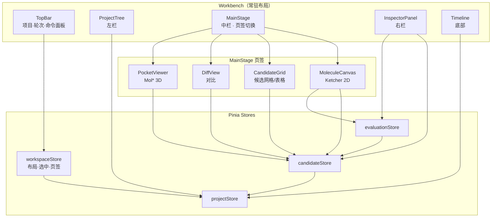
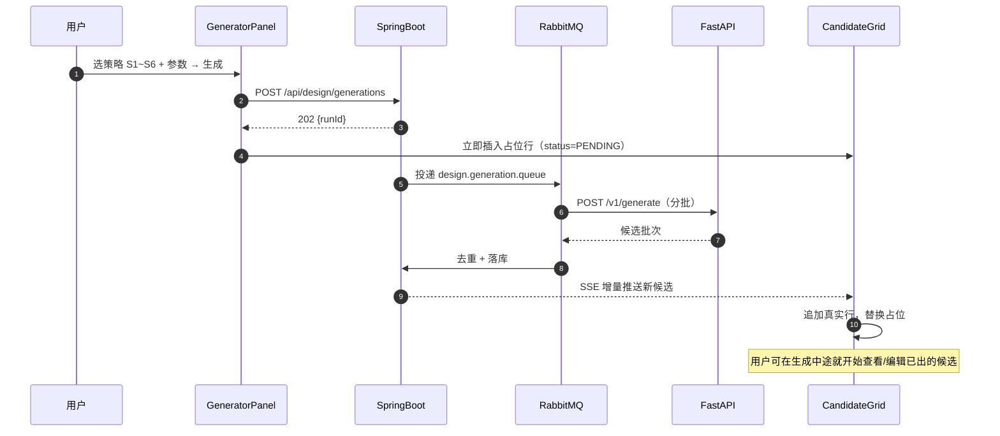
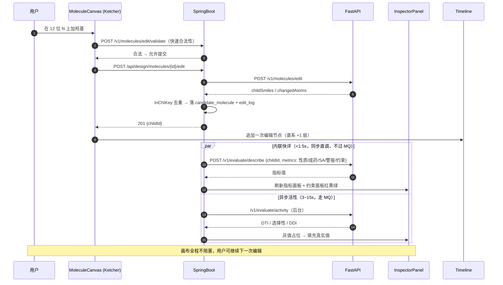
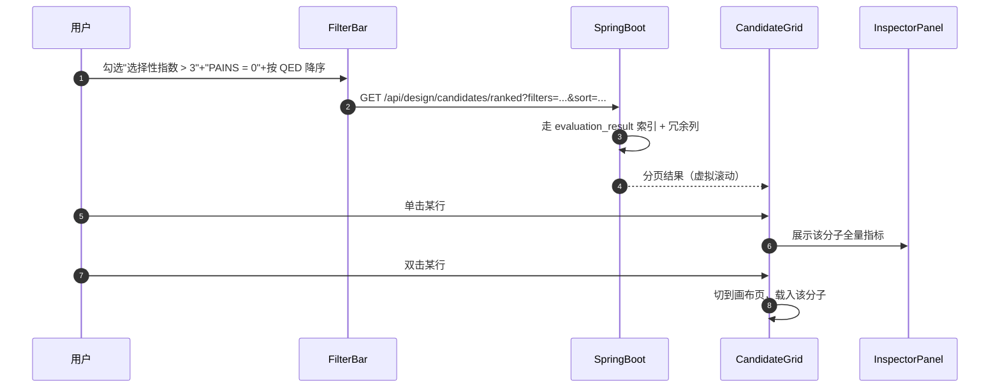
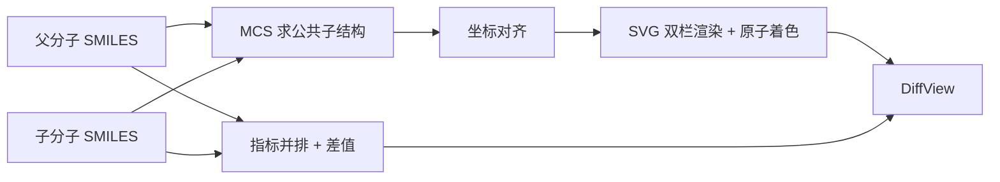
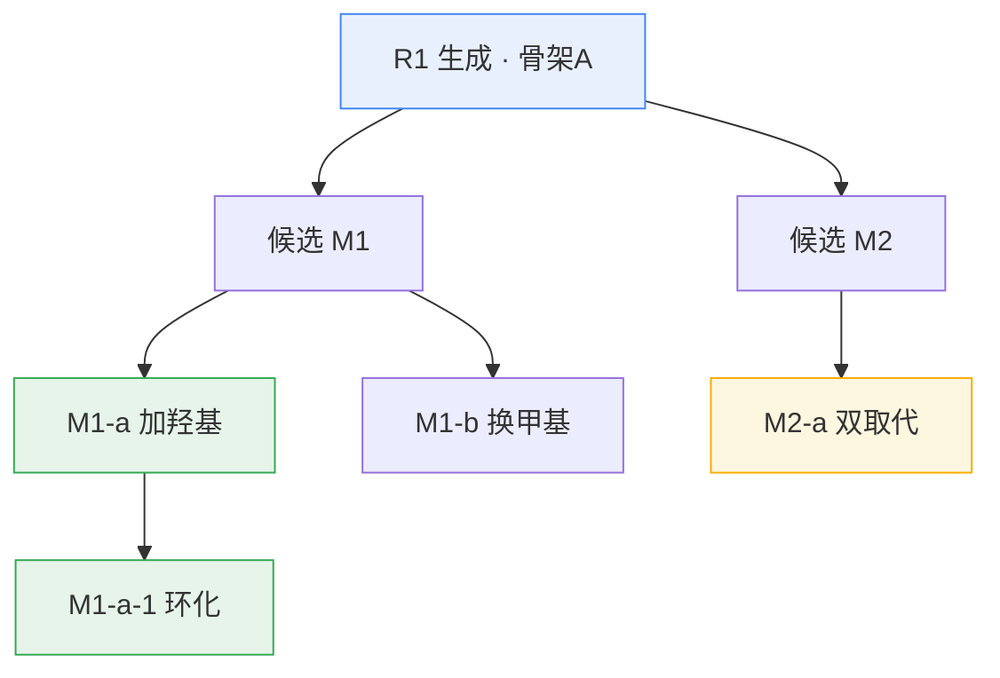
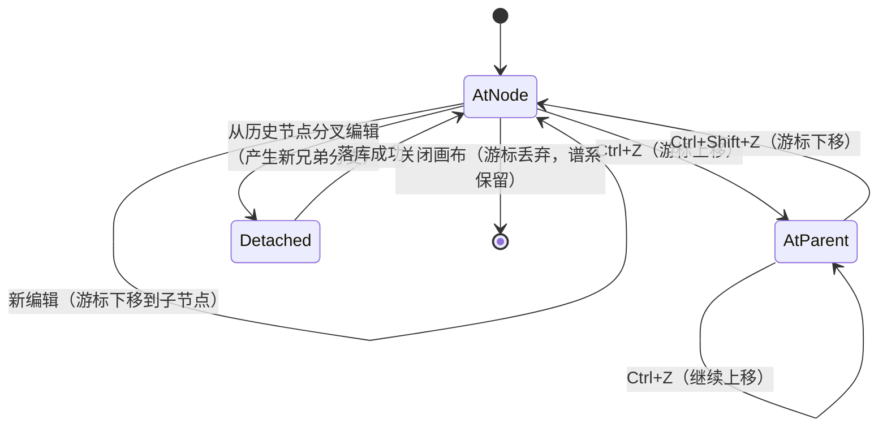
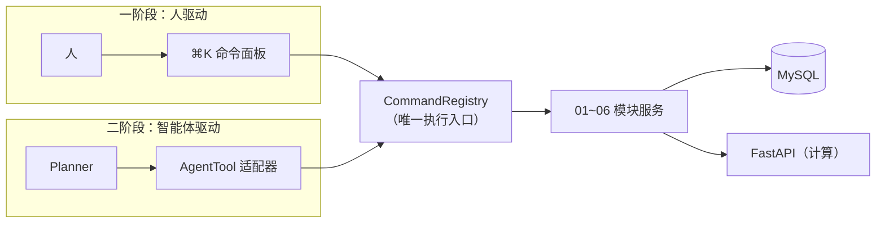

# 07 · 工作台与交互设计

> 所属：干实验药物设计平台 · 第一阶段
> 上级文档：`00-总览与架构分工.md`
> 定位：**本文档不描述新模块，而是把 01~06 六个模块粘成一个软件。**
> **第一阶段（手动操作构建药物）的最终目的，是交付一个干实验 IDE。**

---

## 1. 从"向导"到"工作台"

前六份文档描述的是**管线**：新建 → 约束 → 生成 → 编辑 → 评估。
那是**向导（Wizard）**的形态。而一个真正的设计软件应该是**工作台（Workspace / IDE）**。

| 维度 | 向导（Wizard） | 工作台（IDE）—— 本文档目标 |
|---|---|---|
| 导航 | 步骤 1→2→3，未完成则下一步禁用 | 任意面板、任意时刻可进入 |
| 状态 | 线性、临时、刷新即丢 | 常驻、可恢复、换设备接着干 |
| 中心 | 表单 | **候选与分子画布** |
| 反馈 | 走完流程才出结果 | **保存即编译**（增量、内联） |
| 回退 | 上一步 | **撤销/重做 + 版本对比** |
| 扩展 | 改流程 | 加命令（命令注册表） |
| 心智 | "我在做一件事" | "我在维护一个工作区" |

> **结论**：01~06 是**部件**，本文档是**台面**。缺了本文档，产品是 6 个页面；有了本文档，才是一个软件。

---

## 2. IDE 概念映射（证明部件已齐）

| IDE 概念 | 本项目 | 文档 |
|---|---|---|
| 工作区 / 项目 | `design_project` | 01 |
| 外部依赖 / 库 | 靶点序列、结构、口袋、支持药物集 | 02 |
| 项目设置 / 代码风格 | `constraint_set` + `constraint_rule` | 03 |
| 脚手架 / 代码生成 | 分子生成器（S1~S6 确定性策略） | 04 |
| **编辑器** | 分子编辑器 + 2D 画布（Ketcher） | 05 |
| 编译 / 测试 / lint | 评估器（合规/性质/SA/PAINS/DTI/选择性） | 06 |
| 版本控制 | 轮次 `design_round` + 谱系 `parent_mol_id` | 01 / 05 |
| 构建产物 | `candidate_molecule` + 导出（CSV/SDF） | 04 / 01 |
| **面板 / 布局 / 命令** | **本文档** | **07** |

**部件齐全，不缺件。** 本文档补齐的是布局、反馈链路、Diff、撤销、命令入口。

---

## 3. 工作台布局

```text
┌──────────────────────────────────────────────────────────────────────────────┐
│ 顶栏 ▸ 项目切换 │ 轮次切换 ·R1 R2 R3· │ ⌘K 命令面板 │ 能力状态灯 │ 用户        │
├────────────┬────────────────────────────────────────────┬────────────────────┤
│ 左栏 导航   │ 中栏 主工作面（可切页签）                    │ 右栏 检查器         │
│            │                                            │                    │
│ 项目树      │ ① 画布页  2D 分子编辑器（Ketcher）           │ 约束面板            │
│ ├ 靶点/口袋 │            ┌──────────────────────┐          │  ├ HARD 规则 列表   │
│ ├ 约束集    │ ② 候选页  候选网格 / 表格（可排序）           │  └ SOFT 规则 权重   │
│ ├ 轮次 R1   │            └──────────────────────┘          │                    │
│ │ ├ 生成 G1 │ ③ 对比页  两分子 / 两轮次 并排 Diff           │ 指标面板            │
│ │ ├ 编辑    │ ④ 口袋页  3D 视图（Mol*，口袋+配体）         │  ├ 性质 / 成药性    │
│ │ └ 评估 E1 │                                            │  ├ SA / 警报        │
│ ├ 轮次 R2   │                                            │  ├ 活性 / 选择性    │
│ └ 轮次 R3   │                                            │  └ 对接 / ADMET     │
├────────────┴────────────────────────────────────────────┴────────────────────┤
│ 底部时间线 ▸ 轮次 ●R1 ─ R2 ─ R3●  │ 编辑谱系树 │ 操作日志（人/智能体着色）  │
└──────────────────────────────────────────────────────────────────────────────┘
```

### 3.1 各栏职责与接口挂载

| 区域 | 职责 | 数据来源 |
|---|---|---|
| **顶栏** | 项目/轮次切换、命令面板、**能力状态灯**（哪些引擎可用） | `/api/design/projects`、`/v1/evaluate/capabilities` |
| **左栏 · 项目树** | 层级导航：靶点 → 约束 → 轮次 → (生成/编辑/评估) | `/api/design/projects/{id}/tree` |
| **中栏 · 画布页** | 2D 编辑；提交即评估 | `/v1/molecules/edit`、`/v1/molecules/edit/validate` |
| **中栏 · 候选页** | 候选网格/表格、按任意指标排序、批量选择 | `/api/design/candidates/ranked` |
| **中栏 · 对比页** | 分子 Diff、轮次 Diff | 新增 `/api/design/compare/*` |
| **中栏 · 口袋页** | 3D 口袋与配体、可编辑位点高亮 | `/v1/structures/fetch`、`/v1/molecules/edit/suggest` |
| **右栏 · 约束面板** | HARD/SOFT 规则实时校验结果（红/黄/绿） | `/v1/constraints/validate` |
| **右栏 · 指标面板** | 当前选中分子的全量指标 | `/v1/evaluate/describe` |
| **底部 · 时间线** | 轮次推进、候选流向、谱系树、操作日志 | `/api/design/rounds/{id}/metrics`、`/api/design/molecules/{id}/lineage` |

### 3.2 组件挂载关系



---

## 4. 三条核心交互链路

### 4.1 生成：批量 → 网格

批量、耗时长（秒~分钟）→ 走 MQ，进度经 SSE/轮询回填网格，**候选逐个出现**而非等全部完成。



### 4.2 编辑：保存即编译（**最关键的一条**）

编辑器提交后**不等 batch**，直接内联评估，1~2 秒内把右栏指标面板刷新。



### 4.3 评估：筛选 → 排序表格



---

## 5. 保存即编译：增量评估

### 5.1 两类 run（**复用已有设计，无 DDL 变更**）

`evaluation_run.scope` 已定义 `ALL / SELECTED / INCREMENTAL`，直接利用：

| run 类型 | `scope` | 生命周期 | 可变性 | 用途 |
|---|---|---|---|---|
| **批量 run** | `ALL` / `SELECTED` | 一次评估任务 | **不可变快照** | 轮次结论、`design_round.metrics_json` |
| **增量 run** | `INCREMENTAL` | 每轮一条常驻（`run_no = R{roundId}-INC`） | **活**，随时被覆盖 | 编辑时即时反馈 |

- 增量 run 长期保持 `status = RUNNING`（语义是"会话进行中"），其统计字段（`top_count` 等）**读取时按需重算**。
- `uk_run_mol_metric (run_id, molecule_id, metric_code)` 保证**反复编辑同一分子只更新不翻倍**。

> **好处**：批量 run 的不可变性未被破坏（历史永远可复现），而编辑体验又足够快。
> 两条链路共用同一张表，前端只有一个指标读取接口。

### 5.2 什么同步、什么异步

| 指标组 | 典型延迟 | 链路 | 交互表现 |
|---|---|---|---|
| D1 约束合规 / D2 性质 / D3 成药性 / D4 警报 / D5 SA | < 200 ms | **同步直调** | 即时刷新，无 loading |
| D6 多样性 | < 500 ms | 同步直调（需同批上下文） | 即时刷新 |
| D7~D10 活性 / 选择性 | 3 ~ 15 s | **异步 MQ + SSE** | 先显示灰色占位 → 填充 |
| D11 对接 | 10 ~ 300 s | **显式触发** | 按钮 + 进度条，绝不自动跑 |
| D12 ADMET | 1 ~ 5 s | 异步 | 懒加载 |

**验收指标**：性质类 P95 < 1.5 s；**任何情况下不阻塞画布交互**。

### 5.3 降级可见

顶栏"能力状态灯"读取 `/v1/evaluate/capabilities`：

- 未装对接引擎 → 对接指标**不注册**，右栏该项显示"未启用"而非报错
- 三模型之一权重缺失 → 对应指标标灰 + 提示原因（对齐引擎侧 `health` 的四态：`ready` / `not_loaded` / `weights_missing` / `load_failed`）

---

## 6. 对比（Diff）—— IDE 的核心体验

### 6.1 分子 Diff

| 项 | 方案 |
|---|---|
| 差异算法 | **RDKit `rdFMCS.FindMCS`** 求最大公共子结构 |
| 2D 对齐 | **RDKit `rdMolAlign`** + `rdDepictor` 统一坐标 |
| 着色 | 共有骨架 **灰**；子分子新增 **绿**；父分子删除 **红**；原子编号高亮 |
| 属性对比 | 逐指标并排 + 差值与变化方向箭头（`value_num` 直接相减） |
| 交互 | 左栏点两个候选 → 中栏切"对比页"；编辑器内 `Ctrl+D` 对比父子 |



### 6.2 轮次 Diff

对比 $R_n$ 与 $R_{n-1}$：

| 视图 | 内容 |
|---|---|
| **指标趋势折线** | 各指标均值 / 中位 / Top1 随轮次变化（读 `design_round.metrics_json`） |
| **候选流向桑基图** | $R_{n-1}$ 的候选 → 保留 / 被筛掉 / 被编辑衍生 |
| **Top 变化表** | 两轮 Top N 的进出与排名跃迁 |
| **约束收紧对比** | 两轮约束规则的增删改（读 `constraint_set` 版本） |

> 轮次 Diff 直接回答评审最爱问的一句话：**"第二轮比第一轮好在哪里？"**

### 6.3 谱系树



- 数据来源：`candidate_molecule.parent_mol_id` 自关联 + `molecule_edit_log`
- 节点着色 = 综合得分等级（`TOP` 绿 / `QUALIFIED` 黄 / 未定 灰 / `REJECTED` 红）
- 节点徽标 = `origin_type`（`GENERATED` / `EDITED` / `IMPORTED`）+ 操作者（人 / 智能体）
- 点击节点 → 中栏画布载入

---

## 7. 撤销 / 重做

### 7.1 原理：**游标移动，不是数据回滚**

因为 05 模块已定义 **父分子不可变、编辑只新增子分子**，所以撤销天然无损：

| 操作 | 实现 | 是否需要反向记录 |
|---|---|---|
| 撤销一次编辑 | 画布切到 `parent_mol_id` | ❌ 不需要 |
| 重做 | 沿谱系走回 `child_mol_id` | ❌ 不需要 |
| 撤销连续 N 次 | 游标上移 N 层 | ❌ 不需要 |

**无需新增字段、无需反向日志、无需物理删除。** 这是"父分子不可变"设计带来的红利。

### 7.2 状态机



> **分叉编辑**：从谱系中间节点再编辑，会产生**兄弟分支**（不覆盖原分支）—— 这正是"版本控制"的手感。

### 7.3 边界

| 操作 | 可否撤销 | 机制 |
|---|---|---|
| 单次/连续编辑 | ✅ | 游标上移 |
| 生成整批 | ✅ | 逻辑删除该 `generation_run` 下的 `candidate_molecule` |
| 评估 | ➖ 无需 | 评估不改分子，重跑即可 |
| 切换轮次 | ❌ | 轮次是版本，不可撤销；用归档（`ARCHIVED`）代替 |
| 关闭项目 | ❌ | 用 `COMPLETED` / `CANCELLED` 代替 |

**铁律：撤销 = 移动游标；永不物理删除历史。** 这与 `00` §7 的"可完整重放"要求一致。

快捷键：`Ctrl+Z` / `Ctrl+Shift+Z`；撤销栈作用域 = **当前分子**（不跨分子）。

---

## 8. 命令注册表 —— 通往二阶段的桥

### 8.1 唯一执行入口



**实现要求（硬约束）**：
> 所有**写操作**必须经 `CommandRegistry` 执行；Controller 只做参数绑定与权限校验，**不得直接调 Service**。

这样二阶段接入时，智能体与人**走同一扇门** —— 权限、审计、幂等、能力过滤全部自动继承，无需为智能体新开通道。

### 8.2 命令清单（对齐 `00` §7 的工具名）

| 命令 ID | 面板入口 | 断言（写） | 二阶段工具名 |
|---|---|---|---|
| `target.resolve` | 靶点面板 | ✅ | `target_resolve` |
| `pocket.detect` | 靶点面板 | ✅ | `pocket_detect` |
| `constraint.validate` | 约束面板 | ❌ 只读 | `constraint_validate` |
| `molecule.generate` | 生成面板 | ✅ | `molecule_generate` |
| `molecule.edit` | 画布 | ✅ | `molecule_edit` |
| `molecule.evaluate` | 评估面板 | ✅ | `mol_properties` |
| `molecule.dock` | 评估面板 | ✅ | `mol_docking` |
| `activity.predict` | 指标面板 | ✅ | `dti_predict`（已有） |
| `project.context` | — | ❌ 只读 | `project_context` |
| `workspace.open` | 命令面板 | ❌ 只读 | — （二阶段不需要） |

**注册表来源（第一阶段）**：Java 代码中声明（枚举 + 注解），经 `GET /api/design/commands` 暴露给前端。
**不做表驱动** —— 避免过度设计；若二阶段确需动态启停，再提升为表。

**能力过滤**：注册表在返回时按 `/v1/evaluate/capabilities` 过滤掉不可用命令，前端置灰并给出原因。

---

## 9. 接口设计（本文档新增）

| 方法 | 路径 | 说明 |
|---|---|---|
| `GET` | `/api/design/projects/{id}/tree` | 工作台左栏树（靶点/约束/轮次/任务，一次拉全） |
| `GET` | `/api/design/commands` | 命令注册表（已按能力过滤） |
| `POST` | `/api/design/commands/{commandId}` | **统一命令执行入口** |
| `GET` | `/api/design/compare/molecules?a={id}&b={id}` | 分子 Diff（MCS + 属性差值） |
| `GET` | `/api/design/compare/rounds?a={id}&b={id}` | 轮次 Diff（指标趋势 + 流向） |
| `GET` | `/api/design/workspace` | 读取工作台状态（恢复上次视图） |
| `PUT` | `/api/design/workspace` | 保存工作台状态 |
| `GET` | `/api/design/stream/{runId}` | **SSE 增量推送**（生成/评估进度、新候选） |

**新增错误码**：

| 错误码 | HTTP | 语义 |
|---|---|---|
| `COMMAND_NOT_FOUND` | 404 | 命令 ID 不存在 |
| `COMMAND_UNAVAILABLE` | 409 | 命令存在但当前引擎不可用（如对接未装） |
| `COMMAND_FORBIDDEN` | 403 | 该命令在当前项目状态下不允许（如未定约束就生成） |
| `COMPARE_SAME_OBJECT` | 400 | 对比同一对象 |

---

## 10. 数据库设计

### 10.1 `25_workspace_state.sql`

```sql
-- =============================================
-- 干实验药物设计 · 工作台状态（IDE 视图恢复）
-- 版本：v1.0  依赖：sys_user / design_project
-- =============================================
USE synpharm;

CREATE TABLE IF NOT EXISTS workspace_state (
    id                 BIGINT PRIMARY KEY AUTO_INCREMENT,
    user_id            BIGINT       NOT NULL COMMENT '归属用户（工作台是"我的"视图）',
    project_id         BIGINT                COMMENT 'NULL = 用户级最近项目',
    last_round_id      BIGINT                COMMENT '上次打开的轮次',
    last_mol_id        BIGINT                COMMENT '上次选中的候选',
    active_tab         VARCHAR(30)           COMMENT 'CANVAS/CANDIDATES/DIFF/POCKET',
    open_mol_ids       JSON                  COMMENT '已打开的分子页签列表（IDE 多标签）',
    panel_layout_json  JSON                  COMMENT '面板展开/折叠/宽度、表格排序与筛选',
    last_visited_at    DATETIME     NOT NULL DEFAULT CURRENT_TIMESTAMP,
    created_at         DATETIME     NOT NULL DEFAULT CURRENT_TIMESTAMP,
    updated_at         DATETIME     NOT NULL DEFAULT CURRENT_TIMESTAMP ON UPDATE CURRENT_TIMESTAMP,
    UNIQUE KEY uk_user_project (user_id, project_id),
    KEY idx_user_visited (user_id, last_visited_at),
    CONSTRAINT fk_ws_project FOREIGN KEY (project_id) REFERENCES design_project(id)
) ENGINE=InnoDB DEFAULT CHARSET=utf8mb4 COLLATE=utf8mb4_unicode_ci COMMENT='工作台视图状态';
```

> **一个用户对一个项目一行**。`panel_layout_json` 存视图偏好，`open_mol_ids` 支撑 IDE 式的多标签编辑。
> 前端同时用 `localStorage` 兜底（离线/未登录场景），服务端为准。

### 10.2 对已有 DDL 的修订要求

| 脚本 | 修订 | 原因 |
|---|---|---|
| `11_design_project.sql` | 追加 `current_round_id BIGINT` + `KEY idx_current_round` | 工作台恢复与"当前轮"语义；避免每次 `MAX()` 推导 |
| `23_evaluation_run.sql` | 无（`scope` 已含 `INCREMENTAL`） | 增量为常驻 run，语义在本文档 §5.1 定义 |
| `21_molecule_edit_log.sql` | 无 | 撤销走谱系游标，不需要反向记录 |

```sql
-- 追加到 11_design_project.sql 的 design_project 表定义中
ALTER TABLE design_project
    ADD COLUMN current_round_id BIGINT NULL COMMENT '当前轮次（工作台恢复用）' AFTER active_constraint_set_id,
    ADD KEY idx_current_round (current_round_id);
```

### 10.3 本文档不新增表的部分（刻意为之）

| 需求 | 为何不建表 |
|---|---|
| 命令注册表 | 第一阶段代码声明即可，避免过度设计（见 §8.2） |
| Diff 结果 | 纯计算，不落库（需可复现时由两端 SMILES/轮次 ID 重算即可） |
| 撤销栈 | 由谱系游标派生，无持久化需求 |

---

## 11. 前端组件与状态

| Store | 职责 | 关键状态 |
|---|---|---|
| `workspaceStore` | 布局、页签、选中、SSE 连接 | `activeTab` / `openMolIds` / `panelLayout` |
| `projectStore` | 项目、轮次、左栏树 | `project` / `currentRound` / `tree` |
| `candidateStore` | 候选集、排序、筛选、分页 | `candidates` / `filters` / `sort` / `total` |
| `evaluationStore` | 指标定义、当前分子指标、增量 run | `metricMeta` / `currentMetrics` / `incrementalRunId` |
| `commandStore` | 命令注册表、可用性 | `commands` / `capabilities` |

**性能要点**：

- 候选网格**必须虚拟滚动**（Element Plus `el-table-v2`）—— 单轮候选数可达数千
- 分子 2D 结构**必须缓存渲染结果**（InChIKey → SVG），避免滚动时重复 depict
- SSE 断线自动重连，重连后按 `runId` 补齐增量（避免丢候选）

---

## 12. 一阶段验收（Definition of Done）

工作台**成立**的判据 —— 下列每条都能做到，才算 IDE：

- [ ] 打开项目后**不进入任何向导**，直接停在工作台，左中右三栏与时间线同时可见
- [ ] 刷新浏览器 / 换设备登录，**回到上次的轮次、选中的分子与面板布局**
- [ ] 在画布改一个基团，**2 秒内**右栏指标与约束红黄绿刷新，画布不卡顿
- [ ] 连续编辑 5 次后 `Ctrl+Z` 五次回到原点，`Ctrl+Shift+Z` 五次复原，谱系树显示分叉
- [ ] 从谱系中间节点再编辑，产生**兄弟分支**而非覆盖
- [ ] 任意两个候选可并排 Diff，差异原子**绿/红**着色，属性差值可见
- [ ] 两轮次可 Diff，直接看出"第二轮比第一轮好在哪"（指标趋势 + 候选流向）
- [ ] `⌘K` 能呼出命令面板，执行任意写操作；不可用命令置灰并给出原因
- [ ] 未安装对接引擎时，其余评估**照常工作**，仅对接项提示"未启用"
- [ ] 全过程无需离开工作台；不做任何浏览器后退操作即可完成一轮设计

> 满足以上十条，第一阶段交付物就不只是"6 个模块的 API"，而是**一个可交付的干实验设计软件**。
> 第二阶段要做的，只是给 `⌘K` 后面换一双"手"（Planner）—— 界面、数据、权限、审计**一行不改**。
