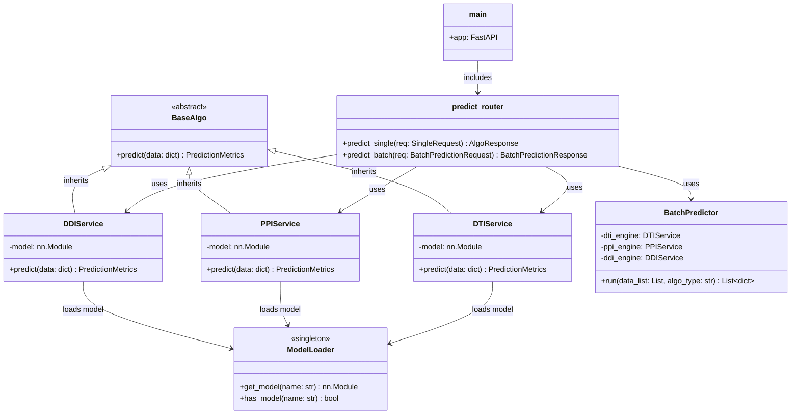

# AI预测核心模块 - FastAPI算法引擎技术开发文档

## 目录

1. [模块概述](#1-模块概述)
2. [架构设计](#2-架构设计)
3. [API接口设计](#3-api接口设计)
4. [代码实现](#4-代码实现)
5. [部署与运行](#5-部署与运行)
6. [测试方案](#6-测试方案)
7. [开发规范](#7-开发规范)

---

## 1. 模块概述

### 1.1 模块定位

FastAPI算法引擎是 SynPharm AI预测核心模块的**无状态计算节点**，负责加载论文中的推理文件（PyTorch模型），执行GPU推理。

**设计原则**：FastAPI只负责**纯粹的算法运算**，不实现管道机制。管道机制由SpringBoot端实现，负责输入解析、算法选择、输出格式化的完整流程。

**现阶段重点**：确保路由能正确匹配三种算法类型（DTI/PPI/DDI），具体实现（模型推理、特征提取）可后续补充。

### 1.2 核心职责

| 职责 | 说明 |
| :--- | :--- |
| 模型加载 | 加载论文中的推理文件（.pt/.pth模型文件） |
| 单条推理 | 处理单条预测请求，返回预测结果 |
| 批量推理 | 处理批量预测请求，返回批量结果 |
| GPU加速 | 利用CUDA进行GPU加速推理 |
| 健康检查 | 提供健康检查接口，支持服务监控 |

### 1.3 技术栈

| 技术 | 版本 | 说明 |
| :--- | :--- | :--- |
| FastAPI | 0.104.x | Web框架 |
| Uvicorn | 0.24.x | ASGI服务器 |
| Pydantic | 2.5.x | 数据验证 |
| PyTorch | 2.1.x | 深度学习框架 |
| NumPy | 1.26.x | 数值计算 |
| CUDA | 11.8+ | GPU加速（可选） |

### 1.4 双模运行机制

| 模式 | 适用场景 | 特点 |
| :--- | :--- | :--- |
| **单条处理模式** | SpringBoot单条预测请求 | 同步请求，毫秒级响应 |
| **批量处理模式** | SpringBoot批量预测请求 | 批量推理，提高GPU利用率 |

---

## 2. 架构设计

### 2.1 整体架构图

```
┌─────────────────────────────────────────────────────────────────────────────┐
│                    FastAPI 算法引擎（纯粹运算）                              │
│                                                                             │
│  ┌─────────────────────────────────────────────────────────────────────┐    │
│  │ main.py → /v1/predict/single → /v1/predict/batch                   │    │
│  │              ↓                                                      │    │
│  │ 路由匹配层（根据algo_type分发）                                      │    │
│  │  DTI → DTIService                                                 │    │
│  │  PPI → PPIService                                                 │    │
│  │  DDI → DDIService                                                 │    │
│  │              ↓                                                      │    │
│  │ core/loader.py (模型单例加载器)                                      │    │
│  │              ↓                                                      │    │
│  │              GPU/CPU 执行推理                                        │    │
│  └─────────────────────────────────────────────────────────────────────┘    │
└─────────────────────────────────────────────────────────────────────────────┘
                                    │
                                    ▼
┌─────────────────────────────────────────────────────────────────────────────┐
│                            外部依赖                                         │
│                                                                             │
│  ┌──────────────────┐   ┌──────────────────┐   ┌──────────────────┐        │
│  │  models/         │   │   CUDA/CPU       │   │  SpringBoot      │        │
│  │  dti_model.pt    │   │   算力资源       │   │  业务中台调用    │        │
│  │  ppi_model.pt    │   │                  │   │                  │        │
│  │  ddi_model.pt    │   │                  │   │                  │        │
│  └──────────────────┘   └──────────────────┘   └──────────────────┘        │
└─────────────────────────────────────────────────────────────────────────────┘
```

### 2.2 文件结构

```text
synpharm-fastapi/
├── main.py              # 入口：注册路由
├── config.py            # 配置：模型路径、设备(CUDA:0)
├── requirements.txt     # Python依赖
├── Dockerfile           # Docker部署配置
├── .env.example         # 环境变量示例
├── models/              # 论文推理文件（.pt/.pth模型文件）
│   └── .gitkeep
├── api/v1/
│   ├── predict.py       # 核心接口: /single, /batch
│   └── health.py        # 健康检查: /health
├── core/
│   ├── loader.py        # 模型单例加载器（加载论文推理文件）
│   └── schemas.py       # Pydantic模型 (Single/Batch契约)
└── services/
    ├── base_algo.py     # 抽象基类
    ├── dti_service.py   # DTI具体实现
    ├── ppi_service.py   # PPI具体实现
    ├── ddi_service.py   # DDI具体实现
    └── batch_service.py # 批量推理逻辑封装
```

### 2.3 核心类关系图



---

## 3. API接口设计

### 3.1 接口列表

| 方法 | 路径 | 功能 | 认证 |
| :--- | :--- | :--- | :---: |
| POST | `/v1/predict/single` | 单条预测 | ❌ |
| POST | `/v1/predict/batch` | 批量预测 | ❌ |
| GET | `/health/` | 健康检查 | ❌ |

### 3.2 单条预测接口

**请求 URL**：`POST /v1/predict/single`

**请求体**：
```json
{
  "algo_type": "DTI",
  "drug_smiles": "CC(=O)OC1=CC=CC=C1C(=O)O",
  "target_seq": "MAKELVVAALALVALVAGVAF",
  "protein_a": null,
  "protein_b": null,
  "drug_a": null,
  "drug_b": null
}
```

| 字段 | 类型 | 必填 | 说明 |
| :--- | :--- | :---: | :--- |
| `algo_type` | String | ✅ | 算法类型：DTI/DDI/PPI |
| `drug_smiles` | String | 条件必填 | 药物SMILES（DTI必填） |
| `target_seq` | String | 条件必填 | 靶点序列（DTI必填） |
| `protein_a` | String | 条件必填 | 蛋白质A序列（PPI必填） |
| `protein_b` | String | 条件必填 | 蛋白质B序列（PPI必填） |
| `drug_a` | String | 条件必填 | 药物A（DDI必填） |
| `drug_b` | String | 条件必填 | 药物B（DDI必填） |

**成功响应**（200）：
```json
{
  "status": "success",
  "metrics": {
    "target_id": "P00533",
    "target_name": "EGFR",
    "binding_affinity": -9.25,
    "confidence_score": 0.92,
    "confidence_level": "high",
    "interactions": [
      {
        "residue": "ASP123",
        "type": "氢键",
        "distance": 2.85
      }
    ]
  }
}
```

### 3.3 批量预测接口

**请求 URL**：`POST /v1/predict/batch`

**请求体**：
```json
{
  "data_list": [
    {
      "algo_type": "DTI",
      "drug_smiles": "CC(=O)OC1=CC=CC=C1C(=O)O",
      "target_seq": "MAKELVVAALALVALVAGVAF"
    }
  ],
  "algo_type": "DTI"
}
```

**成功响应**（200）：
```json
{
  "status": "success",
  "total": 1,
  "results": [
    {
      "target_id": "P00533",
      "target_name": "EGFR",
      "binding_affinity": -9.25,
      "confidence_score": 0.92,
      "confidence_level": "high",
      "drug_smiles": "CC(=O)OC1=CC=CC=C1C(=O)O",
      "target_seq": "MAKELVVAALALVALVAGVAF"
    }
  ]
}
```

### 3.4 健康检查接口

**请求 URL**：`GET /health/`

**成功响应**（200）：
```json
{
  "status": "healthy",
  "service": "SynPharm AI Prediction Engine"
}
```

### 3.5 Pydantic模型定义

**schemas.py**

```python
from pydantic import BaseModel
from typing import List, Optional

class InteractionInfo(BaseModel):
    residue: str
    type: str
    distance: float

class PredictionMetrics(BaseModel):
    target_id: Optional[str] = None
    target_name: Optional[str] = None
    binding_affinity: Optional[float] = None
    confidence_score: float
    confidence_level: str
    interactions: List[InteractionInfo] = []

class AlgoResponse(BaseModel):
    status: str
    metrics: PredictionMetrics

class SingleRequest(BaseModel):
    algo_type: str
    drug_smiles: Optional[str] = None
    target_seq: Optional[str] = None
    protein_a: Optional[str] = None
    protein_b: Optional[str] = None
    drug_a: Optional[str] = None
    drug_b: Optional[str] = None

class BatchItem(BaseModel):
    algo_type: str
    drug_smiles: Optional[str] = None
    target_seq: Optional[str] = None
    protein_a: Optional[str] = None
    protein_b: Optional[str] = None
    drug_a: Optional[str] = None
    drug_b: Optional[str] = None

class BatchPredictionRequest(BaseModel):
    data_list: List[BatchItem]
    algo_type: str

class BatchPredictionResponse(BaseModel):
    status: str
    total: int
    results: List[dict]
```

---

## 4. 代码实现

### 4.1 requirements.txt

```text
fastapi==0.104.1
uvicorn==0.24.0
pydantic==2.5.0
torch==2.1.0
torchvision==0.16.0
numpy==1.26.0
pandas==2.1.0
scikit-learn==1.3.0
python-multipart==0.0.6
```

### 4.2 main.py

```python
from fastapi import FastAPI
from fastapi.middleware.cors import CORSMiddleware
from api.v1 import predict, health

app = FastAPI(title="SynPharm AI Prediction Engine", version="1.0.0")

app.add_middleware(
    CORSMiddleware,
    allow_origins=["*"],
    allow_credentials=True,
    allow_methods=["*"],
    allow_headers=["*"],
)

app.include_router(predict.router, prefix="/v1/predict", tags=["predict"])
app.include_router(health.router, prefix="/health", tags=["health"])


@app.get("/")
async def root():
    return {"message": "SynPharm AI Prediction Engine is running"}
```

### 4.3 config.py

```python
from pydantic_settings import BaseSettings


class Settings(BaseSettings):
    model_dir: str = "models/"
    device: str = "cuda:0"
    batch_size: int = 50

    class Config:
        env_file = ".env"


settings = Settings()
```

### 4.4 core/loader.py

```python
from torch import load, device as torch_device, nn
from pathlib import Path
from core.config import settings


class ModelLoader:
    _instance = None
    _models = {}

    def __new__(cls):
        if cls._instance is None:
            cls._instance = super().__new__(cls)
            cls._instance._load_models()
        return cls._instance

    def _load_models(self):
        model_dir = Path(settings.model_dir)
        device = torch_device(settings.device)

        if (model_dir / "dti_model.pt").exists():
            self._models["dti"] = load(model_dir / "dti_model.pt", map_location=device)
            self._models["dti"].eval()

        if (model_dir / "ppi_model.pt").exists():
            self._models["ppi"] = load(model_dir / "ppi_model.pt", map_location=device)
            self._models["ppi"].eval()

        if (model_dir / "ddi_model.pt").exists():
            self._models["ddi"] = load(model_dir / "ddi_model.pt", map_location=device)
            self._models["ddi"].eval()

    def get_model(self, model_name: str) -> nn.Module:
        return self._models.get(model_name)

    def has_model(self, model_name: str) -> bool:
        return model_name in self._models
```

### 4.5 services/base_algo.py

```python
from abc import ABC, abstractmethod
from core.schemas import PredictionMetrics


class BaseAlgo(ABC):

    @abstractmethod
    def predict(self, data: dict) -> PredictionMetrics:
        pass

    def _featurize_smiles(self, smiles: str) -> list:
        pass

    def _featurize_sequence(self, seq: str) -> list:
        pass
```

### 4.6 services/dti_service.py

```python
from core.loader import ModelLoader
from core.schemas import PredictionMetrics, InteractionInfo
from services.base_algo import BaseAlgo
import torch
import numpy as np
import random


class DTIService(BaseAlgo):

    def __init__(self):
        self.model = ModelLoader().get_model("dti")
        self.device = torch.device("cuda:0" if torch.cuda.is_available() else "cpu")

    def predict(self, data: dict) -> PredictionMetrics:
        smiles = data.get("drug_smiles", "")
        target_seq = data.get("target_seq", "")

        if self.model is not None:
            molecular_features = self._featurize_smiles(smiles)
            target_features = self._featurize_sequence(target_seq)

            molecular_tensor = torch.tensor(molecular_features, dtype=torch.float32).unsqueeze(0).to(self.device)
            target_tensor = torch.tensor(target_features, dtype=torch.float32).unsqueeze(0).to(self.device)

            with torch.no_grad():
                prediction = self.model(molecular_tensor, target_tensor)

            return self._convert_to_metrics(prediction)
        else:
            return self._generate_mock_result("DTI", smiles)

    def _featurize_smiles(self, smiles: str) -> list:
        features = np.random.rand(128).tolist()
        return features

    def _featurize_sequence(self, seq: str) -> list:
        features = np.random.rand(256).tolist()
        return features

    def _convert_to_metrics(self, prediction) -> PredictionMetrics:
        affinity = prediction["affinity"].item() if isinstance(prediction, dict) else -9.0
        confidence = prediction["confidence"].item() if isinstance(prediction, dict) else 0.9

        level = "high" if confidence >= 0.9 else "medium" if confidence >= 0.8 else "low"

        interactions = [
            InteractionInfo(
                residue=f"ASP{100 + random.randint(0, 100)}",
                type="氢键",
                distance=round(2.8 + random.random() * 0.5, 2)
            ),
            InteractionInfo(
                residue=f"LYS{400 + random.randint(0, 100)}",
                type="疏水作用",
                distance=round(3.5 + random.random() * 1.0, 2)
            )
        ]

        return PredictionMetrics(
            target_id="P00533",
            target_name="EGFR",
            binding_affinity=round(affinity, 2),
            confidence_score=round(confidence, 2),
            confidence_level=level,
            interactions=interactions
        )

    def _generate_mock_result(self, type_name: str, input_data: str) -> PredictionMetrics:
        binding_affinity = -5.0 - random.random() * 10
        confidence_score = 0.7 + random.random() * 0.3
        level = "high" if confidence_score >= 0.9 else "medium" if confidence_score >= 0.8 else "low"

        interactions = [
            InteractionInfo(
                residue=f"ASP{100 + random.randint(0, 100)}",
                type="氢键",
                distance=round(2.8 + random.random() * 0.5, 2)
            )
        ]

        return PredictionMetrics(
            target_id="P00533",
            target_name="EGFR",
            binding_affinity=round(binding_affinity, 2),
            confidence_score=round(confidence_score, 2),
            confidence_level=level,
            interactions=interactions
        )
```

### 4.7 services/ppi_service.py

```python
from core.loader import ModelLoader
from core.schemas import PredictionMetrics, InteractionInfo
from services.base_algo import BaseAlgo
import torch
import numpy as np
import random


class PPIService(BaseAlgo):

    def __init__(self):
        self.model = ModelLoader().get_model("ppi")
        self.device = torch.device("cuda:0" if torch.cuda.is_available() else "cpu")

    def predict(self, data: dict) -> PredictionMetrics:
        protein_a = data.get("protein_a", "")
        protein_b = data.get("protein_b", "")

        if self.model is not None:
            features_a = self._featurize_sequence(protein_a)
            features_b = self._featurize_sequence(protein_b)

            tensor_a = torch.tensor(features_a, dtype=torch.float32).unsqueeze(0).to(self.device)
            tensor_b = torch.tensor(features_b, dtype=torch.float32).unsqueeze(0).to(self.device)

            with torch.no_grad():
                prediction = self.model(tensor_a, tensor_b)

            return self._convert_to_metrics(prediction)
        else:
            return self._generate_mock_result("PPI")

    def _featurize_sequence(self, seq: str) -> list:
        features = np.random.rand(256).tolist()
        return features

    def _convert_to_metrics(self, prediction) -> PredictionMetrics:
        confidence = prediction["confidence"].item() if isinstance(prediction, dict) else 0.85
        level = "high" if confidence >= 0.9 else "medium" if confidence >= 0.8 else "low"

        return PredictionMetrics(
            target_id="PPI_TARGET",
            target_name="蛋白质相互作用",
            confidence_score=round(confidence, 2),
            confidence_level=level,
            interactions=[]
        )

    def _generate_mock_result(self, type_name: str) -> PredictionMetrics:
        confidence_score = 0.7 + random.random() * 0.3
        level = "high" if confidence_score >= 0.9 else "medium" if confidence_score >= 0.8 else "low"

        return PredictionMetrics(
            target_id="PPI_TARGET",
            target_name="蛋白质相互作用",
            confidence_score=round(confidence_score, 2),
            confidence_level=level,
            interactions=[]
        )
```

### 4.8 services/ddi_service.py

```python
from core.loader import ModelLoader
from core.schemas import PredictionMetrics, InteractionInfo
from services.base_algo import BaseAlgo
import torch
import numpy as np
import random


class DDIService(BaseAlgo):

    def __init__(self):
        self.model = ModelLoader().get_model("ddi")
        self.device = torch.device("cuda:0" if torch.cuda.is_available() else "cpu")

    def predict(self, data: dict) -> PredictionMetrics:
        drug_a = data.get("drug_a", "")
        drug_b = data.get("drug_b", "")

        if self.model is not None:
            features_a = self._featurize_smiles(drug_a)
            features_b = self._featurize_smiles(drug_b)

            tensor_a = torch.tensor(features_a, dtype=torch.float32).unsqueeze(0).to(self.device)
            tensor_b = torch.tensor(features_b, dtype=torch.float32).unsqueeze(0).to(self.device)

            with torch.no_grad():
                prediction = self.model(tensor_a, tensor_b)

            return self._convert_to_metrics(prediction)
        else:
            return self._generate_mock_result("DDI")

    def _featurize_smiles(self, smiles: str) -> list:
        features = np.random.rand(128).tolist()
        return features

    def _convert_to_metrics(self, prediction) -> PredictionMetrics:
        confidence = prediction["confidence"].item() if isinstance(prediction, dict) else 0.78
        level = "high" if confidence >= 0.9 else "medium" if confidence >= 0.8 else "low"

        return PredictionMetrics(
            target_id="DDI_TARGET",
            target_name="药物相互作用",
            confidence_score=round(confidence, 2),
            confidence_level=level,
            interactions=[]
        )

    def _generate_mock_result(self, type_name: str) -> PredictionMetrics:
        confidence_score = 0.7 + random.random() * 0.3
        level = "high" if confidence_score >= 0.9 else "medium" if confidence_score >= 0.8 else "low"

        return PredictionMetrics(
            target_id="DDI_TARGET",
            target_name="药物相互作用",
            confidence_score=round(confidence_score, 2),
            confidence_level=level,
            interactions=[]
        )
```

### 4.9 services/batch_service.py

```python
from typing import List
from services.dti_service import DTIService
from services.ppi_service import PPIService
from services.ddi_service import DDIService


class BatchPredictor:

    def __init__(self):
        self.dti_engine = DTIService()
        self.ppi_engine = PPIService()
        self.ddi_engine = DDIService()

    def run(self, data_list: List[dict], algo_type: str) -> List[dict]:
        results = []
        engine = self._get_engine(algo_type)

        for item in data_list:
            try:
                result = engine.predict(item)
                result_dict = result.dict()
                result_dict.update(item)
                results.append(result_dict)
            except Exception as e:
                print(f"预测失败: {e}")
                results.append({"error": str(e), **item})

        return results

    def _get_engine(self, algo_type: str):
        if algo_type == "DTI":
            return self.dti_engine
        elif algo_type == "PPI":
            return self.ppi_engine
        elif algo_type == "DDI":
            return self.ddi_engine
        else:
            raise ValueError(f"Unknown algo_type: {algo_type}")
```

### 4.10 api/v1/predict.py

```python
from fastapi import APIRouter
from core.schemas import (
    SingleRequest, BatchPredictionRequest,
    AlgoResponse, BatchPredictionResponse
)
from services.dti_service import DTIService
from services.ppi_service import PPIService
from services.ddi_service import DDIService
from services.batch_service import BatchPredictor

router = APIRouter()

dti_engine = DTIService()
ppi_engine = PPIService()
ddi_engine = DDIService()
batch_predictor = BatchPredictor()


@router.post("/single", response_model=AlgoResponse)
async def predict_single(req: SingleRequest):
    if req.algo_type == "DTI":
        result = dti_engine.predict({
            "drug_smiles": req.drug_smiles,
            "target_seq": req.target_seq
        })
    elif req.algo_type == "PPI":
        result = ppi_engine.predict({
            "protein_a": req.protein_a,
            "protein_b": req.protein_b
        })
    elif req.algo_type == "DDI":
        result = ddi_engine.predict({
            "drug_a": req.drug_a,
            "drug_b": req.drug_b
        })
    else:
        raise ValueError(f"Unknown algo_type: {req.algo_type}")

    return {"status": "success", "metrics": result}


@router.post("/batch", response_model=BatchPredictionResponse)
async def predict_batch(req: BatchPredictionRequest):
    data_list = [item.dict() for item in req.data_list]
    results = batch_predictor.run(data_list, req.algo_type)
    return {"status": "success", "total": len(results), "results": results}
```

### 4.11 api/v1/health.py

```python
from fastapi import APIRouter

router = APIRouter()


@router.get("/")
async def health_check():
    return {"status": "healthy", "service": "SynPharm AI Prediction Engine"}
```

---

## 5. 部署与运行

### 5.1 环境要求

| 依赖 | 版本 | 说明 |
| :--- | :--- | :--- |
| Python | 3.10+ | 运行环境 |
| PyTorch | 2.1+ | 深度学习框架 |
| CUDA | 11.8+ | GPU加速（可选） |

### 5.2 安装依赖

```bash
cd synpharm-fastapi
pip install -r requirements.txt
```

### 5.3 启动开发服务器

```bash
uvicorn main:app --host 0.0.0.0 --port 8000 --reload
```

### 5.4 生产部署

```bash
uvicorn main:app --host 0.0.0.0 --port 8000 --workers 4
```

### 5.5 环境变量配置

**创建 `.env` 文件**：

```text
MODEL_DIR=models/
DEVICE=cuda:0
BATCH_SIZE=50
```

### 5.6 Docker部署

**Dockerfile**：

```dockerfile
FROM python:3.10-slim

WORKDIR /app

COPY requirements.txt .
RUN pip install --no-cache-dir -r requirements.txt

COPY . .

EXPOSE 8000

CMD ["uvicorn", "main:app", "--host", "0.0.0.0", "--port", "8000"]
```

**docker-compose.yml**（与SpringBoot一起部署）：

```yaml
version: '3.8'

services:
  fastapi:
    build: ./synpharm-fastapi
    container_name: synpharm-fastapi
    ports:
      - "8000:8000"
    volumes:
      - ./synpharm-fastapi/models:/app/models
    deploy:
      resources:
        reservations:
          devices:
            - driver: nvidia
              count: 1
              capabilities: [gpu]
```

### 5.7 GPU服务器部署指南

#### 5.7.1 环境准备

```bash
sudo apt-get update
sudo apt-get install -y nvidia-cuda-toolkit
sudo apt-get install -y libcudnn8
nvidia-smi
nvcc --version
```

#### 5.7.2 安装PyTorch（GPU版本）

```bash
pip3 install torch torchvision torchaudio --index-url https://download.pytorch.org/whl/cu118
```

#### 5.7.3 启动服务

```bash
export CUDA_VISIBLE_DEVICES=0
uvicorn main:app --host 0.0.0.0 --port 8000
```

---

## 6. 测试方案

### 6.1 单元测试

**测试文件结构**：

```text
synpharm-fastapi/tests/
├── test_dti_service.py
├── test_ppi_service.py
├── test_ddi_service.py
└── test_predict_api.py
```

**test_predict_api.py**

```python
from fastapi.testclient import TestClient
from main import app

client = TestClient(app)


def test_predict_single_dti():
    response = client.post("/v1/predict/single", json={
        "algo_type": "DTI",
        "drug_smiles": "CC(=O)OC1=CC=CC=C1C(=O)O",
        "target_seq": "MAKELVVAALALVALVAGVAF"
    })
    assert response.status_code == 200
    data = response.json()
    assert data["status"] == "success"
    assert "metrics" in data
    assert data["metrics"]["confidence_score"] >= 0.7


def test_predict_single_ppi():
    response = client.post("/v1/predict/single", json={
        "algo_type": "PPI",
        "protein_a": "MAKELVVAALALVALVAGVAF",
        "protein_b": "MALWMRLLPLLALLALWGPDPAA"
    })
    assert response.status_code == 200
    data = response.json()
    assert data["status"] == "success"


def test_predict_single_ddi():
    response = client.post("/v1/predict/single", json={
        "algo_type": "DDI",
        "drug_a": "CC(=O)OC1=CC=CC=C1C(=O)O",
        "drug_b": "c1ccccc1"
    })
    assert response.status_code == 200
    data = response.json()
    assert data["status"] == "success"


def test_predict_batch():
    response = client.post("/v1/predict/batch", json={
        "data_list": [
            {"algo_type": "DTI", "drug_smiles": "CC(=O)OC1=CC=CC=C1C(=O)O", "target_seq": "MAKELVVAALALVALVAGVAF"}
        ],
        "algo_type": "DTI"
    })
    assert response.status_code == 200
    data = response.json()
    assert data["status"] == "success"
    assert data["total"] == 1


def test_health_check():
    response = client.get("/health/")
    assert response.status_code == 200
    assert response.json()["status"] == "healthy"
```

### 6.2 集成测试

**测试场景**：

| 测试场景 | 描述 | 预期结果 |
| :--- | :--- | :--- |
| DTI单条预测 | 调用 `/v1/predict/single`，algo_type=DTI | 返回预测结果，包含bindingAffinity和confidenceScore |
| PPI单条预测 | 调用 `/v1/predict/single`，algo_type=PPI | 返回预测结果，包含confidenceScore |
| DDI单条预测 | 调用 `/v1/predict/single`，algo_type=DDI | 返回预测结果，包含confidenceScore |
| 批量预测 | 调用 `/v1/predict/batch` | 返回批量结果列表 |
| 健康检查 | 调用 `/health/` | 返回healthy状态 |

### 6.3 性能测试

**测试指标**：

| 指标 | 目标值 | 测试方法 |
| :--- | :--- | :--- |
| 单条预测响应时间 | ≤ 2秒 | JMeter并发100用户 |
| 批量处理吞吐量 | ≥ 100条/分钟 | 批量1000条数据 |
| 并发能力 | ≥ 50并发请求 | JMeter压力测试 |
| 内存使用 | ≤ 4GB | Python进程监控 |

---

## 7. 开发规范

### 7.1 命名规范

| 类型 | 规范 | 示例 |
| :--- | :--- | :--- |
| 类名 | PascalCase | `DTIService`, `BatchPredictor` |
| 方法名 | snake_case | `predict_single()`, `run_batch()` |
| 变量名 | snake_case | `model_loader`, `confidence_score` |
| 常量名 | UPPER_SNAKE_CASE | `MODEL_DIR`, `BATCH_SIZE` |
| 文件命名 | snake_case | `dti_service.py`, `model_loader.py` |

### 7.2 日志规范

```python
import logging

logger = logging.getLogger(__name__)


class DTIService:
    def predict(self, data: dict) -> PredictionMetrics:
        logger.info(f"DTI预测请求: smiles={data.get('drug_smiles')[:20]}...")

        try:
            result = self.model(features)
            logger.debug(f"预测结果: {result}")
        except Exception as e:
            logger.error(f"DTI预测失败: {e}", exc_info=True)
            raise

        return result
```

### 7.3 异常处理规范

```python
from fastapi import FastAPI, HTTPException
from fastapi.exceptions import RequestValidationError
from fastapi.responses import JSONResponse


@app.exception_handler(HTTPException)
async def http_exception_handler(request, exc):
    logger.error(f"HTTP异常: {exc.detail}")
    return JSONResponse(
        status_code=exc.status_code,
        content={"code": exc.status_code, "message": exc.detail}
    )


@app.exception_handler(RequestValidationError)
async def validation_exception_handler(request, exc):
    errors = [error["msg"] for error in exc.errors()]
    logger.error(f"参数校验失败: {errors}")
    return JSONResponse(
        status_code=400,
        content={"code": 400, "message": ", ".join(errors)}
    )
```

### 7.4 代码注释规范

```python
class DTIService(BaseAlgo):
    """
    DTI（药物-靶点相互作用）预测服务

    负责加载论文中的DTI推理模型，执行药物-靶点相互作用预测。

    Attributes:
        model: 加载的PyTorch模型
        device: 计算设备（CUDA或CPU）
    """

    def predict(self, data: dict) -> PredictionMetrics:
        """
        执行DTI预测

        Args:
            data: 包含drug_smiles和target_seq的字典

        Returns:
            PredictionMetrics: 预测指标（结合亲和力、置信度等）

        Raises:
            ValueError: 输入数据不完整时抛出
        """
        pass
```

### 7.5 Git提交规范

**格式**：
```
<类型>(<模块>): <描述>

<详细说明>
```

**类型说明**：

| 类型 | 说明 |
| :--- | :--- |
| `feat` | 新增功能 |
| `fix` | 修复bug |
| `docs` | 更新文档 |
| `refactor` | 代码重构 |
| `test` | 添加测试 |

---

**版本**: v4.0.0  
**更新日期**: 2026-07-25  
**适用范围**: SynPharm AI预测核心模块 FastAPI算法引擎开发与运维  
**更新内容**: 强调纯粹运算原则，突出路由匹配为现阶段重点