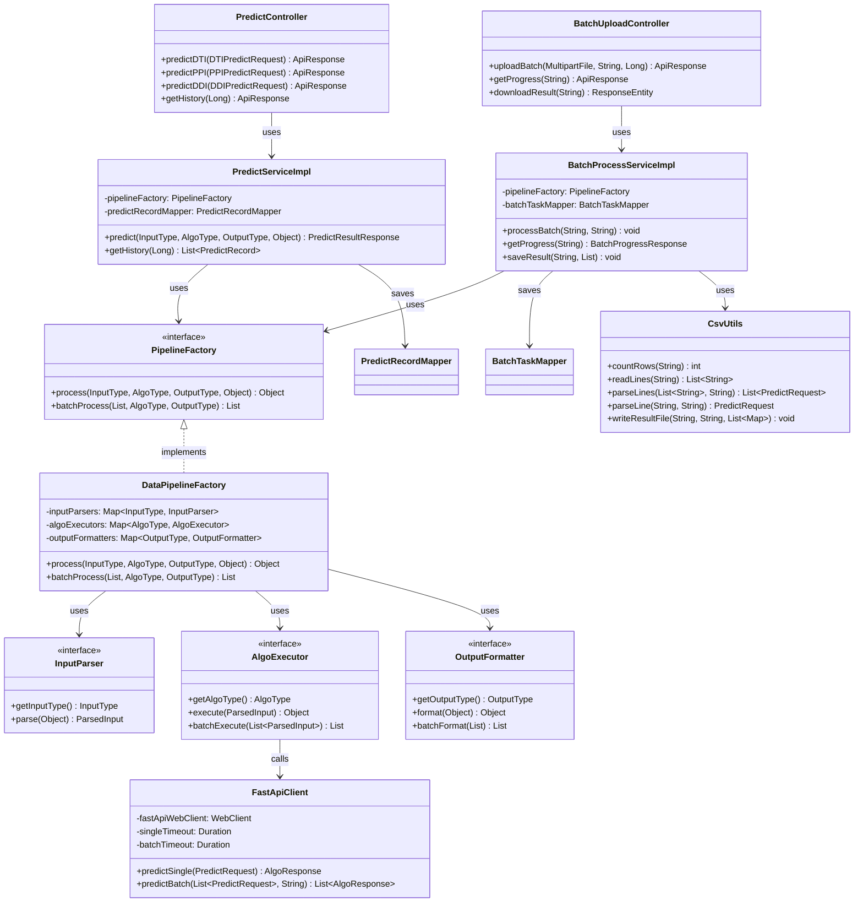

# AI预测核心模块 - SpringBoot后端技术开发文档

## 目录

1. [模块概述](#1-模块概述)
2. [架构设计](#2-架构设计)
3. [数据库设计](#3-数据库设计)
4. [API接口设计](#4-api接口设计)
5. [代码实现](#5-代码实现)
6. [部署与运行](#6-部署与运行)
7. [测试方案](#7-测试方案)
8. [开发规范](#8-开发规范)

---

## 1. 模块概述

### 1.1 模块定位

SpringBoot后端是 SynPharm AI预测核心模块的**业务中台**，负责处理用户认证、预测请求管理、批量任务调度、结果存储等业务逻辑，并调用FastAPI算法引擎执行实际的AI推理。

### 1.2 核心职责

| 职责 | 说明 |
| :--- | :--- |
| 用户认证 | 登录、注册、Token管理 |
| 单条预测 | 接收前端请求，调用FastAPI，返回结果 |
| 批量预测 | CSV上传、任务调度、进度追踪、结果下载 |
| 数据管理 | 预测记录存储、历史查询 |
| 服务集成 | WebClient调用FastAPI接口 |

### 1.3 技术栈

| 技术 | 版本 | 说明 |
| :--- | :--- | :--- |
| Spring Boot | 3.2.x | 后端框架 |
| MyBatis-Plus | 3.5.x | ORM框架 |
| MySQL | 8.0+ | 数据库 |
| WebClient | Spring WebFlux | HTTP客户端 |
| Spring Security | 6.2.x | 安全框架 |
| JWT | 0.12.x | Token认证 |
| Redis | 7.0+ | 缓存（可选） |

### 1.4 双模运行机制

| 模式 | 适用场景 | 特点 |
| :--- | :--- | :--- |
| **单条处理模式** | 前端单条预测请求 | 同步请求，毫秒级响应 |
| **批量处理模式** | 前端CSV批量上传 | 异步任务，进度实时追踪 |

---

## 2. 架构设计

### 2.1 整体架构图

```
┌─────────────────────────────────────────────────────────────────────────────┐
│                    SpringBoot 业务中台（管道机制）                          │
│                                                                             │
│  ┌─────────────────────────────────────────────────────────────────────┐    │
│  │  Controller层                                                       │    │
│  │  PredictController → /api/predict/*                                │    │
│  │  BatchUploadController → /api/batch/upload                         │    │
│  │  UserController → /api/auth/login                                  │    │
│  │              ↓                                                      │    │
│  │  Service层                                                         │    │
│  │  PredictServiceImpl → 调用管道工厂                                   │    │
│  │  BatchProcessServiceImpl → Redis进度+异步批量处理                     │    │
│  │  UserServiceImpl → 用户认证逻辑                                     │    │
│  │              ↓                                                      │    │
│  │  Pipeline层（策略模式）                                             │    │
│  │  DataPipelineFactory → 动态组合策略                                 │    │
│  │     ├── InputParser → 解析输入（SMILES/UniProt/PDB/CSV）           │    │
│  │     ├── AlgoExecutor → 执行算法（DTI/PPI/DDI）                    │    │
│  │     └── OutputFormatter → 格式化输出（JSON/CSV）                   │    │
│  │              ↓                                                      │    │
│  │  Client层                                                          │    │
│  │  FastApiClient → WebClient调用FastAPI接口                            │    │
│  │              ↓                                                      │    │
│  │  Mapper层 + MySQL                                                   │    │
│  │  PredictRecordMapper → 预测记录                                      │    │
│  │  BatchTaskMapper → 批量任务记录                                      │    │
│  │  UserMapper → 用户信息                                               │    │
│  └─────────────────────────────────────────────────────────────────────┘    │
└─────────────────────────────────────────────────────────────────────────────┘
                                    │
                                    ▼
┌─────────────────────────────────────────────────────────────────────────────┐
│                            外部依赖                                         │
│                                                                             │
│  ┌──────────────────┐   ┌──────────────────┐   ┌──────────────────┐        │
│  │  FastAPI         │   │   MySQL          │   │  Redis           │        │
│  │  /v1/predict/    │   │   数据库         │   │  缓存/进度存储    │        │
│  └──────────────────┘   └──────────────────┘   └──────────────────┘        │
└─────────────────────────────────────────────────────────────────────────────┘
```

### 2.2 文件结构

```text
synpharm-backend/
├── src/main/java/com/synpharm/
│   ├── SynpharmApplication.java   # 启动类
│   ├── api/                       # 控制器层
│   │   ├── PredictController.java
│   │   ├── BatchUploadController.java
│   │   └── UserController.java
│   ├── service/                   # 服务层
│   │   ├── PredictService.java
│   │   ├── BatchProcessService.java
│   │   ├── UserService.java
│   │   └── impl/
│   │       ├── PredictServiceImpl.java
│   │       ├── BatchProcessServiceImpl.java
│   │       └── UserServiceImpl.java
│   ├── pipeline/                  # 管道机制（策略模式）
│   │   ├── InputParser.java          # 输入解析器接口
│   │   ├── AlgoExecutor.java         # 算法执行器接口
│   │   ├── OutputFormatter.java      # 输出格式化器接口
│   │   ├── PipelineFactory.java      # 管道工厂接口
│   │   ├── DataPipelineFactory.java  # 管道工厂实现
│   │   ├── ParsedInput.java          # 解析后输入DTO
│   │   └── impl/                     # 管道实现类
│   │       ├── SmilesInputParser.java
│   │       ├── DtiAlgoExecutor.java
│   │       ├── JsonOutputFormatter.java
│   │       └── ...                   # 待开发实现类
│   ├── client/                    # 外部服务调用层
│   │   └── FastApiClient.java
│   ├── mapper/                    # 数据访问层
│   │   ├── PredictRecordMapper.java
│   │   ├── BatchTaskMapper.java
│   │   └── UserMapper.java
│   ├── entity/                    # 数据库实体
│   │   ├── PredictRecord.java
│   │   ├── BatchTask.java
│   │   └── User.java
│   ├── dto/                       # 数据传输对象
│   │   ├── request/
│   │   │   ├── DTIPredictRequest.java
│   │   │   ├── PPIPredictRequest.java
│   │   │   ├── DDIPredictRequest.java
│   │   │   ├── PredictRequest.java
│   │   │   └── BatchUploadRequest.java
│   │   └── response/
│   │       ├── PredictResultResponse.java
│   │       ├── AlgoResponse.java
│   │       ├── BatchProgressResponse.java
│   │       └── ApiResponse.java
│   ├── config/                    # 配置类
│   │   ├── WebClientConfig.java
│   │   ├── AsyncConfig.java
│   │   └── SecurityConfig.java
│   ├── utils/                     # 工具类
│   │   ├── CsvUtils.java
│   │   └── JwtUtils.java
│   └── exception/                 # 异常处理
│       ├── GlobalExceptionHandler.java
│       ├── BusinessException.java
│       └── PipelineException.java    # 管道异常
├── src/main/resources/
│   ├── application.yml            # 配置文件
│   ├── mapper/                    # MyBatis映射文件
│   │   ├── PredictRecordMapper.xml
│   │   ├── BatchTaskMapper.xml
│   │   └── UserMapper.xml
│   └── schema.sql                 # 数据库初始化脚本
└── pom.xml                        # Maven配置
```

### 2.3 核心类关系图



---

## 3. 数据库设计

### 3.1 数据库表设计

#### 3.1.1 用户表 `sys_user`

| 字段名 | 类型 | 约束 | 说明 |
| :--- | :--- | :--- | :--- |
| `id` | BIGINT | PRIMARY KEY, AUTO_INCREMENT | 用户ID |
| `username` | VARCHAR(50) | NOT NULL, UNIQUE | 用户名 |
| `password` | VARCHAR(255) | NOT NULL | 密码（加密存储） |
| `email` | VARCHAR(100) | UNIQUE | 邮箱 |
| `phone` | VARCHAR(20) | UNIQUE | 手机号 |
| `status` | TINYINT | DEFAULT 1 | 状态（0禁用，1启用） |
| `create_time` | DATETIME | DEFAULT CURRENT_TIMESTAMP | 创建时间 |
| `update_time` | DATETIME | ON UPDATE CURRENT_TIMESTAMP | 更新时间 |

#### 3.1.2 预测记录表 `predict_record`

| 字段名 | 类型 | 约束 | 说明 |
| :--- | :--- | :--- | :--- |
| `id` | BIGINT | PRIMARY KEY, AUTO_INCREMENT | 记录ID |
| `user_id` | BIGINT | NOT NULL, FOREIGN KEY | 用户ID |
| `algo_type` | VARCHAR(20) | NOT NULL | 算法类型（DTI/PPI/DDI） |
| `input_data` | TEXT | NOT NULL | 输入数据（JSON格式） |
| `result_data` | TEXT | | 预测结果（JSON格式） |
| `confidence_score` | DECIMAL(5,2) | | 置信度分数 |
| `confidence_level` | VARCHAR(20) | | 置信度等级 |
| `create_time` | DATETIME | DEFAULT CURRENT_TIMESTAMP | 创建时间 |

#### 3.1.3 批量任务表 `batch_task`

| 字段名 | 类型 | 约束 | 说明 |
| :--- | :--- | :--- | :--- |
| `id` | BIGINT | PRIMARY KEY, AUTO_INCREMENT | 任务ID |
| `batch_id` | VARCHAR(64) | NOT NULL, UNIQUE | 批次ID |
| `user_id` | BIGINT | NOT NULL, FOREIGN KEY | 用户ID |
| `algo_type` | VARCHAR(20) | NOT NULL | 算法类型（DTI/PPI/DDI） |
| `file_path` | VARCHAR(500) | NOT NULL | 上传文件路径 |
| `result_path` | VARCHAR(500) | | 结果文件路径 |
| `result_url` | VARCHAR(500) | | 结果下载URL |
| `total_count` | INT | DEFAULT 0 | 总条数 |
| `success_count` | INT | DEFAULT 0 | 成功条数 |
| `fail_count` | INT | DEFAULT 0 | 失败条数 |
| `progress` | DECIMAL(5,2) | DEFAULT 0 | 进度百分比 |
| `status` | TINYINT | DEFAULT 0 | 状态（0等待，1处理中，2完成，3失败） |
| `error_msg` | TEXT | | 错误信息 |
| `create_time` | DATETIME | DEFAULT CURRENT_TIMESTAMP | 创建时间 |
| `update_time` | DATETIME | ON UPDATE CURRENT_TIMESTAMP | 更新时间 |

### 3.2 实体类定义

**User.java**

```java
@Data
@TableName("sys_user")
public class User {
    @TableId(type = IdType.AUTO)
    private Long id;
    private String username;
    private String password;
    private String email;
    private String phone;
    private Integer status;
    @TableField(fill = FieldFill.INSERT)
    private LocalDateTime createTime;
    @TableField(fill = FieldFill.INSERT_UPDATE)
    private LocalDateTime updateTime;
}
```

**PredictRecord.java**

```java
@Data
@TableName("predict_record")
public class PredictRecord {
    @TableId(type = IdType.AUTO)
    private Long id;
    private Long userId;
    private String algoType;
    private String inputData;
    private String resultData;
    private BigDecimal confidenceScore;
    private String confidenceLevel;
    @TableField(fill = FieldFill.INSERT)
    private LocalDateTime createTime;
}
```

**BatchTask.java**

```java
@Data
@TableName("batch_task")
public class BatchTask {
    @TableId(type = IdType.AUTO)
    private Long id;
    private String batchId;
    private Long userId;
    private String algoType;
    private String filePath;
    private String resultPath;
    private String resultUrl;
    private Integer totalCount;
    private Integer successCount;
    private Integer failCount;
    private BigDecimal progress;
    private Integer status;
    private String errorMsg;
    @TableField(fill = FieldFill.INSERT)
    private LocalDateTime createTime;
    @TableField(fill = FieldFill.INSERT_UPDATE)
    private LocalDateTime updateTime;
}
```

---

## 4. API接口设计

### 4.1 接口列表

| 模块 | 方法 | 路径 | 功能 | 认证 |
| :--- | :--- | :--- | :--- | :---: |
| 用户认证 | POST | `/api/auth/login` | 用户登录 | ❌ |
| 用户认证 | POST | `/api/auth/register` | 用户注册 | ❌ |
| 用户认证 | GET | `/api/auth/profile` | 获取用户信息 | ✅ |
| 单条预测 | POST | `/api/predict/dti` | DTI预测 | ✅ |
| 单条预测 | POST | `/api/predict/ppi` | PPI预测 | ✅ |
| 单条预测 | POST | `/api/predict/ddi` | DDI预测 | ✅ |
| 单条预测 | GET | `/api/predict/history` | 获取预测历史 | ✅ |
| 批量预测 | POST | `/api/batch/upload` | 批量上传 | ✅ |
| 批量预测 | GET | `/api/batch/progress/{batchId}` | 查询进度 | ✅ |
| 批量预测 | GET | `/api/batch/download/{batchId}` | 下载结果 | ✅ |

### 4.2 用户登录接口

**请求 URL**：`POST /api/auth/login`

**请求体**：
```json
{
  "username": "admin",
  "password": "123456"
}
```

**成功响应**（200）：
```json
{
  "code": 200,
  "message": "success",
  "data": {
    "token": "eyJhbGciOiJIUzI1NiIsInR5cCI6IkpXVCJ9...",
    "user": {
      "id": 1,
      "username": "admin",
      "email": "admin@synpharm.com"
    }
  }
}
```

### 4.3 DTI单条预测接口

**请求 URL**：`POST /api/predict/dti`

**请求头**：`Authorization: Bearer <token>`

**请求体**：
```json
{
  "smiles": "CC(=O)OC1=CC=CC=C1C(=O)O",
  "targetId": "P00533"
}
```

**成功响应**（200）：
```json
{
  "code": 200,
  "message": "success",
  "data": {
    "id": 1,
    "algoType": "DTI",
    "targetId": "P00533",
    "targetName": "EGFR",
    "bindingAffinity": -9.25,
    "confidenceScore": 0.92,
    "confidenceLevel": "high",
    "interactions": [
      {
        "residue": "ASP123",
        "type": "氢键",
        "distance": 2.85
      }
    ],
    "createTime": "2024-01-15T10:30:00"
  }
}
```

### 4.4 批量上传接口

**请求 URL**：`POST /api/batch/upload`

**请求头**：`Authorization: Bearer <token>`

**请求体**（multipart/form-data）：

| 字段 | 类型 | 必填 | 说明 |
| :--- | :--- | :---: | :--- |
| `file` | File | ✅ | CSV文件 |
| `algoType` | String | ✅ | DTI/PPI/DDI |

**成功响应**（200）：
```json
{
  "code": 200,
  "message": "success",
  "data": {
    "batchId": "batch_20240115_103000",
    "totalRows": 100,
    "status": 0,
    "message": "任务已提交，正在处理中"
  }
}
```

### 4.5 查询批量进度接口

**请求 URL**：`GET /api/batch/progress/{batchId}`

**请求头**：`Authorization: Bearer <token>`

**成功响应**（200）：
```json
{
  "code": 200,
  "message": "success",
  "data": {
    "batchId": "batch_20240115_103000",
    "totalCount": 100,
    "successCount": 65,
    "failCount": 0,
    "progress": 65.0,
    "status": 1,
    "statusText": "处理中"
  }
}
```

### 4.6 DTO类定义

**DTIPredictRequest.java**

```java
@Data
public class DTIPredictRequest {
    @NotBlank(message = "药物SMILES不能为空")
    private String smiles;
    @NotBlank(message = "靶点序列不能为空")
    private String targetId;
}
```

**PredictRequest.java**

```java
@Data
@Builder
@NoArgsConstructor
@AllArgsConstructor
public class PredictRequest {
    private String algoType;
    private String drugSmiles;
    private String targetSeq;
    private String proteinA;
    private String proteinB;
    private String drugA;
    private String drugB;

    public static PredictRequest forDTI(String drugSmiles, String targetSeq) {
        return PredictRequest.builder()
                .algoType("DTI")
                .drugSmiles(drugSmiles)
                .targetSeq(targetSeq)
                .build();
    }

    public static PredictRequest forPPI(String proteinA, String proteinB) {
        return PredictRequest.builder()
                .algoType("PPI")
                .proteinA(proteinA)
                .proteinB(proteinB)
                .build();
    }

    public static PredictRequest forDDI(String drugA, String drugB) {
        return PredictRequest.builder()
                .algoType("DDI")
                .drugA(drugA)
                .drugB(drugB)
                .build();
    }
}
```

**AlgoResponse.java**

```java
@Data
public class AlgoResponse {
    private String status;
    private PredictionMetrics metrics;
}
```

**PredictionMetrics.java**

```java
@Data
public class PredictionMetrics {
    private String targetId;
    private String targetName;
    private Double bindingAffinity;
    private Double confidenceScore;
    private String confidenceLevel;
    private List<InteractionInfo> interactions;
}
```

---

## 5. 代码实现

### 5.1 pom.xml依赖

```xml
<dependencies>
    <dependency>
        <groupId>org.springframework.boot</groupId>
        <artifactId>spring-boot-starter-web</artifactId>
    </dependency>
    <dependency>
        <groupId>org.springframework.boot</groupId>
        <artifactId>spring-boot-starter-webflux</artifactId>
    </dependency>
    <dependency>
        <groupId>org.springframework.boot</groupId>
        <artifactId>spring-boot-starter-security</artifactId>
    </dependency>
    <dependency>
        <groupId>com.baomidou</groupId>
        <artifactId>mybatis-plus-boot-starter</artifactId>
        <version>3.5.5</version>
    </dependency>
    <dependency>
        <groupId>mysql</groupId>
        <artifactId>mysql-connector-java</artifactId>
        <scope>runtime</scope>
    </dependency>
    <dependency>
        <groupId>com.auth0</groupId>
        <artifactId>java-jwt</artifactId>
        <version>0.12.3</version>
    </dependency>
    <dependency>
        <groupId>org.projectlombok</groupId>
        <artifactId>lombok</artifactId>
        <optional>true</optional>
    </dependency>
</dependencies>
```

### 5.2 application.yml配置

```yaml
server:
  port: 8080

spring:
  datasource:
    url: jdbc:mysql://localhost:3306/synpharm?useSSL=false&serverTimezone=UTC&characterEncoding=utf8
    username: root
    password: password
    driver-class-name: com.mysql.cj.jdbc.Driver

  servlet:
    multipart:
      max-file-size: 50MB
      max-request-size: 50MB

  jackson:
    date-format: yyyy-MM-dd HH:mm:ss
    time-zone: GMT+8

mybatis-plus:
  mapper-locations: classpath:mapper/*.xml
  type-aliases-package: com.synpharm.entity
  configuration:
    map-underscore-to-camel-case: true

fastapi:
  base-url: http://localhost:8000
  single-timeout: 60000
  batch-timeout: 600000

logging:
  level:
    com.synpharm: DEBUG
```

### 5.3 WebClient配置

**WebClientConfig.java**

```java
@Configuration
public class WebClientConfig {

    @Value("${fastapi.base-url}")
    private String baseUrl;

    @Value("${fastapi.single-timeout:60000}")
    private long singleTimeout;

    @Value("${fastapi.batch-timeout:600000}")
    private long batchTimeout;

    @Bean
    public WebClient fastApiWebClient() {
        return WebClient.builder()
                .baseUrl(baseUrl)
                .defaultHeader(HttpHeaders.CONTENT_TYPE, MediaType.APPLICATION_JSON_VALUE)
                .codecs(configurer -> configurer.defaultCodecs().maxInMemorySize(16 * 1024 * 1024))
                .build();
    }

    @Bean("singleTimeout")
    public Duration singleTimeout() {
        return Duration.ofMillis(singleTimeout);
    }

    @Bean("batchTimeout")
    public Duration batchTimeout() {
        return Duration.ofMillis(batchTimeout);
    }
}
```

### 5.4 FastApiClient实现

**FastApiClient.java**

```java
@Component
@Slf4j
public class FastApiClient {

    private final WebClient fastApiWebClient;
    private final Duration singleTimeout;
    private final Duration batchTimeout;

    public FastApiClient(WebClient fastApiWebClient,
                         @Qualifier("singleTimeout") Duration singleTimeout,
                         @Qualifier("batchTimeout") Duration batchTimeout) {
        this.fastApiWebClient = fastApiWebClient;
        this.singleTimeout = singleTimeout;
        this.batchTimeout = batchTimeout;
    }

    public AlgoResponse predictSingle(PredictRequest request) {
        log.info("调用FastAPI单条预测: algoType={}", request.getAlgoType());
        try {
            return fastApiWebClient.post()
                    .uri("/v1/predict/single")
                    .contentType(MediaType.APPLICATION_JSON)
                    .bodyValue(request)
                    .retrieve()
                    .bodyToMono(AlgoResponse.class)
                    .timeout(singleTimeout)
                    .block();
        } catch (WebClientResponseException e) {
            log.error("FastAPI单条预测HTTP错误: status={}, body={}", e.getStatusCode(), e.getResponseBodyAsString());
            throw new RuntimeException("预测服务调用失败: " + e.getMessage());
        } catch (Exception e) {
            log.error("FastAPI单条预测调用失败", e);
            throw new RuntimeException("预测服务调用失败");
        }
    }

    public List<AlgoResponse> predictBatch(List<PredictRequest> requests, String algoType) {
        log.info("调用FastAPI批量预测: size={}, algoType={}", requests.size(), algoType);
        try {
            Map<String, Object> body = new HashMap<>();
            body.put("data_list", requests);
            body.put("algo_type", algoType);

            return fastApiWebClient.post()
                    .uri("/v1/predict/batch")
                    .contentType(MediaType.APPLICATION_JSON)
                    .bodyValue(body)
                    .retrieve()
                    .bodyToMono(new ParameterizedTypeReference<List<AlgoResponse>>() {})
                    .timeout(batchTimeout)
                    .block();
        } catch (WebClientResponseException e) {
            log.error("FastAPI批量预测HTTP错误: status={}, body={}", e.getStatusCode(), e.getResponseBodyAsString());
            throw new RuntimeException("批量预测服务调用失败: " + e.getMessage());
        } catch (Exception e) {
            log.error("FastAPI批量预测调用失败", e);
            throw new RuntimeException("批量预测服务调用失败");
        }
    }
}
```

### 5.5 PredictServiceImpl实现

**PredictServiceImpl.java**

```java
@Service
@Slf4j
public class PredictServiceImpl implements PredictService {

    private final FastApiClient fastApiClient;
    private final PredictRecordMapper predictRecordMapper;
    private final ObjectMapper objectMapper;

    public PredictServiceImpl(FastApiClient fastApiClient,
                              PredictRecordMapper predictRecordMapper,
                              ObjectMapper objectMapper) {
        this.fastApiClient = fastApiClient;
        this.predictRecordMapper = predictRecordMapper;
        this.objectMapper = objectMapper;
    }

    @Override
    public PredictResultResponse predictDTI(DTIPredictRequest request, Long userId) {
        log.info("DTI预测请求: userId={}, smiles={}, targetId={}", userId, request.getSmiles(), request.getTargetId());

        PredictRequest predictRequest = PredictRequest.forDTI(request.getSmiles(), request.getTargetId());
        AlgoResponse response = fastApiClient.predictSingle(predictRequest);

        return convertToResponse(response, "DTI", userId);
    }

    @Override
    public PredictResultResponse predictPPI(PPIPredictRequest request, Long userId) {
        log.info("PPI预测请求: userId={}, proteinA={}, proteinB={}", userId, request.getProteinA(), request.getProteinB());

        PredictRequest predictRequest = PredictRequest.forPPI(request.getProteinA(), request.getProteinB());
        AlgoResponse response = fastApiClient.predictSingle(predictRequest);

        return convertToResponse(response, "PPI", userId);
    }

    @Override
    public PredictResultResponse predictDDI(DDIPredictRequest request, Long userId) {
        log.info("DDI预测请求: userId={}, drugA={}, drugB={}", userId, request.getDrugA(), request.getDrugB());

        PredictRequest predictRequest = PredictRequest.forDDI(request.getDrugA(), request.getDrugB());
        AlgoResponse response = fastApiClient.predictSingle(predictRequest);

        return convertToResponse(response, "DDI", userId);
    }

    @Override
    public List<PredictRecord> getHistory(Long userId) {
        QueryWrapper<PredictRecord> query = new QueryWrapper<>();
        query.eq("user_id", userId)
                .orderByDesc("create_time");
        return predictRecordMapper.selectList(query);
    }

    private PredictResultResponse convertToResponse(AlgoResponse response, String algoType, Long userId) {
        PredictionMetrics metrics = response.getMetrics();

        PredictRecord record = new PredictRecord();
        record.setUserId(userId);
        record.setAlgoType(algoType);
        record.setConfidenceScore(BigDecimal.valueOf(metrics.getConfidenceScore()));
        record.setConfidenceLevel(metrics.getConfidenceLevel());

        try {
            record.setInputData(objectMapper.writeValueAsString(metrics));
            record.setResultData(objectMapper.writeValueAsString(response));
        } catch (JsonProcessingException e) {
            log.warn("序列化预测结果失败", e);
        }

        predictRecordMapper.insert(record);

        return PredictResultResponse.builder()
                .id(record.getId())
                .algoType(algoType)
                .targetId(metrics.getTargetId())
                .targetName(metrics.getTargetName())
                .bindingAffinity(metrics.getBindingAffinity())
                .confidenceScore(metrics.getConfidenceScore())
                .confidenceLevel(metrics.getConfidenceLevel())
                .interactions(metrics.getInteractions())
                .createTime(record.getCreateTime())
                .build();
    }
}
```

### 5.6 BatchProcessServiceImpl实现

**BatchProcessServiceImpl.java**

```java
@Service
@Slf4j
public class BatchProcessServiceImpl implements BatchProcessService {

    private static final int CHUNK_SIZE = 50;
    private static final int PROGRESS_UPDATE_INTERVAL = 2;

    private final FastApiClient fastApiClient;
    private final BatchTaskMapper batchTaskMapper;
    private final ConcurrentHashMap<String, BatchTaskProgress> progressCache = new ConcurrentHashMap<>();
    private final ObjectMapper objectMapper;

    @Value("${app.batch.result-dir:./data/batch/results}")
    private String resultDir;

    public BatchProcessServiceImpl(FastApiClient fastApiClient,
                                   BatchTaskMapper batchTaskMapper,
                                   ObjectMapper objectMapper) {
        this.fastApiClient = fastApiClient;
        this.batchTaskMapper = batchTaskMapper;
        this.objectMapper = objectMapper;
    }

    @Override
    @Async
    public void processBatch(String batchId, String algoType) {
        log.info("开始处理批量任务: {}", batchId);

        BatchTaskProgress progress = progressCache.get(batchId);
        if (progress == null) {
            BatchTask task = batchTaskMapper.selectByBatchId(batchId);
            if (task == null) {
                log.error("批量任务不存在: {}", batchId);
                return;
            }
            progress = new BatchTaskProgress(task);
            progressCache.put(batchId, progress);
        }

        progress.setStatus(1);
        batchTaskMapper.updateById(progress.getTask());

        List<Map<String, Object>> allResults = new ArrayList<>();
        List<PredictRequest> chunk = new ArrayList<>();
        int chunkCount = 0;

        try {
            List<String> lines = CsvUtils.readLines(progress.getTask().getFilePath());

            for (String line : lines) {
                PredictRequest request = CsvUtils.parseLine(line, algoType);
                if (request != null) {
                    chunk.add(request);

                    if (chunk.size() >= CHUNK_SIZE) {
                        processChunk(batchId, chunk, allResults);
                        chunk.clear();
                        chunkCount++;

                        if (chunkCount % PROGRESS_UPDATE_INTERVAL == 0) {
                            batchTaskMapper.updateById(progress.getTask());
                        }
                    }
                }
            }

            if (!chunk.isEmpty()) {
                processChunk(batchId, chunk, allResults);
            }

            String resultPath = resultDir + "/" + batchId + "_result.csv";
            CsvUtils.writeResultFile(resultPath, algoType, allResults);

            progress.setStatus(2);
            progress.getTask().setResultUrl("/api/batch/download/" + batchId);
            progress.setProgress(100.0);
            batchTaskMapper.updateById(progress.getTask());

            progressCache.remove(batchId);

            log.info("批量任务处理完成: {}", batchId);

        } catch (Exception e) {
            log.error("批量任务处理失败: {}", batchId, e);
            progress.setStatus(3);
            progress.getTask().setErrorMsg(e.getMessage());
            batchTaskMapper.updateById(progress.getTask());
            progressCache.remove(batchId);
        }
    }

    private void processChunk(String batchId, List<PredictRequest> chunk, List<Map<String, Object>> allResults) {
        BatchTaskProgress progress = progressCache.get(batchId);
        if (progress == null) return;

        try {
            String algoType = progress.getTask().getAlgoType();
            List<AlgoResponse> responses = fastApiClient.predictBatch(chunk, algoType);

            for (int i = 0; i < chunk.size(); i++) {
                PredictRequest request = chunk.get(i);
                AlgoResponse response = responses.get(i);

                Map<String, Object> result = new HashMap<>();
                result.put("confidence_score", response.getMetrics().getConfidenceScore());
                result.put("confidence_level", response.getMetrics().getConfidenceLevel());

                switch (algoType) {
                    case "DTI" -> {
                        result.put("drug_smiles", request.getDrugSmiles());
                        result.put("target_seq", request.getTargetSeq());
                        result.put("binding_affinity", response.getMetrics().getBindingAffinity());
                    }
                    case "PPI" -> {
                        result.put("protein_a", request.getProteinA());
                        result.put("protein_b", request.getProteinB());
                    }
                    case "DDI" -> {
                        result.put("drug_a", request.getDrugA());
                        result.put("drug_b", request.getDrugB());
                    }
                }

                allResults.add(result);
                progress.incrementSuccess();
            }

            double newProgress = (double) progress.getTask().getSuccessCount() / progress.getTask().getTotalCount() * 100;
            progress.setProgress(Math.min(newProgress, 99.9));

        } catch (Exception e) {
            log.error("处理批次失败: {}", e.getMessage());
            progress.incrementFail(chunk.size());
        }
    }

    @Override
    public BatchProgressResponse getProgress(String batchId) {
        BatchTaskProgress progress = progressCache.get(batchId);
        if (progress != null) {
            return progress.toResponse();
        }

        BatchTask task = batchTaskMapper.selectByBatchId(batchId);
        if (task == null) {
            throw new BusinessException("任务不存在");
        }

        return BatchProgressResponse.builder()
                .batchId(task.getBatchId())
                .totalCount(task.getTotalCount())
                .successCount(task.getSuccessCount())
                .failCount(task.getFailCount())
                .progress(task.getProgress() != null ? task.getProgress().doubleValue() : 0)
                .status(task.getStatus())
                .statusText(getStatusText(task.getStatus()))
                .build();
    }

    private String getStatusText(Integer status) {
        return switch (status) {
            case 0 -> "等待处理";
            case 1 -> "处理中";
            case 2 -> "已完成";
            case 3 -> "处理失败";
            default -> "未知";
        };
    }
}
```

### 5.7 CsvUtils工具类

**CsvUtils.java**

```java
@Slf4j
public class CsvUtils {

    private static final String[] DTI_HEADERS = {"drug_smiles", "target_seq"};
    private static final String[] PPI_HEADERS = {"protein_a", "protein_b"};
    private static final String[] DDI_HEADERS = {"drug_a", "drug_b"};

    private static final String[] DTI_RESULT_HEADERS = {"drug_smiles", "target_seq", "binding_affinity", "confidence_score", "confidence_level"};
    private static final String[] PPI_RESULT_HEADERS = {"protein_a", "protein_b", "confidence_score", "confidence_level"};
    private static final String[] DDI_RESULT_HEADERS = {"drug_a", "drug_b", "confidence_score", "confidence_level"};

    public static int countRows(String filePath) throws IOException {
        int count = 0;
        try (BufferedReader reader = new BufferedReader(new InputStreamReader(new FileInputStream(filePath), StandardCharsets.UTF_8))) {
            reader.readLine();
            while (reader.readLine() != null) {
                count++;
            }
        }
        return count;
    }

    public static List<String> readLines(String filePath) throws IOException {
        List<String> lines = new ArrayList<>();
        try (BufferedReader reader = new BufferedReader(new InputStreamReader(new FileInputStream(filePath), StandardCharsets.UTF_8))) {
            String line;
            reader.readLine();
            while ((line = reader.readLine()) != null) {
                lines.add(line);
            }
        }
        return lines;
    }

    public static List<PredictRequest> parseLines(List<String> lines, String algoType) {
        List<PredictRequest> requests = new ArrayList<>();
        for (String line : lines) {
            PredictRequest request = parseLine(line, algoType);
            if (request != null) {
                requests.add(request);
            }
        }
        return requests;
    }

    public static PredictRequest parseLine(String line, String algoType) {
        String[] parts = parseCsvLine(line);
        if (parts.length < 2) {
            log.warn("CSV行格式错误，跳过: {}", line);
            return null;
        }

        return switch (algoType) {
            case "DTI" -> PredictRequest.forDTI(parts[0].trim(), parts[1].trim());
            case "PPI" -> PredictRequest.forPPI(parts[0].trim(), parts[1].trim());
            case "DDI" -> PredictRequest.forDDI(parts[0].trim(), parts[1].trim());
            default -> {
                log.warn("未知算法类型: {}", algoType);
                yield null;
            }
        };
    }

    private static String[] parseCsvLine(String line) {
        List<String> parts = new ArrayList<>();
        StringBuilder current = new StringBuilder();
        boolean inQuotes = false;

        for (char c : line.toCharArray()) {
            if (c == '"') {
                inQuotes = !inQuotes;
            } else if (c == ',' && !inQuotes) {
                parts.add(current.toString());
                current = new StringBuilder();
            } else {
                current.append(c);
            }
        }
        parts.add(current.toString());

        return parts.toArray(new String[0]);
    }

    public static void writeResultFile(String resultPath, String algoType, List<Map<String, Object>> results) throws IOException {
        File resultFile = new File(resultPath);
        resultFile.getParentFile().mkdirs();

        try (PrintWriter writer = new PrintWriter(new OutputStreamWriter(new FileOutputStream(resultFile), StandardCharsets.UTF_8))) {
            String[] headers = getResultHeaders(algoType);
            writer.println(String.join(",", headers));

            for (var result : results) {
                writer.println(formatResultLine(result, algoType));
            }
        }
    }

    private static String[] getResultHeaders(String algoType) {
        return switch (algoType) {
            case "DTI" -> DTI_RESULT_HEADERS;
            case "PPI" -> PPI_RESULT_HEADERS;
            case "DDI" -> DDI_RESULT_HEADERS;
            default -> DTI_RESULT_HEADERS;
        };
    }

    private static String formatResultLine(Map<String, Object> result, String algoType) {
        return switch (algoType) {
            case "DTI" -> String.format("%s,%s,%s,%s,%s",
                    escapeCsv(String.valueOf(result.getOrDefault("drug_smiles", ""))),
                    escapeCsv(String.valueOf(result.getOrDefault("target_seq", ""))),
                    result.getOrDefault("binding_affinity", ""),
                    result.getOrDefault("confidence_score", ""),
                    result.getOrDefault("confidence_level", ""));
            case "PPI" -> String.format("%s,%s,%s,%s",
                    escapeCsv(String.valueOf(result.getOrDefault("protein_a", ""))),
                    escapeCsv(String.valueOf(result.getOrDefault("protein_b", ""))),
                    result.getOrDefault("confidence_score", ""),
                    result.getOrDefault("confidence_level", ""));
            case "DDI" -> String.format("%s,%s,%s,%s",
                    escapeCsv(String.valueOf(result.getOrDefault("drug_a", ""))),
                    escapeCsv(String.valueOf(result.getOrDefault("drug_b", ""))),
                    result.getOrDefault("confidence_score", ""),
                    result.getOrDefault("confidence_level", ""));
            default -> "";
        };
    }

    private static String escapeCsv(String value) {
        if (value == null) {
            return "";
        }
        if (value.contains(",") || value.contains("\"") || value.contains("\n")) {
            return "\"" + value.replace("\"", "\"\"") + "\"";
        }
        return value;
    }
}
```

### 5.8 异步配置

**AsyncConfig.java**

```java
@Configuration
@EnableAsync
public class AsyncConfig {

    @Bean(name = "batchTaskExecutor")
    public Executor batchTaskExecutor() {
        ThreadPoolTaskExecutor executor = new ThreadPoolTaskExecutor();
        executor.setCorePoolSize(2);
        executor.setMaxPoolSize(5);
        executor.setQueueCapacity(100);
        executor.setThreadNamePrefix("batch-");
        executor.setRejectedExecutionHandler(new ThreadPoolExecutor.CallerRunsPolicy());
        executor.initialize();
        return executor;
    }
}
```

---

## 6. 部署与运行

### 6.1 环境要求

| 依赖 | 版本 | 说明 |
| :--- | :--- | :--- |
| JDK | 21+ | 运行环境 |
| MySQL | 8.0+ | 数据库 |
| Maven | 3.9+ | 构建工具 |

### 6.2 数据库初始化

```sql
CREATE DATABASE IF NOT EXISTS synpharm CHARACTER SET utf8mb4 COLLATE utf8mb4_unicode_ci;

USE synpharm;

CREATE TABLE IF NOT EXISTS sys_user (
    id BIGINT AUTO_INCREMENT PRIMARY KEY,
    username VARCHAR(50) NOT NULL UNIQUE,
    password VARCHAR(255) NOT NULL,
    email VARCHAR(100) UNIQUE,
    phone VARCHAR(20) UNIQUE,
    status TINYINT DEFAULT 1,
    create_time DATETIME DEFAULT CURRENT_TIMESTAMP,
    update_time DATETIME ON UPDATE CURRENT_TIMESTAMP
);

CREATE TABLE IF NOT EXISTS predict_record (
    id BIGINT AUTO_INCREMENT PRIMARY KEY,
    user_id BIGINT NOT NULL,
    algo_type VARCHAR(20) NOT NULL,
    input_data TEXT NOT NULL,
    result_data TEXT,
    confidence_score DECIMAL(5,2),
    confidence_level VARCHAR(20),
    create_time DATETIME DEFAULT CURRENT_TIMESTAMP,
    INDEX idx_user_id (user_id),
    FOREIGN KEY (user_id) REFERENCES sys_user(id)
);

CREATE TABLE IF NOT EXISTS batch_task (
    id BIGINT AUTO_INCREMENT PRIMARY KEY,
    batch_id VARCHAR(64) NOT NULL UNIQUE,
    user_id BIGINT NOT NULL,
    algo_type VARCHAR(20) NOT NULL,
    file_path VARCHAR(500) NOT NULL,
    result_path VARCHAR(500),
    result_url VARCHAR(500),
    total_count INT DEFAULT 0,
    success_count INT DEFAULT 0,
    fail_count INT DEFAULT 0,
    progress DECIMAL(5,2) DEFAULT 0,
    status TINYINT DEFAULT 0,
    error_msg TEXT,
    create_time DATETIME DEFAULT CURRENT_TIMESTAMP,
    update_time DATETIME ON UPDATE CURRENT_TIMESTAMP,
    INDEX idx_batch_id (batch_id),
    INDEX idx_user_id (user_id),
    FOREIGN KEY (user_id) REFERENCES sys_user(id)
);

INSERT INTO sys_user (username, password, email, status) VALUES 
('admin', '$2a$10$N9qo8uLOickgx2ZMRZoMye.IjzqAKL9xL5jvMFVdNJHvGCgTq/VEq', 'admin@synpharm.com', 1);
```

### 6.3 构建项目

```bash
cd synpharm-backend
mvn clean package -DskipTests
```

### 6.4 启动开发服务器

```bash
mvn spring-boot:run
```

### 6.5 生产部署

```bash
java -jar target/synpharm-backend-1.0.0.jar --spring.profiles.active=prod
```

### 6.6 Docker部署

**Dockerfile**：

```dockerfile
FROM openjdk:21-jdk-slim

WORKDIR /app

COPY target/synpharm-backend-1.0.0.jar app.jar

EXPOSE 8080

CMD ["java", "-jar", "app.jar"]
```

**docker-compose.yml**：

```yaml
version: '3.8'

services:
  backend:
    build: ./synpharm-backend
    container_name: synpharm-backend
    ports:
      - "8080:8080"
    environment:
      - SPRING_DATASOURCE_URL=jdbc:mysql://mysql:3306/synpharm
      - SPRING_DATASOURCE_USERNAME=root
      - SPRING_DATASOURCE_PASSWORD=password
      - FASTAPI_BASE_URL=http://fastapi:8000
    depends_on:
      - mysql
      - fastapi

  mysql:
    image: mysql:8.0
    container_name: synpharm-mysql
    ports:
      - "3306:3306"
    environment:
      - MYSQL_ROOT_PASSWORD=password
      - MYSQL_DATABASE=synpharm
    volumes:
      - mysql-data:/var/lib/mysql

volumes:
  mysql-data:
```

---

## 7. 测试方案

### 7.1 单元测试

**测试文件结构**：

```text
synpharm-backend/src/test/java/com/synpharm/
├── service/
│   ├── PredictServiceTest.java
│   └── BatchProcessServiceTest.java
├── client/
│   └── FastApiClientTest.java
└── utils/
    └── CsvUtilsTest.java
```

**PredictServiceTest.java**

```java
@SpringBootTest
@Slf4j
class PredictServiceTest {

    @Autowired
    private PredictService predictService;

    @Autowired
    private UserMapper userMapper;

    private Long testUserId;

    @BeforeEach
    void setUp() {
        User user = new User();
        user.setUsername("test_user");
        user.setPassword("test_pass");
        user.setStatus(1);
        userMapper.insert(user);
        testUserId = user.getId();
    }

    @AfterEach
    void tearDown() {
        userMapper.deleteById(testUserId);
    }

    @Test
    void testPredictDTI() {
        DTIPredictRequest request = new DTIPredictRequest();
        request.setSmiles("CC(=O)OC1=CC=CC=C1C(=O)O");
        request.setTargetId("MAKELVVAALALVALVAGVAF");

        PredictResultResponse response = predictService.predictDTI(request, testUserId);

        assertNotNull(response);
        assertEquals("DTI", response.getAlgoType());
        assertNotNull(response.getConfidenceScore());
        assertTrue(response.getConfidenceScore() >= 0.7);
    }

    @Test
    void testPredictPPI() {
        PPIPredictRequest request = new PPIPredictRequest();
        request.setProteinA("MAKELVVAALALVALVAGVAF");
        request.setProteinB("MALWMRLLPLLALLALWGPDPAA");

        PredictResultResponse response = predictService.predictPPI(request, testUserId);

        assertNotNull(response);
        assertEquals("PPI", response.getAlgoType());
        assertNotNull(response.getConfidenceScore());
    }

    @Test
    void testPredictDDI() {
        DDIPredictRequest request = new DDIPredictRequest();
        request.setDrugA("CC(=O)OC1=CC=CC=C1C(=O)O");
        request.setDrugB("c1ccccc1");

        PredictResultResponse response = predictService.predictDDI(request, testUserId);

        assertNotNull(response);
        assertEquals("DDI", response.getAlgoType());
        assertNotNull(response.getConfidenceScore());
    }

    @Test
    void testGetHistory() {
        List<PredictRecord> history = predictService.getHistory(testUserId);
        assertNotNull(history);
    }
}
```

### 7.2 集成测试

**测试场景**：

| 测试场景 | 描述 | 预期结果 |
| :--- | :--- | :--- |
| 用户登录 | 调用 `/api/auth/login` | 返回Token |
| DTI单条预测 | 调用 `/api/predict/dti` | 返回预测结果 |
| PPI单条预测 | 调用 `/api/predict/ppi` | 返回预测结果 |
| DDI单条预测 | 调用 `/api/predict/ddi` | 返回预测结果 |
| 批量上传 | 调用 `/api/batch/upload` | 返回batchId |
| 查询进度 | 调用 `/api/batch/progress/{batchId}` | 返回进度信息 |
| 获取历史 | 调用 `/api/predict/history` | 返回预测历史列表 |

### 7.3 性能测试

**测试指标**：

| 指标 | 目标值 | 测试方法 |
| :--- | :--- | :--- |
| 单条预测响应时间 | ≤ 3秒 | JMeter并发100用户 |
| 批量处理吞吐量 | ≥ 80条/分钟 | 批量1000条数据 |
| 并发能力 | ≥ 50并发请求 | JMeter压力测试 |
| 数据库连接池 | 最大100连接 | Spring配置 |

---

## 8. 开发规范

### 8.1 命名规范

| 类型 | 规范 | 示例 |
| :--- | :--- | :--- |
| 类名 | PascalCase | `PredictServiceImpl`, `FastApiClient` |
| 方法名 | camelCase | `predictDTI()`, `processBatch()` |
| 变量名 | camelCase | `fastApiClient`, `confidenceScore` |
| 常量名 | UPPER_CAMEL_CASE | `CHUNK_SIZE`, `PROGRESS_UPDATE_INTERVAL` |
| 文件命名 | PascalCase | `PredictController.java`, `CsvUtils.java` |
| 包命名 | lowercase | `com.synpharm.api`, `com.synpharm.service` |

### 8.2 日志规范

```java
@Slf4j
public class PredictServiceImpl {

    public PredictResultResponse predictDTI(DTIPredictRequest request, Long userId) {
        log.info("DTI预测请求: userId={}, smiles={}, targetId={}", userId, request.getSmiles(), request.getTargetId());

        try {
            AlgoResponse response = fastApiClient.predictSingle(predictRequest);
            log.debug("FastAPI响应: {}", response);
        } catch (Exception e) {
            log.error("DTI预测失败: userId={}", userId, e);
            throw new BusinessException("预测失败: " + e.getMessage());
        }

        return result;
    }
}
```

### 8.3 异常处理规范

```java
@RestControllerAdvice
@Slf4j
public class GlobalExceptionHandler {

    @ExceptionHandler(BusinessException.class)
    public ApiResponse<?> handleBusinessException(BusinessException e) {
        log.warn("业务异常: {}", e.getMessage());
        return ApiResponse.error(e.getCode(), e.getMessage());
    }

    @ExceptionHandler(Exception.class)
    public ApiResponse<?> handleException(Exception e) {
        log.error("系统异常", e);
        return ApiResponse.error(500, "系统内部错误");
    }

    @ExceptionHandler(MethodArgumentNotValidException.class)
    public ApiResponse<?> handleValidationException(MethodArgumentNotValidException e) {
        String errors = e.getBindingResult().getFieldErrors().stream()
                .map(error -> error.getField() + ": " + error.getDefaultMessage())
                .collect(Collectors.joining(", "));
        log.warn("参数校验失败: {}", errors);
        return ApiResponse.error(400, errors);
    }
}
```

### 8.4 代码注释规范

```java
/**
 * DTI（药物-靶点相互作用）预测服务实现
 *
 * <p>负责接收DTI预测请求，调用FastAPI算法引擎，存储预测结果。
 *
 * @author SynPharm Team
 * @version 1.0.0
 */
@Service
@Slf4j
public class PredictServiceImpl implements PredictService {

    /**
     * 执行DTI预测
     *
     * @param request 预测请求，包含药物SMILES和靶点序列
     * @param userId 用户ID
     * @return 预测结果响应
     * @throws BusinessException 预测失败时抛出
     */
    @Override
    public PredictResultResponse predictDTI(DTIPredictRequest request, Long userId) {
        // 实现逻辑
    }
}
```

### 8.5 Git提交规范

**格式**：
```
<类型>(<模块>): <描述>

<详细说明>
```

**类型说明**：

| 类型 | 说明 |
| :--- | :--- |
| `feat` | 新增功能 |
| `fix` | 修复bug |
| `docs` | 更新文档 |
| `refactor` | 代码重构 |
| `test` | 添加测试 |

---

**版本**: v4.0.0  
**更新日期**: 2026-07-26  
**适用范围**: SynPharm AI预测核心模块 SpringBoot后端开发与运维  
**更新内容**: 添加管道机制（策略模式）说明，更新架构图和类关系图