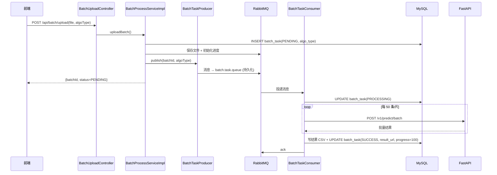

# SynPharm 批量处理技术设计文档（RabbitMQ 消息队列）

> 版本：v1.0（已实施 v3.1.0）
> 更新日期：2026-08-07
> 状态：✅ **已实施落地**（对应版本 v3.1.0），本文为设计原文 + 实施结果标注
> 前置阅读：`docs/modules/predict/AI预测核心模块-SpringBoot后端技术开发文档.md`（§2.4 批量处理异步架构）

---

## 1. 背景与目标

### 1.1 背景

当前批量预测采用 **Java 线程池异步**（`AsyncConfig.batchTaskExecutor` + `@Async` + Redis 进度缓存），存在以下痛点：

| 问题 | 说明 |
|---|---|
| 任务易丢 | 线程池任务在 JVM 内存，**服务重启即丢**，无法恢复 |
| 无重试/死信 | 处理失败只能置 FAIL，无自动补偿 |
| 不可水平扩展 | 多实例各自线程池，任务不共享 |
| 状态依赖 Redis | 进度/算法类型只存 Redis 缓存，24h 过期后 `status/download` 报错 |
| 无消息解耦 | 生产（上传）与消费（执行）强耦合在单服务内 |

### 1.2 目标

- 批量任务由 **RabbitMQ 消息队列**驱动，消息持久化、可重试、可扩展
- 任务状态以 **DB（batch_task）为权威**，Redis 仅作进度缓存 → 重启可从 DB 恢复
- 建立**统一消息基础设施**（Exchange/Queue/死信规范），为后续横向功能（通知、报表、外部集成）复用
- 修复现有批量模块的运行时 bug（`deleted` 列缺失、`algo_type` 缺失、IDOR 归属校验）

---

## 2. 现状分析

### 2.1 当前批量流程

```
前端上传 CSV
  → POST /api/batch/upload (file + algoType)
     ① 保存 CSV 到 uploadDir
     ② 建 batch_task 记录（PENDING）
     ③ 存 Redis 进度
     ④ @Async 异步 submitBatchTask
  → processBatch(batchId, algoType)
     ① 分片（50条/片）调 PipelineFactory.batchProcess
     ② 聚合 → 写结果 CSV
     ③ 更新 batch_task（SUCCESS/FAIL）
  → GET /api/batch/status/{batchId}  查进度
  → GET /api/batch/download/{batchId} 下载结果
```

### 2.2 现有问题

| # | 问题 | 影响 |
|---|---|---|
| P1 | `batch_task` 表**缺 `deleted` 列**，但 `BatchTaskMapper.xml` 有 `AND deleted=0` | `status/download` 在 Redis 过期后调用 `selectByBatchId` 必报 SQL 错误 |
| P2 | 表**缺 `algo_type` 列**，上传未持久化算法类型 | 依赖 Redis 才能知道 DTI/PPI/DDI，Redis 丢失则结果文件无法正确生成 |
| P3 | 任务状态/进度以 Redis 为准 | 服务重启、Redis 过期后状态丢失 |
| P4 | `status/download` 不校验 batchId 归属（IDOR） | 可查看/下载他人批次结果 |
| P5 | 线程池任务重启即丢 | 无持久化 |

---

## 3. 总体架构设计

### 3.1 架构图

```
┌──────────┐   ┌───────────────────────────────┐   ┌────────────────┐
│  前端     │──▶│ SpringBoot 业务中台            │   │   FastAPI       │
│ (CSV上传) │   │                               │   │  算法引擎       │
└──────────┘   │  BatchUploadController         │   │  /v1/predict/   │
               │    │ ① 存文件 + 写 batch_task    │   │  batch          │
               │    │ ② 发消息                    │   └───────▲────────┘
               │    ▼                           │           │
               │  BatchTaskProducer             │           │ HTTP
               │    │ ③ convertAndSend          │           │
               └────┼──────────────────────────┼───────────┘
                    ▼                          │
            ┌───────────────┐                 │
            │  RabbitMQ     │                 │
            │  batch.task.  │                 │
            │  queue        │                 │
            └───────┬───────┘                 │
                    │ ④ 消费                  │
                    ▼                         │
            ┌───────────────────────────┐    │
            │  BatchTaskConsumer        │    │
            │  @RabbitListener          │    │
            │  分片调 PipelineFactory ──┼────┘
            │  写结果 CSV + 更新 DB      │
            └───────────────────────────┘
```

### 3.2 RabbitMQ 拓扑设计

| 组件 | 名称 | 类型/参数 | 说明 |
|---|---|---|---|
| Exchange | `synpharm.exchange` | direct，持久化 | 统一交换机，横向功能复用 |
| 业务队列 | `batch.task.queue` | durable，绑定 `synpharm.exchange` routingKey=`batch.task` | 批量任务主队列 |
| 死信队列 | `batch.task.dlq` | durable，绑定 `synpharm.exchange` routingKey=`batch.task.dlq` | 失败/重试耗尽消息 |
| 死信参数 | 业务队列声明 `x-dead-letter-exchange=synpharm.exchange`、`x-dead-letter-routing-key=batch.task.dlq` | | 处理失败自动入 DLQ |
| RoutingKey | `batch.task` | | 生产/消费路由键 |

**重试策略**：消费者处理失败后 `nack(requeue=false)` 进入 DLQ；由**补偿任务**（`@Scheduled` 扫描 DLQ 或 DB 中 FAIL 任务）做有限次重试（默认 3 次），仍失败则保留 FAIL 供人工处理。

### 3.3 消息流转时序



---

## 4. 详细设计

### 4.1 消息模型

消息体使用 **JSON**，字段最小化（明细在 DB，消息只作投递触发）：

```json
{
  "batchId": "uuid-batch-id",
  "algoType": "DTI"
}
```

对应 DTO：

```java
@Data
@Builder
public class BatchTaskMessage {
    private String batchId;
    private String algoType;
}
```

### 4.2 表结构改造（`batch_task`）

在 `06_batch_task.sql` 基础上新增两列：

```sql
ALTER TABLE batch_task
    ADD COLUMN algo_type VARCHAR(20) NOT NULL DEFAULT '' COMMENT '算法类型 DTI/PPI/DDI' AFTER status,
    ADD COLUMN deleted   TINYINT NOT NULL DEFAULT 0 COMMENT '逻辑删除' AFTER update_time;
```

- 新建 `sql/08_batch_task_alter.sql`（迁移脚本，幂等）
- 同步更新 `06_batch_task.sql` 建表脚本（新增两列）
- `BatchTask.java` 实体增加 `algoType`、`deleted`（`@TableLogic`）

### 4.3 生产者设计（`BatchTaskProducer`）

```java
@Component
public class BatchTaskProducer {
    private final RabbitTemplate rabbitTemplate;

    public void sendBatchTask(String batchId, String algoType) {
        BatchTaskMessage msg = BatchTaskMessage.builder()
                .batchId(batchId).algoType(algoType).build();
        // 持久化消息（默认 delivery_mode=2）+ 指定 routingKey
        rabbitTemplate.convertAndSend(
                RabbitConfig.BATCH_EXCHANGE,
                RabbitConfig.BATCH_ROUTING_KEY,
                msg);
    }
}
```

调用位置：`BatchProcessServiceImpl.uploadBatch` 建表成功后发送（替换原 `@Async` 提交）。

### 4.4 消费者设计（`BatchTaskConsumer`）

```java
@Component
public class BatchTaskConsumer {
    private final BatchProcessService batchProcessService;

    @RabbitListener(queues = RabbitConfig.BATCH_QUEUE, ackMode = "MANUAL")
    public void onBatchTask(BatchTaskMessage message, Channel channel, @Header(AmqpHeaders.DELIVERY_TAG) long tag) throws IOException {
        try {
            batchProcessService.processBatch(message.getBatchId(), message.getAlgoType());
            channel.basicAck(tag, false);
        } catch (Exception e) {
            // 处理失败：不 requeue，进死信队列，由补偿任务重试
            channel.basicNack(tag, false, false);
        }
    }
}
```

**要点**：
- `ackMode=MANUAL`：只有处理成功才 ack，保证至少一次投递
- 失败 `nack(requeue=false)` → 消息进入 DLQ
- **幂等**：`processBatch` 以 `batchId` 为幂等键——执行前检查状态，已 PROCESSING/SUCCESS 直接跳过，避免重复消费
- 并发：`@RabbitListener` 默认单线程消费；可按需配置 `concurrency = "1-4"`

### 4.5 可靠性设计

| 机制 | 落地 |
|---|---|
| 消息持久化 | 队列 `durable=true`、消息 `delivery_mode=2`（RabbitTemplate 默认持久化） |
| 至少一次投递 | 手动 ack，成功才确认 |
| 失败隔离 | `nack(requeue=false)` → 死信队列 `batch.task.dlq` |
| 有限重试 | 补偿任务：扫描 DLQ / DB 中 FAIL 且 `retry_count < 3` 的任务重新入队 |
| 幂等消费 | 以 `batchId` 校验状态，重复消息直接 ack 跳过 |
| 恢复 | 启动时扫描 DB 中 `PENDING/PROCESSING` 任务，重新发消息（DB 为权威） |

### 4.6 状态机

`batch_task.status`（TINYINT）流转：

```
PENDING(0) ──▶ PROCESSING(1) ──▶ SUCCESS(2)
                │
                └──────▶ FAIL(3)
```

- `PENDING`：上传落库、未消费
- `PROCESSING`：消费者开始执行（消费时置 1）
- `SUCCESS`：全部处理完成，生成 result_url
- `FAIL`：处理异常（可被补偿任务重试）

### 4.7 进度与结果

- **进度**：`progress` 字段以 **DB 为准**，每片处理后更新；Redis 仅作读加速（`getBatchStatus` 优先 Redis，miss 则读 DB）
- **结果文件**：`resultDir/{batchId}_result.csv`，`result_url=/api/batch/download/{batchId}`
- **归属校验**：`getBatchStatus`/`downloadBatch` 增加 `batchId + userId` 联合校验（修复 IDOR）

### 4.8 配置

**docker-compose.yml 新增服务**：

```yaml
  rabbitmq:
    image: rabbitmq:3.13-management-alpine
    container_name: synpharm-rabbitmq
    environment:
      RABBITMQ_DEFAULT_USER: ${RABBITMQ_USER:-synpharm}
      RABBITMQ_DEFAULT_PASS: ${RABBITMQ_PASSWORD:?请在 .env 中设置 RABBITMQ_PASSWORD}
    ports:
      - "5672:5672"    # AMQP（仅内网）
      - "15672:15672"  # 管理台（仅内网/不暴露公网）
    volumes:
      - rabbitmq_data:/var/lib/rabbitmq
    networks: [synpharm]
    restart: unless-stopped

  backend:
    environment:
      SPRING_RABBITMQ_HOST: rabbitmq
      SPRING_RABBITMQ_PORT: 5672
      SPRING_RABBITMQ_USERNAME: ${RABBITMQ_USER:-synpharm}
      SPRING_RABBITMQ_PASSWORD: ${RABBITMQ_PASSWORD:?...}
```

**.env.example 新增**：

```ini
RABBITMQ_USER=synpharm
RABBITMQ_PASSWORD=<强密码>
```

**pom.xml**：

```xml
<dependency>
    <groupId>org.springframework.boot</groupId>
    <artifactId>spring-boot-starter-amqp</artifactId>
</dependency>
```

**application-docker.yml**：

```yaml
spring:
  rabbitmq:
    host: ${RABBITMQ_HOST:rabbitmq}
    port: ${RABBITMQ_PORT:5672}
    username: ${RABBITMQ_USERNAME:synpharm}
    password: ${RABBITMQ_PASSWORD:}
```

### 4.9 代码结构（新增 `mq/` 包）

```text
src/main/java/com/synpharm/mq/
├── RabbitConfig.java          # Exchange/Queue/Binding/死信声明
├── BatchTaskProducer.java     # 批量任务消息生产者
├── BatchTaskConsumer.java     # 批量任务消息消费者（异步执行）
└── BatchTaskMessage.java      # 消息体 DTO
```

**RabbitConfig 核心**：

```java
@Configuration
public class RabbitConfig {
    public static final String BATCH_EXCHANGE = "synpharm.exchange";
    public static final String BATCH_QUEUE = "batch.task.queue";
    public static final String BATCH_DLQ = "batch.task.dlq";
    public static final String BATCH_ROUTING_KEY = "batch.task";
    public static final String BATCH_DLQ_ROUTING_KEY = "batch.task.dlq";

    @Bean
    public DirectExchange synpharmExchange() {
        return new DirectExchange(BATCH_EXCHANGE, true, false); // durable
    }

    @Bean
    public Queue batchQueue() {
        return QueueBuilder.durable(BATCH_QUEUE)
                .deadLetterExchange(BATCH_EXCHANGE)
                .deadLetterRoutingKey(BATCH_DLQ_ROUTING_KEY)
                .build();
    }

    @Bean
    public Queue batchDlq() {
        return QueueBuilder.durable(BATCH_DLQ).build();
    }

    @Bean
    public Binding batchBinding() {
        return BindingBuilder.bind(batchQueue()).to(synpharmExchange()).with(BATCH_ROUTING_KEY);
    }

    @Bean
    public Binding batchDlqBinding() {
        return BindingBuilder.bind(batchDlq()).to(synpharmExchange()).with(BATCH_DLQ_ROUTING_KEY);
    }
}
```

---

## 5. 接口设计

现有接口**保持不变**（对外契约不变，内部改 MQ 驱动）：

| 接口 | 方法 | 说明 | 改动 |
|---|---|---|---|
| `/api/batch/upload` | POST | 上传 CSV + algoType | 内部由发消息替代 `@Async` |
| `/api/batch/status/{batchId}` | GET | 查进度 | 加 batchId+userId 归属校验；algoType 从 DB 读 |
| `/api/batch/download/{batchId}` | GET | 下载结果 | 加 batchId+userId 归属校验 |

响应 `BatchStatusResponse` 增加 `algoType` 字段。

---

## 6. 前端对接

✅ **已实现（v3.1.0）**：前端 `api/predict.ts` 新增 `batchApi`；`views/Predict.vue` 新增批量预测区块（CSV 文件选择 + 算法类型选择 + 上传按钮 + 2s 轮询进度 + 下载按钮）。

```ts
// api/predict.ts（已实现）
export const batchApi = {
  upload(file: File, algoType: string): Promise<BatchUploadResult> {
    const form = new FormData()
    form.append('file', file)
    form.append('algoType', algoType)
    return request.post('/api/batch/upload', form, { headers: { 'Content-Type': 'multipart/form-data' } })
  },
  getStatus(batchId: string): Promise<BatchStatus> {
    return request.get(`/api/batch/status/${batchId}`)
  },
  download(batchId: string): Promise<void> {
    // 原生 fetch + token + blob 下载
  }
}
```

> 下载使用原生 `fetch` 携带 `Authorization` 头 + `blob`，规避 axios 对响应流的处理问题；`baseURL` 已从 `utils/request.ts` 导出复用。

---

## 7. 监控与运维

| 项 | 方案 |
|---|---|
| 队列监控 | RabbitMQ 管理台（15672）监控队列积压、DLQ 堆积 |
| 告警 | 队列积压 > 阈值 / DLQ 非空 时告警（UptimeRobot/云监控） |
| 消费者 | RabbitMQ 消费者（`BatchTaskConsumer`）日志贯穿 batchId，便于排障 |
| 幂等日志 | 以 batchId 贯穿日志，便于排障 |

---

## 8. 横向扩展与演进

- 统一 `synpharm.exchange` + `功能.queue` + `功能.dlq` 命名规范
- 后续功能（邮件通知、报表生成、外部系统同步）只需新增 Queue + 消费者，复用同一 Exchange 与死信/重试基建
- 规模增长可平滑将消费者部署到独立实例（`concurrency` 调优 / 多副本）

---

## 9. 测试方案

| 层 | 内容 |
|---|---|
| 单元 | `RabbitConfig` 声明 bean；`BatchTaskProducer` 消息结构；消费者幂等逻辑 |
| 集成 | Testcontainers 起 RabbitMQ；验证「上传→发消息→消费→DB 状态→结果文件」全链路；模拟失败验证进 DLQ |
| E2E | 上传 CSV → 轮询 status → 下载结果，含异常批次（坏数据） |

---

## 10. 实施计划

| 步骤 | 内容 | 状态 |
|---|---|---|
| 1 | docker-compose 加 rabbitmq + 网络/数据卷 | ✅ 完成 |
| 2 | pom 加 `spring-boot-starter-amqp` + application 配置 | ✅ 完成 |
| 3 | `batch_task` 加列（`algo_type`/`deleted`）+ 迁移 SQL + 实体 | ✅ 完成 |
| 4 | 新增 `mq/` 包（RabbitConfig/Producer/Consumer） | ✅ 完成 |
| 5 | `BatchProcessServiceImpl` 改造：upload 发消息、processBatch 幂等、状态落库 | ✅ 完成 |
| 6 | status/download 归属校验 + 恢复扫描（启动时重新投递 PENDING/PROCESSING） | ⚠️ 归属校验已完成；启动恢复扫描为后续可选 |
| 7 | 前端 batch API + 批量上传交互 | ✅ 完成 |
| 8 | 测试（单测/集成/E2E）+ 文档同步 | 🚧 编译/构建通过；集成需 Docker 环境实测 |

---

## 附录：现有文件清单（改造范围）

| 文件 | 改动 |
|---|---|
| `deploy/docker-compose.yml` | 新增 rabbitmq 服务、backend 加 AMQP 配置 |
| `deploy/.env.example` | 新增 RABBITMQ_USER/PASSWORD |
| `synpharm-backend/pom.xml` | 新增 spring-boot-starter-amqp |
| `synpharm-backend/src/main/resources/application-docker.yml` | 新增 spring.rabbitmq 配置 |
| `sql/06_batch_task.sql` | 新增 algo_type/deleted 列 |
| `sql/08_batch_task_alter.sql` | 新建迁移脚本 |
| `model/entity/BatchTask.java` | 新增 algoType/deleted 字段 |
| `mq/`（新增 4 个类） | RabbitConfig/Producer/Consumer/Message |
| `service/impl/BatchProcessServiceImpl.java` | MQ 驱动改造、幂等、状态落库、归属校验 |
| `config/AsyncConfig.java` | ✅ 已删除（批量改由 RabbitMQ 驱动，无 @Async 使用方） |
| `dto/response/BatchStatusResponse.java` | 新增 algoType |
