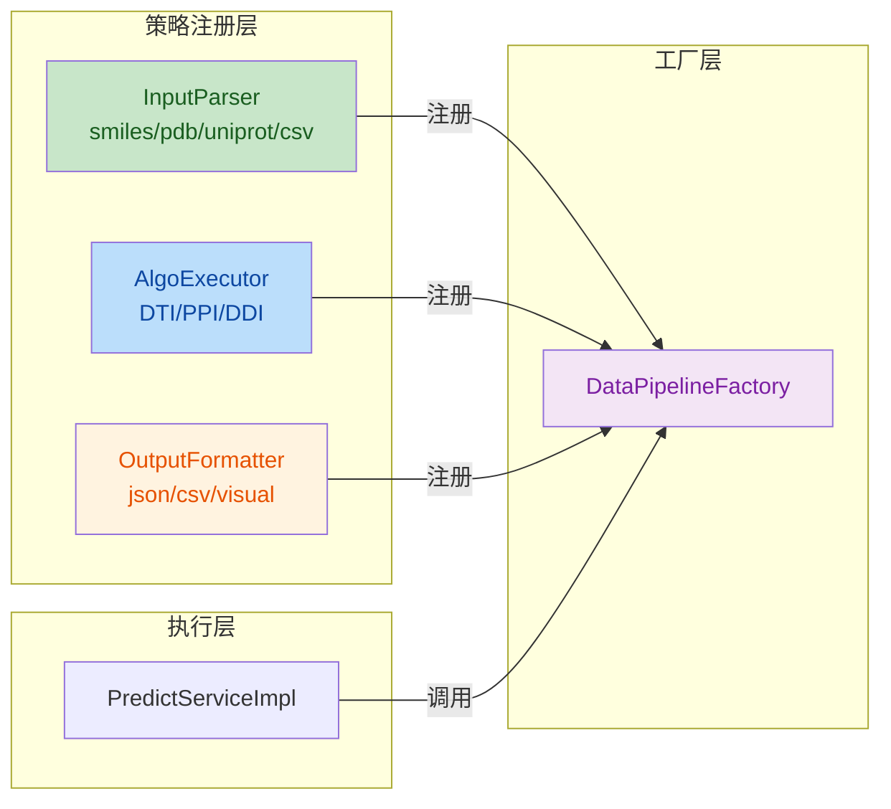

# SynPharm 数据流开发操作文档

## 目录

1. [架构概述](#1-架构概述)
2. [核心概念](#2-核心概念)
3. [开发流程](#3-开发流程)
4. [代码模板](#4-代码模板)
5. [DTI数据流示例](#5-dti数据流示例)
6. [PPI数据流开发任务](#6-ppi数据流开发任务)
7. [DDI数据流开发任务](#7-ddi数据流开发任务)
8. [测试验证](#8-测试验证)

---

## 1. 架构概述

### 1.1 设计理念

**策略模式 + 动态组合**：将预测流程拆分为三个独立的策略维度，由工厂在运行时动态组合。

```
输入解析器 (InputParser)  ← 独立注册
算法执行器 (AlgoExecutor) ← 独立注册  
输出格式化器 (OutputFormatter) ← 独立注册
         │                    │                    │
         └────────────────────┴────────────────────┘
                              │
                    DataPipelineFactory
                    运行时动态组合: parse → execute → format
```

**核心优势**：
- 组件可复用：一个输入解析器支持所有算法类型
- 无类爆炸：3种输入 + 3种算法 + 2种输出 = 8个组件（而非18个组合类）
- 类型安全：使用泛型接口，编译期检查类型

### 1.2 架构图



### 1.3 目录结构

```
synpharm-backend/src/main/java/com/synpharm/
├── enums/                    # 枚举类
│   ├── InputType.java
│   ├── AlgoType.java
│   └── OutputType.java
├── pipeline/                 # 管道接口层
│   ├── InputParser.java      # 泛型输入解析器接口
│   ├── AlgoExecutor.java     # 泛型算法执行器接口
│   ├── OutputFormatter.java  # 泛型输出格式化器接口
│   └── DataPipelineFactory.java  # 策略工厂
└── pipeline/impl/            # 策略实现层
    ├── SmilesInputParser.java    # SMILES输入解析器（通用）
    ├── DtiAlgoExecutor.java      # DTI算法执行器
    └── JsonOutputFormatter.java  # JSON输出格式化器（通用）
```

---

## 2. 核心概念

### 2.1 类型枚举

| 枚举 | 值 | 说明 |
|:---|:---|:---|
| **InputType** | `smiles` | 药物SMILES表达式 |
| | `pdb` | PDB蛋白质结构文件 |
| | `uniprot` | UniProt蛋白质ID |
| | `csv` | CSV批量文件 |
| **AlgoType** | `DTI` | 药物-靶点相互作用 |
| | `PPI` | 蛋白质-蛋白质相互作用 |
| | `DDI` | 药物-药物相互作用 |
| **OutputType** | `json` | JSON格式 |
| | `csv` | CSV格式 |
| | `visual` | 可视化数据 |

### 2.2 数据流组合矩阵

**任意组合，无需预先定义**：

| InputType | AlgoType | OutputType | 状态 |
|:---|:---|:---|:---|
| smiles | DTI | json | ✅已实现 |
| smiles | PPI | json | ⏳待实现（只需添加PpiAlgoExecutor） |
| smiles | DDI | json | ⏳待实现（只需添加DdiAlgoExecutor） |
| uniprot | PPI | json | ⏳待实现（只需添加UniprotInputParser） |
| pdb | DTI | json | ⏳待实现（只需添加PdbInputParser） |

---

## 3. 开发流程

### 3.1 新增算法类型步骤

**只需创建一个文件**：

```
创建文件：pipeline/impl/{AlgoType}AlgoExecutor.java
实现接口：AlgoExecutor<PredictRequest, AlgoResponse>
实现方法：getAlgoType()、execute()
```

**组件自动注册**：Spring启动时自动扫描并注册到工厂。

### 3.2 新增输入类型步骤

```
创建文件：pipeline/impl/{InputType}InputParser.java
实现接口：InputParser<PredictRequest>
实现方法：getInputType()、parse()
```

### 3.3 新增输出类型步骤

```
创建文件：pipeline/impl/{OutputType}OutputFormatter.java
实现接口：OutputFormatter<AlgoResponse, PredictResultResponse>
实现方法：getOutputType()、format()
```

---

## 4. 代码模板

### 4.1 InputParser 模板

```java
package com.synpharm.pipeline.impl;

import com.synpharm.dto.request.PredictRequest;
import com.synpharm.enums.AlgoType;
import com.synpharm.enums.InputType;
import com.synpharm.pipeline.InputParser;
import lombok.extern.slf4j.Slf4j;
import org.springframework.stereotype.Component;

@Slf4j
@Component
public class {InputType}InputParser implements InputParser<PredictRequest> {

    @Override
    public InputType getInputType() {
        return InputType.{INPUT_TYPE_ENUM};
    }

    @Override
    public PredictRequest parse(String inputValue, String fileUrl, AlgoType algoType) {
        log.debug("解析{}输入: {}, algoType={}", getInputType().getCode(), inputValue, algoType.getCode());
        
        // TODO: 根据algoType构建不同的PredictRequest
        return switch (algoType) {
            case DTI -> PredictRequest.forDTI(param1, param2);
            case PPI -> PredictRequest.forPPI(param1, param2);
            case DDI -> PredictRequest.forDDI(param1, param2);
        };
    }
}
```

### 4.2 AlgoExecutor 模板

```java
package com.synpharm.pipeline.impl;

import com.synpharm.client.FastApiClient;
import com.synpharm.dto.request.PredictRequest;
import com.synpharm.dto.response.AlgoResponse;
import com.synpharm.enums.AlgoType;
import com.synpharm.pipeline.AlgoExecutor;
import lombok.RequiredArgsConstructor;
import lombok.extern.slf4j.Slf4j;
import org.springframework.stereotype.Component;

@Slf4j
@Component
@RequiredArgsConstructor
public class {AlgoType}AlgoExecutor implements AlgoExecutor<PredictRequest, AlgoResponse> {

    private final FastApiClient fastApiClient;

    @Override
    public AlgoType getAlgoType() {
        return AlgoType.{ALGO_TYPE_ENUM};
    }

    @Override
    public AlgoResponse execute(PredictRequest inputData) {
        log.info("执行{}算法", getAlgoType().getCode());
        
        AlgoResponse response = fastApiClient.predictSingle(inputData);
        response.setAlgoType(getAlgoType().getCode());
        
        return response;
    }
}
```

### 4.3 OutputFormatter 模板

```java
package com.synpharm.pipeline.impl;

import com.synpharm.dto.response.AlgoResponse;
import com.synpharm.dto.response.PredictResultResponse;
import com.synpharm.enums.OutputType;
import com.synpharm.pipeline.OutputFormatter;
import lombok.extern.slf4j.Slf4j;
import org.springframework.stereotype.Component;

import java.util.ArrayList;
import java.util.List;

@Slf4j
@Component
public class {OutputType}OutputFormatter implements OutputFormatter<AlgoResponse, PredictResultResponse> {

    @Override
    public OutputType getOutputType() {
        return OutputType.{OUTPUT_TYPE_ENUM};
    }

    @Override
    public PredictResultResponse format(AlgoResponse response) {
        if (response == null || response.getMetrics() == null) {
            throw new RuntimeException("预测结果为空");
        }
        
        log.debug("格式化{}输出: status={}, algoType={}", 
                getOutputType().getCode(), response.getStatus(), response.getAlgoType());
        
        var metrics = response.getMetrics();
        List<PredictResultResponse.InteractionInfo> interactions = new ArrayList<>();
        
        if (metrics.getInteractions() != null) {
            for (var interaction : metrics.getInteractions()) {
                interactions.add(PredictResultResponse.InteractionInfo.builder()
                        .residue(interaction.getResidue())
                        .type(interaction.getType())
                        .distance(interaction.getDistance())
                        .build());
            }
        }
        
        return PredictResultResponse.builder()
                .algoType(response.getAlgoType())  // 从响应中动态获取
                .targetId(metrics.getTargetId())
                .targetName(metrics.getTargetName())
                .bindingAffinity(metrics.getBindingAffinity())
                .confidenceScore(metrics.getConfidenceScore())
                .confidenceLevel(metrics.getConfidenceLevel())
                .interactions(interactions)
                .build();
    }
}
```

---

## 5. DTI数据流示例

已实现的DTI数据流作为参考：

### 5.1 文件清单

| 文件 | 说明 | 复用性 |
|:---|:---|:---|
| `SmilesInputParser.java` | SMILES输入解析器，支持DTI/PPI/DDI | ✅通用 |
| `DtiAlgoExecutor.java` | DTI算法执行器 | ❌DTI专用 |
| `JsonOutputFormatter.java` | JSON输出格式化器，支持所有算法类型 | ✅通用 |

### 5.2 输入格式

```
输入类型: smiles
输入值格式: 参数1,参数2
DTI示例: CC(=O)OC1=CC=CC=C1C(=O)O,P00533
PPI示例: MGLGLG...(蛋白质A序列),MVHLTE...(蛋白质B序列)
DDI示例: CC(=O)OC1=CC=CC=C1C(=O)O,c1ccccc1
```

### 5.3 输出格式

```json
{
    "algoType": "DTI",
    "targetId": "P00533",
    "targetName": "EGFR",
    "bindingAffinity": -9.25,
    "confidenceScore": 0.92,
    "confidenceLevel": "high",
    "interactions": [
        {"residue": "Lys745", "type": "hydrogen_bond", "distance": 2.8}
    ]
}
```

---

## 6. PPI数据流开发任务

### 6.1 任务概述

只需创建 **PpiAlgoExecutor**，即可支持所有输入类型 + PPI + 所有输出类型的组合。

### 6.2 需要创建的文件

#### 任务1：PpiAlgoExecutor

```java
// 文件路径: pipeline/impl/PpiAlgoExecutor.java
// 功能: 调用FastAPI执行PPI算法
// 输入: PredictRequest (proteinA, proteinB)
// 输出: AlgoResponse (包含algoType="PPI")
```

### 6.3 输入输出格式

| 输入类型 | 输入格式 | 输出格式 |
|:---|:---|:---|
| smiles | 蛋白质A序列,蛋白质B序列 | JSON |
| uniprot | UniProtA,UniProtB | JSON（需先实现UniprotInputParser） |

---

## 7. DDI数据流开发任务

### 7.1 任务概述

只需创建 **DdiAlgoExecutor**。

### 7.2 需要创建的文件

#### 任务1：DdiAlgoExecutor

```java
// 文件路径: pipeline/impl/DdiAlgoExecutor.java
// 功能: 调用FastAPI执行DDI算法
// 输入: PredictRequest (drugA, drugB)
// 输出: AlgoResponse (包含algoType="DDI")
```

### 7.3 输入输出格式

| 输入类型 | 输入格式 | 输出格式 |
|:---|:---|:---|
| smiles | 药物A SMILES,药物B SMILES | JSON |

---

## 8. 测试验证

### 8.1 单元测试

```java
// 测试输入解析器支持多种算法类型
@Test
void testSmilesInputParserForAllAlgoTypes() {
    SmilesInputParser parser = new SmilesInputParser();
    
    PredictRequest dtiRequest = parser.parse("drug,target", null, AlgoType.DTI);
    assertEquals("DTI", dtiRequest.getAlgoType());
    
    PredictRequest ppiRequest = parser.parse("proteinA,proteinB", null, AlgoType.PPI);
    assertEquals("PPI", ppiRequest.getAlgoType());
    
    PredictRequest ddiRequest = parser.parse("drugA,drugB", null, AlgoType.DDI);
    assertEquals("DDI", ddiRequest.getAlgoType());
}

// 测试工厂动态组合
@Test
void testPipelineFactory() {
    // 所有组合都应该支持（只要注册了对应的组件）
    assertTrue(factory.supports("smiles", "DTI", "json"));
    assertTrue(factory.supports("smiles", "PPI", "json"));
    assertTrue(factory.supports("smiles", "DDI", "json"));
}
```

### 8.2 接口测试

使用Postman或curl测试通用预测接口：

```bash
POST /api/predict/general
Content-Type: application/json

{
    "inputType": "smiles",
    "algoType": "DTI",
    "outputType": "json",
    "inputValue": "CC(=O)OC1=CC=CC=C1C(=O)O,P00533"
}
```

### 8.3 验证步骤

1. ✅ 启动应用，查看组件注册日志
2. ✅ 调用接口，确认返回正确格式
3. ✅ 测试异常输入，确认错误处理
4. ✅ 测试未支持的组合，确认抛出异常

---

## 附录：PredictRequest 静态工厂方法

```java
// DTI预测请求
PredictRequest.forDTI(String drugSmiles, String targetSeq)

// PPI预测请求
PredictRequest.forPPI(String proteinA, String proteinB)

// DDI预测请求
PredictRequest.forDDI(String drugA, String drugB)
```

---

**版本**: v3.1.0  
**创建日期**: 2026-07-25  
**作者**: SynPharm Team