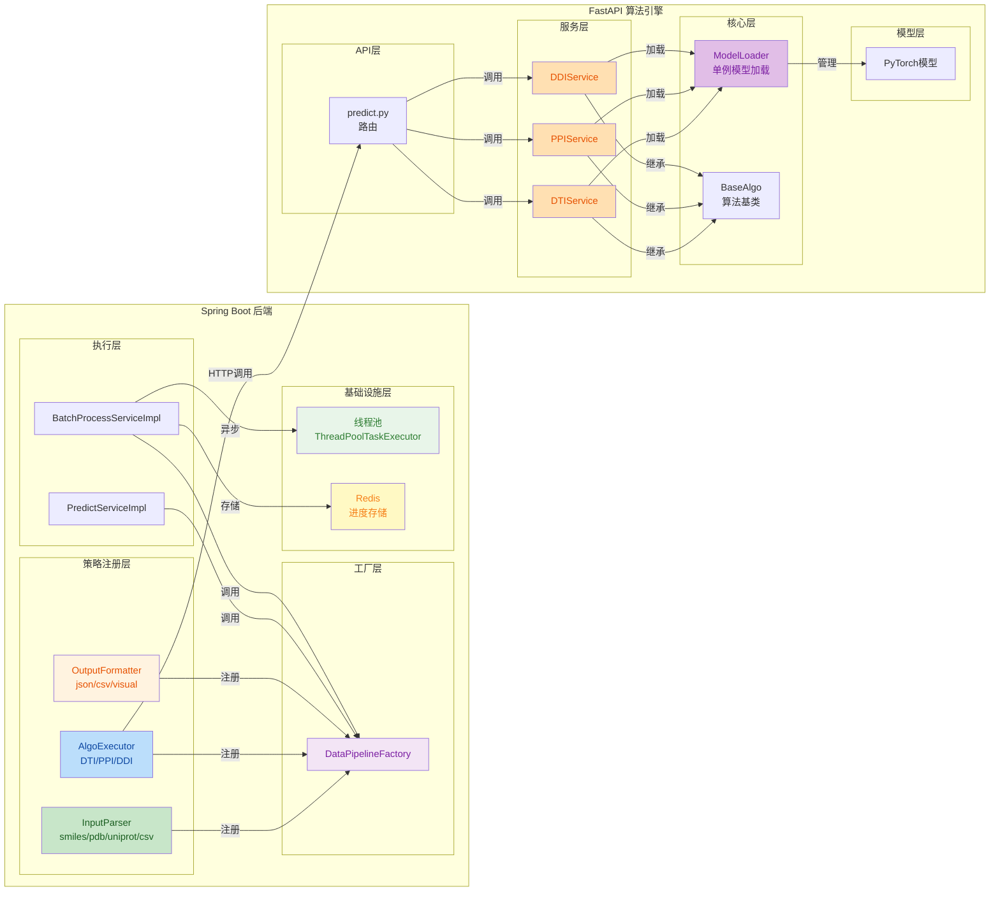

# SynPharm 数据流开发操作文档

## 目录

1. [架构概述](#1-架构概述)
2. [项目已有的组件](#2-项目已有的组件)
   - 2.1 管道接口层
   - 2.2 管道工厂机制
   - 2.3 线程池异步实现
   - 2.4 Redis批量进度存储
   - 2.5 异常处理体系
   - 2.6 数据传输对象(DTO)
   - 2.7 枚举类定义
3. [项目待开发的组件](#3-项目待开发的组件)
   - 3.1 输入解析器任务
   - 3.2 算法执行器任务
   - 3.3 输出格式化器任务
4. [开发流程](#4-开发流程)
5. [代码模板](#5-代码模板)
6. [测试验证](#6-测试验证)

---

## 1. 架构概述

### 1.1 设计理念

**策略模式 + 动态组合**：将预测流程拆分为三个独立的策略维度，由工厂在运行时动态组合。

```
输入解析器 (InputParser)  ← 独立注册
算法执行器 (AlgoExecutor) ← 独立注册  
输出格式化器 (OutputFormatter) ← 独立注册
         │                    │                    │
         └────────────────────┴────────────────────┘
                              │
                    DataPipelineFactory
                    运行时动态组合: parse → execute → format
```

**核心优势**：
- 组件可复用：一个输入解析器支持所有算法类型
- 无类爆炸：3种输入 + 3种算法 + 2种输出 = 8个组件（而非18个组合类）
- 类型安全：使用泛型接口，编译期检查类型

### 1.2 架构图



### 1.3 目录结构

#### Spring Boot 后端

```
synpharm-backend/src/main/java/com/synpharm/
├── enums/                    # 枚举类（✅已完成）
│   ├── InputType.java
│   ├── AlgoType.java
│   └── OutputType.java
├── pipeline/                 # 管道接口层（✅已完成）
│   ├── InputParser.java      # 泛型输入解析器接口
│   ├── AlgoExecutor.java     # 泛型算法执行器接口
│   ├── OutputFormatter.java  # 泛型输出格式化器接口
│   ├── PipelineFactory.java  # 管道工厂接口
│   └── DataPipelineFactory.java  # 策略工厂实现
├── pipeline/impl/            # 策略实现层（⚠️部分完成）
│   ├── SmilesInputParser.java    # ✅已完成（通用）
│   ├── DtiAlgoExecutor.java      # ✅已完成（DTI专用）
│   ├── JsonOutputFormatter.java  # ✅已完成（通用）
│   ├── UniprotInputParser.java   # ❌待开发
│   ├── PdbInputParser.java       # ❌待开发
│   ├── CsvInputParser.java       # ❌待开发
│   ├── PpiAlgoExecutor.java      # ❌待开发
│   ├── DdiAlgoExecutor.java      # ❌待开发
│   └── CsvOutputFormatter.java   # ❌待开发
├── config/
│   └── AsyncConfig.java      # ✅已完成（线程池配置）
├── exception/
│   └── PipelineException.java # ✅已完成（管道异常）
└── service/impl/
    ├── PredictServiceImpl.java      # ✅已完成（单条预测）
    └── BatchProcessServiceImpl.java # ✅已完成（批量预测）
```

#### FastAPI 算法引擎

```
synpharm-fastapi/
├── api/v1/
│   ├── health.py             # ✅已完成（健康检查）
│   └── predict.py            # ✅已完成（预测路由）
├── core/
│   ├── auth.py               # ✅已完成（认证）
│   ├── base_algo.py          # ✅已完成（算法基类）
│   ├── exceptions.py         # ✅已完成（异常处理）
│   ├── loader.py             # ✅已完成（模型加载）
│   ├── logging_config.py     # ✅已完成（日志配置）
│   └── schemas.py            # ✅已完成（数据模型）
├── services/
│   ├── dti_service.py        # ✅已完成（DTI算法服务）
│   ├── ppi_service.py        # ❌待开发（PPI算法服务）
│   ├── ddi_service.py        # ❌待开发（DDI算法服务）
│   └── batch_service.py      # ✅已完成（批量服务）
├── models/
│   └── .gitkeep              # 模型文件存放目录
├── main.py                   # ✅已完成（应用入口）
└── config.py                 # ✅已完成（配置文件）
```

---

## 2. 项目已有的组件

### 2.1 Spring Boot后端已有组件

#### 2.1.1 管道接口层

这些接口定义了组件的契约，无需修改，只需实现。

#### 2.1.1.1 InputParser - 输入解析器接口

```java
// 文件: pipeline/InputParser.java
public interface InputParser {
    InputType getInputType();
    ParsedInput parse(String inputValue, String fileUrl);
}
```

**职责**：将原始输入（字符串/文件路径）解析为统一的 `ParsedInput` 格式。

#### 2.1.1.2 AlgoExecutor - 算法执行器接口

```java
// 文件: pipeline/AlgoExecutor.java
public interface AlgoExecutor {
    AlgoType getAlgoType();
    AlgoResponse execute(ParsedInput inputData);
    List<AlgoResponse> batchExecute(List<ParsedInput> inputDataList);
}
```

**职责**：调用FastAPI执行具体算法，返回算法响应。

#### 2.1.1.3 OutputFormatter - 输出格式化器接口

```java
// 文件: pipeline/OutputFormatter.java
public interface OutputFormatter {
    OutputType getOutputType();
    PredictResultResponse format(AlgoResponse resultData);
    List<PredictResultResponse> batchFormat(List<AlgoResponse> resultDataList);
}
```

**职责**：将算法响应格式化为前端友好的输出格式。

#### 2.1.2 管道工厂机制

#### 2.1.2.1 PipelineFactory - 工厂接口

```java
// 文件: pipeline/PipelineFactory.java
public interface PipelineFactory {
    PredictResultResponse process(InputType inputType, AlgoType algoType, OutputType outputType,
                                  String inputValue, String fileUrl);
    List<PredictResultResponse> batchProcess(InputType inputType, AlgoType algoType, OutputType outputType,
                                             List<String> inputs);
    boolean supports(InputType inputType, AlgoType algoType, OutputType outputType);
}
```

**设计意图**：便于Mock测试和实现类替换。

#### 2.1.2.2 DataPipelineFactory - 工厂实现

```java
// 文件: pipeline/DataPipelineFactory.java
@Slf4j
@Component
public class DataPipelineFactory implements PipelineFactory {
    
    private final Map<InputType, InputParser> inputParserMap = new ConcurrentHashMap<>();
    private final Map<AlgoType, AlgoExecutor> algoExecutorMap = new ConcurrentHashMap<>();
    private final Map<OutputType, OutputFormatter> outputFormatterMap = new ConcurrentHashMap<>();
    
    public DataPipelineFactory(List<InputParser> inputParsers, 
                               List<AlgoExecutor> algoExecutors, 
                               List<OutputFormatter> outputFormatters) {
        inputParsers.forEach(p -> inputParserMap.put(p.getInputType(), p));
        algoExecutors.forEach(e -> algoExecutorMap.put(e.getAlgoType(), e));
        outputFormatters.forEach(f -> outputFormatterMap.put(f.getOutputType(), f));
    }
    
    @Override
    public PredictResultResponse process(...) {
        // 运行时动态组合: parse → execute → format
    }
}
```

**核心机制**：
- Spring启动时自动扫描并注册所有实现类
- 使用三个独立Map存储不同维度的策略
- 运行时根据类型动态组合，无需预先定义所有组合

#### 2.1.3 线程池异步实现

```java
// 文件: config/AsyncConfig.java
@Configuration
@EnableAsync
public class AsyncConfig {
    
    @Bean("batchTaskExecutor")
    public Executor batchTaskExecutor() {
        ThreadPoolTaskExecutor executor = new ThreadPoolTaskExecutor();
        executor.setCorePoolSize(4);
        executor.setMaxPoolSize(8);
        executor.setQueueCapacity(100);
        executor.setThreadNamePrefix("batch-predict-");
        executor.setRejectedExecutionHandler(new ThreadPoolExecutor.CallerRunsPolicy());
        executor.setWaitForTasksToCompleteOnShutdown(true);
        executor.setAwaitTerminationSeconds(60);
        executor.initialize();
        return executor;
    }
}
```

**使用方式**：在批量处理方法上添加 `@Async("batchTaskExecutor")` 注解即可实现异步执行。

#### 2.1.4 Redis批量进度存储

```java
// 文件: service/impl/BatchProcessServiceImpl.java
@Service
@RequiredArgsConstructor
public class BatchProcessServiceImpl implements BatchProcessService {
    
    private final StringRedisTemplate redisTemplate;
    private final ObjectMapper objectMapper;
    private static final String BATCH_TASK_PREFIX = "batch:task:";
    
    @Override
    @Async("batchTaskExecutor")
    public void processBatchTask(Long taskId, List<String> inputs, 
                                 InputType inputType, AlgoType algoType, OutputType outputType) {
        String key = BATCH_TASK_PREFIX + taskId;
        
        try {
            for (int i = 0; i < inputs.size(); i++) {
                BatchTask batchTask = BatchTask.builder()
                        .taskId(taskId)
                        .totalSize(inputs.size())
                        .completedSize(i + 1)
                        .status(TaskStatus.RUNNING)
                        .build();
                
                String json = objectMapper.writeValueAsString(batchTask);
                redisTemplate.opsForValue().set(key, json, Duration.ofHours(24));
            }
        } catch (Exception e) {
            // 标记失败
        }
    }
}
```

**优势**：
- 进度持久化到Redis，服务重启后不丢失
- 设置24小时过期，自动清理历史数据
- 使用JSON序列化存储复杂对象

#### 2.1.5 异常处理体系

```java
// 文件: exception/PipelineException.java
@Data
@EqualsAndHashCode(callSuper = true)
public class PipelineException extends RuntimeException {
    private final String stage;
    private final String inputType;
    private final String algoType;
    
    public PipelineException(String stage, String inputType, String algoType, String message) {
        super(message);
        this.stage = stage;
        this.inputType = inputType;
        this.algoType = algoType;
    }
}
```

#### 2.1.6 数据传输对象(DTO)

| DTO | 文件 | 说明 |
|:---|:---|:---|
| ParsedInput | `dto/ParsedInput.java` | 统一输入格式 |
| AlgoResponse | `dto/response/AlgoResponse.java` | 算法响应 |
| PredictResultResponse | `dto/response/PredictResultResponse.java` | 预测结果响应 |

### 2.2 FastAPI算法引擎已有组件

**设计原则**：FastAPI只负责**纯粹的算法运算**，不实现管道机制。管道机制由Spring Boot端实现，负责输入解析、算法选择、输出格式化的完整流程。

#### 2.2.1 BaseAlgo - 算法基类

```python
# 文件: core/base_algo.py
from abc import ABC, abstractmethod
from core.schemas import PredictionMetrics

class BaseAlgo(ABC):
    @abstractmethod
    def predict(self, data: dict) -> PredictionMetrics:
        pass
    
    def _featurize_smiles(self, smiles: str) -> list:
        pass
    
    def _featurize_sequence(self, seq: str) -> list:
        pass
```

**职责**：定义算法服务的统一接口，所有算法服务都需要继承此类。

#### 2.2.2 ModelLoader - 单例模型加载器

```python
# 文件: core/loader.py
class ModelLoader:
    _instance = None
    _models = {}
    
    def __new__(cls):
        if cls._instance is None:
            cls._instance = super().__new__(cls)
        return cls._instance
    
    def get_model(self, model_name: str):
        if model_name not in self._models:
            self._models[model_name] = self._load_model(model_name)
        return self._models[model_name]
    
    def _load_model(self, model_name: str):
        # 加载PyTorch模型
        pass
```

**核心机制**：
- 使用单例模式确保模型只加载一次
- 缓存已加载的模型，避免重复加载
- 支持多模型管理（DTI/PPI/DDI）

#### 2.2.3 数据模型(Schemas)

```python
# 文件: core/schemas.py
from pydantic import BaseModel
from typing import List, Optional

class InteractionInfo(BaseModel):
    residue: str
    type: str
    distance: float

class PredictionMetrics(BaseModel):
    target_id: Optional[str] = None
    target_name: Optional[str] = None
    binding_affinity: Optional[float] = None
    confidence_score: float
    confidence_level: str
    interactions: List[InteractionInfo] = []

class AlgoResponse(BaseModel):
    status: str
    metrics: PredictionMetrics

class SingleRequest(BaseModel):
    algo_type: str
    drug_smiles: Optional[str] = None
    target_seq: Optional[str] = None
    protein_a: Optional[str] = None
    protein_b: Optional[str] = None
    drug_a: Optional[str] = None
    drug_b: Optional[str] = None
```

**职责**：定义请求和响应的数据结构，使用Pydantic进行自动验证。

#### 2.2.3 已实现的算法服务

| 服务 | 文件路径 | 状态 |
|:---|:---|:---|
| DTIService | `services/dti_service.py` | ✅已完成 |
| PPIService | `services/ppi_service.py` | ✅已完成 |
| DDIService | `services/ddi_service.py` | ✅已完成 |

#### 2.2.4 预测路由

```python
# 文件: api/v1/predict.py
from fastapi import APIRouter
from core.schemas import SingleRequest, AlgoResponse, BatchPredictionRequest, BatchPredictionResponse
from services.dti_service import DTIService
from services.ppi_service import PPIService
from services.ddi_service import DDIService
from services.batch_service import BatchPredictor

router = APIRouter()

dti_engine = DTIService()
ppi_engine = PPIService()
ddi_engine = DDIService()
batch_predictor = BatchPredictor()

@router.post("/single", response_model=AlgoResponse)
async def predict_single(req: SingleRequest):
    if req.algo_type == "DTI":
        result = dti_engine.predict({"drug_smiles": req.drug_smiles, "target_seq": req.target_seq})
    elif req.algo_type == "PPI":
        result = ppi_engine.predict({"protein_a": req.protein_a, "protein_b": req.protein_b})
    elif req.algo_type == "DDI":
        result = ddi_engine.predict({"drug_a": req.drug_a, "drug_b": req.drug_b})
    else:
        raise InvalidInputError(f"未知算法类型: {req.algo_type}")
    
    return {"status": "success", "metrics": result}

@router.post("/batch", response_model=BatchPredictionResponse)
async def predict_batch(req: BatchPredictionRequest):
    data_list = [item.dict() for item in req.data_list]
    results = batch_predictor.run(data_list, req.algo_type)
    return {"status": "success", "total": len(results), "results": results}
```

**职责**：接收来自Spring Boot的预测请求，直接调用对应算法服务执行运算。

#### 2.2.5 健康检查路由

```python
# 文件: api/v1/health.py
from fastapi import APIRouter

router = APIRouter()

@router.get("/health")
async def health_check():
    return {"status": "UP", "service": "synpharm-fastapi"}
```

**职责**：提供健康检查接口，用于服务监控和负载均衡。

---

## 3. 项目待开发的组件

### 3.1 Spring Boot后端任务

#### 3.1.1 输入解析器任务

| 任务 | 文件路径 | 输入格式 | 输出格式 | 负责人 |
|:---|:---|:---|:---|:---|
| **UniprotInputParser** | `pipeline/impl/UniprotInputParser.java` | UniProt ID | 蛋白质序列 | 组员A |
| **PdbInputParser** | `pipeline/impl/PdbInputParser.java` | PDB文件路径 | 蛋白质结构+序列 | 组员B |
| **CsvInputParser** | `pipeline/impl/CsvInputParser.java` | CSV文件 | 批量参数列表 | 组员C |

**开发要求**：
- 实现 `InputParser` 接口
- 支持单条和批量输入
- 返回统一的 `ParsedInput` 对象

#### 3.1.2 算法执行器任务

| 任务 | 文件路径 | 输入 | 输出 | 负责人 |
|:---|:---|:---|:---|:---|
| **PpiAlgoExecutor** | `pipeline/impl/PpiAlgoExecutor.java` | ParsedInput | AlgoResponse(algoType="PPI") | 组员A |
| **DdiAlgoExecutor** | `pipeline/impl/DdiAlgoExecutor.java` | ParsedInput | AlgoResponse(algoType="DDI") | 组员B |

**开发要求**：
- 实现 `AlgoExecutor` 接口
- 调用 `FastApiClient` 执行算法
- 返回包含算法类型的 `AlgoResponse`

#### 3.1.3 输出格式化器任务

| 任务 | 文件路径 | 输入 | 输出 | 负责人 |
|:---|:---|:---|:---|:---|
| **CsvOutputFormatter** | `pipeline/impl/CsvOutputFormatter.java` | AlgoResponse | PredictResultResponse | 组员C |

**开发要求**：
- 实现 `OutputFormatter` 接口
- 支持单条和批量格式化
- 返回CSV格式的预测结果

### 3.2 FastAPI算法引擎任务

**设计原则**：FastAPI只负责**纯粹的算法运算**，不实现管道机制。管道机制由Spring Boot端实现。

#### 3.2.1 算法服务完善（基础框架已完成）

三个算法服务的基础框架已完成，包含mock数据返回，待完善真实模型推理逻辑：

| 服务 | 文件路径 | 状态 | 负责人 |
|:---|:---|:---|:---|
| DTIService | `services/dti_service.py` | ✅已完成（基础框架） | 算法组员A |
| PPIService | `services/ppi_service.py` | ✅已完成（基础框架） | 算法组员B |
| DDIService | `services/ddi_service.py` | ✅已完成（基础框架） | 算法组员C |

**待完善内容**：
- ✅ 框架已完成，包含mock数据返回
- ❌ 待替换真实模型推理逻辑
- ❌ 待实现真实特征提取方法

**开发要求**：
- 继承 `BaseAlgo` 基类
- 实现特征提取方法 `_featurize_sequence()` / `_featurize_smiles()`
- 加载对应PyTorch模型
- 返回 `PredictionMetrics` 对象

#### 3.2.2 模型加载完善

| 任务 | 文件路径 | 说明 | 负责人 |
|:---|:---|:---|:---|
| **模型加载** | `core/loader.py` | 实现真实模型加载逻辑 | 算法组员A/B/C |

**开发要求**：
- 在 `_load_model()` 方法中添加真实模型加载逻辑
- 支持DTI/PPI/DDI三种模型
- 使用单例模式确保模型只加载一次

### 3.3 任务与文档对应关系

| 任务 | 所属模块 | 开发文档 |
|:---|:---|:---|
| UniprotInputParser | Spring Boot | [UniProt输入解析器开发操作文档.md](data/UniProt输入解析器开发操作文档.md) |
| PdbInputParser | Spring Boot | [PDB输入解析器开发操作文档.md](data/PDB输入解析器开发操作文档.md) |
| CsvInputParser + CsvOutputFormatter | Spring Boot | [CSV输入解析器开发操作文档.md](data/CSV输入解析器开发操作文档.md) |
| PpiAlgoExecutor | Spring Boot | [PPI算法开发操作文档.md](algorithm/PPI算法开发操作文档.md) |
| DdiAlgoExecutor | Spring Boot | [DDI算法开发操作文档.md](algorithm/DDI算法开发操作文档.md) |
| DTIService完善 | FastAPI | [AI预测核心模块-FastAPI算法引擎技术开发文档.md](../AI预测核心模块-FastAPI算法引擎技术开发文档.md) |
| PPIService完善 | FastAPI | [AI预测核心模块-FastAPI算法引擎技术开发文档.md](../AI预测核心模块-FastAPI算法引擎技术开发文档.md) |
| DDIService完善 | FastAPI | [AI预测核心模块-FastAPI算法引擎技术开发文档.md](../AI预测核心模块-FastAPI算法引擎技术开发文档.md) |

---

## 4. 开发流程

### 4.1 新增输入解析器步骤

```
步骤1: 创建文件 → pipeline/impl/{InputType}InputParser.java
步骤2: 实现接口 → InputParser
步骤3: 实现方法 → getInputType(), parse()
步骤4: 编译验证 → mvn compile
步骤5: 启动测试 → 查看日志确认注册成功
```

### 4.2 新增算法执行器步骤

```
步骤1: 创建文件 → pipeline/impl/{AlgoType}AlgoExecutor.java
步骤2: 实现接口 → AlgoExecutor
步骤3: 实现方法 → getAlgoType(), execute(), batchExecute()
步骤4: 注入依赖 → FastApiClient
步骤5: 编译验证 → mvn compile
步骤6: 启动测试 → 查看日志确认注册成功
```

### 4.3 新增输出格式化器步骤

```
步骤1: 创建文件 → pipeline/impl/{OutputType}OutputFormatter.java
步骤2: 实现接口 → OutputFormatter
步骤3: 实现方法 → getOutputType(), format(), batchFormat()
步骤4: 编译验证 → mvn compile
步骤5: 启动测试 → 查看日志确认注册成功
```

### 4.4 组件注册机制

**无需手动注册！** Spring启动时自动完成：

```
启动日志示例:
┌─────────────────────────────────────────────────────────┐
│  注册输入解析器: smiles                                  │
│  注册输入解析器: uniprot  ← 新增后自动出现               │
│  注册输入解析器: pdb      ← 新增后自动出现               │
│  注册输入解析器: csv      ← 新增后自动出现               │
├─────────────────────────────────────────────────────────┤
│  注册算法执行器: DTI                                     │
│  注册算法执行器: PPI      ← 新增后自动出现               │
│  注册算法执行器: DDI      ← 新增后自动出现               │
├─────────────────────────────────────────────────────────┤
│  注册输出格式化器: json                                  │
│  注册输出格式化器: csv     ← 新增后自动出现               │
└─────────────────────────────────────────────────────────┘
```

### 4.4 组件注册机制

**Spring Boot无需手动注册！** Spring启动时自动完成：

```
启动日志示例:
┌─────────────────────────────────────────────────────────┐
│  注册输入解析器: smiles                                  │
│  注册输入解析器: uniprot  ← 新增后自动出现               │
│  注册输入解析器: pdb      ← 新增后自动出现               │
│  注册输入解析器: csv      ← 新增后自动出现               │
├─────────────────────────────────────────────────────────┤
│  注册算法执行器: DTI                                     │
│  注册算法执行器: PPI      ← 新增后自动出现               │
│  注册算法执行器: DDI      ← 新增后自动出现               │
├─────────────────────────────────────────────────────────┤
│  注册输出格式化器: json                                  │
│  注册输出格式化器: csv     ← 新增后自动出现               │
└─────────────────────────────────────────────────────────┘
```

**FastAPI无需手动注册！** 直接导入并调用即可。

---

## 5. 代码模板

### 5.1 Spring Boot InputParser 模板

```java
package com.synpharm.pipeline.impl;

import com.synpharm.dto.ParsedInput;
import com.synpharm.enums.InputType;
import com.synpharm.pipeline.InputParser;
import lombok.extern.slf4j.Slf4j;
import org.springframework.stereotype.Component;

import java.util.List;

@Slf4j
@Component
public class {InputType}InputParser implements InputParser {

    @Override
    public InputType getInputType() {
        return InputType.{INPUT_TYPE_ENUM};
    }

    @Override
    public ParsedInput parse(String inputValue, String fileUrl) {
        log.info("解析{}输入: {}", getInputType().getCode(), inputValue);
        
        // TODO: 实现解析逻辑
        List<String> params = /* 解析后的参数 */;
        
        return ParsedInput.builder()
                .params(params)
                .inputType(getInputType().getCode())
                .build();
    }
}
```

### 5.2 AlgoExecutor 模板

```java
package com.synpharm.pipeline.impl;

import com.synpharm.client.FastApiClient;
import com.synpharm.dto.ParsedInput;
import com.synpharm.dto.response.AlgoResponse;
import com.synpharm.enums.AlgoType;
import com.synpharm.pipeline.AlgoExecutor;
import lombok.RequiredArgsConstructor;
import lombok.extern.slf4j.Slf4j;
import org.springframework.stereotype.Component;

import java.util.ArrayList;
import java.util.List;

@Slf4j
@Component
@RequiredArgsConstructor
public class {AlgoType}AlgoExecutor implements AlgoExecutor {

    private final FastApiClient fastApiClient;

    @Override
    public AlgoType getAlgoType() {
        return AlgoType.{ALGO_TYPE_ENUM};
    }

    @Override
    public AlgoResponse execute(ParsedInput inputData) {
        log.info("执行{}算法", getAlgoType().getCode());
        
        AlgoResponse response = fastApiClient.predictSingle(inputData);
        response.setAlgoType(getAlgoType().getCode());
        
        return response;
    }

    @Override
    public List<AlgoResponse> batchExecute(List<ParsedInput> inputDataList) {
        log.info("批量执行{}算法: 数量={}", getAlgoType().getCode(), inputDataList.size());
        
        List<AlgoResponse> responses = new ArrayList<>();
        for (ParsedInput input : inputDataList) {
            try {
                responses.add(execute(input));
            } catch (Exception e) {
                log.warn("执行单个任务失败", e);
            }
        }
        return responses;
    }
}
```

### 5.3 OutputFormatter 模板

```java
package com.synpharm.pipeline.impl;

import com.synpharm.dto.response.AlgoResponse;
import com.synpharm.dto.response.PredictResultResponse;
import com.synpharm.enums.OutputType;
import com.synpharm.pipeline.OutputFormatter;
import lombok.extern.slf4j.Slf4j;
import org.springframework.stereotype.Component;

import java.util.ArrayList;
import java.util.List;

@Slf4j
@Component
public class {OutputType}OutputFormatter implements OutputFormatter {

    @Override
    public OutputType getOutputType() {
        return OutputType.{OUTPUT_TYPE_ENUM};
    }

    @Override
    public PredictResultResponse format(AlgoResponse response) {
        if (response == null || response.getMetrics() == null) {
            throw new RuntimeException("预测结果为空");
        }
        
        log.debug("格式化{}输出", getOutputType().getCode());
        
        var metrics = response.getMetrics();
        List<PredictResultResponse.InteractionInfo> interactions = new ArrayList<>();
        
        if (metrics.getInteractions() != null) {
            for (var interaction : metrics.getInteractions()) {
                interactions.add(PredictResultResponse.InteractionInfo.builder()
                        .residue(interaction.getResidue())
                        .type(interaction.getType())
                        .distance(interaction.getDistance())
                        .build());
            }
        }
        
        return PredictResultResponse.builder()
                .algoType(response.getAlgoType())
                .targetId(metrics.getTargetId())
                .targetName(metrics.getTargetName())
                .bindingAffinity(metrics.getBindingAffinity())
                .confidenceScore(metrics.getConfidenceScore())
                .confidenceLevel(metrics.getConfidenceLevel())
                .interactions(interactions)
                .build();
    }

    @Override
    public List<PredictResultResponse> batchFormat(List<AlgoResponse> resultDataList) {
        log.debug("批量格式化{}输出: 数量={}", getOutputType().getCode(), resultDataList.size());
        
        List<PredictResultResponse> responses = new ArrayList<>();
        for (AlgoResponse response : resultDataList) {
            try {
                responses.add(format(response));
            } catch (Exception e) {
                log.warn("格式化单个结果失败", e);
            }
        }
        return responses;
    }
}
```

---

## 6. 测试验证

### 6.1 单元测试

```java
// 测试输入解析器注册
@Test
void testInputParserRegistration() {
    assertTrue(factory.supports(InputType.SMILES, AlgoType.DTI, OutputType.JSON));
    assertTrue(factory.supports(InputType.UNIPROT, AlgoType.PPI, OutputType.JSON));
    assertTrue(factory.supports(InputType.PDB, AlgoType.DTI, OutputType.JSON));
    assertTrue(factory.supports(InputType.CSV, AlgoType.DTI, OutputType.CSV));
}

// 测试算法执行器注册
@Test
void testAlgoExecutorRegistration() {
    assertTrue(factory.supports(InputType.SMILES, AlgoType.DTI, OutputType.JSON));
    assertTrue(factory.supports(InputType.SMILES, AlgoType.PPI, OutputType.JSON));
    assertTrue(factory.supports(InputType.SMILES, AlgoType.DDI, OutputType.JSON));
}

// 测试输出格式化器注册
@Test
void testOutputFormatterRegistration() {
    assertTrue(factory.supports(InputType.SMILES, AlgoType.DTI, OutputType.JSON));
    assertTrue(factory.supports(InputType.SMILES, AlgoType.DTI, OutputType.CSV));
}
```

### 6.2 接口测试

使用Postman或curl测试通用预测接口：

```bash
# 单条预测
POST /api/predict/general
Content-Type: application/json

{
    "inputType": "smiles",
    "algoType": "DTI",
    "outputType": "json",
    "inputValue": "CC(=O)OC1=CC=CC=C1C(=O)O,P00533"
}

# 批量预测
POST /api/predict/batch
Content-Type: application/json

{
    "inputType": "csv",
    "algoType": "DTI",
    "outputType": "csv",
    "fileUrl": "/uploads/batch.csv"
}
```

### 6.3 验证步骤

| 步骤 | 验证内容 | 预期结果 |
|:---|:---|:---|
| 1 | 编译项目 | `mvn compile` 通过 |
| 2 | 启动应用 | 无报错，日志显示组件注册成功 |
| 3 | 调用单条预测 | 返回正确格式的JSON响应 |
| 4 | 调用批量预测 | 返回任务ID，进度可查询 |
| 5 | 检查Redis | 批量任务进度正确存储 |
| 6 | 测试异常输入 | 返回错误提示，状态码正确 |
| 7 | 测试未支持组合 | 返回"不支持的数据流组合"错误 |

---

## 附录：数据流组合矩阵

**实现后支持的完整组合**：

| InputType | AlgoType | OutputType | 状态 |
|:---|:---|:---|:---|
| smiles | DTI | json | ✅已实现 |
| smiles | PPI | json | ✅待实现（只需添加PpiAlgoExecutor） |
| smiles | DDI | json | ✅待实现（只需添加DdiAlgoExecutor） |
| uniprot | PPI | json | ✅待实现（只需添加UniprotInputParser） |
| uniprot | DDI | json | ✅待实现 |
| pdb | DTI | json | ✅待实现（只需添加PdbInputParser） |
| pdb | PPI | json | ✅待实现 |
| csv | DTI | csv | ✅待实现（只需添加CsvInputParser+CsvOutputFormatter） |
| csv | PPI | csv | ✅待实现 |
| csv | DDI | csv | ✅待实现 |

---

**版本**: v4.0.0  
**创建日期**: 2026-07-26  
**作者**: SynPharm Team